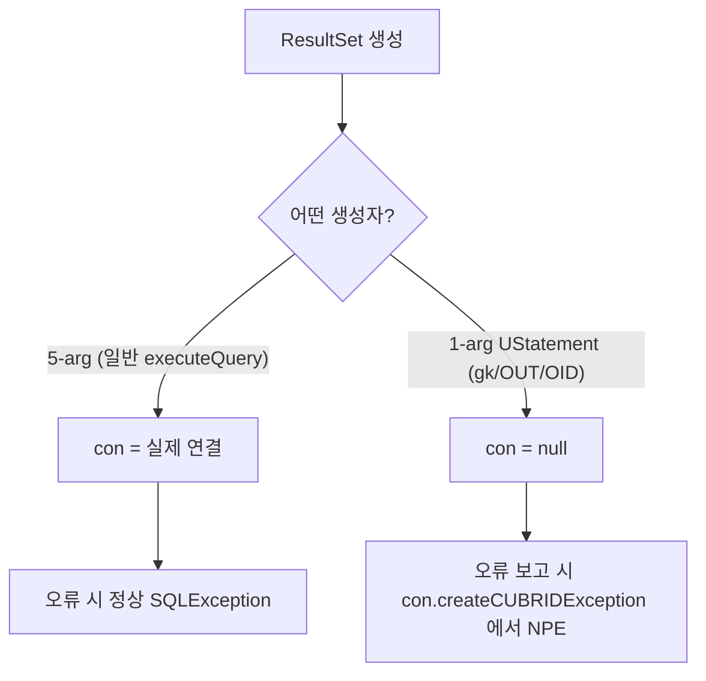

# APIS-1087 con 없이 생성되는 ResultSet의 createCUBRIDException NullPointerException

- 이슈: https://jira.cubrid.org/browse/APIS-1087 (초안 작성, 등록 예정)
- PR: (열리면 링크)
- 상태: 드라이버 수정 + 회귀 TC 완료, 검증 통과, PR 대기
- 날짜: 2026-07-13

## 요약
`getGeneratedKeys()` / 저장 프로시저 OUT 커서 / OID(`getValues`) ResultSet이 오류를 알려야 할 때 `SQLException` 대신 `NullPointerException`을 던지던 문제를, 생성자에 연결을 주입해 정상 `SQLException`으로 고치고 회귀 TC를 추가하여 검증했다.

## 배경 / 이슈
- Hibernate ORM을 CUBRID에서 돌릴 때 잔여 CI 실패의 최대 군집이 이 NPE였다.
- 증상: 위 특수 ResultSet에서 오류를 보고해야 하는 상황이 되면 명확한 `SQLException`이 아니라 raw `NullPointerException`이 노출되어 원래 원인을 가린다.

## 원인 분석 (AS-IS)
- `CUBRIDResultSet`은 오류를 `throw con.createCUBRIDException(...)` 형태로 만든다. 즉 `con`(CUBRIDConnection)은 "오류 객체를 만드는 도구"이자 락 대상이다.
- `CUBRIDResultSet` 생성자는 둘인데, 하나가 `con`을 채우지 않는다.

| 생성자 | con | 쓰임 |
|---|---|---|
| 5-arg `(CUBRIDConnection, CUBRIDStatement, ...)` | 실제 연결 | 일반 `executeQuery()` 결과 |
| 1-arg `(UStatement)` | **null** | generated-keys, OUT 파라미터, OID |

- 1-arg 생성자를 쓰는 세 경로(저수준 `UStatement`만으로 만드는 ResultSet)는 `con`이 null이라, 오류를 알리려는 순간 `con.createCUBRIDException(...)`에서 NPE가 난다.
- 데이터 읽기에는 `con`이 아니라 `u_stmt`(UConnection 보유)만 쓰이므로, `con=null`이어도 데이터는 정상이고 **오류 보고 경로에서만** NPE가 발생한다. 일반 ResultSet은 실제 `con`을 받아 무관하다.

## 변경 / 해결 (TO-BE)
- 1-arg 생성자에 `CUBRIDConnection` 파라미터를 추가하고(`con = c`), 각 생성 지점에서 **이미 가용한 연결**을 전달한다. 데이터 경로는 그대로이고, 오류 보고가 정상 `SQLException`이 된다.

| 생성 지점 | 전달한 연결 |
|---|---|
| `CUBRIDStatement`의 generated-keys 생성 2곳 | `this.con` |
| `CUBRIDOutResultSet`(OUT 파라미터) | `ucon.getCUBRIDConnection()` |
| `CUBRIDOIDImpl.getValues()`(OID) | `cur_con` |

- 공개 JDBC API는 불변이다. 바뀐 것은 인자가 내부 클래스 `UStatement`인 생성자뿐이라 애플리케이션이 직접 호출할 수 없다(사용자는 `Statement`에서 ResultSet을 받는다).
- 부수: 데이터 읽기/`next()`/`close()`의 기존 동작은 변하지 않는다(생성자가 `stmt`도 null로 두므로 `close()`의 no-op 동작은 그대로).

## 검증
- 드라이버 컴파일: 드라이버 소스 98파일, 에러 0.
- Docker CUBRID 11.4.5로 세 경로를 재현(드라이버 jar만 교체해 비교).

| 케이스 | 수정 전 (11.3.1 릴리스) | 수정 후 (con 주입) |
|---|---|---|
| getGeneratedKeys | NullPointerException (con is null) | SQLException: Invalid cursor position. |
| CUBRIDOID.getValues | 동일 NPE | 동일 SQLException |
| CallableStatement OUT 커서 | 동일 NPE | 동일 SQLException |

- 회귀 TC(JUnit) 실측(CUBRID 11.4.5): `TestGeneratedKeysResultSet`, `TestOIDGetValuesResultSet` 각 2개 메서드(값 읽기 전 접근 = `invalid_row`, 읽기 전용 수정 시도 = `non_updatable`), 에러 코드까지 단언.

| 드라이버 | JUnit 결과 |
|---|---|
| 수정 전 | Tests run: 4, Failures: 4 (전부 NPE) |
| 수정 후 | OK (4 tests) |

## 결과 / 영향
- 세 경로 모두 오류 보고가 NPE에서 정상 `SQLException`으로 바뀜을 실서버에서 확인. 회귀 없음.
- 스펙/아키텍처 변경 없음(특수 ResultSet을 일반 ResultSet의 불변식 con != null 에 일치시킨 것).
- 범위 밖(별도 과제):
  - 키 없는 `getGeneratedKeys()`가 `u_stmt=null` ResultSet을 반환해 `getMetaData()`에서 NPE가 나는 문제(con과 무관). 별도 이슈로 분리.
  - 위 특수 ResultSet의 `close()`가 no-op이 되어 커서가 늦게 해제되는 문제(con+stmt 둘 다 null).
  - OUT 파라미터 전용 회귀 TC는 커서 반환 Java 저장 프로시저 인프라가 필요해 CTP 하네스 차원에서 별도 추가.

## 참고
- JIRA: https://jira.cubrid.org/browse/APIS-1087 (등록 예정)
- PR: (열리면 링크)
- Branch: cubrid-jdbc https://github.com/Srltas/cubrid-jdbc/tree/APIS-1087 , cubrid-testcases-private https://github.com/Srltas/cubrid-testcases-private/tree/APIS-1087
- Commit: 드라이버 `f704579`(con 주입); 테스트 `d4702ee3`(회귀 TC), `259a6247`(OID TC 수정), `3b3493fd`(에러코드 단언 + update-on-readonly)
- 분석 노트: [con=null NPE](../bug/2026-07-11-createcubridexception-npe.md), [getGeneratedKeys 빈 결과셋(별도)](../bug/2026-07-12-getgeneratedkeys-empty-resultset.md)
