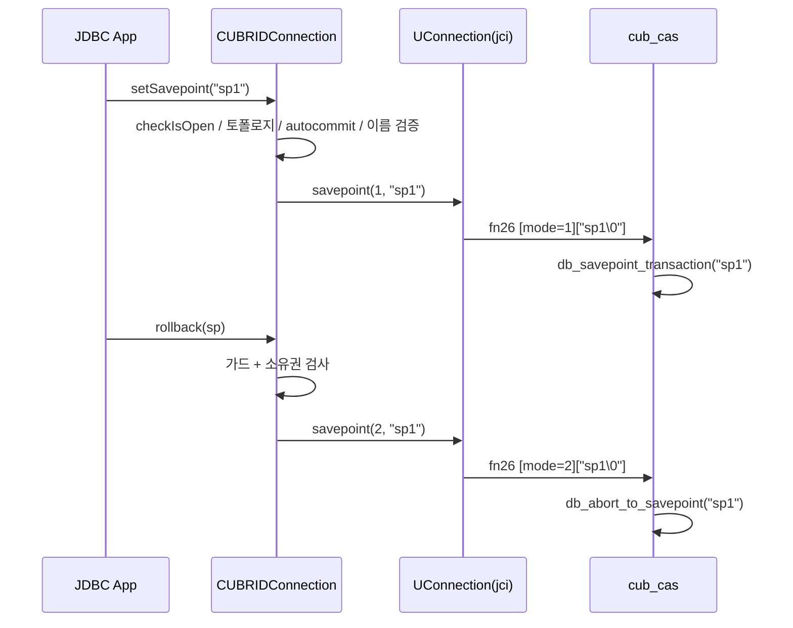

# APIS-1089 CUBRID JDBC savepoint 구현 (setSavepoint / rollback(Savepoint))

- 이슈: http://jira.cubrid.org/browse/APIS-1089
- PR: (열리면 링크)
- 상태: 구현 완료, PR 준비됨
- 날짜: 2026-07-17

## 요약
미구현 상태였던 JDBC savepoint API 4종을 전용 바이너리 프로토콜(fn code 26) 부활 방식으로 구현하고, `supportsSavepoints()`가 항상 true를 반환하던 메타데이터 모순을 해소했다. CUBRID 11.4 실서버 대상 신규 TC 19건과 기존 회귀 18건 전부 통과.

## 배경 / 이슈
CUBRID JDBC 드라이버의 `setSavepoint()`, `setSavepoint(String)`, `rollback(Savepoint)`, `releaseSavepoint(Savepoint)`는 전부 첫 줄에서 `SQLException(UnsupportedOperationException)`을 던지는 스텁이었고, `java.sql.Savepoint` 구현 클래스도 존재하지 않았다. 반면 `DatabaseMetaData.supportsSavepoints()`는 true를 반환해, 메타데이터를 신뢰하는 프레임워크(Spring 중첩 트랜잭션 등)는 반드시 실패하는 모순이 있었다. 서버 측은 이미 완전 지원 상태였다: 브로커에 전용 함수 코드 `CAS_FC_SAVEPOINT(26)`가 배선되어 있고 CCI(`cci_savepoint`)가 동일 프로토콜을 수년간 사용해 왔다.

## 원인 분석 (AS-IS)
- 드라이버에 3.0 시절의 완성된 구현(`CUBRIDSavepoint`, `u_con.savepoint(mode, name)`)이 통째로 주석 처리된 채 방치. 실존한 적 없는 클래스 참조 포함
- `UFunctionCode.SAVEPOINT(26)` 상수는 살아 있으나 참조하는 라이브 코드 없음
- 주석 코드에는 현행 내부 API와 어긋나는 드리프트 2건: 사라진 `new UError()` 생성자, `out`으로 개명 전의 스트림 필드명
- 구현 방식 후보 2개를 비교 분석: A(프로토콜 26 부활) vs B(평문 SQL `SAVEPOINT x` 발행, pgjdbc/mysql-connector-j 방식). 두 경로 모두 엔진 내부의 동일 프리미티브(`tran_savepoint_internal` / `tran_abort_upto_user_savepoint`)로 수렴함을 소스로 확인

| 비교 항목 | A: 프로토콜 26 | B: 평문 SQL |
|---|---|---|
| 라운드트립 | 1회 | 2회 (PREPARE+EXECUTE) |
| 이름 처리 | 파서 미경유, 바이트 그대로 (이스케이프/254바이트 절단/예약어 제약 없음) | 리터럴 이스케이프 필요, 서버 파라미터(no_backslash_escapes) 의존 |
| SHARD proxy / CGW | 서버측 차단 | SQL 경로도 동작 불가 (SHARD: hint 없는 문장 라우팅 불가, CGW: DBLink 힌트 게이트) |
| CCI와 대칭성 | 동일 프로토콜 | 상이 |

- 결론: 토폴로지 제약은 양쪽 동일(가드로 처리)하므로, 남는 실질 차이(이름 충실도, 라운드트립, CCI 대칭)에서 우위인 A를 선택
- 트랜잭션 첫 연산으로 setSavepoint를 불러도 안전함을 확인: CUBRID는 명시적 begin이 없는 상시 트랜잭션 모델이고, savepoint 레코드가 트랜잭션의 첫 로그 레코드인 경우를 서버가 명시 처리

## 변경 / 해결 (TO-BE)

- `CUBRIDSavepoint` 신설: unnamed는 id, named는 name 노출(교차 접근 예외, pgjdbc 모델). 생성 커넥션 참조로 타 커넥션/외부 구현 Savepoint 거부
- `UConnection.savepoint(byte mode, String name)` 부활: 드리프트 2건 수정, 라이브 `putByOID` 템플릿 준수. savepoint는 autocommit OFF 전용이므로 `turnOnAutoCommitBySelf()` 의도적 미포함
- `CUBRIDConnection` 가드 체인: checkIsOpen, 토폴로지(SHARD proxy/CGW면 `SQLFeatureNotSupportedException`), autocommit(ON이면 신규 에러코드 -21144), 이름 검증(null/빈 문자열/U+0000만 거부, -21145)
- `releaseSavepoint`: 항상 `SQLFeatureNotSupportedException`. 근거: 엔진에 RELEASE SAVEPOINT 문법이 없고 fn26에 release 모드도 없어 어떤 방식으로도 서버 전달 불가. COMMIT/ROLLBACK 시 서버가 전체 폐기하므로 누수 없음
- `supportsSavepoints()`: 커넥션별 판정(일반 브로커 true, proxy/CGW false)으로 변경, 모순 해소. 이를 위해 `UConnection`에 CGW dbms_type 상수(7/8/9, 서버 cas_protocol.h와 일치)와 `isConnectedToGateway()` 추가
- unnamed 이름은 커넥션별 카운터로 `CUBRID_JDBC_SAVEPOINT_<n>` 생성. 카운터는 트랜잭션 경계와 무관하게 누적: 이름 재등장을 차단해, 커밋 후 낡은 Savepoint 객체 오용이 조용한 오동작 대신 서버 에러 -550으로 결정적으로 실패하게 함
- 클라이언트 측 savepoint 레지스트리 없음: `commit()`/`rollback()` 무변경, 낡은 savepoint 검출은 서버 위임. XA/Pooling 래퍼도 무변경(기존 가드와 고정 테스트 보존)
- TC 정리: 레거시 `TestSavePoint`(@Ignore 3건)를 신규 통합 `TestSavepoint`로 흡수, 레거시만 커버하던 unnamed rollback 시나리오는 단언을 붙여 승계

## 검증
- 대상: CUBRID 11.4 실서버 (Docker), JDK 1.8 빌드
- 신규 savepoint 스위트 19건 전부 통과: 통합 `TestSavepoint` 14건(전부 단언 보유) + 단위 `CUBRIDSavepointTest` 2건 + `UConnectionGatewayDetectionTest` 3건
- 통합 TC가 고정하는 동작: rollback 데이터 복원과 반복 롤백, 트랜잭션 첫 연산 savepoint, 커밋 후 낡은 savepoint의 -550, 타 커넥션/외부 Savepoint 거부, autocommit 가드(-21144), 이름 검증(-21145), release의 SQLFeatureNotSupportedException, 일반 브로커 supportsSavepoints()==true
- 이름 충실도 실증: 공백/따옴표/예약어/한글이 섞인 이름의 바이트 왕복, 대소문자 구분("sp" vs "SP" 독립 롤백) 실서버 통과. 프로토콜 방식 선택의 핵심 근거를 TC로 고정
- 기존 회귀 18건 무변화 통과: `TestCUBRIDConnectionWrapperXA`/`XA2`(xa_started 시 release 무음 no-op 포함), `TestUFunctionCode`(SAVEPOINT==26)
- 토폴로지 분기(proxy/CGW)는 실서버로 재현 불가(dbms_type 4~9는 해당 배포에서만 수신)하여 package-local `FakeUConnection`으로 brokerInfo를 주입해 단위 검증

## 결과 / 영향
- JDBC 표준 savepoint API가 CUBRID에서 동작하며, 메타데이터와 실동작이 일치하게 됨
- 동작 의미론은 엔진 그대로: 중복 이름 허용(최신 우선), rollback 후 대상 savepoint 유지, COMMIT/ROLLBACK 시 전체 폐기, 이름은 대소문자 구분
- 주의 사항(문서화 대상): 읽기전용 브로커에서 rollback(Savepoint)은 서버의 CHECK_MODIFICATION_ERROR로 거부됨(프로토콜 경로 고유). SHARD proxy/CGW 연결에서는 명확한 미지원 예외
- 남은 과제: 매뉴얼 api/jdbc의 "java.sql.Savepoint: Not Supported" 표기 갱신, (별개 발견) CGW SQL 주석 파서의 미종결 주석 무한루프 버그는 별도 이슈로 처리 예정
- 산출 브랜치: cubrid-jdbc `feature/savepoint`(7커밋), cubrid-testcases-private `feature/savepoint-tests`(9커밋)

## 참고
- JIRA: http://jira.cubrid.org/browse/APIS-1089
- PR: (드라이버/TC 각 저장소에 생성 예정)
- 설계 검토 노트: [spec/2026-07-15-cubrid-jdbc-savepoint-design.md](../spec/2026-07-15-cubrid-jdbc-savepoint-design.md)
- 비교 구현 참조: pgjdbc `PSQLSavepoint`/`PgConnection`, mysql-connector-j `MysqlSavepoint`/`ConnectionImpl`
