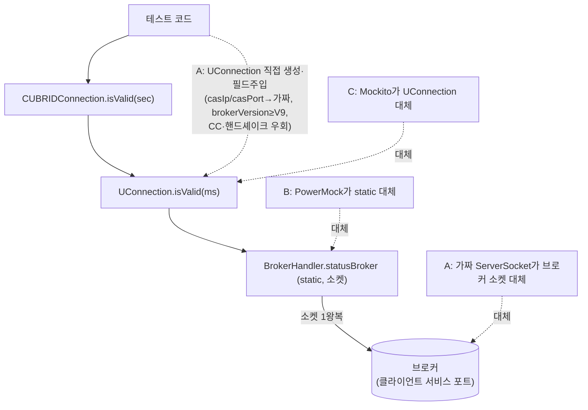

# CAS Mock(가짜 브로커) 기반 JDBC 드라이버 테스트 전략 분석

- 분류: analysis
- 날짜: 2026-07-14
- 관련: isValid 구현 검토(선행 분석), CTP(`JdbcLocalTest`) 기반 `test_jdbc` 실행 모델

## 요약
JDBC 드라이버 "자체" 테스트의 주류는 실 DB 접속이고, 가짜 브로커(CAS mock)는 실 DB로 재현하기 힘든 장애/경계 시나리오 주입에 특화된 보완 수단이다. isValid의 "조용히 죽은 커넥션 감지" TC에는 이 방식(A: 가짜 ServerSocket)이 적합하다. 단, 이 저장소의 **CTP 실행 모델**에서 성립하려면 A는 "공개 API 제로터치"가 아니라 **`cubrid.jdbc.jci` 내부에서 UConnection을 직접 만들어 필드를 주입하고 statusBroker의 소켓만 가짜로 물리는 JUnit4 테스트**여야 한다. 특히 `brokerVersion`을 프로토콜 V9 이상으로 올리지 않으면 isValid가 소켓 접근 전에 단락되어 **가짜 서버 응답과 무관하게 통과**하는 함정이 있다.

## 목적
isValid의 "서버측 CAS가 죽었는데 클라이언트는 안 닫힌" 상태를 검증하는 TC를, 실제 브로커를 제어하지 않고 mock으로 재현할 수 있는지 심층 분석한다. 나아가 타 DBMS JDBC 드라이버의 테스트 방식(실 DB vs mock)과 비교하고, CAS mock을 어떤 방식(A/B/C)으로, **이 저장소의 CTP 실행 모델 위에서** 실제로 접목할 수 있는지 판단한다.

## 배경
선행 분석에서 isValid는 이미 구현돼 있으나, 이 API의 핵심 목적인 "조용히 죽은 커넥션 감지"를 검증하는 TC가 부재함을 확인했다. 이 시나리오를 실 브로커/CAS를 죽여 재현하려면 서버 수명주기 제어가 필요해 TC 작성이 어렵고, 브로커 재기동은 병렬 실행 중인 다른 테스트까지 끊는 격리 문제가 있다. 그래서 mock으로 재현 가능한지를 출발점으로 삼았다.

## 범위 / 방법
- isValid 호출 경로의 외부 의존성 지점을 실제 드라이버 소스로 확인(드라이버 → JCI → 네트워크 레이어).
- 브로커 STATUS 응답값 도메인을 엔진 소스로 재확인(`FN_STATUS` enum, `broker.c`의 "ST" 핸들러).
- **CTP 실행 모델 실측**: 드라이버 jar 교체·컴파일·실행을 담당하는 CTP JDBC 러너(`run.sh`)와 테스트 러너(`JdbcLocalTest`)가 test double을 어떻게 다루는지(디스커버리·JUnit 버전·JVM·타임아웃) 확인.
- 로컬 하네스 실태 조사: Ant 기반 `test_jdbc`(라이브러리·클래스 구조), 기존 isValid 테스트(`TestValid4`), `cubrid.jdbc.jci` 내부 접근 선례.
- 타 드라이버 자체 테스트 방식 조사: pgjdbc, MySQL Connector/J, Testcontainers, MockRunner.
- test double을 3레벨로 분류하고 A/B/C 접근을 각 레벨에 매핑.

## 발견 / 관찰

### 1) isValid의 외부 의존성은 static 소켓 호출 "하나"뿐
```
CUBRIDConnection.isValid(sec)                 # timeout<0 → 예외, u_con==null·is_closed → false, sec*1000
  └─ UConnection.isValid(ms)
       # brokerVersion < makeProtoVersion(V9) 이면 !isClosed(필드)만 반환하고 단락(소켓 미접근)
       # 그 외에는 ↓
       └─ BrokerHandler.statusBroker(casIp, casPort, pid, session, ms)   # static, 소켓 1왕복
            # 요청 10바이트("ST" + processId 4B + session 4B) → 응답 4바이트 int
            → int status   # -2(FN_STATUS_NONE) → false, 그 외 전부(예상 밖 값 포함) → true, 예외 → false
```
- 죽은 CAS를 재현하려면 이 static 소켓 호출 지점만 통제하면 된다. 엔진 확인 결과 브로커 STATUS 응답은 `FN_STATUS` 5개 값 {-2, -1, 0, 1, 2}으로 한정되고(`cas_common.h`, `broker.c`의 "ST" 핸들러), 프로토콜이 단순해 가짜 서버로 흉내내기 쉽다.
- 엔진 측 의미: "ST" 핸들러는 요청의 pid·session이 살아있는 CAS와 매칭될 때만 그 CAS의 상태를 돌려주고, 매칭이 없으면 -2(NONE)를 반환한다. 즉 **-2 = 죽은/부재 CAS**이고, 드라이버는 이를 invalid로 해석한다.
- 접속 대상 `casIp:casPort`는 **브로커의 일반 클라이언트 서비스 포트**다(별도 admin 포트나 CAS 직결이 아님).
- **함정(핵심)**: `isValid`는 `brokerVersion`이 프로토콜 V9(`makeProtoVersion(9)`) 미만이면 소켓을 열지 않고 `!isClosed`만 반환한다. 손으로 만든 UConnection은 `brokerVersion`이 기본 0이라 이 분기로 단락되므로, **가짜 서버가 -2를 주든 말든 항상 true**가 된다(검증을 못 하는데 통과하는 위양성). statusBroker 경로를 태우려면 테스트에서 `brokerVersion`을 V9 이상으로 올려야 한다.

### 2) UConnection은 테스트하기 쉬운 구조 (단, 내부 접근 전제)
- `UConnection`은 public abstract이지만 추상 메서드가 4개뿐(`endTransaction`, `closeInternal`, `setAutoCommit`, `getAutoCommit`)이고 명시 생성자가 없어, 필드 초기화만 하는 테스트 서브클래스를 자명하게 만들 수 있다. 유일한 구현체 `UClientSideConnection`의 생성자는 네트워크 I/O를 하지 않으므로 "생성만 하고 connect 안 함"도 가능하다.
- `isValid`가 쓰는 필드: `casIp`/`casPort`/`casProcessId`는 public(세터 있음), `brokerVersion`/`sessionId`/`isClosed`는 protected라 **같은 패키지(`cubrid.jdbc.jci`) 또는 서브클래스**에서 직접 설정 가능하다. `sessionId`는 기본 20바이트라 isValid가 참조하는 [8..11] 인덱싱이 안전하다.
- 즉 A안은 "casIp/casPort를 가짜 서버로 지정 + brokerVersion을 V9↑로 세팅 후 isValid 호출"로 구현되며, 이를 위해 테스트는 `cubrid.jdbc.jci` 패키지 접근이 필요하다. 이 패키지에서 UConnection을 다루는 선례가 이미 있다(`TestUConnection`, `TestCUBRIDIsolationLevel`의 UConnection 서브클래스).
- `test_jdbc`의 lib에는 mockito, easymock, powermock이 포함돼 있다. 다만 powermock 1.4.12는 구버전이고 오래된 javassist와 조합하면 Java 8 클래스 인스트루먼트에서 `VerifyError`를 유발한다(javassist를 상향하면 해소). static 목킹(B)은 이 인스트루먼트 취약성의 영향권에 있다.

### 3) test double 3레벨 분류 (핵심 정리)

| 레벨 | 무엇을 대체 | 실 DB | 검증 대상 | 대표 도구 | 우리 대응 |
|------|------------|:----:|----------|----------|----------|
| (i) API 레벨 mock | `java.sql.*` 인터페이스 | 불필요 | 드라이버를 쓰는 **앱 코드** | MockRunner, jOOQ MockConnection, Mockito | (C) 계열(내부 경계 mock) |
| (ii) 와이어/프로토콜 fake | 서버(소켓) | 불필요 | **드라이버 내부**(소켓·파싱·상태머신) | 일부 드라이버의 fake server | **(A) 가짜 브로커** |
| (iii) 실 DB | 대체 없음(진짜) | 필요 | 전 구간 end-to-end | pgjdbc, MySQL C/J, Testcontainers | CTP+실브로커 Ant `test_jdbc` |

### 4) 타 DBMS JDBC 드라이버의 "자체" 테스트 방식

| 드라이버 | 자체 테스트 방식 | 실 서버 |
|---------|----------------|:------:|
| pgjdbc | `./gradlew test`, Docker Compose/Vagrant로 PG 기동 후 접속 | 필수 |
| MySQL Connector/J | `ant test`, `testsuite.url`로 실서버 접속(단위·기능 테스트 모두) | 필수 |
| Testcontainers(업계 공통 방식) | `jdbc:tc:` URL로 DB 컨테이너 자동 기동·종료 | 필수(컨테이너) |
| MockRunner / jOOQ MockConnection | `Mock*` 객체로 결과 지정, SQL 미실행 | 불필요(단 **앱 코드**용) |
| CUBRID(현행) | Ant `test_jdbc`를 CTP `JdbcLocalTest`가 **사전 기동된 실 브로커**로 실행 | 필수 |

- 관찰: 드라이버 "자체" 테스트의 주류는 (iii) 실 DB다. 업계 일반으로는 Testcontainers로 실 DB를 자동 프로비저닝하는 흐름도 있으나, **이 저장소의 현행은 컨테이너가 아니라 CTP가 사전 기동된 실 브로커에 접속하는 방식**이다(저장소에 Testcontainers/pom 없음).
- (i) API 레벨 mock은 DB 없이 돌지만 드라이버 자체를 "대체"하므로 드라이버 와이어 로직 검증에는 쓸 수 없다(앱 개발자용).
- (ii) 와이어 레벨 fake는 실 DB로 만들기 힘든 장애/경계 케이스에 한정해 선택적으로 쓰인다. 우리의 CAS mock이 정확히 이 범주다.
- **가짜 서버는 두 flavor로 나뉜다** — 타 드라이버 조사에서 확인된 실제 관행:

| flavor | 하는 일 | 프로토콜 구현 | 대표 선례 | 용도 |
|--------|---------|:----:|----------|------|
| 프록시 | 실 서버로 바이트 중계 + 고장 주입(끊기·hang·지연) | 불필요(중계만) | pgjdbc `StrangeProxyServer` | isValid 단절, socket/login 타임아웃, broken network |
| 최소 가짜 서버 | 실 서버 없이 프로토콜 응답을 직접 조작 | 최소 구현 | MariaDB 최소 프로토콜 서버; MySQL Mock/커스텀 SocketFactory | 악성 서버·인증·TLS 경계; timeout·failover |

- 즉 pgjdbc·MySQL·MariaDB 모두 (ii) 와이어레벨 fake를 **장애/경계 케이스에 한정**해 쓰며(기능·데이터 경로는 실 DB), 이는 우리 CAS mock의 목표 용도(isValid 죽은 커넥션 감지)와 정확히 일치한다.

### 5) A/B/C를 레벨에 매핑
- **A(가짜 ServerSocket) = (ii)**. 두 가지로 구현할 수 있다(공통: **프로덕션 코드 변경 0**, PowerMock 불필요).
  - (a) **최소 가짜서버 + 내부 주입**: `cubrid.jdbc.jci` 내부에서 UConnection을 만들어 `casIp`/`casPort`를 로컬 가짜 서버로, `brokerVersion`을 V9↑로 세팅한 뒤 isValid를 호출. 실 서버 불필요·구현 단순. 단 완전 public 경로는 아니고(연결 수립 계층 우회) 내부 패키지 접근과 `brokerVersion` 수동 세팅이 필요하며, statusBroker의 소켓·타임아웃·파싱만 검증한다.
  - (b) **프록시(pgjdbc식)**: 실 브로커 앞단에 포워딩 프록시를 두고 `jdbc:cubrid:localhost:<프록시포트>:...`로 접속 → 핸드셰이크를 실 브로커로 중계(→ `brokerVersion`·`casPort` 정상 세팅)한 뒤, isValid가 여는 statusBroker 새 소켓에 `-2`/끊기/hang을 주입. **공개경로 전체(DriverManager→isValid)를 검증하고 `brokerVersion` 함정·내부접근을 회피**한다. 대신 양방향 포워딩 프록시가 필요하고 실 브로커에 의존한다(CTP는 이미 브로커를 띄우므로 무방). → **isValid엔 (b) 선호.**
- **B(PowerMock static stub) = (ii)를 소켓 없이 흉내내는 구현 기법**일 뿐 독립 레벨이 아니다. 구버전 PowerMock+javassist 조합의 VerifyError 리스크가 있고, 실제 소켓/타임아웃 코드는 미검증. → 지양.
- **C(Mockito로 UConnection mock) = (i) 계열**. 드라이버 내부 경계를 mock해 상위(`CUBRIDConnection`)의 래퍼 로직만 검증. 죽은 CAS 감지 자체는 가려져 검증 못 함.

### 6) 테스트 대상별 주입 지점


## 결론
CAS mock은 "실 DB 대체"가 아니라 (ii) 와이어 레벨 fake로서, 장애/경계 주입에 특화된 보완 수단이다. isValid의 죽은 커넥션 감지처럼 실 DB로 재현이 곤란한 케이스에 가장 적합하다. 접목은 A(가짜 브로커)를 재사용 가능한 MockBroker로 채택하되, 이 저장소의 CTP 실행 모델에 맞춰 **`cubrid.jdbc.jci` 내부 주입형 JUnit4 테스트**로 구현한다(`brokerVersion`≥V9 전제 필수). C(Mockito)는 드라이버 레이어 단위 테스트 보완, B(PowerMock)는 지양한다. 기능 커버리지의 주축은 **현행 실 DB(CTP+실브로커)**를 그대로 유지한다.


## 다음 단계
- isValid 죽은 커넥션 감지 TC를 A로 설계 확정(별도 브레인스토밍/플랜). 시나리오: 죽음(-2)→false, 정상(-1/0/1/2 등)→true, 타임아웃(무응답)→false, 불통(미기동)→false. **전제**: `brokerVersion`을 V9↑로 세팅(안 하면 단락되어 위양성).
- **CTP 실행 제약 반영(중요)**:
  - 러너(`JdbcLocalTest`)는 **JUnit4 전용**이고 `${scenario}/src/` 아래 `.class`를 스캔·리플렉션으로 실행한다. 따라서 새 테스트는 **JUnit4**로, `${scenario}/src/cubrid/jdbc/jci/`에, **CTP conf의 `scenario=`가 가리키는 체크아웃**에 둬야 한다. (JUnit5 신규 모듈은 Jupiter jar 부재로 컴파일 실패→전체 run abort, 러너도 미지원이라 그대로는 불가. 원한다면 lib에 Jupiter 추가 + 러너 재작성이 선행돼야 한다.)
  - **단일 JVM·per-test 타임아웃 없음**: 모든 케이스가 한 JVM에서 순차 실행된다. 무응답 시나리오는 반드시 **양수 timeout**으로 호출해 드라이버의 소켓 read 타임아웃이 끊게 하고, 가짜 ServerSocket과 accept 스레드는 `finally`에서 반드시 close해야 한다. 무한 accept/blocking은 스위트 전체를 멈춘다.
- 재사용 MockBroker 헬퍼는 브로커 admin 서브프로토콜(STATUS/PING/CANCEL)부터 설계. STATUS는 위 방식으로 간단하나 CANCEL·reconnect-on-server-down 등은 프로토콜 표면이 커지므로 확장 비용을 별도 판단. `statusBroker`는 읽기 타임아웃 재시도 경로(`UTimedDataInputStream`)에서도 호출되므로 그 경로 검증에도 재사용 가능하다.
- 데이터 경로(쿼리·PreparedStatement·ResultSet·LOB·metadata)는 fake로 확장하지 않는다. full CAS 프로토콜 에뮬레이션은 비용 대비 부적절하므로 실 DB로 커버.
- 드리프트 방지: 동일 시나리오를 가끔 실 CUBRID로 교차 검증하는 contract test를 두고, 프로토콜 변경 시 mock을 동기화.
- 이슈화: isValid TC 추가와 MockBroker 하네스 도입은 성격이 다르므로 별도 태스크로 분리 가능.

## 참고
- pgjdbc TESTING.md: https://github.com/pgjdbc/pgjdbc/blob/master/TESTING.md
- MySQL Connector/J Testing: https://dev.mysql.com/doc/connector-j/en/connector-j-testing.html
- Testcontainers JDBC support: https://java.testcontainers.org/modules/databases/jdbc/
- MockRunner(JDBC): https://mockrunner.github.io/mockrunner/examplesjdbc.html
- jOOQ, mock your database at the JDBC level: https://blog.jooq.org/easy-mocking-of-your-database/
- 가짜/프록시 서버 선례: pgjdbc `StrangeProxyServer`(isValid·socketTimeout·broken network 테스트, `StatementTest`); MySQL Connector/J Mock/커스텀 SocketFactory(timeout·failover); MariaDB Connector/J 최소 프로토콜 가짜 서버(악성 서버·인증·TLS)
- 내부 코드: `src/jdbc/cubrid/jdbc/jci/UConnection.java`(isValid·버전 게이트·필드), `src/jdbc/cubrid/jdbc/net/BrokerHandler.java`(statusBroker/statusRequest), `src/jdbc/cubrid/jdbc/driver/CUBRIDConnection.java`(isValid), 엔진 `src/broker/broker.c`("ST" 핸들러)·`src/broker/cas_common.h`(FN_STATUS)
- 실행 하네스: CTP `JdbcLocalTest`(JUnit4·단일 JVM·per-test 타임아웃 없음·`src/` .class 스캔), CTP JDBC `run.sh`(드라이버 jar 교체→전체 javac→단일 JVM 실행); 기존 isValid 테스트는 `test_jdbc`의 `TestValid4`(유일, 실 DB), `cubrid.jdbc.jci` 내부 접근 선례는 `TestUConnection`·`TestCUBRIDIsolationLevel`
