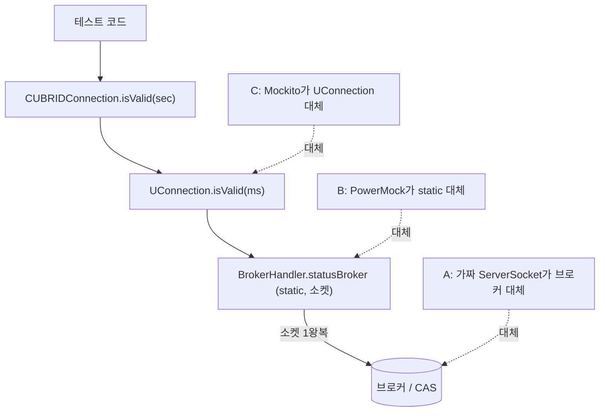

# CAS Mock(가짜 브로커) 기반 JDBC 드라이버 테스트 전략 분석

- 분류: analysis
- 날짜: 2026-07-14
- 관련: isValid 구현 검토(선행 분석), `test_jdbc` / `jdbc-testcontainer`

## 요약
JDBC 드라이버 "자체" 테스트의 주류는 실 DB 접속(요즘은 Testcontainers)이고, 가짜 브로커(CAS mock)는 실 DB로 재현하기 힘든 장애/경계 시나리오 주입에 특화된 보완 수단이다. isValid의 죽은 커넥션 감지 TC에는 이 방식(가짜 ServerSocket, 앞서 제안한 A)이 최적이며, 재사용 가능한 MockBroker로 일반화할 가치가 있다.

## 목적
isValid의 "서버측 CAS가 죽었는데 클라이언트는 안 닫힌" 상태를 검증하는 TC를, 실제 브로커를 제어하지 않고 mock으로 재현할 수 있는지 심층 분석한다. 나아가 타 DBMS JDBC 드라이버의 테스트 방식(실 DB vs mock)과 비교해, CAS mock을 우리 코드에 어떤 방식(A/B/C)으로 접목할지, isValid 외 다른 API로 일반화할 수 있는지 판단한다.

## 배경
선행 분석에서 isValid는 이미 구현돼 있으나, 정작 이 API의 핵심 목적인 "조용히 죽은 커넥션 감지"를 검증하는 TC가 부재함을 확인했다. 이 시나리오를 실 브로커/CAS를 죽여 재현하려면 서버 수명주기 제어가 필요해 TC 작성이 어렵고, 브로커 재기동은 병렬 실행 중인 다른 테스트까지 끊는 격리 문제가 있다. 그래서 mock으로 재현 가능한지를 출발점으로 삼았다.

## 범위 / 방법
- isValid 호출 경로의 외부 의존성 지점 식별(드라이버 → JCI → 네트워크 레이어).
- 브로커 STATUS 응답값 도메인을 엔진 소스로 재확인(`FN_STATUS` enum, `broker.c`의 "ST" 핸들러).
- 로컬 테스트 하네스 실태 조사: `test_jdbc`(라이브러리·클래스 구조), `jdbc-testcontainer`(pom, `CubridJdbcTest`).
- 타 드라이버 자체 테스트 방식 웹 조사: pgjdbc, MySQL Connector/J, Testcontainers, MockRunner.
- test double을 3레벨로 분류하고 A/B/C 접근을 각 레벨에 매핑.

## 발견 / 관찰

### 1) isValid의 외부 의존성은 static 소켓 호출 "하나"뿐
```
CUBRIDConnection.isValid(sec)                     # timeout<0 → 예외, is_closed → false, sec*1000
  └─ UConnection.isValid(ms)                      # protoVer < V9 → !isClosed, 아니면 ↓
       └─ BrokerHandler.statusBroker(...ms)       # static, 소켓 1왕복 (10바이트 요청 → 4바이트 int)
            → int status                          # -2(NONE) → false, 그 외 → true, 예외 → false
```
- 이 static 소켓 호출 지점만 통제하면 "죽은 CAS"를 100% 재현할 수 있다.
- 엔진 확인 결과 브로커 STATUS 응답은 `FN_STATUS` 5개 값 {-2, -1, 0, 1, 2}으로 한정되고(`cas_common.h`, `broker.c`), 프로토콜이 "요청 10바이트 → 응답 4바이트 int"로 매우 단순해 가짜 서버로 흉내내기 쉽다.

### 2) UConnection은 테스트하기 쉬운 구조
- `abstract`지만 추상 메서드가 4개뿐(`endTransaction`, `closeInternal`, `setAutoCommit`, `getAutoCommit`)이고 명시 생성자가 없어, 필드 초기화만 도는 테스트 서브클래스를 자명하게 만들 수 있다(`sessionId` 기본 20바이트라 인덱싱 안전).
- `test_jdbc`의 lib에 mockito, easymock, powermock이 이미 포함돼 있다(단, powermock 1.4.12로 구버전).

### 3) test double 3레벨 분류 (핵심 정리)

| 레벨 | 무엇을 대체 | 실 DB | 검증 대상 | 대표 도구 | 우리 대응 |
|------|------------|:----:|----------|----------|----------|
| (i) API 레벨 mock | `java.sql.*` 인터페이스 | 불필요 | 드라이버를 쓰는 **앱 코드** | MockRunner, jOOQ MockConnection, Mockito | (C) 계열(내부 경계 mock) |
| (ii) 와이어/프로토콜 fake | 서버(소켓) | 불필요 | **드라이버 내부**(소켓·파싱·상태머신) | 일부 드라이버의 fake server | **(A) 가짜 브로커** |
| (iii) 실 DB | 대체 없음(진짜) | 필요 | 전 구간 end-to-end | pgjdbc, MySQL C/J, Testcontainers | `jdbc-testcontainer` |

### 4) 타 DBMS JDBC 드라이버의 "자체" 테스트 방식

| 드라이버 | 자체 테스트 방식 | 실 서버 |
|---------|----------------|:------:|
| pgjdbc | `./gradlew test`, Docker Compose/Vagrant로 PG 기동 후 접속 | 필수 |
| MySQL Connector/J | `ant test`, `testsuite.url`로 실서버 접속(단위·기능 테스트 모두) | 필수 |
| Testcontainers(공통 방식) | `jdbc:tc:` URL로 DB 컨테이너 자동 기동·종료 | 필수(컨테이너) |
| MockRunner / jOOQ MockConnection | `Mock*` 객체로 결과 지정, SQL 미실행 | 불필요(단 **앱 코드**용) |
| CUBRID(현행) | `test_jdbc`(사전 기동 서버 접속) + `jdbc-testcontainer`(실 DB 컨테이너) | 필수 |

- 관찰: 드라이버 "자체" 테스트의 주류는 (iii) 실 DB이며, 최근에는 Testcontainers로 실 DB를 자동 프로비저닝하는 흐름이다.
- (i) API 레벨 mock은 DB 없이 돌지만 드라이버 자체를 "대체"하므로 드라이버 와이어 로직 검증에는 쓸 수 없다(앱 개발자용).
- (ii) 와이어 레벨 fake는 실 DB로 만들기 힘든 장애/경계 케이스에 한정해 선택적으로 쓰인다. 우리의 CAS mock이 정확히 이 범주다.

### 5) A/B/C를 레벨에 매핑
- A(가짜 ServerSocket) = (ii). `casIp`/`casPort`를 로컬 가짜 서버로 돌리는 방식이라 **프로덕션 코드 변경 0**, PowerMock 불필요, 실제 소켓·타임아웃·파싱 코드까지 검증.
- B(PowerMock static stub) = (ii)를 소켓 없이 흉내내는 구현 기법일 뿐 독립 레벨이 아니다. 구버전 PowerMock 의존, 실제 소켓/타임아웃 코드는 미검증.
- C(Mockito로 UConnection mock) = 드라이버 내부 경계를 mock해 상위(`CUBRIDConnection`)의 래퍼 로직만 검증하는 (i) 계열. 죽은 CAS 감지 자체는 가려져 검증 못 함.

### 6) 테스트 대상별 주입 지점


## 결론
CAS mock은 "실 DB 대체"가 아니라 (ii) 와이어 레벨 fake로서, 장애/경계 주입에 특화된 보완 수단이다. 주류(실 DB) 대비 틈새지만, isValid의 죽은 커넥션 감지처럼 실 DB로 재현이 곤란한 케이스에는 가장 적합하다. 접목은 A(가짜 브로커)를 재사용 가능한 MockBroker로 채택하는 것을 권장하며(프로덕션 변경 0, PowerMock 회피), C(Mockito)는 드라이버 레이어 단위 테스트 보완, B(PowerMock)는 지양한다. 기능 커버리지의 주축은 이미 도입된 실 DB(Testcontainers)를 그대로 유지한다.


## 다음 단계
- isValid 죽은 커넥션 감지 TC를 A로 설계 확정(별도 브레인스토밍/플랜). 시나리오: 죽음(-2)→false, 정상(-1/0/1/2)→true, 타임아웃(무응답)→false, 불통(미기동)→false.
- 재사용 MockBroker 헬퍼를 브로커 admin 서브프로토콜(STATUS/PING/CANCEL)부터 설계. 대상 API: isValid, statement/query cancel, reconnect-on-server-down, 에러코드/renewed-session 처리 등 소켓 경계에 의존하는 경로.
- 데이터 경로(쿼리·PreparedStatement·ResultSet·LOB·metadata)는 fake로 확장하지 않는다. full CAS 프로토콜 에뮬레이션은 비용 대비 부적절하므로 실 DB(Testcontainers)로 커버.
- 드리프트 방지: 동일 시나리오를 가끔 실 CUBRID로 교차 검증하는 contract test를 두고, 프로토콜 변경 시 mock을 동기화.
- 배치 검토: UConnection 내부 접근이 필요하므로 `cubrid.jdbc.jci` 패키지 접근이 가능한 `test_jdbc`에 두거나, 모던 스택(JUnit5)으로 신규 모듈 신설.
- 이슈화: isValid TC 추가와 MockBroker 하네스 도입은 성격이 다르므로 별도 태스크로 분리 가능.

## 참고
- pgjdbc TESTING.md: https://github.com/pgjdbc/pgjdbc/blob/master/TESTING.md
- MySQL Connector/J Testing: https://dev.mysql.com/doc/connector-j/en/connector-j-testing.html
- Testcontainers JDBC support: https://java.testcontainers.org/modules/databases/jdbc/
- MockRunner(JDBC): https://mockrunner.github.io/mockrunner/examplesjdbc.html
- jOOQ, mock your database at the JDBC level: https://blog.jooq.org/easy-mocking-of-your-database/
- 내부 코드: `src/jdbc/cubrid/jdbc/jci/UConnection.java`(isValid), `src/jdbc/cubrid/jdbc/net/BrokerHandler.java`(statusBroker), 엔진 `src/broker/broker.c`(ST 핸들러), `src/broker/cas_common.h`(FN_STATUS)
- 로컬 하네스: `test_jdbc`(TestValid4), `jdbc-testcontainer`(CubridJdbcTest, testcontainers-cubrid)
