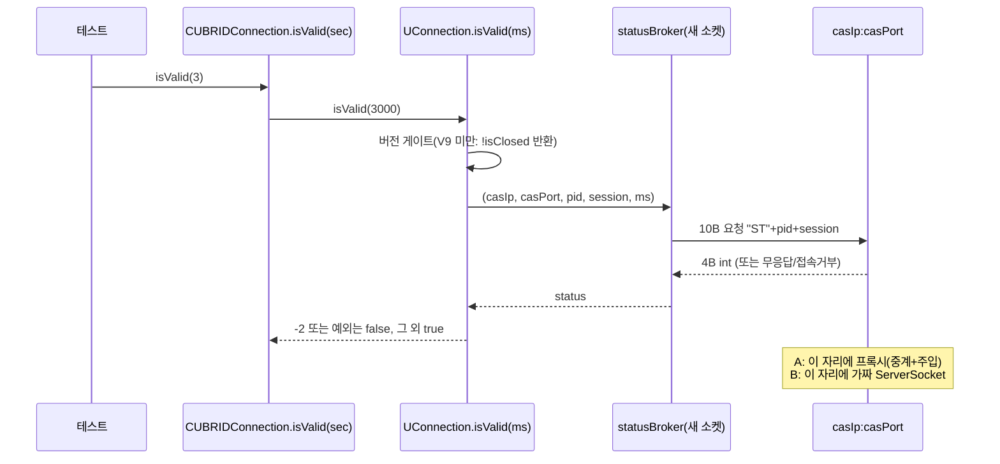

# isValid 죽은-커넥션 TC: 프록시 vs fakeSocket 심층 설계 비교

- 분류: analysis
- 날짜: 2026-07-14
- 관련: `analysis/2026-07-14-cas-mock-fake-broker.md`(선행: CAS mock 전략), `analysis/2026-07-14-jdbc-ctp-harness-gradle.md`(선행: Gradle 하네스 제안)

## 요약
두 방식 모두 코드 근거상 실현 가능하나, 현행 CTP(단일 JVM·순차 실행) 위에서는 **B(fakeSocket, `cubrid.jdbc.jci` 내부 주입)를 지금 채택**하고, A(프록시)는 Gradle 하네스 도입 이후 read-hang·cancel 계열 확장용 재사용 헬퍼(FaultProxy)로 미루는 것이 우세하다. 선행 노트의 "isValid엔 프록시 선호" 판단은 현행 CTP 전제에서는 수정한다.

## 목적
isValid()의 "서버측 CAS는 죽었는데 클라이언트는 안 닫힌" 상태를 실 브로커를 죽이지 않고 재현하는 두 방식(A: 프록시 중계+주입, B: 최소 가짜서버)을 실제 설계 수준까지 내려가 비교하고, 이 저장소의 CTP 실행 모델에서 어느 쪽을 채택할지 결론짓는다.

## 배경
선행 분석에서 isValid의 유일한 외부 의존이 `BrokerHandler.statusBroker`의 소켓 1왕복임을 확인했고, 죽은-CAS 감지 TC가 부재함도 확인했다(기존 `TestValid4`는 실 DB의 정상/닫힘/음수인자 3케이스뿐). 두 선행 노트는 각각 "프록시 선호"와 "새 하네스 위에서 프록시 방식"을 제안했으나, 두 방식을 설계 수준까지 비교한 적은 없어 이번에 코드로 독립 재검증하며 판정한다.

## 범위 / 방법
- 선행 노트의 load-bearing 주장 6개를 현재 소스로 file:line 재확인(드라이버 `cubrid-jdbc`, 테스트 `cubrid-testcases-private/interface/JDBC/test_jdbc`, 하네스 `cubrid-testtools/CTP`, 엔진 `cubrid/src/broker`). 모두 읽기 전용.
- A/B 각각의 성립 조건(연결·핸드셰이크·포트·필드 가시성·와이어 포맷·CTP 컴파일/실행)을 코드로 검증.
- 두 방식을 테스트 스켈레톤 수준으로 설계하고 8개 축으로 비교, 추천 도출.

## 발견 / 관찰

### 1) 선행 노트 주장 6개 재검증: 전부 사실

| # | 주장 | 판정 | 근거 (file:line) |
|---|------|:----:|------------------|
| 1 | 경로: `CUBRIDConnection.isValid(sec)` → `UConnection.isValid(ms)` → `statusBroker` | 확인 | 래퍼: 음수 예외·null/closed false·sec×1000 `driver/CUBRIDConnection.java:1035-1042`, 호출 `jci/UConnection.java:1387` |
| 2 | 버전 게이트: V9 미만이면 소켓 없이 `!isClosed` 반환. 기본 `brokerVersion=0`이라 단락 | 확인 | 게이트 `UConnection.java:1380-1382`, 기본값 0 `:231`, `makeProtoVersion(9)`=(0x40<<24)\|9=0x40000009 (`:107`, `:1890-1892`), 비교 `:1905-1910` |
| 3 | 프로토콜: static, 매번 새 소켓, 10B 요청("ST"+pid 4B+session 4B) → 4B int 응답. -2→false, 그 외→true, 예외→false. timeout≤0이면 무제한 | 확인 | `net/BrokerHandler.java:272-287`(조립), `:191-227`(statusRequest: 새 Socket `:199`, timeout>0이면 connect 타임아웃+잔여 soTimeout `:204-209`, **timeout≤0이면 connect·read 모두 무제한** `:201-202`, finally close `:222-226`); 해석 `UConnection.java:1388-1393`, `FN_STATUS_NONE=-2` `:187` |
| 4 | 객체: `UConnection`은 public abstract·추상메서드 4개·명시 생성자 없음. `UClientSideConnection` 생성자는 I/O 없음. 필드 가시성·`sessionId` 기본 byte[20] | 확인 | abstract 4개 `UConnection.java:327,1291,1551,1553`; 생성자 `UClientSideConnection.java:61-82`(필드 대입만); `casIp/casPort/casProcessId` public `UConnection.java:234-236`, `brokerVersion/isClosed/sessionId` protected `:231,244,255`, `SESSION_ID_SIZE=20` `:180,1958-1960` |
| 5 | 선례: `TestUConnection`(package cubrid.jdbc.jci), `TestCUBRIDIsolationLevel`(UConnection 서브클래스), `TestValid4`(유일 isValid TC, 실 DB, JUnit4) | 확인 | `src/cubrid/jdbc/jci/TestUConnection.java:1`, `TestCUBRIDIsolationLevel.java:14,44`(내부클래스 `IsolationCheck extends UConnection`), `src/com/cubrid/jdbc/test/spec/connection/TestValid4.java:15-38` |
| 6 | statusBroker는 읽기 타임아웃 재시도 경로에서도 호출 | 확인 | `jci/UTimedDataInputStream.java:140-164`(V9 이상에서 `statusBroker(...) != 1`이면 1회 재시도 후 통신오류 `:156-161`) |

엔진 측 대응도 일치: 브로커는 서비스 포트에서 10B 헤더를 읽고(`broker.c:846`, `SRV_CON_CLIENT_INFO_SIZE=10` `cas_protocol.h:40`), "ST"면 pid·session을 살아있는 CAS와 대조해 기본 -2(NONE)에서 시작(`broker.c:861-894`, 기본값 `:863`), 4B를 htonl로 쓰고(`:186-191`) **소켓을 즉시 닫는다**(`:892`). `FN_STATUS` 도메인 {-2..2}는 `cas_common.h:157-161`.

### 2) 방식 A(프록시) 실현성: 성립. 결정적 근거는 "casPort 불변"

- **casPort는 URL 포트로 한 번 세팅된 후 변하지 않는다.** 세팅 지점은 생성자(`UClientSideConnection.java:65-67`)와 altHosts 경로(`:137-145`, `:473-475`)뿐이고, connect·재연결(`reconnectWorker :254-285`)은 항상 `casIp:casPort`로 접속한다. 따라서 `jdbc:cubrid:localhost:<프록시포트>:...`로 접속하면 이후 isValid의 statusBroker 새 소켓(`BrokerHandler.java:199`)도 반드시 프록시로 온다.
- **brokerVersion은 핸드셰이크 중계만으로 정상 세팅된다.** `connectDB`가 서버가 보낸 brokerInfo 바이트에서 세팅(`UClientSideConnection.java:425-434`)하므로, 프록시가 바이트를 그대로 중계하면 실 브로커의 V9+ 값이 들어온다. `casProcessId`(`:418`)·`sessionId`(`:445`)도 동일.
- **포트 리다이렉트는 Linux에서 미발동.** `connectBroker`는 응답 code==0이면 같은 소켓을 계속 쓰고(`BrokerHandler.java:109-115`), code>0 재접속은 "only windows"(`:118-132`)다. CTP는 Linux이므로 순수 바이트 포워딩으로 전 트래픽이 프록시를 경유한다. (설령 Windows여도 casPort 필드는 불변이라 isValid 주입 자체는 성립.)
- **방해 요소 없음.** keep-alive는 TCP 옵션일 뿐이고(`:82`), statusRequest는 useSSL과 무관하게 평문 소켓이며(`:191-219`), 재연결·unreachableHosts 로직은 isValid 경로에서 동작하지 않는다(`UConnection.java:1379-1396`은 본 소켓을 아예 만지지 않음).
- 유의점: 프록시의 고장 모드는 "이후 수락되는 연결"에만 적용해야 한다. 본 연결(핸드셰이크로 맺어 중계 중)은 그대로 두어야 teardown의 `conn.close()`가 성립한다.

### 3) 방식 B(fakeSocket) 실현성: 성립. 함정은 brokerVersion 하나

- **직접 생성 경로 성립.** `UClientSideConnection` 생성자는 public이고 네트워크 I/O가 없다(`:61-82`). 서브클래스 선례도 있다(`TestCUBRIDIsolationLevel.java:14`).
- **필드 주입 성립.** 테스트를 `cubrid.jdbc.jci` 패키지에 두면 protected `brokerVersion`을 직접 대입할 수 있다(선례 `TestUConnection.java:1`). `casIp/casPort/casProcessId`는 public. `sessionId`는 기본 byte[20](전부 0)이라 isValid의 [8..11] 슬라이스(`UConnection.java:1384-1385`)가 안전.
- **함정(치명): `brokerVersion`을 0x40000009 이상으로 안 올리면** 게이트가 단락되어 가짜 서버 응답과 무관하게 `!isClosed`(=true)를 반환한다(`:1380-1382`). 검증이 안 되는데 통과하는 위양성.
- **가짜 서버가 구현할 와이어 계약(전부 확인됨):** 연결 수락 → 정확히 10바이트 읽기('S','T' + pid int 4B big-endian + session 4B) → 4바이트 big-endian int 응답 → 즉시 close(실 브로커 동작 `broker.c:892`와 동일). Java `DataOutputStream.writeInt`가 big-endian이라 그대로 대응된다(브로커는 htonl `broker.c:189`).
- **CTP 컴파일·실행 문제없음.** run.sh가 `${scenario}` 전체를 javac하고(`jdbc/bin/run.sh:245`, 드라이버 jar는 lib에 복사됨 `:235-236`) 단일 JVM으로 러너를 실행(`:257`). 러너는 .class를 스캔해 JUnit4로 메서드 단위 실행(`JdbcLocalTest.java:225-242`, JUnitCore `:136`). split-package(jar+디렉터리의 동일 패키지)는 `cubrid.jdbc.jci` 기존 테스트들이 이미 일일 CI에서 증명.



### 4) 설계 A: FaultProxy + 공개 API 테스트

배치: `${scenario}/src/com/cubrid/jdbc/test/spec/connection/TestIsValidViaProxy.java` (내부 패키지 불필요, 공개 API만 사용)

```java
package com.cubrid.jdbc.test.spec.connection;
// JUnit4. FaultProxy 약 120~180 LOC + 테스트 약 80 LOC

public class TestIsValidViaProxy {
    enum Mode { FORWARD, REPLY_DEAD, SILENT }

    /* FaultProxy: ServerSocket 1개.
       - 수락 시점의 mode에 따라
         FORWARD    : 실 브로커(localhost:jdbc.port)로 접속해 양방향 펌프 스레드 2개로 중계
         REPLY_DEAD : 10B 읽고 -2(4B big-endian) 응답 후 close  (죽은 CAS)
         SILENT     : 10B 읽고 응답 없이 유지                    (hang)
       - mode는 이후 수락되는 연결에만 적용: 중계 중인 본 연결은 영향 없음
       - stopAccepting(): ServerSocket만 close (미기동 흉내)
       - close(): 서버소켓·펌프 스레드·중계 소켓 전부 정리 */
    static class FaultProxy { /* ... */ }

    private FaultProxy proxy;
    private Connection conn;

    @Before public void setUp() throws Exception {
        String db = PropertiesUtil.getValue("jdbc.dbname", "jdbc.properties");
        int realPort = Integer.parseInt(PropertiesUtil.getValue("jdbc.port", "jdbc.properties"));
        proxy = new FaultProxy("localhost", realPort);           // FORWARD로 시작
        // 핸드셰이크가 프록시를 경유: brokerVersion, casProcessId, sessionId 자동 세팅.
        // casPort = 프록시 포트로 고정되므로 statusBroker의 새 소켓도 프록시로 온다.
        conn = DriverManager.getConnection(
            "jdbc:cubrid:localhost:" + proxy.port() + ":" + db + ":::", "dba", "");
    }

    @After public void tearDown() throws Exception {
        try { if (conn != null) conn.close(); }                  // 본 연결 중계는 mode와 무관
        finally { if (proxy != null) proxy.close(); }
    }

    @Test(timeout = 20000) public void deadCasReturnsFalse() throws Exception {
        proxy.setMode(Mode.REPLY_DEAD);
        Assert.assertFalse(conn.isValid(3));
    }
    @Test(timeout = 20000) public void aliveCasReturnsTrue() throws Exception {
        Assert.assertTrue(conn.isValid(3));                      // 실 브로커 end-to-end
    }
    @Test(timeout = 20000) public void noResponseReturnsFalse() throws Exception {
        proxy.setMode(Mode.SILENT);
        Assert.assertFalse(conn.isValid(3));                     // 양수 timeout 필수
    }
    @Test(timeout = 20000) public void brokerDownReturnsFalse() throws Exception {
        proxy.stopAccepting();
        Assert.assertFalse(conn.isValid(3));                     // connect refused
    }
}
```

### 5) 설계 B: 최소 가짜서버 + 내부 주입 테스트

배치: `${scenario}/src/cubrid/jdbc/jci/TestIsValidDeadCas.java` (protected 접근을 위한 동일 패키지, 선례 `TestUConnection`)

```java
package cubrid.jdbc.jci;
// JUnit4. 가짜서버+테스트 합쳐 단일 파일 약 120 LOC

public class TestIsValidDeadCas {
    private static final int PROTO_V9 = 0x40000009;  // makeProtoVersion(PROTOCOL_V9)

    private ServerSocket fake;
    private Thread acceptor;

    /* 가짜 브로커: 연결마다 10B 요청("ST"+pid+session)을 읽고
       reply를 4B big-endian으로 응답 후 close (실 브로커와 동일: broker.c:892).
       reply == null이면 읽기만 하고 응답하지 않음 (무응답 시나리오) */
    private int startFakeBroker(final Integer reply) throws IOException {
        fake = new ServerSocket(0, 1, InetAddress.getByName("127.0.0.1"));
        acceptor = new Thread(new Runnable() { public void run() {
            while (!fake.isClosed()) {
                try {
                    Socket s = fake.accept();
                    new DataInputStream(s.getInputStream()).readFully(new byte[10]);
                    if (reply != null) {
                        new DataOutputStream(s.getOutputStream()).writeInt(reply.intValue());
                        s.close();
                    } // null: 열어둔 채 방치 → 클라이언트 soTimeout 유도
                } catch (IOException ignore) { }
            }
        }});
        acceptor.setDaemon(true);
        acceptor.start();
        return fake.getLocalPort();
    }

    private UClientSideConnection newUConn(int port) throws Exception {
        String url = "jdbc:cubrid:127.0.0.1:" + port + ":fakedb:::";
        UClientSideConnection u =
            new UClientSideConnection("127.0.0.1", port, "fakedb", "dba", "", url); // I/O 없음
        u.brokerVersion = PROTO_V9;  // 필수: 미설정(0)이면 게이트 단락 → 항상 true(위양성)
        u.casProcessId = 99999;      // public. sessionId는 기본 byte[20] 그대로
        return u;
    }

    @After public void tearDown() throws Exception {
        if (fake != null && !fake.isClosed()) fake.close();  // accept 스레드도 깨어나 종료
        if (acceptor != null) acceptor.join(2000);
    }

    @Test(timeout = 15000) public void deadCasReturnsFalse() throws Exception {
        assertFalse(newUConn(startFakeBroker(-2)).isValid(3000));   // FN_STATUS_NONE
    }
    @Test(timeout = 15000) public void aliveCasReturnsTrue() throws Exception {
        assertTrue(newUConn(startFakeBroker(1)).isValid(3000));     // BUSY(-1/0/2도 동일 취급)
    }
    @Test(timeout = 15000) public void noResponseReturnsFalse() throws Exception {
        assertFalse(newUConn(startFakeBroker(null)).isValid(3000)); // soTimeout → 예외 → false
    }
    @Test(timeout = 15000) public void brokerDownReturnsFalse() throws Exception {
        ServerSocket tmp = new ServerSocket(0);
        int deadPort = tmp.getLocalPort();
        tmp.close();
        assertFalse(newUConn(deadPort).isValid(3000));              // connect refused
    }
    @Test(timeout = 15000) public void versionGateShortCircuitsUnderV9() throws Exception {
        UClientSideConnection u = newUConn(startFakeBroker(-2));
        u.brokerVersion = 0;
        assertTrue(u.isValid(3000));  // 게이트 명세 고정: V9 미만은 소켓 없이 !isClosed
    }
}
```

선택 보강: `CUBRIDConnection`의 public 생성자(`driver/CUBRIDConnection.java:100`)로 래핑하면 초 단위 인자·null 검사 등 래퍼 계층(`:1035-1042`)까지 B에서 커버할 수 있다.

### 6) CTP 안전 규율 (두 방식 공통)

- isValid는 **반드시 양수 timeout**으로 호출: timeout≤0이면 connect·read 모두 무제한 대기(`BrokerHandler.java:201-202`)라 스위트 전체가 멈출 수 있다.
- 소켓·스레드는 @After와 try/finally에서 정리. accept 스레드는 daemon으로 두고 `ServerSocket.close()`로 깨워 종료.
- `@Test(timeout=...)` 백스톱을 모든 케이스에 부여. 러너가 JUnit4 표준 실행(`JdbcLocalTest.java:136`)이라 CTP에서도 동작한다. 이는 선행 노트의 "per-test 타임아웃 없음"에 대한 뉘앙스 보정이다: 하네스 차원엔 없지만 TC가 스스로 걸 수는 있다.
- 러너는 이름에 "test"(대소문자 무관)가 들어간 메서드를 @Test 없이도 실행 대상으로 잡는다(`JdbcLocalTest.java:235`). 헬퍼 메서드 이름에 test 문자열 금지.
- 포트는 `ServerSocket(0)`으로 OS 할당(고정 포트 금지).

### 7) 축별 장단점 비교

| 축 | A. 프록시 | B. fakeSocket |
|---|---|---|
| 충실도 | DriverManager → 실 핸드셰이크 → isValid 전 구간. brokerVersion을 실제 경로로 획득 | `UConnection.isValid` 이하(게이트·소켓·타임아웃·해석). 래퍼는 public ctor 래핑으로 보강 가능 |
| brokerVersion 함정 | 없음(핸드셰이크가 세팅) | 수동 세팅 필수. 단 네거티브 TC로 게이트 자체를 명세화 가능 |
| 내부 접근 | 불필요(공개 API만) | `cubrid.jdbc.jci` 배치 필요(확립된 선례 있음) |
| 구현 복잡도·LOC | 프록시 120~180 + TC 80: 펌프 스레드 2/연결, 모드 전환, 정리 순서 | 단일 파일 약 120: accept 루프 1개 |
| 의존성 | 실 브로커 필수(CTP는 보장, 브로커 없는 로컬 단독 실행 불가) | 없음. 브로커 상태와 무관하게 결정적 |
| 프로토콜 드리프트 | 중계부는 무관. 주입부만 4B 응답 지식 | 10B 요청+4B 응답 지식 필요(V9+에서 안정된 표면) |
| CTP 적합성 | 컴파일·러너 문제없음, 공개 패키지 배치 | 컴파일·러너 문제없음, split-package는 기존 30개 TC가 증명 |
| 재사용성 | 높음: read-hang 재시도(`UTimedDataInputStream.java:156`)·cancel(`UConnection.java:1398-1404`, 동일 casPort 대상)·reconnect·login timeout의 유일한 현실적 주입 지점 | "새 소켓" 계열(statusBroker·pingBroker·cancelBroker) 단위 검증에 한정 |
| 단일 JVM 견고성·누수 | 장수 펌프 스레드+유지되는 본 연결: 누수 표면 큼, teardown 실수가 후속 TC에 전파 | 스레드 1·단명 소켓: 누수 표면 작음 |

## 결론
**추천: B(fakeSocket)를 현행 CTP `test_jdbc`에 지금 추가한다.** 근거:

1. **커버리지 갭 분석이 A의 우위를 상쇄한다.** A만의 추가 충실도(실 핸드셰이크로 게이트를 통과해 true가 나오는 공개경로)는 이미 `TestValid4.test1`(실 브로커, `isValid(10)`)이 일일 CI에서 커버 중이다. 미커버 지점은 정확히 죽은-CAS 계열(-2/무응답/불통)의 해석이고, 이는 B가 전부 커버한다.
2. **현행 CTP 제약에서 위험이 더 작다.** 단일 JVM 순차 실행에서 B는 스레드 1개·단명 소켓으로 누수 표면이 작고, 실 브로커 상태와 무관하게 결정적이다. A는 장수 펌프 스레드와 본 연결 유지가 필요해 teardown 실수의 전파 범위가 크다.
3. **비용이 절반 이하다.** 단일 파일 약 120 LOC, 프로토콜 표면은 V9 이상에서 안정된 10B/4B뿐이다.
4. **성립 조건이 전부 선례로 검증돼 있다.** `cubrid.jdbc.jci` 배치·직접 생성·CTP 컴파일/러너 모두 기존 TC가 증명.

**선행 노트 수정**: `cas-mock` 노트의 "isValid엔 (b) 프록시 선호"는 공개경로 충실도만 반영한 판단으로, TestValid4의 기존 커버리지와 현행 CTP의 누수 리스크를 반영하면 뒤집힌다. 단 방향 자체는 보존된다: **프록시(FaultProxy)는 Gradle 하네스(per-test 타임아웃·fork 격리) 도입 이후** read-hang·cancel·reconnect 계열의 첫 적용 케이스로 도입하는 것이 적기다(하네스 노트의 제안과 정합). 즉 하이브리드가 정답이다: 지금은 B, 하네스 이후 A를 재사용 헬퍼로.

**리스크와 완화(B)**:
- brokerVersion 함정(미설정 시 위양성): 상수+주석으로 고정하고, 게이트 단락을 명세화하는 네거티브 TC(`versionGateShortCircuitsUnderV9`)를 함께 둔다. 게이트 조건이 바뀌면 이 TC가 먼저 알린다.
- 프로토콜 드리프트: 실 브로커 교차 검증은 TestValid4가 contract 역할로 상시 수행한다.
- 내부 API 결합(필드 직접 대입): 필드명 변경 시 컴파일 에러로 즉시 드러나므로 침묵 실패는 없다.

## 다음 단계
- B 방식 TC(`TestIsValidDeadCas`, 시나리오 5개) 구현 이슈화. 배치는 `${scenario}/src/cubrid/jdbc/jci/`, JUnit4, 위 안전 규율 적용.
- FaultProxy(A) 도입은 "JDBC Gradle 하네스" 과제에 묶어 별도 이슈로: 첫 적용은 read-hang 재시도 경로(`UTimedDataInputStream`) 또는 cancel.
- (선택) B에 `CUBRIDConnection` 래핑 변형을 추가해 래퍼 계층까지 커버.

## 참고
- 선행 노트: `analysis/2026-07-14-cas-mock-fake-broker.md`, `analysis/2026-07-14-jdbc-ctp-harness-gradle.md`
- 드라이버: `cubrid-jdbc/src/jdbc/cubrid/jdbc/jci/UConnection.java`(isValid 1379-1396, 게이트 1380-1382, 상수 100/107/180/187-191, 필드 231-255, makeProtoVersion 1890-1892), `net/BrokerHandler.java`(statusBroker 272-287, statusRequest 191-227, connectBroker 59-153), `driver/CUBRIDConnection.java`(isValid 1035-1042, ctor 100), `jci/UClientSideConnection.java`(ctor 61-82, reconnectWorker 254-285, connectDB 384-457, setConnectInfo 467-475), `jci/UTimedDataInputStream.java`(재시도 140-164)
- 엔진: `cubrid/src/broker/broker.c`("ST" 핸들러 861-894, CAS_SEND_ERROR_CODE 186-191), `cas_common.h`(FN_STATUS 157-161), `cas_protocol.h`(헤더 10B, 40)
- 테스트/하네스: `test_jdbc`의 `TestValid4.java`(15-38), `TestUConnection.java`, `TestCUBRIDIsolationLevel.java`(14, 44), `GeneralTestCase.java`(@Before/@After 37-51); CTP `jdbc/bin/run.sh`(sed 주입 229-233, jar 교체 235-236, javac 245, 실행 257), `JdbcLocalTest.java`(JUnitCore 136, 스캔 225-242, 이름 매칭 235), `conf/jdbc.conf`(scenario 27)
- 프록시 선례: pgjdbc `StrangeProxyServer` (https://github.com/pgjdbc/pgjdbc)
