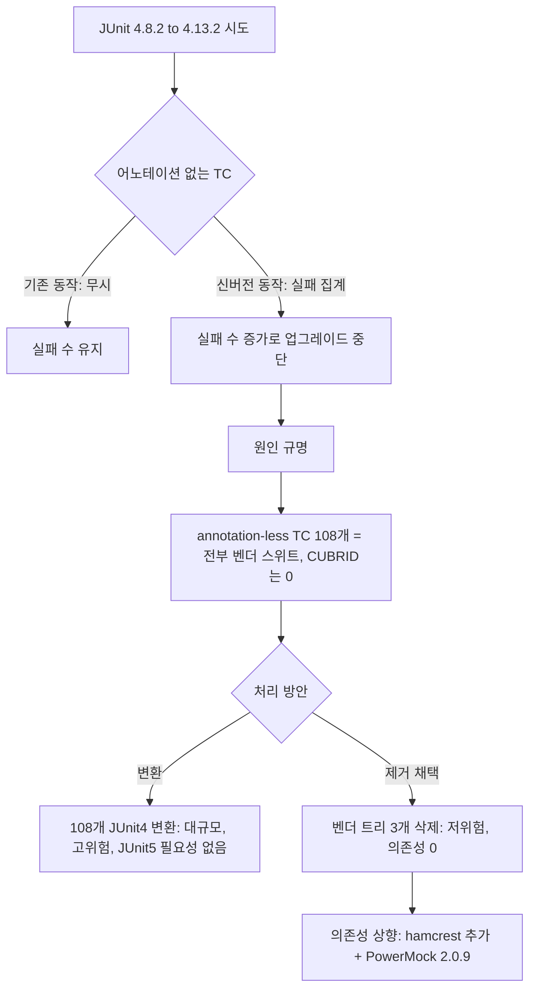

# JDBC 테스트 JUnit 4.13.2 업그레이드 분석 및 계획

- 분류: analysis
- 날짜: 2026-07-14
- 관련: 이슈 없음 (사전 분석). 대상: `interface/JDBC/test_jdbc`

## 요약
JUnit 라이브러리(4.8.2 → 4.x 최신 4.13.2) 업그레이드를 막던 "어노테이션 없는 TC"는 전부 벤더 이식 스위트(jTDS/PostgreSQL/MySQL)였고 CUBRID 테스트와 완전히 분리되므로, "JUnit 4로 변환"이 아니라 "벤더 스위트 제거 + 의존성 상향"이 최소 위험의 정답이다.

## 목적
JUnit 4.x 최신 업그레이드가 막힌 실제 원인을 규명하고, "JUnit 3 스타일 TC를 JUnit 4로 먼저 변환하는 것"이 옳은 선행 작업인지 검증한다. 그 결과로 최소 위험의 업그레이드 경로를 도출한다.

## 배경
대상 프로젝트는 이미 JUnit 4.8.2를 쓰는 Ant 단일 프로젝트다(즉 3→4 마이그레이션이 아니라 4.x 내 상향). 라이브러리를 올리면 `@Test`가 없는 JUnit 3 스타일 TC가 지금까지의 "무시(집계 제외)"와 달리 "실패"로 집계되어 실패 TC 수가 증가하고, 이 때문에 업그레이드가 중단됐다. 이 현상의 원인과 범위를 코드로 확인했다.

## 범위 / 방법
- 대상: `interface/JDBC/test_jdbc` (`build.xml`, `.classpath`, `src/**`).
- 방법: 빌드/클래스패스 설정과 소스 트리 정적 분석(ripgrep, 파일 검사), 라이브러리 호환성은 공식 문서/위키로 교차 확인.
- 분류 기준: 상속 관계(`TestCase` 계열)와 어노테이션(`@Test`/`@RunWith`)을 교차 확인(임포트만으로는 벤더 하위 클래스가 누락됨).

## 발견 / 관찰

- 이미 **JUnit 4.8.2** 사용. `lib/`에 `junit-4.8.1.jar`와 `junit-4.8.2.jar`가 **중복** 존재하고 Ant가 `*.jar` glob으로 둘 다 클래스패스에 올린다.
- 소스는 두 부류로 완전히 갈린다.

| 구분 | 트리 | 프레임워크 | 규모 |
|---|---|---|---|
| CUBRID 자체 | `src/com`, `src/cubrid`, `src/issues` | JUnit 4 (`@Test`) | JUnit4 파일 143개, annotation-less 0 |
| 벤더 이식 | `src/net`(jTDS), `src/org`(PostgreSQL), `src/testsuite`(MySQL C/J) | JUnit 3 | `.java` 225개 (JUnit3 테스트 118, batch 수집 대상 108) |

- Ant `<batchtest>`가 이름 패턴(`*Test`/`Test*`)으로 수집하는 annotation-less 클래스 **108개는 전원 벤더 스위트**이며 모두 `TestCase` 계열 상속이다. **CUBRID 트리에는 annotation-less 테스트가 0개** (삭제 후 세트가 깨끗한 JUnit 4).
- 벤더 트리는 외부에서 import되지 않고(`testsuite.tools` 포함 참조 0건) CUBRID 테스트도 이에 의존하지 않는다. → **통째 삭제해도 컴파일 영향 없음**.
- JUnit 4.13.2도 `junit.framework.*` 호환 클래스를 유지하므로 JUnit 3 스타일 자체는 "컴파일 블로커"가 아니다. 실제 블로커는 아래 표와 같다.

| 항목 | 현재 상태 | 조치 |
|---|---|---|
| 벤더 JUnit3 TC | batch 대상 108개, 신버전에서 실패 집계 | 벤더 트리 3개 삭제 |
| hamcrest | 4.8.2 jar에 번들됨 | 4.11부터 분리되어 미번들 → `hamcrest-core-1.3.jar` 추가 필요 |
| junit jar 중복 | `junit-4.8.1.jar` + `junit-4.8.2.jar` 동시 | 제거 후 `junit-4.13.2.jar` 단일화 |
| PowerMock | 1.4.12, 8개 CUBRID 테스트(EasyMock 3.1 기반, 1건 Mockito 병용) | PowerMock 2.0.9 + EasyMock 3.5+ (2.0이 EasyMock 3.1 지원 제거) |
| jvmarg | `–add-opens`(en-dash U+2013로 시작, 무효) | ASCII `--add-opens`로 수정 |
| `junit.framework.Assert` | CUBRID 10개 파일에 잔존 | `org.junit.Assert`로 정리 |

- hamcrest 미번들 시 런타임 오류:

```
java.lang.NoClassDefFoundError: org/hamcrest/SelfDescribing
```

- jvmarg 오타 (JDK 9+ 모듈 개방, CBRD-23846):

```xml
<!-- 현재: en-dash(U+2013)로 시작 → JVM이 인식 못 함(무효) -->
<jvmarg value="–add-opens java.base/java.lang=ALL-UNNAMED" />
<!-- 수정: ASCII 이중 하이픈 -->
<jvmarg value="--add-opens java.base/java.lang=ALL-UNNAMED" />
```

### 원인 분석과 결정 흐름



## 결론
업그레이드를 막은 것은 CUBRID 테스트가 아니라 벤더 이식 스위트의 JUnit 3 스타일 TC이며, 이들은 안전하게 제거 가능하다. 따라서 "JUnit 3 → 4 변환을 먼저"는 불필요하고, 블로커의 원천(벤더 스위트)을 제거한 뒤 라이브러리/빌드 의존성을 상향하는 것이 정답이다. 남는 실제 작업 중 최대 불확실성은 PowerMock(1.4.12 → 2.0.9)과 그에 딸린 EasyMock(3.1 → 3.5+) 상향이다.

## 다음 단계
- 실제 구현은 별도 작업/이슈로 진행(권장 순서 아래).
  1. Baseline 실행으로 현재 pass/fail/error 및 벤더 통과 수 기록(삭제로 잃는 커버리지 정량화).
  2. 벤더 트리 3개(`src/net`, `src/org`, `src/testsuite`) 삭제 후 `ant compile` 확인.
  3. 의존성/빌드 상향: `hamcrest-core-1.3.jar` 추가, `junit-4.13.2.jar` 단일화, `.classpath` 갱신, jvmarg 오타 수정.
  4. CUBRID 10개 파일의 `junit.framework.Assert` → `org.junit.Assert` 정리.
  5. PowerMock 8개 테스트 검증, 필요 시 PowerMock 2.0.9 + EasyMock 3.5+ (Mockito 병용 1건은 `powermock-api-mockito2`+Mockito 2.x 또는 EasyMock으로 치환)로 상향.
  6. 재실행 후 baseline 대비 실패 수 미증가 확인. 비교는 `jdbc-ctp-verify-report` 스킬로 문서화.

## 참고
- 확인 코드: `interface/JDBC/test_jdbc/build.xml`, `interface/JDBC/test_jdbc/.classpath`, `interface/JDBC/test_jdbc/src/**`
- JUnit 4.11 hamcrest 분리: https://junit.org/junit4/dependencies.html , https://dzone.com/articles/whats-junit-and-hamcrest
- PowerMock 호환성(JUnit/EasyMock): https://github.com/powermock/powermock/wiki/Getting-Started , https://github.com/powermock/powermock/wiki/easymock
- 검증 스킬: `jdbc-ctp-verify-report`
