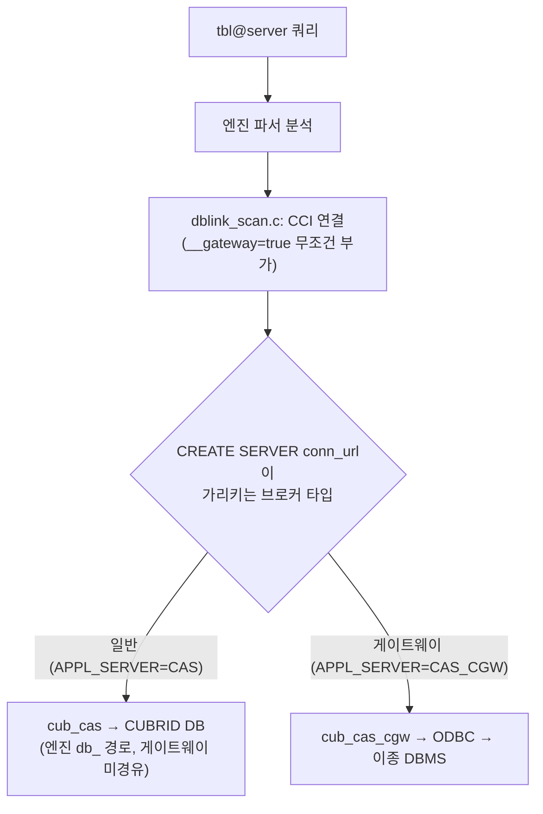

# CUBRID Gateway와 DBLink 구조 분석 (CAS 경유 경로)

- 분류: analysis
- 날짜: 2026-07-15
- 관련: 없음 (JDBC 4.2 확장 사전 조사에서 파생)

## 요약
이종(異種) DBMS 대상 DBLink는 게이트웨이 CAS(`cub_cas_cgw`)를 경유하지만, CUBRID↔CUBRID DBLink는 일반 브로커(`cub_cas`)로 직결된다. 경유 여부는 엔진 코드가 아니라 `CREATE SERVER`가 가리키는 브로커의 `APPL_SERVER` 타입이 결정한다.

## 목적
JDBC 4.2 확장 사전 조사 중 파생된 질문을 CUBRID 소스로 규명한다. (1) 게이트웨이 사용 시 JDBC가 필요한가, (2) `테이블@server` 쿼리의 처리 흐름, (3) CUBRID↔CUBRID DBLink가 게이트웨이 CAS를 거치는가 일반 브로커로 직결하는가.

## 배경
CUBRID JDBC 드라이버에 JDBC 4.2 API를 확장하기 위한 사전 조사 과정에서, 일부 기능이 CAS 프로토콜과 게이트웨이 동작에 의존하는지 확인이 필요했다. 특히 게이트웨이와 DBLink의 관계, 그리고 JDBC 드라이버가 어느 구간에 관여하는지가 반복적으로 제기되어 소스 레벨로 검증했다.

## 범위 / 방법
- 대상: CUBRID 11.5 엔진 및 브로커 소스 (Apache 2.0 오픈소스), CUBRID JDBC 드라이버
- 방법: 소스 직접 추적. 함수 디스패치 테이블, 연결 URL 구성, `db_`(엔진) / `cci_`(클라이언트) / ODBC 호출 경로를 대조
- 확인 파일: `src/broker/cas_cgw.c`, `cas_cgw_execute.c`, `cas_cgw_odbc.c`, `cas_execute.c`, `cas_common_main.c`, `broker_config.c`, `broker_filename.h`, `src/query/dblink_scan.c`, `src/parser/csql_grammar.y`, `src/parser/name_resolution.c`

## 발견 / 관찰

### 1. Gateway(CGW)의 정체: 별도 CAS 바이너리 + 브로커 설정
- 게이트웨이는 일반 CAS와 다른 **별도 실행 바이너리** `cub_cas_cgw`이다 (`broker_filename.h:32`, `cas_handle.h:37`의 `CAS_FOR_CGW` 컴파일 가드).
- 어떤 브로커가 게이트웨이인지는 **브로커 설정**이 결정한다: `APPL_SERVER = CAS_CGW` (`broker_config.c:130`, `broker_config.h:41`).
- 게이트웨이 브로커는 대상 외부 DB를 다음 파라미터로 지정한다 (`broker_config.c:261-265`).

```
CGW_LINK_SERVER
CGW_LINK_SERVER_IP
CGW_LINK_SERVER_PORT
CGW_LINK_ODBC_DRIVER_NAME
CGW_LINK_CONNECT_URL_PROPERTY
```

### 2. CGW가 지원하는 함수코드는 최소 집합뿐
게이트웨이 CAS의 함수 디스패치 테이블(`cas_cgw.c:95`)은 극히 일부만 실제 핸들러를 두고 나머지는 `fn_not_supported`이다.

| 지원 (fn_cgw_*) | 미지원 (fn_not_supported) |
|---|---|
| END_TRAN, PREPARE, EXECUTE, CURSOR, FETCH, CLOSE_REQ_HANDLE, GET_DB_VERSION, CON_CLOSE, CHECK_CAS | SAVEPOINT, GET_GENERATED_KEYS, EXECUTE_BATCH, EXECUTE_ARRAY, LOB_*, XA_*, GET_ROW_COUNT, GET_LAST_INSERT_ID, SCHEMA_INFO, PARAMETER_INFO, OID_*, 그 외 전부 |

즉 게이트웨이 직결 연결에서는 prepare / execute / fetch / commit / close 수준만 동작한다.

### 3. CGW는 CUBRID 엔진을 거치지 않는 무(無)번역 프록시
- 게이트웨이 실행부는 CUBRID 엔진 API(`db_execute` / `db_compile` / `db_open`)를 **전혀 호출하지 않는다**. 대신 ODBC로 대상 DB에 직접 실행한다.

| 경로 | CUBRID 엔진(db_) 호출 수 | 외부 실행 수단 |
|---|---|---|
| 일반 CAS (`cas_execute.c`) | 25 | CUBRID 엔진 |
| 게이트웨이 CAS (`cas_cgw_execute.c`) | 0 | ODBC (`SQLPrepare` / `SQLExecute` / `SQLFetch`) |

- SQL 문자열은 앱이 보낸 그대로 ODBC로 전달된다. `ux_cgw_prepare()`가 문자열을 복사한 뒤 `SQLPrepareW`로 넘긴다 (`cas_cgw_odbc.c:1765`, 실행 `:309`, 페치 `:345`). `translate` / `rewrite` / `dialect` 관련 로직은 검색 결과 없음.
- 따라서 앱이 던지는 SQL은 이미 **대상 DBMS(예: Oracle) 방언**이어야 한다. 파싱과 실행은 대상 DBMS가 수행한다. (마이그레이션 툴 CMT가 방언을 변환하는 것과 다르다.)

### 4. JDBC의 개입 지점
- 앱은 게이트웨이 사용 여부와 무관하게 **일반 CUBRID 연결**로 브로커에 접속한다. 즉 Java 앱이면 CUBRID JDBC 드라이버가 클라이언트 인터페이스다.
- 게이트웨이(브로커↔외부 DB의 ODBC 중계)는 서버측/내부 구간이라 JDBC에는 투명하다.
- 단, 게이트웨이 직결 연결에서는 위 함수코드 제약 때문에 Savepoint, 배치, 생성키 조회 등이 동작하지 않는다. JDBC 4.2 작업 시 이 기능들은 게이트웨이 연결에서 깔끔한 "미지원" 예외로 우아하게 degrade 되도록 설계해야 한다.

### 5. DBLink 흐름: `테이블@server`
- `테이블@server` 및 `CREATE SERVER` 구문은 **CUBRID 엔진 파서**가 처리한다 (`csql_grammar.y:3107` CREATE SERVER, `class_name_with_server_name`, `is_dblink_query_string`).
- 원격 조회 시 엔진이 **직접 CCI 클라이언트**가 되어 외부로 접속한다 (`src/query/dblink_scan.c`): `cci_connect_with_url_ex()`(`:606`) → `cci_prepare()`(`:633`) → `cci_execute()`(`:648`) → `cci_fetch()`(`:865`). 결과는 엔진이 수신해 로컬 테이블과 통합한다.
- 연결 핸들은 `qmgr_dblink_*_conn_handle`로 (url, user, password) 단위 캐싱된다 (non-autocommit 시).


### 6. 핵심: CUBRID↔CUBRID DBLink는 게이트웨이 CAS를 거치지 않는다
- `dblink_scan.c`는 대상 종류에 대한 **분기가 없다**. 연결 URL에 항상 `__gateway=true`를 부가한다 (`:590` / `:594`, 두 번째 함수 `:701` / `:705`, `name_resolution.c:5479`도 동일). `:?` 조건은 `?` 대 `&` 구분용 URL 포맷팅일 뿐이다.
- 실제 경유 여부는 `CREATE SERVER`의 `conn_url`이 가리키는 **브로커 타입**이 결정한다.
  - 일반 브로커(`cub_cas`, `APPL_SERVER=CAS`)를 가리키면 CUBRID DB에 직접 연결된다. `__gateway=true` 플래그는 정상 CAS에서는 인증 오류 메시지 문구 분기에만 쓰이고 기능에는 영향이 없다 (`cas_common_main.c:1138`).
  - 게이트웨이 브로커(`cub_cas_cgw`, `APPL_SERVER=CAS_CGW`)를 가리키면 ODBC로 이종 DB에 접근한다 (`cas_cgw.c:356`에서 플래그 확인).



## 결론
CUBRID↔CUBRID DBLink는 게이트웨이 CAS를 경유하지 않고 일반 브로커(`cub_cas`)로 직결된다. 게이트웨이(`cub_cas_cgw`)는 이종 DBMS 접근 전용 ODBC 프록시이며, DBLink의 대상 종류 구분은 엔진 코드가 아니라 `CREATE SERVER`가 가리키는 브로커의 `APPL_SERVER` 타입이 결정한다. 엔진은 두 경우 모두 `__gateway=true`를 부가하지만, 이 플래그 자체가 경유를 강제하지는 않는다. JDBC 드라이버는 두 경우 모두 앱↔CUBRID 구간에만 관여하고 원격/게이트웨이 홉은 서버 내부에서 처리되어 투명하다.

## 다음 단계
- JDBC 4.2 작업 반영: 게이트웨이 직결 연결에서 미동작하는 기능(Savepoint, 배치, 생성키 등)은 표준 미지원 예외로 degrade 되도록 설계에 명시
- (선택) `__gateway=true` 플래그가 정상 CAS 동작에 에러 메시지 외 기능적 영향을 주는지 추가 확인
- (선택) CUBRID 매뉴얼의 DBLink, CREATE SERVER, CAS_CGW 브로커 설정 페이지로 사용자 관점 교차확인
- 이슈화: 현재는 조사 노트 수준, 별도 JIRA 불필요

## 참고
- `src/broker/cas_cgw.c:95` (CGW 함수 테이블), `:356` (`__gateway` 확인)
- `src/broker/cas_cgw_execute.c` (엔진 db_ 호출 0), `cas_cgw_odbc.c:1765` (`SQLPrepareW`), `:309` (`SQLExecute`), `:345` (`SQLFetchScroll`)
- `src/broker/cas_execute.c` (일반 경로 db_ 호출 25)
- `src/broker/cas_common_main.c:1138` (`__gateway` 오류 메시지 분기)
- `src/broker/broker_config.c:130` (CAS_CGW 타입), `:261-265` (CGW_LINK_* 파라미터), `broker_filename.h:32` (`cub_cas_cgw`), `broker_config.h:41`
- `src/query/dblink_scan.c:590`,`594`,`606`,`633`,`648`,`865` (엔진의 CCI 원격 실행), `src/parser/name_resolution.c:5479`
- `src/parser/csql_grammar.y:3107` (CREATE SERVER 문법)
- 기준: CUBRID 11.5 소스
