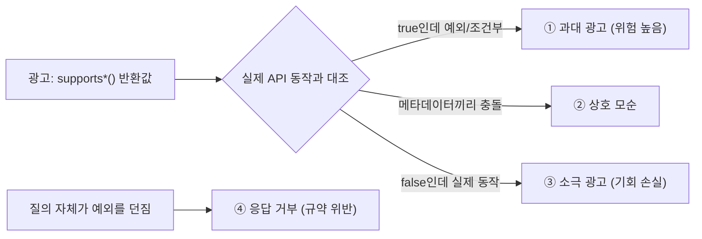

# CUBRID JDBC 기능 광고(capability) vs 실제 동작 전수 감사

- 분류: analysis
- 날짜: 2026-07-17
- 관련: [타입 매핑 전수 분석](2026-07-09-cubrid-jdbc-type-mapping.md), [5-DB 실측](2026-07-10-5db-jdbc-type-mapping-measured.md), [APIS-1086](../APIS-1086/APIS-1086-getbestrowidentifier-pk.md), [APIS-1089](../APIS-1089/APIS-1089-savepoint-implementation.md)

## 요약

`DatabaseMetaData`의 기능 광고(supports* 등 약 95개)를 전수 조사하고 8개 그룹을 드라이버 소스로 심층 검증한 결과, 과대 광고(true인데 예외/조건부) 다수, 메타데이터 상호 모순, 소극 광고(false인데 실제 동작, 대표: `supportsStoredProcedures`)가 확인됨. 타입 매핑 불일치와 같은 병: 광고가 실제 동작과 관리되지 않은 채 어긋나 있다.

## 목적

타입 매핑 조사의 연장. 이번에는 값(java.sql.Types)이 아니라 "이 기능이 되느냐"를 답하는 capability 메서드가 실제 API 동작과 일치하는지 감사한다.

## 배경

타입 매핑 조사에서 `getTypeInfo`가 컬렉션을 `ARRAY`로 광고하지만 `getArray()`는 예외를 던지는 "지킬 수 없는 약속"을 발견했다. 같은 패턴이 capability 전반에 있는지 확대 조사했다.

## 범위 / 방법

- 대상: cubrid-jdbc 드라이버 소스(11.x 개발 트리 기준, line 번호는 확인 시점)
- 인벤토리: `CUBRIDDatabaseMetaData`의 boolean capability 메서드 전수(약 95개)와 하드코딩 값 수집
- 심층 검증 8개 그룹: 광고값과 실제 구현 코드(driver + jci 프로토콜 계층)를 끝까지 추적해 대조
  - savepoints / generated keys / scroll·updatable ResultSet / batch / stored procedures / multiple results / holdability / JDBC 필수 API
- 판정 기준: MISMATCH(광고와 실제가 다름) / PARTIAL(조건부·일부만 이행) / CONSISTENT(일치)
- 이미 별도 문서화된 발견은 본 노트에서 상세 재기술하지 않고 링크만 남긴다(중복 방지)

## 발견 / 관찰

### 심층 검증 8건 판정

| 그룹 | 광고 | 실제 | 판정 |
|---|---|---|---|
| multiple results | `supportsMultipleOpenResults()=true` | `getMoreResults(int)` 몸체가 주석 처리, 무조건 예외. 순차 접근만 가능 | MISMATCH |
| JDBC 필수 API | JDBC 3.0 선언 + getTypeInfo `ARRAY` 광고 | `getParameterMetaData()`(구현 주석 처리), `getArray()`, `createArrayOf()` 전부 예외 | MISMATCH |
| stored procedures | `supportsStoredProcedures()=false` | `prepareCall`+CallableStatement가 전용 프로토콜 플래그로 실제 동작(인덱스 IN/OUT) | MISMATCH |
| scroll·updatable | `supportsResultSetConcurrency(*, UPDATABLE)` 무조건 true | 서버가 OID-updatable로 안 주면(조인·뷰·집계) SQLWarning 없이 READ_ONLY로 조용히 강등, 이후 `updateRow()` 예외 | PARTIAL |
| holdability | `supportsResultSetHoldability` 무조건 true | 브로커 미지원 시 조용히 강등. 그 경우 `getResultSetHoldability()`와 자기모순 | PARTIAL |
| savepoints | 토폴로지 기반 동적 true | set/rollback은 fn26으로 실제 동작, `releaseSavepoint()`만 예외. 상세: [APIS-1089](../APIS-1089/APIS-1089-savepoint-implementation.md), [설계](../spec/2026-07-15-cubrid-jdbc-savepoint-design.md) | PARTIAL |
| generated keys | `supportsGetGeneratedKeys()=true` | int-flag 경로만 동작, 컬럼명/인덱스 오버로드는 조용히 빈 결과. 상세: [버그 노트](../bug/2026-07-12-getgeneratedkeys-empty-resultset.md) | PARTIAL |
| batch | `supportsBatchUpdates()=true` | 와이어 계층(EXECUTE_BATCH_STATEMENT)까지 완전 구현 | CONSISTENT |

### ① 과대 광고 상세 (신규 발견 중심)

- `supportsMultipleOpenResults()=true`인데 `getMoreResults(KEEP_CURRENT_RESULT)`가 무조건 예외 (`CUBRIDStatement.java:605-638`, 몸체 주석 처리). 순차 다중 결과(`supportsMultipleResultSets`)는 정직하게 동작
- JDBC 3.0 선언(`getJDBCMajorVersion()=3`)과 모순되게 3.0 필수 API `getParameterMetaData()`가 예외 (`CUBRIDPreparedStatement.java:812`, 동작 구현이 주석으로 존재)
- getTypeInfo의 컬렉션 `ARRAY` 광고와 모순되게 `getArray()`/`createArrayOf()` 예외 (`CUBRIDResultSet.java:1473`, `CUBRIDConnection.java:1044`)
- updatable/holdable 요청이 서버 조건 미충족 시 **경고 없이 조용히 강등**되는 공통 패턴 (`CUBRIDStatement.java:334-339`, `:108-111`). 앱은 광고를 믿고 요청했는데 실패 신호가 없음

### ② 메타데이터 상호 모순

- getTypeInfo `ARRAY` ↔ getColumns/RSMD `OTHER` (타입 매핑 노트의 컬렉션 불일치와 동일 뿌리)
- `supportsMultipleOpenResults=true` ↔ `supportsStoredProcedures=false` (그 기능은 SP 결과용)
- `supportsDataManipulationTransactionsOnly=true` ↔ `supportsDataDefinitionAndDataManipulationTransactions=true` (동시에 참일 수 없음)
- `supportsOpenCursorsAcrossCommit=true` ↔ `supportsOpenStatementsAcrossCommit=false`
- 레거시 브로커에서 `supportsResultSetHoldability(HOLD)=true` ↔ `getResultSetHoldability()=CLOSE`
- quoted identifier 관련 4개 전부 false(어떤 케이스로든 저장되므로 논리 불가능), `isCatalogAtStart=true` ↔ 카탈로그 전면 미지원

### ③ 소극 광고: false인데 실제 동작

- `supportsStoredProcedures()=false`가 대표 사례(심층 검증 완료). Spring SimpleJdbcCall, Hibernate 등이 이 값을 보고 SP 기능을 통째로 비활성화
- 아래는 인벤토리 단계의 의심 플래그(엔진 대조 미검증):
  - `supportsColumnAliasing=false` (SELECT AS 지원), `supportsOuterJoins=false` (LEFT/RIGHT OUTER JOIN 지원)
  - `supportsExpressionsInOrderBy=false`, `supportsOrderByUnrelated=false`, `supportsSelectForUpdate=false` (10.x+ 지원)
  - `supportsSchemasIn*=false` (11.2+ 유저 스키마 도입 후 stale 가능), `isReadOnly=false` 하드코딩(HA read-only 브로커 미반영)

### ④ 응답 거부: capability 질의 자체가 예외

`autoCommitFailureClosesAllResultSets`, `supportsStoredFunctionsUsingCallSyntax`, `generatedKeyAlwaysReturned`, `isWrapperFor`, `getSchemas(catalog, pattern)`. boolean/결과를 반환해야 하는 질의 메서드가 예외를 던지는 것 자체가 규약 위반 (`isWrapperFor`는 java.sql.Wrapper 계약 위반)

## 결론

- 개별 기능 구현은 상당수 실존한다(batch 완전 일치, SP·savepoint 대부분 동작). 문제는 **광고가 관리되지 않는 것**: 되는 걸 안 된다 하고(③), 안 되는 걸 된다 하며(①), 광고끼리 모순(②)이다.
- 특히 "조용한 강등" 패턴(updatable/holdable)은 광고를 믿은 코드가 특정 쿼리·브로커에서만 런타임에 깨져 재현이 어렵다.
- 타입 매핑 통일과 동일한 원칙을 적용해야 한다: **지킬 수 있는 약속만, 실제 동작과 일치하게, 한 곳에서 관리**.

## 다음 단계

- ③ 의심 플래그의 엔진 대조 실측(SQL 문법류는 실제 서버로 확인 후 판정 확정)
- 이슈화 후보: `supportsMultipleOpenResults` 정정 또는 `getMoreResults(int)` 구현, 필수 API(getParameterMetaData) 부활, 조용한 강등에 SQLWarning 추가, `supportsStoredProcedures` true 전환
- 타입 매핑 통일 작업과 같은 트랙에서 capability 표 정비(광고값 일괄 재검토)

## 참고

- cubrid-jdbc 드라이버 소스: `CUBRIDDatabaseMetaData.java`(capability 응답), `CUBRIDStatement/CUBRIDPreparedStatement/CUBRIDResultSet/CUBRIDConnection.java`(실제 구현), `jci/UConnection·UStatement.java`(프로토콜 계층)
- 관련 노트(상세 중복 없이 링크만): [타입 매핑 전수 분석](2026-07-09-cubrid-jdbc-type-mapping.md) · [5-DB 실측](2026-07-10-5db-jdbc-type-mapping-measured.md) · [generated keys 버그](../bug/2026-07-12-getgeneratedkeys-empty-resultset.md) · [APIS-1086 PK](../APIS-1086/APIS-1086-getbestrowidentifier-pk.md) · [APIS-1089 savepoint](../APIS-1089/APIS-1089-savepoint-implementation.md)
