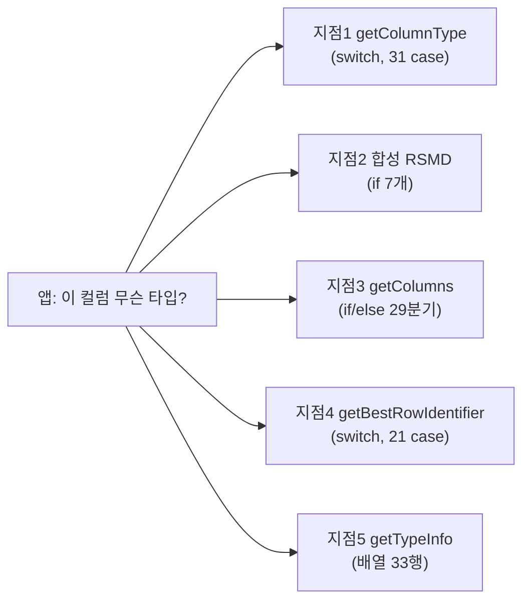

# CUBRID JDBC 타입 매핑 정본: 5개 지점 전체 매핑, 불일치, 제안

- 분류: analysis
- 날짜: 2026-07-17
- 관련: [소스 분석(07-09)](2026-07-09-cubrid-jdbc-type-mapping.md) · [5-DB 실측(07-10)](2026-07-10-5db-jdbc-type-mapping-measured.md) · 본 문서가 두 노트의 CUBRID 매핑 내용을 대체하는 **정본**

## 요약

CUBRID JDBC 드라이버가 타입을 `java.sql.Types`로 변환하는 5개 지점의 전체 매핑을 소스에서 재도출하고 라이브 CUBRID 11.4로 실측 검증했다. 개별 값은 대체로 정상이지만 BIT, TZ 날짜·시간, 컬렉션, NULL이 지점마다 다른 값으로 보고되고, getTypeInfo는 규약이 요구하는 정렬을 하지 않으며, 미매칭 타입은 직전 행 값이 잔존하는 구조적 결함이 있다. 또한 이전 노트에서 "엔진 제거"로 제외했던 **MONETARY·NCHAR·NCHAR VARYING이 실측 결과 여전히 생성·매핑됨을 확인**하여 본 정본에 복원했다.

## 1. 신뢰 근거: 검증 방법과 증거 등급

이 문서의 **모든 표의 모든 행에는 증거 등급**이 있다. 등급 없는 값은 싣지 않았다.

| 등급 | 의미 |
|---|---|
| [S] | 드라이버 소스에서 재도출(2026-07-17, 기존 문서를 참조하지 않고 독립 재추출 후 대조). file:line 명시 |
| [M] | 라이브 CUBRID에 실측 확인(아래 환경) |
| [SM] | 소스와 실측이 일치(본 문서 표의 기본 요건) |
| [U] | 미확정(해당 시 명시) |

**실측 환경**: Docker `cubrid/cubrid:11.4` + cubrid-jdbc `11.3.2.0053` (Testcontainers, JUnit 5).
**재현 방법**: 검증 하네스(jdbc-testcontainer 모듈)의 `CubridJdbcTest`(회귀 10건: 지점 1·3·4·5의 매핑 전량 assert)와 `CubridProbeTest`(프로브 4건: MONETARY·NCHAR 생성, 부호없는 정수 DDL, 합성 결과셋 RSMD 전체 덤프). 본 문서 작성 직전 실행 결과 **14/14 통과**.
**소스 기준**: cubrid-jdbc 소스 트리. line 번호는 재도출 시점 기준(버전에 따라 이동 가능).

### 이전 노트에 대한 정정 (재검증으로 뒤집힘)

| 항목 | 이전 판단 | 실측 결과 [M] |
|---|---|---|
| MONETARY | 엔진에서 제거됨(표에서 제외) | `CREATE TABLE (c MONETARY)` **성공**. RSMD=DOUBLE/"MONETARY"/Double. 매뉴얼 문구("제거될 예정, deprecated")가 정확했음 |
| NCHAR / NCHAR VARYING | 9.0에서 제거(데드 경로) | `CREATE TABLE (c NCHAR(3))`, `(c NCHAR VARYING(3))` **둘 다 성공**. RSMD=CHAR/"NCHAR", VARCHAR/"NCHAR VARYING". 매뉴얼의 "지원하지 않음"은 공식 지원 중단이지 파서 제거가 아님 |
| 미매칭 시 동작 | "null 반환"으로 기술 | 정밀 교정: 지점 3·4는 출력 배열 재사용으로 **직전 행 값 잔존**(첫 행이면 null). §9-⑧ |

→ MONETARY·NCHAR·NCHAR VARYING은 본 정본의 모든 표에 **폐기(deprecated)이지만 동작하는 타입**으로 포함한다.

## 2. 기초: 내부 타입 상수와 다섯 지점

### 2.1 U_TYPE 상수 전량 (37개 선언, 35개 값) [S: jci/UUType.java:60~102]

| 상수 | 값 | line | 비고 |
|---|---|---|---|
| U_TYPE_MIN | 0 | :60 | int 범위 마커(실제 타입 아님) |
| U_TYPE_NULL | 0 | :62 | |
| U_TYPE_CHAR | 1 | :63 | |
| U_TYPE_STRING | 2 | :64 | **U_TYPE_VARCHAR와 별칭**(같은 값 2) |
| U_TYPE_VARCHAR | 2 | :65 | |
| U_TYPE_NCHAR | 3 | :66 | |
| U_TYPE_VARNCHAR | 4 | :67 | |
| U_TYPE_BIT | 5 | :68 | |
| U_TYPE_VARBIT | 6 | :69 | |
| U_TYPE_NUMERIC | 7 | :70 | **U_TYPE_DECIMAL과 별칭**(같은 값 7) |
| U_TYPE_DECIMAL | 7 | :71 | |
| U_TYPE_INT | 8 | :72 | |
| U_TYPE_SHORT | 9 | :73 | |
| U_TYPE_MONETARY | 10 | :74 | |
| U_TYPE_FLOAT | 11 | :75 | |
| U_TYPE_DOUBLE | 12 | :76 | |
| U_TYPE_DATE | 13 | :77 | |
| U_TYPE_TIME | 14 | :78 | |
| U_TYPE_TIMESTAMP | 15 | :79 | |
| U_TYPE_SET | 16 | :80 | |
| U_TYPE_MULTISET | 17 | :81 | |
| U_TYPE_SEQUENCE | 18 | :82 | |
| U_TYPE_OBJECT | 19 | :83 | |
| U_TYPE_RESULTSET | 20 | :84 | |
| U_TYPE_BIGINT | 21 | :85 | |
| U_TYPE_DATETIME | 22 | :86 | |
| U_TYPE_BLOB | 23 | :87 | |
| U_TYPE_CLOB | 24 | :88 | |
| U_TYPE_ENUM | 25 | :89 | |
| U_TYPE_USHORT | 26 | :90 | |
| U_TYPE_UINT | 27 | :91 | |
| U_TYPE_UBIGINT | 28 | :92 | |
| U_TYPE_TIMESTAMPTZ | 29 | :93 | |
| U_TYPE_TIMESTAMPLTZ | 30 | :94 | |
| U_TYPE_DATETIMETZ | 31 | :95 | |
| U_TYPE_DATETIMELTZ | 32 | :96 | |
| U_TYPE_TIMETZ | 33 | :97 | 소스 주석 `/* unused */` |
| U_TYPE_JSON | 34 | :98 | |
| U_TYPE_MAX | 34 | :102 | int 범위 마커 |

값 공간 0~34는 빈틈 없이 연속(별칭 2쌍 포함).

### 2.2 다섯 지점

| 지점 | 위치 [S] | 답하는 질문 | 구현 |
|---|---|---|---|
| 1 | CUBRIDResultSetMetaData 생성자(UColumnInfo[]) :62, switch :99 | 실행한 SELECT 결과 컬럼의 타입 | switch 30 case + default |
| 2 | 같은 파일 생성자(CUBRIDResultSetWithoutQuery) :453, if :470~520 | 메타데이터 결과표 자체의 칸 타입 | 독립 if 7개(else 없음) |
| 3 | CUBRIDDatabaseMetaData.getColumns, 체인 :1160~1247 | 카탈로그 컬럼 목록의 DATA_TYPE | if/else 29분기(default 없음) |
| 4 | 같은 파일 getBestRowIdentifier, switch :1513~1619 | 행 식별 컬럼의 DATA_TYPE | switch 21 case(default 없음) |
| 5 | 같은 파일 getTypeInfo, 병렬 배열 :1946~1978 | 지원 타입 카탈로그(역방향 안내) | 손수 짠 배열 33행 |

## 3. 지점 1: getColumnType 전체 매핑 (30 case + default)

증거: 전 행 [SM] (소스 재도출 + 회귀 검증기의 all-types 테이블 28컬럼 assert + 프로브의 MONETARY·NCHAR·NCHAR VARYING 실측). 예외: NUMERIC의 mysql 모드 분기만 [S](모드 미실측).

| # | U_TYPE(값) | java.sql.Types | TYPE_NAME 문자열 | 조건·비고 | line |
|---|---|---|---|---|---|
| 1 | CHAR(1) | CHAR | "CHAR" | | :100 |
| 2 | VARCHAR(2) | VARCHAR | "VARCHAR" | STRING은 같은 값(2)이라 이 case가 처리 | :109 |
| 3 | ENUM(25) | VARCHAR | "ENUM" | | :118 |
| 4 | BIT(5) | **정밀도 8이면 BIT, 아니면 BINARY** | "BIT"(양쪽 동일) | 클래스도 Boolean/byte[]로 갈림 → 불일치 ① | :127 |
| 5 | VARBIT(6) | VARBINARY | "BIT VARYING" | | :142 |
| 6 | SHORT(9) | SMALLINT | "SMALLINT" | mysql 모드: 표시폭만 변경 | :151 |
| 7 | INT(8) | INTEGER | "INTEGER" / mysql 모드 "INT" | Types는 양쪽 INTEGER | :160 |
| 8 | BIGINT(21) | BIGINT | "BIGINT" | | :171 |
| 9 | FLOAT(11) | REAL | "FLOAT" | 이름은 FLOAT, Types는 REAL(규약상 정상, 부록 A) | :177 |
| 10 | DOUBLE(12) | DOUBLE | "DOUBLE" | | :183 |
| 11 | NUMERIC(7) | **mysql 모드면 DECIMAL, 아니면 NUMERIC** | "DECIMAL"/"NUMERIC" | DECIMAL은 같은 값(7)이라 이 case가 처리 → 불일치 ⑤ | :189 |
| 12 | MONETARY(10) | DOUBLE | "MONETARY" | deprecated이나 동작(§1 정정) | :203 |
| 13 | DATE(13) | DATE | "DATE" | | :209 |
| 14 | TIME(14) | TIME | "TIME" | | :215 |
| 15 | TIMESTAMP(15) | TIMESTAMP | "TIMESTAMP" | | :221 |
| 16 | TIMESTAMPTZ(29) | TIMESTAMP | "TIMESTAMPTZ" | W_TIMEZONE 아님 → 불일치 ② | :227 |
| 17 | TIMESTAMPLTZ(30) | TIMESTAMP | "TIMESTAMPLTZ" | 불일치 ② | :233 |
| 18 | DATETIME(22) | TIMESTAMP | "DATETIME" | ms 포함이라 합리적 | :239 |
| 19 | DATETIMETZ(31) | TIMESTAMP | "DATETIMETZ" | 불일치 ② | :245 |
| 20 | DATETIMELTZ(32) | TIMESTAMP | "DATETIMELTZ" | 불일치 ② | :251 |
| 21 | NULL(0) | OTHER | ""(빈 문자열) | :259에 `// col_type[i] = java.sql.Types.NULL;` 주석 잔존 → 불일치 ④ | :257 |
| 22 | OBJECT(19) | OTHER | "CLASS" | | :264 |
| 23 | SET(16) | OTHER(:282에서 할당) | "SET" | break 없이 MULTISET·SEQUENCE로 **의도적 fallthrough** → 불일치 ③ | :270 |
| 24 | MULTISET(17) | OTHER(:282) | "MULTISET"(null일 때만 설정) | fallthrough 계속 | :273 |
| 25 | SEQUENCE(18) | OTHER(:282) | "SEQUENCE"(null일 때만) | 이후 내부 switch로 원소 타입(ele_type) 결정 | :278 |
| 26 | NCHAR(3) | CHAR | "NCHAR" | deprecated이나 동작(§1 정정) | :408 |
| 27 | VARNCHAR(4) | VARCHAR | "NCHAR VARYING" | 동일 | :417 |
| 28 | BLOB(23) | BLOB | "BLOB" | | :426 |
| 29 | CLOB(24) | CLOB | "CLOB" | | :432 |
| 30 | JSON(34) | VARCHAR | "JSON" | | :438 |
| 31 | **default** | (배열 기본값 0 유지 = 수치상 Types.NULL) | null 유지 | break만 있음. ele_type도 0(처리된 case는 -1) | :447 |

- **default로 빠지는 U_TYPE**: RESULTSET(20), USHORT(26), UINT(27), UBIGINT(28), TIMETZ(33). 부호없는 정수는 DDL로 생성 불가 실측 확정 [M](§9-⑥).
- **컬렉션 내부 switch** [S: :284~404]: 원소 타입(getCollectionBaseType)에 대해 26개 case로 ele_type 결정. BIT 원소에도 동일한 정밀도 8 규칙 반복(:298~304). **내부 NULL 원소는 Types.NULL(:371)인데 외부 NULL 컬럼은 OTHER(:260)**: 같은 switch 안에서도 어긋남(불일치 ④에 포함).

## 4. 지점 2: 합성 결과셋 RSMD 전체 매핑 (if 7개)

DatabaseMetaData가 돌려주는 결과표(getTypeInfo/getTables/getColumns 등) **자체의 칸 타입**. 증거: 전 행 [S] + [M]은 세 결과셋 전 칸 실측 덤프(BIT·SMALLINT·INTEGER·VARCHAR·NULL 분기 실측). ENUM·JSON 분기는 이 결과셋들에 등장하지 않아 [S]만.

| # | U_TYPE(값) | java.sql.Types | 자바 클래스 | 강제값 | line |
|---|---|---|---|---|---|
| 1 | BIT(5) | BIT | byte[] | col_prec=1 강제 | :470 |
| 2 | INT(8) | INTEGER | java.lang.Integer | col_prec=10 강제 | :476 |
| 3 | SHORT(9) | SMALLINT | java.lang.Short | col_prec=5 강제 | :482 |
| 4 | VARCHAR(2) | VARCHAR | java.lang.String | prec은 결과셋 값 사용 | :488 |
| 5 | ENUM(25) | VARCHAR | java.lang.String | 동일 | :497 |
| 6 | JSON(34) | VARCHAR | java.lang.String | 동일 | :506 |
| 7 | NULL(0) | **NULL** | ""(빈 문자열) | col_prec=0 강제 | :515 |
| - | 그 외 전부 | (배열 기본값 0 = Types.NULL) | null | | |

- **지점 1과의 차이**: BIT가 정밀도 무관 항상 BIT+byte → 불일치 ①. NULL이 Types.NULL(지점 1은 OTHER) → 불일치 ④.
- 구조 [S]: switch가 아니라 **독립 if 7개**(else 없음, 매 루프 전부 평가). 이 생성자는 package-private, 지점 1 생성자는 protected.

### 실측: 합성 결과셋 칸 타입 전체 덤프 [M]

- `getTypeInfo()` 결과표(18칸): TYPE_NAME·LITERAL_PREFIX/SUFFIX·CREATE_PARAMS·LOCAL_TYPE_NAME은 VARCHAR/String, DATA_TYPE·NULLABLE·SEARCHABLE·MINIMUM/MAXIMUM_SCALE은 SMALLINT/Short, PRECISION·SQL_DATA_TYPE·SQL_DATETIME_SUB·NUM_PREC_RADIX는 INTEGER/Integer, CASE_SENSITIVE·UNSIGNED_ATTRIBUTE·FIXED_PREC_SCALE·AUTO_INCREMENT는 **BIT/byte[]**
- `getTables()` 결과표(5칸): 전부 VARCHAR/String
- `getColumns()` 결과표(18칸): 문자열 칸 VARCHAR/String, 수치 칸 SMALLINT·INTEGER, **BUFFER_LENGTH 칸=Types.NULL(typeName·class 빈 값)**: NULL 분기의 실측 증거

## 5. 지점 3: getColumns 전체 매핑 (if/else 29분기)

증거: 전 행 [SM](재도출 + 회귀 검증기 26컬럼 assert + 프로브 MONETARY). 예외: NCHAR/VARNCHAR 행은 [S](이 지점의 실측은 미수행).

| # | U_TYPE(값) | DATA_TYPE | TYPE_NAME | line |
|---|---|---|---|---|
| 1 | BIT(5) | **BINARY(정밀도 무관, 항상)** | "BIT" | :1160 |
| 2 | VARBIT(6) | VARBINARY | "BIT VARYING" | :1163 |
| 3 | CHAR(1) | CHAR | "CHAR" | :1166 |
| 4 | VARCHAR(2) | VARCHAR | "VARCHAR" | :1169 |
| 5 | ENUM(25) | VARCHAR | "ENUM" | :1172 |
| 6 | NCHAR(3) | CHAR | "NCHAR" | :1175 |
| 7 | VARNCHAR(4) | VARCHAR | "NCHAR VARYING" | :1178 |
| 8 | SHORT(9) | SMALLINT | "SMALLINT" | :1181 |
| 9 | BIGINT(21) | BIGINT | "BIGINT" | :1184 |
| 10 | INT(8) | INTEGER | "INTEGER" | :1187 |
| 11 | NUMERIC(7) | NUMERIC | "NUMERIC" | :1190 |
| 12 | FLOAT(11) | REAL | "FLOAT" | :1193 |
| 13 | DOUBLE(12) | DOUBLE | "DOUBLE PRECISION" | :1196 |
| 14 | MONETARY(10) | DOUBLE | "MONETARY" | :1199 |
| 15 | TIME(14) | TIME | "TIME" | :1202 |
| 16 | DATE(13) | DATE | "DATE" | :1205 |
| 17 | TIMESTAMP(15) | TIMESTAMP | "TIMESTAMP" | :1208 |
| 18 | DATETIME(22) | TIMESTAMP | "DATETIME" | :1211 |
| 19 | OBJECT(19) | OTHER | "CLASS" | :1214 |
| 20 | SET(16) | OTHER | "SET" | :1217 |
| 21 | MULTISET(17) | OTHER | "MULTISET" | :1220 |
| 22 | SEQUENCE(18) | OTHER | "SEQUENCE" | :1223 |
| 23 | BLOB(23) | BLOB | "BLOB" | :1226 |
| 24 | CLOB(24) | CLOB | "CLOB" | :1229 |
| 25 | TIMESTAMPTZ(29) | TIMESTAMP | "TIMESTAMPTZ" | :1232 |
| 26 | TIMESTAMPLTZ(30) | TIMESTAMP | "TIMESTAMPLTZ" | :1235 |
| 27 | DATETIMETZ(31) | TIMESTAMP | "DATETIMETZ" | :1238 |
| 28 | DATETIMELTZ(32) | TIMESTAMP | "DATETIMELTZ" | :1241 |
| 29 | JSON(34) | VARCHAR | "JSON" | :1244 |

- **분기 없는 U_TYPE**: NULL(0), RESULTSET(20), USHORT(26), UINT(27), UBIGINT(28), TIMETZ(33).
- **미매칭 시 동작(정밀 교정)** [S]: default가 없고, 출력용 `value` 배열(Object[18])이 **행마다 재사용**되므로 미매칭 타입의 DATA_TYPE/TYPE_NAME에는 **직전 행의 값이 잔존**한다(첫 행이면 null). 이전 노트의 "null로 반환"은 부정확했음 → 불일치 ⑧.
- 지점 1과 달리 mysql 모드 분기가 전혀 없음 → 불일치 ⑤. DATA_TYPE을 Short로 방출(JDBC 규약은 int)하는 특이점 [S].

## 6. 지점 4: getBestRowIdentifier 전체 매핑 (switch 21 case)

증거: 전 행 [SM](재도출 + 회귀 검증기: 매핑 17종 + 미지원 6종 assert).

| # | U_TYPE(값) | DATA_TYPE | TYPE_NAME | COLUMN_SIZE | line |
|---|---|---|---|---|---|
| 1 | CHAR(1) | CHAR | "CHAR" | 0 고정 | :1514 |
| 2 | VARCHAR(2) | VARCHAR | "VARCHAR" | 0 고정 | :1519 |
| 3 | ENUM(25) | VARCHAR | "ENUM" | 0 고정 | :1524 |
| 4 | SHORT(9) | SMALLINT | "SMALLINT" | 속성 정밀도 | :1529 |
| 5 | INT(8) | INTEGER | "INTEGER" | 속성 정밀도 | :1534 |
| 6 | BIGINT(21) | BIGINT | "BIGINT" | 속성 정밀도 | :1539 |
| 7 | DOUBLE(12) | DOUBLE | "DOUBLE" | 속성 정밀도 | :1544 |
| 8 | FLOAT(11) | REAL | "FLOAT" | 속성 정밀도 | :1549 |
| 9 | NUMERIC(7) | NUMERIC | "NUMERIC" | 속성 정밀도 | :1554 |
| 10 | DATE(13) | DATE | "DATE" | 0 고정 | :1559 |
| 11 | TIME(14) | TIME | "TIME" | 0 고정 | :1564 |
| 12 | TIMESTAMP(15) | TIMESTAMP | "TIMESTAMP" | 0 고정 | :1569 |
| 13 | DATETIME(22) | TIMESTAMP | "DATETIME" | 0 고정 | :1574 |
| 14 | NULL(0) | **NULL** | ""(빈 문자열) | 0 고정 | :1579 |
| 15 | BLOB(23) | BLOB | "BLOB" | 0 고정 | :1584 |
| 16 | CLOB(24) | CLOB | "CLOB" | 0 고정 | :1589 |
| 17 | TIMESTAMPTZ(29) | TIMESTAMP | "TIMESTAMPTZ" | 0 고정 | :1594 |
| 18 | TIMESTAMPLTZ(30) | TIMESTAMP | "TIMESTAMPLTZ" | 0 고정 | :1599 |
| 19 | DATETIMETZ(31) | TIMESTAMP | "DATETIMETZ" | 0 고정 | :1604 |
| 20 | DATETIMELTZ(32) | TIMESTAMP | "DATETIMELTZ" | 0 고정 | :1609 |
| 21 | JSON(34) | VARCHAR | "JSON" | 0 고정 | :1614 |

- **case 없는 U_TYPE(14종)**: NCHAR(3), VARNCHAR(4), **BIT(5), VARBIT(6)**, MONETARY(10), SET(16), MULTISET(17), SEQUENCE(18), OBJECT(19), RESULTSET(20), USHORT(26), UINT(27), UBIGINT(28), TIMETZ(33). 비트열·MONETARY·NCHAR는 유니크 키가 될 수 있는데도 case가 없어, 미매칭 동작(아래)으로 빠진다. 검증기 실측 [M]: NCHAR·NCHAR VARYING·BIT·BIT VARYING·MONETARY·OBJECT 유니크 키에서 DATA_TYPE 값 없음 확인.
- **미매칭 시 동작** [S]: 지점 3과 같은 `value` 배열 재사용 구조라 직전 행 값 잔존/첫 행 null → 불일치 ⑧.
- **기타 결함** [S]: `scope` 인자는 전혀 사용되지 않음. **SCOPE 출력 칸(value[0])은 어떤 행에서도 할당되지 않아 항상 null**(비nullable로 선언돼 있음에도). 후보 컬럼은 SCH_CONSTRAIT에서 제약 타입==0(UNIQUE)만 통과(:1458). 결과는 sortTuples로 정렬함(:1627).
- LOB(BLOB/CLOB)·JSON case는 존재하나 해당 타입은 키가 될 수 없어 실제 도달하지 않음 [M].
- 기본키(PK)를 반환하지 못하는 문제는 엔진(브로커) 동반 수정 사안으로 범위 밖(부록 B).

## 7. 지점 5: getTypeInfo 전체 카탈로그 (33행, 배열 순서 그대로)

역방향 안내표: DATA_TYPE(JDBC 타입)을 원할 때 쓸 네이티브 타입(TYPE_NAME)을 안내한다. 하나의 네이티브가 여러 JDBC 타입을 담당하는 것 자체는 정상. 증거: 전 행 [SM](재도출 + 회귀 검증기가 33행 전량과 순서를 assert).

| # | TYPE_NAME | DATA_TYPE | PRECISION | line | 비고 |
|---|---|---|---|---|---|
| 1 | BIT | BIT | 8 | :1946 | |
| 2 | NUMERIC | TINYINT | 3 | :1947 | CUBRID에 TINYINT 없음: NUMERIC(3) 대체 안내(더 가까운 건 SMALLINT) |
| 3 | NUMERIC | BIGINT | 38 | :1948 | 레거시 대체. 네이티브 BIGINT(11행)보다 **앞** → 불일치 ⑦ |
| 4 | BIT VARYING | LONGVARBINARY | 1073741823 | :1949 | |
| 5 | BIT VARYING | VARBINARY | 1073741823 | :1950 | |
| 6 | BIT | BINARY | 1073741823 | :1951 | |
| 7 | VARCHAR | LONGVARCHAR | 1073741823 | :1952 | |
| 8 | CHAR | CHAR | 1073741823 | :1953 | |
| 9 | NUMERIC | NUMERIC | 38 | :1954 | |
| 10 | INTEGER | INTEGER | 10 | :1955 | |
| 11 | BIGINT | BIGINT | 19 | :1956 | |
| 12 | SMALLINT | SMALLINT | 5 | :1957 | |
| 13 | DOUBLE | FLOAT | 38 | :1958 | 정상: Types.FLOAT은 배정밀도(부록 A) |
| 14 | FLOAT | REAL | 38 | :1959 | |
| 15 | DOUBLE | DOUBLE | 38 | :1960 | |
| 16 | VARCHAR | VARCHAR | 1073741823 | :1961 | |
| 17 | STRING | VARCHAR | 1073741823 | :1962 | |
| 18 | DATE | DATE | 10 | :1963 | |
| 19 | TIME | TIME | 11 | :1964 | |
| 20 | TIMESTAMP | TIMESTAMP | 22 | :1965 | |
| 21 | TIMESTAMPTZ | TIMESTAMP_WITH_TIMEZONE | 22 | :1966 | 다른 지점은 TIMESTAMP → 불일치 ② |
| 22 | TIMESTAMPLTZ | TIMESTAMP_WITH_TIMEZONE | 22 | :1967 | 불일치 ② |
| 23 | DATETIME | TIMESTAMP | 26 | :1968 | |
| 24 | DATETIMETZ | TIMESTAMP_WITH_TIMEZONE | 26 | :1969 | 불일치 ② |
| 25 | DATETIMELTZ | TIMESTAMP_WITH_TIMEZONE | 26 | :1970 | 불일치 ② |
| 26 | BLOB | BLOB | 1073741823 | :1971 | |
| 27 | CLOB | CLOB | 1073741823 | :1972 | |
| 28 | ENUM | VARCHAR | 1073741823 | :1973 | |
| 29 | MULTISET | ARRAY | 1073741823 | :1974 | getArray() 미구현 → 불일치 ③ |
| 30 | SET | ARRAY | 1073741823 | :1975 | 불일치 ③ |
| 31 | LIST | ARRAY | 1073741823 | :1976 | 불일치 ③ |
| 32 | SEQUENCE | ARRAY | 1073741823 | :1977 | 불일치 ③ |
| 33 | JSON | VARCHAR | 1073741823 | :1978 | |

- **미정렬** [SM]: 이 메서드만 sortTuples를 호출하지 않고 배열 순서 그대로 반환한다(같은 파일의 다른 메타데이터 메서드는 전부 정렬). JDBC 규약의 "DATA_TYPE 순 + 근접순" 위반 → 불일치 ⑦.
- 특이점 [S]: NCHAR/VARNCHAR/MONETARY 행이 카탈로그에 **없음**(생성 가능한 타입인데 미광고). LOCAL_TYPE_NAME 칸은 TYPE_NAME 배열의 별칭(항상 동일). DATA_TYPE을 Short로 방출. 정밀도 1073741823(2^30-1)이 17행에 사용.

## 8. 교차 매트릭스: SQL 타입 × 5지점

값은 java.sql.Types 상수명. `(case 없음)` = 그 지점 코드에 분기 자체가 없음(§9-⑧의 미매칭 동작으로 빠짐). `(등장 없음)` = 그 지점의 결과셋 칸에 나타나지 않는 타입. ★ = 지점 간 불일치가 있는 행.

| SQL 타입 | 지점1 RSMD | 지점2 합성 | 지점3 getColumns | 지점4 BestRowId | 지점5 getTypeInfo |
|---|---|---|---|---|---|
| SHORT/SMALLINT | SMALLINT | SMALLINT | SMALLINT | SMALLINT | SMALLINT |
| INT/INTEGER | INTEGER | INTEGER | INTEGER | INTEGER | INTEGER |
| BIGINT | BIGINT | (등장 없음) | BIGINT | BIGINT | BIGINT(+NUMERIC 대체행) |
| NUMERIC/DECIMAL ★ | NUMERIC(mysql: DECIMAL) | (등장 없음) | NUMERIC | NUMERIC | NUMERIC |
| FLOAT/REAL | REAL | (등장 없음) | REAL | REAL | REAL |
| DOUBLE | DOUBLE | (등장 없음) | DOUBLE | DOUBLE | DOUBLE(+FLOAT행) |
| MONETARY ★ | DOUBLE | (등장 없음) | DOUBLE | **(case 없음)** | **(행 없음)** |
| CHAR | CHAR | (등장 없음) | CHAR | CHAR | CHAR |
| VARCHAR/STRING | VARCHAR | VARCHAR | VARCHAR | VARCHAR | VARCHAR(+LONGVARCHAR행) |
| NCHAR ★ | CHAR | (등장 없음) | CHAR | **(case 없음)** | **(행 없음)** |
| NCHAR VARYING ★ | VARCHAR | (등장 없음) | VARCHAR | **(case 없음)** | **(행 없음)** |
| BIT ★ | 정밀도8: BIT / 그 외: BINARY | BIT(+byte[]) | BINARY | **(case 없음)** | BIT행+BINARY행 |
| BIT VARYING ★ | VARBINARY | (등장 없음) | VARBINARY | **(case 없음)** | VARBINARY(+LONGVARBINARY행) |
| DATE | DATE | (등장 없음) | DATE | DATE | DATE |
| TIME | TIME | (등장 없음) | TIME | TIME | TIME |
| TIMESTAMP | TIMESTAMP | (등장 없음) | TIMESTAMP | TIMESTAMP | TIMESTAMP |
| DATETIME | TIMESTAMP | (등장 없음) | TIMESTAMP | TIMESTAMP | TIMESTAMP |
| TIMESTAMPTZ ★ | TIMESTAMP | (등장 없음) | TIMESTAMP | TIMESTAMP | **TIMESTAMP_WITH_TIMEZONE** |
| TIMESTAMPLTZ ★ | TIMESTAMP | (등장 없음) | TIMESTAMP | TIMESTAMP | **TIMESTAMP_WITH_TIMEZONE** |
| DATETIMETZ ★ | TIMESTAMP | (등장 없음) | TIMESTAMP | TIMESTAMP | **TIMESTAMP_WITH_TIMEZONE** |
| DATETIMELTZ ★ | TIMESTAMP | (등장 없음) | TIMESTAMP | TIMESTAMP | **TIMESTAMP_WITH_TIMEZONE** |
| SET ★ | OTHER | (등장 없음) | OTHER | (case 없음) | **ARRAY** |
| MULTISET ★ | OTHER | (등장 없음) | OTHER | (case 없음) | **ARRAY** |
| LIST/SEQUENCE ★ | OTHER | (등장 없음) | OTHER | (case 없음) | **ARRAY** |
| BLOB | BLOB | (등장 없음) | BLOB | BLOB(키 불가로 미도달) | BLOB |
| CLOB | CLOB | (등장 없음) | CLOB | CLOB(키 불가로 미도달) | CLOB |
| ENUM | VARCHAR | VARCHAR | VARCHAR | VARCHAR | VARCHAR |
| JSON | VARCHAR | VARCHAR | VARCHAR | VARCHAR(UNIQUE 불가로 미도달) | VARCHAR |
| object/OID | OTHER | (등장 없음) | OTHER | (case 없음) | (행 없음) |
| (NULL 타입) ★ | OTHER | **NULL** | (분기 없음) | **NULL** | (행 없음) |

## 9. 불일치 항목별 상세 (8건)

각 항목: 현상 → 원인 → 영향 → 제안.

### ① BIT: 한 타입, 다섯 가지 처리

- **현상** [SM]: 지점1=정밀도 8이면 BIT+Boolean 아니면 BINARY+byte[] / 지점2=항상 BIT+byte[] / 지점3=항상 BINARY / 지점4=case 없음 / 지점5=BIT행과 BINARY행 둘 다.
- **원인**: 5벌 독립 구현 + 지점1에만 정밀도 특례.
- **영향**: 같은 BIT(8) 컬럼이 API에 따라 BIT·BINARY·(미설정)으로 갈리고, CUBRID BIT는 비트열(이진 데이터)인데 Boolean으로 왜곡됨.
- **제안**: 정밀도 무관 **BINARY + byte[]**로 통일, 지점4에 case 추가.

### ② TZ 날짜·시간 4종: 다수가 손실 매핑

- **현상** [SM]: TIMESTAMPTZ·TIMESTAMPLTZ·DATETIMETZ·DATETIMELTZ를 지점1·3·4는 TIMESTAMP로, 지점5만 TIMESTAMP_WITH_TIMEZONE으로 보고.
- **원인**: JDBC 4.2 상수(2014) 도입 시 지점5(카탈로그)만 갱신됨.
- **영향**: 규약 정답은 W_TIMEZONE(오프셋 보존)인데 다수 지점이 타임존 정보를 잃는다. 드라이버 내부에서조차 답이 갈림.
- **제안**: 전 지점 **TIMESTAMP_WITH_TIMEZONE**으로 통일(+OffsetDateTime 취득 지원). 하위호환 영향 검토 필요.

### ③ 컬렉션(SET/MULTISET/SEQUENCE): 지킬 수 없는 ARRAY 약속

- **현상** [SM]: 지점1·3=OTHER, 지점5=ARRAY. 그런데 `ResultSet.getArray()`/`createArrayOf()`는 예외를 던짐(미구현). 실제 값은 getObject()가 자바 배열로 반환.
- **원인**: 카탈로그만 ARRAY로 광고, API 미구현.
- **영향**: Types.ARRAY는 "getArray()로 받아라"는 계약. 광고를 믿은 도구는 런타임에 깨진다.
- **제안**: 단기 **OTHER 통일**(정직한 값). 장기: java.sql.Array 구현 후 ARRAY 전환.

### ④ NULL 타입: 4갈래 + 내부 자기모순

- **현상** [SM]: 지점1=OTHER(Types.NULL 코드가 주석 처리된 채 잔존) / 지점2=NULL / 지점3=분기 없음 / 지점4=NULL. 게다가 지점1 안에서도 컬렉션 **원소**의 NULL은 Types.NULL(:371)로, 외부 NULL 컬럼(OTHER, :260)과 어긋난다.
- **원인**: 주석 처리 이력 + 5벌 구현.
- **영향**: 경미하나 5벌 구현의 전형적 증상.
- **제안**: **Types.NULL**로 통일(주석 코드 부활, 지점3 분기 추가).

### ⑤ NUMERIC: mysql 호환 모드 분기 비대칭

- **현상** [S]: mysql 모드에서 지점1만 DECIMAL로 보고, 지점3·4·5는 항상 NUMERIC. (모드 분기 자체는 소스 확인, 모드 상태 실측은 미수행)
- **영향**: NUMERIC/DECIMAL은 JDBC상 사실상 동의어라 실해는 작음.
- **제안**: 모드 분기를 한 곳으로 모아 전 지점 일관(유지 또는 제거).

### ⑥ 부호없는 정수(USHORT·UINT·UBIGINT): 전 지점 미매핑, 단 DDL 도달 불가

- **현상** [S]: 5개 지점 어디에도 분기 없음. 클래스명 경로(UColumnInfo.findFQDN)만 Short/Integer/Long 반환(비대칭).
- **실측 확정** [M]: `SHORT UNSIGNED`·`USHORT`·`UNSIGNED INTEGER`·`UINT`·`BIGINT UNSIGNED`·`UBIGINT` 6가지 DDL 전부 구문/의미 오류로 실패. **일반 SQL로는 이 타입의 컬럼을 만들 수 없다.**
- **영향**: 잠재적 갭(현재 사용자 노출 경로 없음). 프로토콜상 다른 경로로 등장하는지는 [U].
- **제안**: 도달 경로가 확인되면 대응 정수 매핑 추가, 아니면 클래스명 쪽 잔재 정리로 비대칭 해소.

### ⑦ getTypeInfo 미정렬: 규약 위반 + 레거시 행 우선 매치

- **현상** [SM]: 유일하게 sortTuples 없이 배열 순서 그대로 반환. NUMERIC→BIGINT 레거시 행(3행)이 네이티브 BIGINT 행(11행)보다 앞.
- **영향**: DATA_TYPE 첫 매치를 쓰는 DDL 생성 도구가 BIGINT 컬럼을 NUMERIC(38)로 만들 수 있음.
- **제안**: DATA_TYPE 순 정렬 추가(다른 메서드처럼 sortTuples).

### ⑧ 미매칭 타입의 스테일 값 노출 (이번 재도출의 신규 정밀화)

- **현상** [S]: 지점3·4는 default 분기가 없고 출력용 `value` 배열을 행마다 **재사용**한다. 분기 없는 타입(예: 지점3의 NULL, 지점4의 BIT·MONETARY·NCHAR)이 오면 DATA_TYPE/TYPE_NAME 칸에 **직전 행의 값이 그대로 잔존**한다(그 행이 첫 행이면 null). 지점1·2는 컬럼별 배열이라 0(=Types.NULL)으로 빠진다.
- **영향**: 미매핑 타입이 "직전 컬럼과 같은 타입"으로 둔갑할 수 있다: null보다 위험한 오답. (이전 노트의 "null 반환" 기술을 본 항목으로 정정)
- **제안**: 공유 매핑 함수 도입 시 **미매칭 기본값을 명시적으로 정의**(예: OTHER)하고, 재사용 배열은 매 행 초기화.

## 10. 제안 종합

원칙: 규약 우선 / 지킬 수 있는 약속만 / 한 곳에서 관리(5벌을 공유 매핑 함수 1벌로 통합: 구현 세부는 개발 내부 과제).

| # | 대상 | 현재 | 통일 제안 | 논의 포인트 |
|---|---|---|---|---|
| ① | BIT | BIT/BINARY/Boolean/byte[]/(case 없음) | **BINARY + byte[]** (정밀도 무관) | Boolean 의존 코드 존재 여부 |
| ② | TZ 4종 | TIMESTAMP ↔ W_TIMEZONE | **TIMESTAMP_WITH_TIMEZONE** | 하위호환 감수 범위 |
| ③ | 컬렉션 | OTHER ↔ ARRAY | **OTHER**(단기) / ARRAY+getArray() 구현(장기) | getArray() 수요 |
| ④ | NULL 타입 | OTHER/NULL/(분기 없음) | **NULL** | 이견 없으면 확정 |
| ⑤ | NUMERIC(mysql 모드) | 지점1만 DECIMAL | 전 지점 일관 | 모드 유지 여부 |
| ⑥ | 부호없는 정수 | 전 지점 미매핑(DDL 도달 불가) | 도달 경로 확인 후 결정 | |
| ⑦ | getTypeInfo | 미정렬 | DATA_TYPE 순 정렬 | |
| ⑧ | 미매칭 기본값 | 스테일/0 노출 | 명시적 기본값(예: OTHER) + 행별 초기화 | |
| 추가 | MONETARY·NCHAR·VARNCHAR | 동작하나 지점4 case 없음·지점5 행 없음 | deprecated 명시하되 매핑은 전 지점 일관 | 폐기 로드맵과 연동 |

## 11. 결론

- 다섯 지점 전체 매핑(30+7+29+21+33행)을 전량 재도출하고 실측으로 대조했다. 값 자체는 대체로 규약에 부합하며, 문제의 본질은 **5벌 구현에서 오는 지점 간 불일치**와 **미매칭 처리의 부재**다.
- 재검증으로 이전 문서의 오류 3건을 정정했다: MONETARY 실존, NCHAR/NCHAR VARYING 실존(제외 판단 뒤집힘), 미매칭 동작(null이 아니라 스테일 잔존).
- 우선 수정 후보: ②TZ(규약 정답으로), ①BIT(의미 왜곡 제거), ⑦정렬(실해 있는 규약 위반), ⑧미매칭 기본값(구조 결함).

## 부록 A. 정상인데 오해하기 쉬운 것 (통일 대상 아님)

- **FLOAT → REAL은 정상**: JDBC에서 REAL=단정밀도(float), FLOAT=배정밀도(double). CUBRID FLOAT는 4바이트 단정밀도이므로 REAL이 맞다.
- **getTypeInfo의 DOUBLE→FLOAT 행도 정상**: Types.FLOAT은 배정밀도(DOUBLE의 동의어)라 CUBRID DOUBLE로 안내하는 것이 맞다. 15행(DOUBLE→DOUBLE)과 이름이 같지만 DATA_TYPE이 달라 충돌 아님.
- **ENUM/JSON → VARCHAR**: 표준 매핑이 없는 타입이라 방어 가능한 선택.
- **하나의 네이티브가 여러 JDBC 타입 담당**(VARCHAR→VARCHAR+LONGVARCHAR 등): getTypeInfo의 정상 패턴.
- **역방향(setObject)에는 Types→U_TYPE 스위치가 없음**: 값의 런타임 자바 클래스로 결정(UUType.getObjectDBtype). 별개 주제.

## 부록 B. 범위 밖 (별도 트랙)

- getBestRowIdentifier가 기본키(PK)를 반환하지 못하는 문제: 브로커가 PK 제약을 미전달, 엔진 동반 수정 필요. [APIS-1086](../APIS-1086/APIS-1086-getbestrowidentifier-pk.md)
- 기능 광고(supports*) 부정합: [capability 감사 노트](2026-07-17-cubrid-jdbc-capability-audit.md)
- savepoint: [APIS-1089](../APIS-1089/APIS-1089-savepoint-implementation.md)

## 부록 C. 이전 노트와의 관계

- [07-09 소스 분석](2026-07-09-cubrid-jdbc-type-mapping.md)과 [07-10 5-DB 실측](2026-07-10-5db-jdbc-type-mapping-measured.md)의 CUBRID 매핑 내용은 본 정본으로 대체한다. 두 노트의 MONETARY·NCHAR "제거로 제외" 판단과 "미매칭 시 null" 기술은 본 문서 §1·§9-⑧에서 정정되었다. 5-DB 비교(타 DBMS 대조)는 07-10 노트가 계속 유효하다.

## 참고

- CUBRID JDBC 드라이버 소스: `jci/UUType.java`(상수), `driver/CUBRIDResultSetMetaData.java`(지점 1·2), `driver/CUBRIDDatabaseMetaData.java`(지점 3·4·5), `jci/UColumnInfo.java`(클래스명 매핑)
- [CUBRID 11.4 매뉴얼: 데이터 타입](https://www.cubrid.org/manual/ko/11.4/sql/datatype.html)
- 검증 하네스: jdbc-testcontainer 모듈 `CubridJdbcTest`(회귀 10건), `CubridProbeTest`(프로브 4건)
