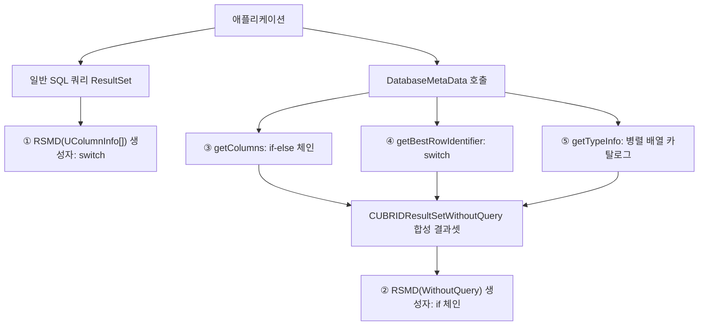

# CUBRID JDBC 타입 보고 5개 지점의 데이터 타입별 반환값 전수표

- 분류: analysis
- 날짜: 2026-07-20
- 관련: [CUBRID 11.4 매뉴얼, 데이터 타입](https://www.cubrid.org/manual/ko/11.4/sql/datatype.html), CUBRID JDBC 드라이버 소스([CUBRID/cubrid-jdbc](https://github.com/CUBRID/cubrid-jdbc))

## 요약

CUBRID JDBC 드라이버가 컬럼 타입을 보고하는 5개 지점(ResultSetMetaData 생성자 2개, getColumns, getBestRowIdentifier, getTypeInfo)에 대해, U_TYPE 전수(0~34)의 반환값(java.sql.Types, 타입 이름, 클래스명, 크기류 컬럼)을 소스 기준 표로 정리했다.

## 목적

드라이버의 U_TYPE → JDBC 매핑은 한 곳이 아니라 최소 5개 지점에 각각 하드코딩되어 있다. 어느 API로 조회하느냐에 따라 같은 CUBRID 타입이 다른 값으로 보고될 수 있으므로, 지점별로 "모든 데이터 타입이 실제로 어떤 값을 반환하는가"를 한 문서에서 찾을 수 있는 전수 참조표를 만든다.

## 배경

드라이버에서 타입이 보고되는 경로는 두 갈래다. 일반 SQL 쿼리 결과셋은 서버가 준 `UColumnInfo[]`로 RSMD ①을 만들고, `DatabaseMetaData` 계열 메서드는 드라이버가 서버 쿼리 없이 조립한 합성 결과셋(`CUBRIDResultSetWithoutQuery`)을 돌려주며 그 결과셋의 메타데이터는 RSMD ②가 담당한다. 여기에 `getColumns`, `getBestRowIdentifier`가 튜플에 직접 써넣는 DATA_TYPE/TYPE_NAME 분기, `getTypeInfo`의 병렬 배열 카탈로그가 더해져 총 5개 지점이 된다.

## 범위 / 방법

- **대상 소스**: `CUBRID/cubrid-jdbc` 저장소, `v11.3.2.0053` 기반(정확히는 `v11.3.2.0053-12-ge4947d1`). 아래 line 번호는 이 시점 기준.
  - RSMD ①: `src/jdbc/cubrid/jdbc/driver/CUBRIDResultSetMetaData.java` 생성자 `CUBRIDResultSetMetaData(UColumnInfo[])` line 62, `switch` line 99~449
  - RSMD ②: 같은 파일 생성자 `CUBRIDResultSetMetaData(CUBRIDResultSetWithoutQuery)` line 453, `if` 체인 line 470~520
  - getColumns: `src/jdbc/cubrid/jdbc/driver/CUBRIDDatabaseMetaData.java` line 1008, 타입 분기 line 1160~1248
  - getBestRowIdentifier: 같은 파일 line 1408, `switch` line 1514~1620
  - getTypeInfo: 같은 파일 line 1895~2355 (병렬 배열 33행)
  - 클래스명 매핑: `src/jdbc/cubrid/jdbc/jci/UColumnInfo.java` `findFQDN` line 225
  - 내부 타입 상수: `src/jdbc/cubrid/jdbc/jci/UUType.java` (`U_TYPE_*`, 0~34)
- **타입 전수 기준**: `U_TYPE` 0~34 전부. `TIMETZ(33)`는 소스 주석부터 `/* unused */`, `RESULTSET(20)`은 결과셋 컬럼 타입으로 쓰이지 않는 내부 타입. `NCHAR(3)`/`VARNCHAR(4)`(9.0부터 엔진 제거)와 `MONETARY(10)`(11.4 매뉴얼 기준 deprecated)은 서버가 방출하지 않는 데드 경로지만 드라이버 코드에 매핑이 남아 있어 표에 포함하고 †로 표시했다.
- **표기 규칙**:
  - `java.sql.Types` 상수는 `Types.` 접두어 생략. 문자열 반환값은 `"따옴표"`.
  - `미분기` = 그 지점에 해당 타입 분기가 없음. RSMD 두 생성자는 배열 기본값이 남아 `getColumnType()=0`(상수값이 `Types.NULL`과 동일), `getColumnTypeName()=null`이 되고, getColumns/getBestRowIdentifier는 재사용하는 `value[]` 배열의 해당 칸을 덮어쓰지 않아 **이전 행 값이 잔존**한다(첫 행이면 null). `addTuple`이 배열을 복사하므로(CUBRIDResultSetWithoutQuery.java:920) 잔존 값은 행마다 굳는다.
  - getTypeInfo 열의 `행 없음` = 카탈로그 33행에 그 타입 행이 아예 없음.

## 발견 / 관찰

### 표 1. RSMD ① `CUBRIDResultSetMetaData(UColumnInfo[] col_info)`

일반 SQL 쿼리 결과셋의 `ResultSetMetaData`. 표시 크기는 `getDefaultColumnDisplaySize()`(line 535) 기본값이며, 문자·비트 계열은 정밀도가 더 크면 정밀도로 올라간다.

| # | CUBRID 타입 (별칭) | U_TYPE (값) | getColumnType | getColumnTypeName | getColumnClassName | 표시 크기 | line |
|---|---|---|---|---|---|---|---|
| 1 | SHORT / SMALLINT | SHORT(9) | `SMALLINT` | "SMALLINT" | java.lang.Short | 6 | :156 |
| 2 | INTEGER / INT | INT(8) | `INTEGER` | "INTEGER" | java.lang.Integer | 11 | :167 |
| 3 | BIGINT | BIGINT(21) | `BIGINT` | "BIGINT" | java.lang.Long | 20 | :173 |
| 4 | NUMERIC / DECIMAL / DEC | NUMERIC(7) | `NUMERIC` | "NUMERIC" | java.math.BigDecimal | 40 | :198 |
| 5 | FLOAT / REAL | FLOAT(11) | `REAL` | "FLOAT" | java.lang.Float | 13 | :179 |
| 6 | DOUBLE / DOUBLE PRECISION | DOUBLE(12) | `DOUBLE` | "DOUBLE" | java.lang.Double | 23 | :185 |
| 7 | MONETARY † | MONETARY(10) | `DOUBLE` | "MONETARY" | java.lang.Double | 23 | :205 |
| 8 | CHAR / CHARACTER | CHAR(1) | `CHAR` | "CHAR" | java.lang.String | 1* | :102 |
| 9 | VARCHAR / CHAR VARYING / STRING | VARCHAR(2) | `VARCHAR` | "VARCHAR" | java.lang.String | 1* | :111 |
| 10 | NCHAR † | NCHAR(3) | `CHAR` | "NCHAR" | java.lang.String | 1* | :410 |
| 11 | NCHAR VARYING † | VARNCHAR(4) | `VARCHAR` | "NCHAR VARYING" | java.lang.String | 1* | :419 |
| 12 | ENUM | ENUM(25) | `VARCHAR` | "ENUM" | java.lang.String | 1* | :120 |
| 13 | BIT (정밀도 8) | BIT(5) | `BIT` | "BIT" | java.lang.Boolean | 1* | :130 |
| 14 | BIT (그 외 정밀도) | BIT(5) | `BINARY` | "BIT" | byte[] | 1* | :134 |
| 15 | BIT VARYING | VARBIT(6) | `VARBINARY` | "BIT VARYING" | byte[] | 1* | :144 |
| 16 | DATE | DATE(13) | `DATE` | "DATE" | java.sql.Date | 10 | :211 |
| 17 | TIME | TIME(14) | `TIME` | "TIME" | java.sql.Time | 8 | :217 |
| 18 | TIMESTAMP | TIMESTAMP(15) | `TIMESTAMP` | "TIMESTAMP" | java.sql.Timestamp | 19 | :223 |
| 19 | TIMESTAMPTZ | TIMESTAMPTZ(29) | `TIMESTAMP` | "TIMESTAMPTZ" | java.sql.Timestamp | 82 | :229 |
| 20 | TIMESTAMPLTZ | TIMESTAMPLTZ(30) | `TIMESTAMP` | "TIMESTAMPLTZ" | java.sql.Timestamp | 82 | :235 |
| 21 | DATETIME | DATETIME(22) | `TIMESTAMP` | "DATETIME" | java.sql.Timestamp | 23 | :241 |
| 22 | DATETIMETZ | DATETIMETZ(31) | `TIMESTAMP` | "DATETIMETZ" | java.sql.Timestamp | 86 | :247 |
| 23 | DATETIMELTZ | DATETIMELTZ(32) | `TIMESTAMP` | "DATETIMELTZ" | java.sql.Timestamp | 86 | :253 |
| 24 | SET | SET(16) | `OTHER` | "SET" | 요소 배열(표 1-1) | -1 | :270 |
| 25 | MULTISET | MULTISET(17) | `OTHER` | "MULTISET" | 요소 배열(표 1-1) | -1 | :273 |
| 26 | LIST / SEQUENCE | SEQUENCE(18) | `OTHER` | "SEQUENCE" | 요소 배열(표 1-1) | -1 | :278 |
| 27 | BLOB | BLOB(23) | `BLOB` | "BLOB" | java.sql.Blob | -1 | :428 |
| 28 | CLOB | CLOB(24) | `CLOB` | "CLOB" | java.sql.Clob | -1 | :434 |
| 29 | JSON | JSON(34) | `VARCHAR` | "JSON" | java.lang.String | 1* | :440 |
| 30 | object (OID) | OBJECT(19) | `OTHER` | "CLASS" | cubrid.sql.CUBRIDOID | 256 | :266 |
| 31 | (NULL 타입 컬럼) | NULL(0) | `OTHER` | "" | "null" | 4 | :260 |
| 32 | (부호 없는 정수) | USHORT(26) | 미분기: 0(=`NULL`) | 미분기: null | java.lang.Short | -1 | :447 |
| 33 | (부호 없는 정수) | UINT(27) | 미분기: 0(=`NULL`) | 미분기: null | java.lang.Integer | -1 | :447 |
| 34 | (부호 없는 정수) | UBIGINT(28) | 미분기: 0(=`NULL`) | 미분기: null | java.lang.Long | -1 | :447 |
| 35 | (내부) | RESULTSET(20) | 미분기: 0(=`NULL`) | 미분기: null | "" | -1 | :447 |
| 36 | (미사용) | TIMETZ(33) | 미분기: 0(=`NULL`) | 미분기: null | "" | -1 | :447 |

- `*` 문자(CHAR/VARCHAR/NCHAR/VARNCHAR/ENUM/JSON)·비트(BIT/BIT VARYING) 계열은 `정밀도 > 기본값`이면 표시 크기가 정밀도로 상승.
- NULL 타입은 `Types.NULL`이 주석 처리되어 있고(:259) `OTHER`를 반환한다(:260). 미분기 타입의 0과 달리 명시적 `OTHER`다.
- 클래스명(getColumnClassName)은 `UColumnInfo.findFQDN`(:225)이 담당한다. USHORT/UINT/UBIGINT는 여기엔 케이스가 있어(Short/Integer/Long) getColumnType(0)과 비대칭이다.
- **MySQL 호환 빌드 분기**(`UJCIUtil.isMysqlMode`, 패키지명 3번째 세그먼트가 `mysql`인 별도 빌드에서만 true): INT의 이름이 "INT"(:162), NUMERIC이 `DECIMAL`/"DECIMAL"(:192)로 바뀌고, SHORT/INT는 표시 크기가 정밀도로, NUMERIC은 정밀도+1(스케일>0이면 +2)로 바뀐다.
- Types 값에서 파생되는 boolean 메서드(두 생성자 공통): `isCaseSensitive()`는 CHAR/VARCHAR/LONGVARCHAR만 true(:632), `isSigned()`는 SMALLINT/INTEGER/NUMERIC/DECIMAL/REAL/DOUBLE만 true(:670)라 **BIGINT 컬럼은 isSigned()=false**, `isCurrency()`는 DOUBLE/REAL/NUMERIC이 true(:649, MySQL 모드는 항상 false).

#### 표 1-1. 컬렉션(SET/MULTISET/SEQUENCE) 요소 타입 반환값

컬렉션 컬럼에서 CUBRID 확장 API `getElementType()`/`getElementTypeName()`(비컬렉션 컬럼이면 예외)과 `getColumnClassName()`이 요소(base) 타입별로 반환하는 값. 요소 `switch`는 line 284~404, 클래스명은 `findFQDN`의 base 분기(line 280~333).

| 요소 U_TYPE (값) | getElementType | getElementTypeName | getColumnClassName |
|---|---|---|---|
| CHAR(1) | `CHAR` | "CHAR" | java.lang.String[] |
| VARCHAR(2) | `VARCHAR` | "VARCHAR" | java.lang.String[] |
| NCHAR(3) † | `CHAR` | "NCHAR" | java.lang.String[] |
| VARNCHAR(4) † | `VARCHAR` | "NCHAR VARYING" | java.lang.String[] |
| ENUM(25) | `VARCHAR` | "ENUM" | java.lang.String[] |
| BIT(5) (컬럼 정밀도 8) | `BIT` | "BIT" | java.lang.Boolean[] |
| BIT(5) (그 외) | `BINARY` | "BIT" | byte[][] |
| VARBIT(6) | `VARBINARY` | "BIT VARYING" | byte[][] |
| SHORT(9) | `SMALLINT` | "SMALLINT" | java.lang.Short[] |
| INT(8) | `INTEGER` | "INTEGER" | java.lang.Integer[] |
| BIGINT(21) | `BIGINT` | "BIGINT" | java.lang.Long[] |
| FLOAT(11) | `REAL` | "FLOAT" | java.lang.Float[] |
| DOUBLE(12) | `DOUBLE` | "DOUBLE" | java.lang.Double[] |
| NUMERIC(7) | `NUMERIC` | "NUMERIC" | java.lang.Double[] (BigDecimal[] 아님) |
| MONETARY(10) † | `DOUBLE` | "MONETARY" | java.lang.Double[] |
| DATE(13) | `DATE` | "DATE" | java.sql.Date[] |
| TIME(14) | `TIME` | "TIME" | java.sql.Time[] |
| TIMESTAMP(15) | `TIMESTAMP` | "TIMESTAMP" | java.sql.Timestamp[] |
| TIMESTAMPTZ(29) | `TIMESTAMP` | "TIMESTAMPTZ" | java.sql.Timestamp[] |
| TIMESTAMPLTZ(30) | `TIMESTAMP` | "TIMESTAMPLTZ" | java.sql.Timestamp[] |
| DATETIME(22) | `TIMESTAMP` | "DATETIME" | java.sql.Timestamp[] |
| DATETIMETZ(31) | `TIMESTAMP` | "DATETIMETZ" | java.sql.Timestamp[] |
| DATETIMELTZ(32) | `TIMESTAMP` | "DATETIMELTZ" | java.sql.Timestamp[] |
| NULL(0) | `NULL` | "" | "null" |
| OBJECT(19) | `OTHER` | "CLASS" | cubrid.sql.CUBRIDOID[] |
| SET(16)/MULTISET(17)/SEQUENCE(18) (중첩) | `OTHER` | "SET"/"MULTISET"/"SEQUENCE" | null |
| BLOB(23) | 미분기: 0(=`NULL`) | 미분기: null | java.sql.Blob[] |
| CLOB(24) | 미분기: 0(=`NULL`) | 미분기: null | java.sql.Clob[] |
| JSON(34) | `VARCHAR` | "JSON" | java.lang.String[] |
| USHORT(26)/UINT(27)/UBIGINT(28) | 미분기: 0(=`NULL`) | 미분기: null | Short[]/Integer[]/Long[] |
| RESULTSET(20), TIMETZ(33) | 미분기: 0(=`NULL`) | 미분기: null | null |

- BLOB/CLOB 요소는 요소 `switch`에 케이스가 없는데 `findFQDN`엔 있어(Blob[]/Clob[]) 여기서도 비대칭이다.
- BIT 요소의 Boolean[]/byte[][] 판정 기준은 요소 정밀도가 아니라 **컬럼 정밀도**(`getColumnPrecision()==8`)다.

### 표 2. RSMD ② `CUBRIDResultSetMetaData(CUBRIDResultSetWithoutQuery r)`

`DatabaseMetaData`가 돌려주는 합성 결과셋(getColumns, getTypeInfo, getTables 등 대부분의 DBMD 결과셋) 자체의 `ResultSetMetaData`. `switch`가 아니라 **독립 `if` 7개의 체인**이며, 합성 결과셋 컬럼 선언에 실제로 쓰이는 타입(VARCHAR/INT/SHORT/BIT/NULL 등)만 처리한다.

| # | 처리 U_TYPE (값) | getColumnType | getColumnTypeName | getPrecision | getColumnClassName | line |
|---|---|---|---|---|---|---|
| 1 | BIT(5) | `BIT` | "BIT" | 1 (강제) | "byte[]" | :470 |
| 2 | INT(8) | `INTEGER` | "INTEGER" | 10 (강제) | "java.lang.Integer" | :476 |
| 3 | SHORT(9) | `SMALLINT` | "SMALLINT" | 5 (강제) | "java.lang.Short" | :482 |
| 4 | VARCHAR(2) | `VARCHAR` | "VARCHAR" | 선언 정밀도 | "java.lang.String" | :488 |
| 5 | ENUM(25) | `VARCHAR` | "ENUM" | 선언 정밀도 | "java.lang.String" | :497 |
| 6 | JSON(34) | `VARCHAR` | "JSON" | 선언 정밀도 | "java.lang.String" | :506 |
| 7 | NULL(0) | `NULL` | "" | 0 | "" | :515 |
| - | 그 외 전 타입(28종) | 미분기: 0(=`NULL`) | 미분기: null | 0 | null | 해당 없음 |

- **생성자 ①과 다른 점**: BIT가 정밀도와 무관하게 항상 `BIT`이고 클래스명도 `byte[]`(① 은 정밀도 8일 때만 `BIT`+`Boolean`). NULL 타입은 ①의 `OTHER`와 달리 명시적 `NULL`.
- 행 공통 고정값: `getScale()=0`, `getSchemaName()`/`getTableName()`="", `getColumnCharset()`=null, `isAutoIncrement()`=false. 표시 크기는 표 1과 같은 `getDefaultColumnDisplaySize()` 기본값이며 VARCHAR/ENUM/JSON은 선언 정밀도가 크면 정밀도로 상승.
- 합성 결과셋의 컬럼 선언은 7종 안에 들도록 설계되어 있으나(예: getColumns의 BUFFER_LENGTH는 `U_TYPE_NULL`로 선언), 선언이 이를 벗어나면 조용히 0/null이 된다.

### 표 3. DBMD `getColumns()` 의 DATA_TYPE / TYPE_NAME

카탈로그 컬럼 조회 시 튜플의 `DATA_TYPE`(value[4])과 `TYPE_NAME`(value[5]). if-else 체인 line 1160~1248.

| # | CUBRID 타입 (별칭) | U_TYPE (값) | DATA_TYPE | TYPE_NAME | line |
|---|---|---|---|---|---|
| 1 | SHORT / SMALLINT | SHORT(9) | `SMALLINT` | "SMALLINT" | :1182 |
| 2 | INTEGER / INT | INT(8) | `INTEGER` | "INTEGER" | :1188 |
| 3 | BIGINT | BIGINT(21) | `BIGINT` | "BIGINT" | :1185 |
| 4 | NUMERIC / DECIMAL / DEC | NUMERIC(7) | `NUMERIC` | "NUMERIC" | :1191 |
| 5 | FLOAT / REAL | FLOAT(11) | `REAL` | "FLOAT" | :1194 |
| 6 | DOUBLE / DOUBLE PRECISION | DOUBLE(12) | `DOUBLE` | "DOUBLE PRECISION" | :1197 |
| 7 | MONETARY † | MONETARY(10) | `DOUBLE` | "MONETARY" | :1200 |
| 8 | CHAR / CHARACTER | CHAR(1) | `CHAR` | "CHAR" | :1167 |
| 9 | VARCHAR / CHAR VARYING / STRING | VARCHAR(2) | `VARCHAR` | "VARCHAR" | :1170 |
| 10 | NCHAR † | NCHAR(3) | `CHAR` | "NCHAR" | :1176 |
| 11 | NCHAR VARYING † | VARNCHAR(4) | `VARCHAR` | "NCHAR VARYING" | :1179 |
| 12 | ENUM | ENUM(25) | `VARCHAR` | "ENUM" | :1173 |
| 13 | BIT (정밀도 무관) | BIT(5) | `BINARY` | "BIT" | :1161 |
| 14 | BIT VARYING | VARBIT(6) | `VARBINARY` | "BIT VARYING" | :1164 |
| 15 | DATE | DATE(13) | `DATE` | "DATE" | :1206 |
| 16 | TIME | TIME(14) | `TIME` | "TIME" | :1203 |
| 17 | TIMESTAMP | TIMESTAMP(15) | `TIMESTAMP` | "TIMESTAMP" | :1209 |
| 18 | TIMESTAMPTZ | TIMESTAMPTZ(29) | `TIMESTAMP` | "TIMESTAMPTZ" | :1233 |
| 19 | TIMESTAMPLTZ | TIMESTAMPLTZ(30) | `TIMESTAMP` | "TIMESTAMPLTZ" | :1236 |
| 20 | DATETIME | DATETIME(22) | `TIMESTAMP` | "DATETIME" | :1212 |
| 21 | DATETIMETZ | DATETIMETZ(31) | `TIMESTAMP` | "DATETIMETZ" | :1239 |
| 22 | DATETIMELTZ | DATETIMELTZ(32) | `TIMESTAMP` | "DATETIMELTZ" | :1242 |
| 23 | SET | SET(16) | `OTHER` | "SET" | :1218 |
| 24 | MULTISET | MULTISET(17) | `OTHER` | "MULTISET" | :1221 |
| 25 | LIST / SEQUENCE | SEQUENCE(18) | `OTHER` | "SEQUENCE" | :1224 |
| 26 | BLOB | BLOB(23) | `BLOB` | "BLOB" | :1227 |
| 27 | CLOB | CLOB(24) | `CLOB` | "CLOB" | :1230 |
| 28 | JSON | JSON(34) | `VARCHAR` | "JSON" | :1245 |
| 29 | object (OID) | OBJECT(19) | `OTHER` | "CLASS" | :1215 |
| - | NULL(0), RESULTSET(20), USHORT(26), UINT(27), UBIGINT(28), TIMETZ(33) | 좌동 | 미분기: 이전 행 값 잔존(첫 행 null) | 좌동 | 해당 없음 |

- **RSMD ①과 다른 점**: BIT가 정밀도 무관 항상 `BINARY`(①은 정밀도 8이면 `BIT`), DOUBLE의 TYPE_NAME이 "DOUBLE PRECISION"(①은 "DOUBLE"), NUMERIC에 MySQL 모드 분기 없음, NULL 타입 분기 자체가 없음.
- 타입 무관 공통 컬럼: TABLE_CAT=null, TABLE_SCHEM/TABLE_NAME은 `소유자.클래스` 분리, COLUMN_SIZE=CHAR_OCTET_LENGTH=정밀도, DECIMAL_DIGITS=스케일, NUM_PREC_RADIX=10, BUFFER_LENGTH=SQL_DATA_TYPE=SQL_DATETIME_SUB=null, NULLABLE/IS_NULLABLE는 non-null 플래그, COLUMN_DEF=컬럼 기본값, ORDINAL_POSITION=속성 순서, REMARKS는 브로커가 주는 경우만.
- 반환 전 `sortTuples("getColumns")`로 정렬한다(:1255).

### 표 4. DBMD `getBestRowIdentifier()` 의 DATA_TYPE / TYPE_NAME / COLUMN_SIZE

행 식별자 후보 컬럼의 타입 보고. `switch` line 1514~1620. COLUMN_SIZE(value[4])는 수치 6종만 정밀도를 넣고 나머지는 0이다.

| # | CUBRID 타입 | U_TYPE (값) | DATA_TYPE | TYPE_NAME | COLUMN_SIZE | line |
|---|---|---|---|---|---|---|
| 1 | SHORT / SMALLINT | SHORT(9) | `SMALLINT` | "SMALLINT" | 정밀도 | :1530 |
| 2 | INTEGER / INT | INT(8) | `INTEGER` | "INTEGER" | 정밀도 | :1535 |
| 3 | BIGINT | BIGINT(21) | `BIGINT` | "BIGINT" | 정밀도 | :1540 |
| 4 | NUMERIC / DECIMAL / DEC | NUMERIC(7) | `NUMERIC` | "NUMERIC" | 정밀도 | :1555 |
| 5 | FLOAT / REAL | FLOAT(11) | `REAL` | "FLOAT" | 정밀도 | :1550 |
| 6 | DOUBLE / DOUBLE PRECISION | DOUBLE(12) | `DOUBLE` | "DOUBLE" | 정밀도 | :1545 |
| 7 | CHAR / CHARACTER | CHAR(1) | `CHAR` | "CHAR" | 0 | :1515 |
| 8 | VARCHAR / CHAR VARYING / STRING | VARCHAR(2) | `VARCHAR` | "VARCHAR" | 0 | :1520 |
| 9 | ENUM | ENUM(25) | `VARCHAR` | "ENUM" | 0 | :1525 |
| 10 | DATE | DATE(13) | `DATE` | "DATE" | 0 | :1560 |
| 11 | TIME | TIME(14) | `TIME` | "TIME" | 0 | :1565 |
| 12 | TIMESTAMP | TIMESTAMP(15) | `TIMESTAMP` | "TIMESTAMP" | 0 | :1570 |
| 13 | TIMESTAMPTZ | TIMESTAMPTZ(29) | `TIMESTAMP` | "TIMESTAMPTZ" | 0 | :1595 |
| 14 | TIMESTAMPLTZ | TIMESTAMPLTZ(30) | `TIMESTAMP` | "TIMESTAMPLTZ" | 0 | :1600 |
| 15 | DATETIME | DATETIME(22) | `TIMESTAMP` | "DATETIME" | 0 | :1575 |
| 16 | DATETIMETZ | DATETIMETZ(31) | `TIMESTAMP` | "DATETIMETZ" | 0 | :1605 |
| 17 | DATETIMELTZ | DATETIMELTZ(32) | `TIMESTAMP` | "DATETIMELTZ" | 0 | :1610 |
| 18 | BLOB | BLOB(23) | `BLOB` | "BLOB" | 0 | :1585 |
| 19 | CLOB | CLOB(24) | `CLOB` | "CLOB" | 0 | :1590 |
| 20 | JSON | JSON(34) | `VARCHAR` | "JSON" | 0 | :1615 |
| 21 | (NULL 타입) | NULL(0) | `NULL` | "" | 0 | :1580 |
| - | BIT(5), VARBIT(6), NCHAR(3) †, VARNCHAR(4) †, MONETARY(10) †, OBJECT(19), SET(16)/MULTISET(17)/SEQUENCE(18), RESULTSET(20), USHORT(26)/UINT(27)/UBIGINT(28), TIMETZ(33) | 좌동 | 미분기: 이전 행 값 잔존(첫 행 null) | 좌동 | 좌동 | 해당 없음 |

- **BIT / BIT VARYING에 case가 없다.** 5개 지점 중 유일하게 비트열을 전혀 처리하지 못하므로, 비트열 컬럼이 UNIQUE 키에 포함되면 DATA_TYPE/TYPE_NAME/COLUMN_SIZE가 미설정(잔존값)으로 나간다.
- 동작 특성: 제약 타입 0(UNIQUE)인 제약만 스캔하고(:1459) 그중 컬럼 수가 가장 적은 것을 고른다. `scope`/`nullable` 파라미터는 무시된다. **SCOPE 컬럼(value[0])은 어디서도 설정하지 않아 전 행 null**이다. BUFFER_LENGTH=null, DECIMAL_DIGITS=스케일(:1512), PSEUDO_COLUMN=`bestRowNotPseudo`(:1496) 고정. 반환 전 `sortTuples` 정렬(:1628).

### 표 5. DBMD `getTypeInfo()` 카탈로그 (33행 전체)

per-컬럼 조회가 아니라 역방향 카탈로그다: DATA_TYPE(`java.sql.Types`)을 키로 "그 JDBC 타입을 만들 때 쓸 CUBRID 네이티브 타입 이름(TYPE_NAME)"을 광고한다. 병렬 배열(line 1946~2328)을 순서 그대로 내보내며, **5개 지점 중 유일하게 `sortTuples`를 호출하지 않는다**(JDBC 규약은 DATA_TYPE 순 + 근접순 정렬 요구).

행별로 값이 달라지는 컬럼 전부를 표기한다. 대소문자(CASE_SENSITIVE)·검색(SEARCHABLE)·부호(UNSIGNED_ATTRIBUTE)·고정정밀도(FIXED_PREC_SCALE)·최대스케일(MAX_SCALE) 열은 각각 column8/9/10/11/15 배열 값이다. SEARCHABLE의 `basic`=`typePredBasic`(2, WHERE 비교만), `searchable`=`typeSearchable`(3, LIKE 포함 전부).

| # | TYPE_NAME | DATA_TYPE | PRECISION | 리터럴 접두/접미 | CREATE_PARAMS | CASE_SENS | SEARCHABLE | UNSIGNED | FIXED_PREC | MAX_SCALE |
|---|---|---|---|---|---|---|---|---|---|---|
| 1 | BIT | `BIT` | 8 | B' / ' | (8) | false | basic | true | false | 0 |
| 2 | NUMERIC | `TINYINT` | 3 | null / null | (3) | false | basic | false | true | 0 |
| 3 | NUMERIC | `BIGINT` | 38 | null / null | null | false | basic | false | true | 38 |
| 4 | BIT VARYING | `LONGVARBINARY` | 1073741823 | X' / ' | null | false | basic | true | false | 0 |
| 5 | BIT VARYING | `VARBINARY` | 1073741823 | X' / ' | null | false | basic | true | false | 0 |
| 6 | BIT | `BINARY` | 1073741823 | X' / ' | null | false | basic | true | false | 0 |
| 7 | VARCHAR | `LONGVARCHAR` | 1073741823 | ' / ' | null | true | basic | true | false | 0 |
| 8 | CHAR | `CHAR` | 1073741823 | ' / ' | null | true | searchable | true | false | 0 |
| 9 | NUMERIC | `NUMERIC` | 38 | null / null | null | false | searchable | false | true | 38 |
| 10 | INTEGER | `INTEGER` | 10 | null / null | null | false | basic | false | false | 0 |
| 11 | BIGINT | `BIGINT` | 19 | null / null | null | false | basic | false | false | 0 |
| 12 | SMALLINT | `SMALLINT` | 5 | null / null | null | false | basic | false | false | 0 |
| 13 | DOUBLE | `FLOAT` | 38 | null / null | null | false | basic | false | true | 38 |
| 14 | FLOAT | `REAL` | 38 | null / null | null | false | basic | false | true | 38 |
| 15 | DOUBLE | `DOUBLE` | 38 | null / null | null | true | basic | false | true | 38 |
| 16 | VARCHAR | `VARCHAR` | 1073741823 | ' / ' | null | false | searchable | true | false | 0 |
| 17 | STRING | `VARCHAR` | 1073741823 | ' / ' | null | false | searchable | true | false | 0 |
| 18 | DATE | `DATE` | 10 | DATE' / ' | null | false | basic | true | false | 0 |
| 19 | TIME | `TIME` | 11 | TIME' / ' | null | false | basic | true | false | 0 |
| 20 | TIMESTAMP | `TIMESTAMP` | 22 | TIMESTAMP' / ' | null | false | basic | true | false | 0 |
| 21 | TIMESTAMPTZ | `TIMESTAMP_WITH_TIMEZONE` | 22 | TIMESTAMPTZ' / ' | null | false | basic | true | false | 0 |
| 22 | TIMESTAMPLTZ | `TIMESTAMP_WITH_TIMEZONE` | 22 | TIMESTAMPLTZ' / ' | null | false | basic | true | false | 0 |
| 23 | DATETIME | `TIMESTAMP` | 26 | DATETIME' / ' | null | false | basic | true | false | 0 |
| 24 | DATETIMETZ | `TIMESTAMP_WITH_TIMEZONE` | 26 | DATETIMETZ' / ' | null | false | basic | true | false | 0 |
| 25 | DATETIMELTZ | `TIMESTAMP_WITH_TIMEZONE` | 26 | DATETIMELTZ' / ' | null | false | basic | true | false | 0 |
| 26 | BLOB | `BLOB` | 1073741823 | null / null | null | false | basic | true | false | 0 |
| 27 | CLOB | `CLOB` | 1073741823 | null / null | null | false | basic | true | false | 0 |
| 28 | ENUM | `VARCHAR` | 1073741823 | ' / ' | null | true | basic | true | false | 0 |
| 29 | MULTISET | `ARRAY` | 1073741823 | MULTISET / null | null | true | basic | true | false | 0 |
| 30 | SET | `ARRAY` | 1073741823 | SET / null | null | true | basic | true | false | 0 |
| 31 | LIST | `ARRAY` | 1073741823 | LIST / null | null | true | basic | true | false | 0 |
| 32 | SEQUENCE | `ARRAY` | 1073741823 | SEQUENCE / null | null | true | basic | true | false | 0 |
| 33 | JSON | `VARCHAR` | 1073741823 | ' / ' | null | false | basic | true | false | 0 |

- 전 행 고정값 컬럼: NULLABLE=`typeNullable`(1), AUTO_INCREMENT=false, LOCAL_TYPE_NAME=TYPE_NAME과 동일 배열, MINIMUM_SCALE=0, SQL_DATA_TYPE=SQL_DATETIME_SUB=null, NUM_PREC_RADIX=10.
- 카탈로그에 행이 없는 CUBRID 타입: MONETARY, NCHAR, NCHAR VARYING(엔진 제거 †), OID(OBJECT). 반대로 CUBRID에 없는 `TINYINT`용 NUMERIC(3) 행, 네이티브 BIGINT 이전의 레거시로 보이는 NUMERIC(38)→`BIGINT` 행이 있다.
- **값 배열이 한 칸 밀린 정황**: CASE_SENSITIVE는 문자 계열인 16·17행(VARCHAR/STRING)이 false인데 수치인 15행(DOUBLE)이 true이고, SEARCHABLE은 7행(LONGVARCHAR)이 basic인데 9행(NUMERIC)이 searchable이다. 문자 계열에 줄 값이 인접 행으로 밀려 들어간 모양새다.
- TZ 4종을 `TIMESTAMP_WITH_TIMEZONE`(JDBC 4.2)으로 광고하는 유일한 지점이다(표 1~4는 전부 `TIMESTAMP`).

### 표 6. 지점 간 한눈 대조 (CUBRID 타입 × 5지점의 java.sql.Types)

| CUBRID 타입 | ① RSMD 쿼리 | ② RSMD 합성 | ③ getColumns | ④ getBestRowId | ⑤ getTypeInfo |
|---|---|---|---|---|---|
| SHORT | `SMALLINT` | `SMALLINT` | `SMALLINT` | `SMALLINT` | `SMALLINT` |
| INTEGER | `INTEGER` | `INTEGER` | `INTEGER` | `INTEGER` | `INTEGER` |
| BIGINT | `BIGINT` | 미분기 | `BIGINT` | `BIGINT` | `BIGINT` (+NUMERIC 행도 BIGINT 광고) |
| NUMERIC | `NUMERIC` (MySQL 빌드 `DECIMAL`) | 미분기 | `NUMERIC` | `NUMERIC` | `NUMERIC` (+TINYINT/BIGINT 대체 행) |
| FLOAT | `REAL` | 미분기 | `REAL` | `REAL` | `REAL` |
| DOUBLE | `DOUBLE` | 미분기 | `DOUBLE` | `DOUBLE` | `DOUBLE`+`FLOAT` 2행 |
| MONETARY † | `DOUBLE` | 미분기 | `DOUBLE` | 미분기 | 행 없음 |
| CHAR | `CHAR` | 미분기 | `CHAR` | `CHAR` | `CHAR` |
| VARCHAR | `VARCHAR` | `VARCHAR` | `VARCHAR` | `VARCHAR` | `VARCHAR`+`LONGVARCHAR` 2행 (별칭 STRING 행도 `VARCHAR`) |
| NCHAR † | `CHAR` | 미분기 | `CHAR` | 미분기 | 행 없음 |
| NCHAR VARYING † | `VARCHAR` | 미분기 | `VARCHAR` | 미분기 | 행 없음 |
| ENUM | `VARCHAR` | `VARCHAR` | `VARCHAR` | `VARCHAR` | `VARCHAR` |
| BIT(8) | `BIT` | `BIT` | `BINARY` | 미분기 | `BIT` 행 |
| BIT(n≠8) | `BINARY` | `BIT` | `BINARY` | 미분기 | `BINARY` 행 |
| BIT VARYING | `VARBINARY` | 미분기 | `VARBINARY` | 미분기 | `VARBINARY`+`LONGVARBINARY` 2행 |
| DATE / TIME | `DATE` / `TIME` | 미분기 | `DATE` / `TIME` | `DATE` / `TIME` | `DATE` / `TIME` |
| TIMESTAMP / DATETIME | `TIMESTAMP` | 미분기 | `TIMESTAMP` | `TIMESTAMP` | `TIMESTAMP` |
| TZ/LTZ 4종 | `TIMESTAMP` | 미분기 | `TIMESTAMP` | `TIMESTAMP` | **`TIMESTAMP_WITH_TIMEZONE`** |
| SET/MULTISET/SEQUENCE | `OTHER` | 미분기 | `OTHER` | 미분기 | **`ARRAY`** |
| BLOB / CLOB | `BLOB` / `CLOB` | 미분기 | `BLOB` / `CLOB` | `BLOB` / `CLOB` | `BLOB` / `CLOB` |
| JSON | `VARCHAR` | `VARCHAR` | `VARCHAR` | `VARCHAR` | `VARCHAR` |
| object (OID) | `OTHER` | 미분기 | `OTHER` | 미분기 | 행 없음 |
| NULL 타입 | `OTHER` | `NULL` | 미분기 | `NULL` | 행 없음 |
| USHORT/UINT/UBIGINT | 미분기 | 미분기 | 미분기 | 미분기 | 행 없음 |
| RESULTSET, TIMETZ | 미분기 | 미분기 | 미분기 | 미분기 | 행 없음 |

## 결론

- 스칼라 타입의 매핑 값 자체는 5개 지점 모두 대체로 표준적이다(FLOAT→`REAL`은 JDBC 규약상 정답이고, getTypeInfo의 DOUBLE→`FLOAT` 행도 `Types.FLOAT`이 배정밀도라 정상).
- 지점 간 값이 갈리는 타입은 대조표(표 6) 굵은 곳들이다: **BIT**(①`BIT`/`BINARY` 정밀도 분기, ② 항상 `BIT`, ③ 항상 `BINARY`, ④ 미분기), **TZ/LTZ 4종**(⑤만 `TIMESTAMP_WITH_TIMEZONE`), **컬렉션**(⑤만 `ARRAY`), **NULL 타입**(①`OTHER`, ②④`NULL`, ③ 미분기), 그리고 TYPE_NAME 표기(③만 "DOUBLE PRECISION").
- 미분기 시 동작도 지점마다 다르다: RSMD 계열은 0(=`Types.NULL` 상수값)이 조용히 반환되고, getColumns/getBestRowIdentifier는 재사용 배열 탓에 **이전 행 값이 잔존**한다.
- getTypeInfo는 유일하게 미정렬이며, CASE_SENSITIVE/SEARCHABLE 배열이 한 칸 밀린 듯한 행(DOUBLE=true, VARCHAR=false 등)이 있다.

## 다음 단계

- 두 번째 노트로 지점 간 불일치와 JDBC 규약 위반(TZ 매핑, getTypeInfo 미정렬, 컬렉션 `ARRAY` 광고 대 `getArray()` 미구현, getBestRowIdentifier의 PK 미반환)을 분석 관점에서 재정리.
- 세 번째 노트로 Testcontainers 기반 5-DB(CUBRID/Oracle/MySQL/SQL Server/PostgreSQL) 실측 대조를 재정리.
- 매핑 로직 단일화(공유 매핑 함수) 개선은 별도 이슈로 논의.

## 참고

- CUBRID JDBC 드라이버 소스: [CUBRID/cubrid-jdbc](https://github.com/CUBRID/cubrid-jdbc) `v11.3.2.0053-12-ge4947d1`
  - `CUBRIDResultSetMetaData.java` (RSMD 생성자 ①·②, 기본 표시 크기)
  - `CUBRIDDatabaseMetaData.java` (getColumns / getBestRowIdentifier / getTypeInfo)
  - `UColumnInfo.java` (findFQDN 클래스명 매핑), `UUType.java` (U_TYPE 상수 0~34)
  - `CUBRIDResultSetWithoutQuery.java` (합성 결과셋, addTuple 복사 동작)
- [CUBRID 11.4 매뉴얼, 데이터 타입](https://www.cubrid.org/manual/ko/11.4/sql/datatype.html) (NCHAR/NCHAR VARYING 9.0부터 미지원, MONETARY deprecated 문구 확인)
