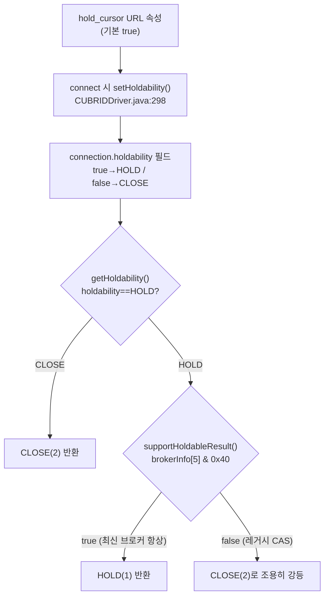

# CUBRID JDBC ResultSet holdability 동작 전수 + RW/RO 실측

- 분류: analysis
- 날짜: 2026-07-20
- 관련: [capability 감사](2026-07-17-cubrid-jdbc-capability-audit.md)(holdability를 PARTIAL로 지적한 상위 노트의 심화편)

## 요약

`getResultSetHoldability()`의 **기본 반환값은 `HOLD_CURSORS_OVER_COMMIT`(1)**. 이 값을 실제로 바꾸는 것은 **클라이언트 요인**(URL `hold_cursor` 속성, `setHoldability()`, statement 생성 시 holdable 인자)뿐이고, **브로커 설정으로는 바뀌지 않는다**(유일한 브로커 입력인 holdable-지원 플래그가 모든 CAS에 하드코딩 ON). 별개 메서드 `supportsResultSetHoldability(int)`는 이와 무관하게 두 상수 모두 `true`(정적 capability)로, 손댈 필요 없음. **RO(읽기전용) 브로커는 holdability와 완전히 직교** — 값·커밋후 커서 동작이 RW와 동일하고 쓰기만 `-581`로 거부. 소스 빌드 드라이버로 RW(33120)·RO(33130) 실측하여 4개 케이스 전부 예측과 일치 확인.

## 목적 / 배경

[capability 감사](2026-07-17-cubrid-jdbc-capability-audit.md)에서 holdability를 PARTIAL(“`supportsResultSetHoldability` 무조건 true인데 브로커 미지원 시 조용히 강등, 그 경우 `getResultSetHoldability()`와 자기모순”)로 분류했다. 이 노트는 그 항목을 **코드 끝까지 추적 + 실서버 실측**으로 심화한다. 확인할 질문: (1) `getResultSetHoldability()`의 기본값과 결정 요인, (2) 브로커 설정 변경이 반환값을 바꾸는가, (3) `supportsResultSetHoldability()`는 어떻게 두어야 하는가, (4) RO 브로커에서도 제대로 동작하는가.

## 대상 메서드와 반환 로직 (AS-IS)

`getResultSetHoldability()`는 두 인터페이스에 있고 값의 원천은 사실상 `Connection` 하나다. 반환 상수: `HOLD_CURSORS_OVER_COMMIT=1`, `CLOSE_CURSORS_AT_COMMIT=2`.

| 호출 대상 | 구현 | 로직 |
|---|---|---|
| `Statement.getResultSetHoldability()` | `CUBRIDStatement.java:640-648` | 자신의 `is_holdable` 필드 |
| `DatabaseMetaData.getResultSetHoldability()` | `CUBRIDDatabaseMetaData.java:2647-2650` | `con.getHoldability()`로 위임 |
| `Connection.getHoldability()` | `CUBRIDConnection.java:473-485` | `holdability` 필드 + 브로커 지원 여부 |

### 기본값이 HOLD(1)로 확정되는 사슬

1. URL 속성 `hold_cursor` 기본 `true` — `ConnectionProperties.java:425`, 변환 `:504-510`.
2. **connect 시** `conn.setHoldability(connProperties.getHoldCursor())` — `CUBRIDDriver.java:298`. 즉 생성자 초기값(`CUBRIDConnection.java:107`)이 아니라 이 속성이 실질 기본값을 정한다.
3. 브로커가 holdable 지원을 광고 → `u_con.supportHoldableResult()==true`.
→ `DatabaseMetaData`/`Statement` 모두 `HOLD_CURSORS_OVER_COMMIT(1)`.

### 판정 로직

- `Statement`: 생성 시 `is_holdable = (hold==HOLD && supportHoldableResult())` — `CUBRIDStatement.java:108-110`. `hold`는 인자 없는 create/prepare면 connection의 `holdability` 필드(`CUBRIDConnection.java:433,162`), 명시 오버로드면 그 인자.
- `supportHoldableResult()` = `brokerInfoSupportHoldableResult() || protoVersionIsSame(V2)` — `UConnection.java:1707-1713`. `brokerInfo`는 핸드셰이크에서 `readFully`로 채워짐(`UClientSideConnection.java:419-422`), byte5 FUNCTION_FLAG의 `0x40`(CAS_SUPPORT_HOLDABLE_RESULT)로 판정.
- 예외 케이스: `HOLD` + (`TYPE_SCROLL_SENSITIVE` 또는 `CONCUR_UPDATABLE`)로 create/prepare하면 create 시점에 `SQLException` — `CUBRIDConnection.java:462-465,504-507`.

### 브로커 설정이 반환값을 못 바꾸는 근거

유일한 브로커 입력인 `CAS_SUPPORT_HOLDABLE_RESULT`(0x40, `cas_protocol.h:131`)는 **모든 CAS에 하드코딩 ON**: 정적 초기화 `cas_meta.c:40`, `cas_bi_make_broker_info` `cas_meta.c:245`. 이를 끄는 브로커 `.conf` 파라미터가 없고(broker_config 검색 결과 없음), 끄는 코드 경로(`cas_bi_set_function_disable(BI_FUNC_SUPPORT_HOLDABLE_RESULT)`, `cas_meta.c:175`)는 **정의만 있고 호출처가 전무**하다. 따라서 최신 브로커에 대해 `supportHoldableResult()`는 항상 true → 브로커 설정 변경은 무효. `KEEP_CONNECTION`은 별개 byte(index1)라 무관(런타임 홀더블 제약에만 관여).

### RO 모드는 holdability와 직교 (C 소스 근거)

`ACCESS_MODE`(enum RW=0/RO=1/SO=2, `broker_config.h:148-154`)는 connect 시 DB client_type만 바꾼다 — `ux_database_connect` `cas_execute.c:412-455`. RO는 `DB_CLIENT_TYPE_READ_ONLY_BROKER`로 접속 → 엔진의 `boot_cl.c:1171-1174`가 `db_disable_modification()` 호출 → 쓰기가 `ER_DB_NO_MODIFICATIONS = -581`(`error_code.h:686`)로 거부. 이 경로는 “수정 vs 비수정”만 볼 뿐 holdable/`is_holdable`/broker_info를 전혀 건드리지 않는다. RO 브로커는 RW와 **byte-identical한 function flag**를 광고한다.

## 실측 검증 (방법)

- 드라이버: 이 저장소 소스 빌드(`cubrid-jdbc/build.sh` → `cubrid-jdbc-11.3.3.0065.jar`).
- 서버: CUBRID 11.5, `jdbcdb`. RW 브로커 `BROKER1`(33120) + 검증용 임시 RO 브로커 `BROKER_RO`(33130, `ACCESS_MODE=RO`) 추가 후 실측, 종료 후 원복.
- 스니펫 `HoldabilityVerify.java`: `hold_cursor` 기본/false 두 URL(`jdbc:cubrid:localhost:<port>:jdbcdb:public::[?hold_cursor=false]`)에 대해 (a) 메타데이터 report, (b) autoCommit=false로 1행 읽고 `commit()` 후 `rs.next()` 생존 여부 behavioral, (c) RO는 INSERT 거부까지 확인.

## 실측 결과 (4케이스 전부 예측 일치)

| 접속 | `getResultSetHoldability()`¹ | `supportsRSH(HOLD)` | `supportsRSH(CLOSE)` | 커밋 후 커서 | 쓰기 |
|---|---|---|---|---|---|
| **RW** `hold_cursor` 기본(true) | **HOLD(1)** | true | true | **생존**(next id=2) | 허용 |
| **RW** `?hold_cursor=false` | **CLOSE(2)** | true | true | **CLOSED**(-21104) | 허용 |
| **RO** 기본(true) | **HOLD(1)** | true | true | **생존**(next id=2) | **거부 -581** |
| **RO** `?hold_cursor=false` | **CLOSE(2)** | true | true | **CLOSED**(-21104) | **거부 -581** |

¹ `conn.getHoldability()`·`DatabaseMetaData.getResultSetHoldability()`·기본 `Statement.getResultSetHoldability()` 세 값 동일. 명시 statement는 전 케이스 공통: `explicit CLOSE`=CLOSE(2), `explicit HOLD`=HOLD(1).

관찰:
- `hold_cursor=false`로 연결 기본을 CLOSE로 만들어도 **명시 HOLD statement는 HOLD(1) 유지** → per-statement override 실증.
- `supportsResultSetHoldability`는 4케이스 모두 true/true — `hold_cursor`·RO에 반응 안 함.
- RO 행이 RW 행과 holdability·커서 동작 **완전 동일**. RO에서도 holdable 커서가 커밋 후 생존(RO도 실제 commit이 일어나고 holdable 결과 보존).
- 에러코드: `-21104`=드라이버 클라이언트측 “closed ResultSet”(CLOSE가 커밋 시 rs 닫음), `-581`=엔진측 수정금지(진짜 RO 증명).

## 결론

1. **`hold_cursor`로 동작이 바뀐다(실증)** — `?hold_cursor=false`가 `getResultSetHoldability()`를 `HOLD(1)→CLOSE(2)`로, 그리고 실제 커밋후 커서 생존→닫힘으로 바꾼다. 기본은 HOLD(1)/생존.
2. **`supportsResultSetHoldability()`는 `hold_cursor`와 엮으면 안 된다** — 이건 “DB가 그 모드를 지원하느냐”는 정적 capability이고 “현재 기본값이 뭐냐”가 아니다. CUBRID는 두 모드 다 지원하므로 두 상수 모두 true가 옳다. 현재 구현 유지(변경 불필요). 현재 설정 확인은 `getResultSetHoldability()`/`getHoldability()`로 해야 함.
3. **RO는 holdability와 직교** — RO 브로커에서도 값·동작이 RW와 동일하며, 쓰기만 `-581`로 거부. 즉 RO는 holdability를 건드리지 않고 “쓰기 금지”만 얹는다.
4. capability 감사가 지적한 “조용한 강등 → 자기모순”은 **레거시(holdable 미지원) CAS에 한한 이론적 케이스**다. 최신 브로커는 0x40을 항상 광고하므로 `supportsResultSetHoldability(HOLD)=true`와 `getResultSetHoldability()=HOLD`가 일치한다. 다만 아주 오래된 CAS에 붙으면 `getResultSetHoldability()`만 CLOSE로 강등되어 `supports*`와 어긋날 수 있다(경고 없음). 엄밀히 하려면 `supportsResultSetHoldability(HOLD)`를 `supportHoldableResult()`에 연동할 여지는 있으나, 실동작 이득이 없어 우선순위 낮음.

## 참고

- 클라이언트 드라이버: `CUBRIDDriver.java:87,298` · `ConnectionProperties.java:425,504` · `CUBRIDConnection.java:107,433,462-465,473-485,556` · `CUBRIDStatement.java:108-110,640-648` · `CUBRIDDatabaseMetaData.java:2647,2677` · `jci/UConnection.java:1693-1713` · `jci/UClientSideConnection.java:419-422`
- 브로커/엔진 C: `cas_meta.c:40,175,245` · `cas_protocol.h:131` · `cas_execute.c:412-455` · `broker_config.h:148-154` · `boot_cl.c:1171-1174` · `error_code.h:686`(-581)
- 스니펫: `HoldabilityVerify.java`(scratchpad; `<port> [RW|RO]` 인자, RW 실행 시 `hold_test` seed). 운영 함정 메모: cubrid broker restart를 tail/grep 파이프하면 hang(파일 리다이렉트로 회피).
- 상위 노트: [capability 감사](2026-07-17-cubrid-jdbc-capability-audit.md)의 holdability 항목(PARTIAL) 심화편.
