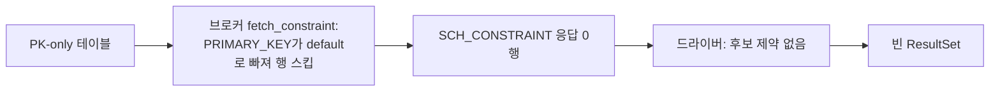

# CUBRID JDBC 타입 매핑의 지점 간 불일치와 JDBC 규약 위반 분석

- 분류: analysis
- 날짜: 2026-07-20
- 관련: [타입 보고 5개 지점 반환값 전수표](2026-07-20-cubrid-jdbc-metadata-type-mapping.md)(1편), [APIS-1086 작업 기록](../APIS-1086/APIS-1086-getbestrowidentifier-pk.md), [CUBRID 11.4 매뉴얼, 데이터 타입](https://www.cubrid.org/manual/ko/11.4/sql/datatype.html)

## 요약

1편 전수표에서 드러난 문제를 분석 관점으로 정리했다: 같은 타입이 지점마다 다르게 보고되는 내부 불일치 6건(A), JDBC 규약과 어긋나는 버그성 문제 8건(B), 오매핑처럼 보이지만 정상이라 손대면 안 되는 것 5건(C)이며, 근본 원인은 U_TYPE → `java.sql.Types` 매핑이 5개 지점에 각각 하드코딩된 구조다.

## 목적

전수표(1편)는 "각 지점이 무엇을 반환하는가"의 사실 기록이었다. 이 노트는 그 값들을 JDBC 규약과 지점 간 일관성 기준으로 판정해, 무엇이 문제이고 무엇이 정상인지, 고친다면 어디를 어떤 순서로 고쳐야 하는지를 정리한다.

## 배경

드라이버가 컬럼 타입을 보고하는 지점은 5개다: ① 일반 쿼리 결과셋의 RSMD, ② DatabaseMetaData 합성 결과셋의 RSMD, ③ getColumns, ④ getBestRowIdentifier, ⑤ getTypeInfo. 각 지점의 타입별 반환값 전체는 1편의 표 1~6에 있고, 이 노트는 값이 갈리거나 규약과 어긋나는 지점만 다룬다. 판정 기준은 `java.sql.Types`/`DatabaseMetaData` javadoc(Java SE 8)과 지점 간 자기 일관성이다.

## 범위 / 방법

- 근거 1: 1편 전수표(드라이버 소스 정적 분석, `CUBRID/cubrid-jdbc` `v11.3.2.0053` 기반).
- 근거 2: 이 노트에서 추가 확인한 소스. `CUBRIDResultSet.getArray()`/`getObject()`, `UStatement.getObject()`, `CUBRIDPreparedStatement.setObject()` 3종 오버로드, `UUType.getObjectDBtype()`, `CUBRIDComparator`.
- 근거 3: getBestRowIdentifier의 PK 문제는 브로커(`cas_execute.c`)까지 추적한 [APIS-1086 작업 기록](../APIS-1086/APIS-1086-getbestrowidentifier-pk.md)의 분석을 따른다.
- 라이브 실측(Testcontainers, 5-DB) 대조는 3편에서 별도 정리한다.
- 1편과 동일하게 11.4 기준 제공되지 않는 타입(NCHAR/NCHAR VARYING, MONETARY, 프로토콜 내부 상수)은 논외로 한다.

## 발견 / 관찰

### 문제 항목 요약

| # | 항목 | 분류 | 실질 영향 |
|---|---|---|---|
| A-1 | BIT의 지점별 제각각 보고 | 내부 불일치 | 같은 컬럼이 API에 따라 `BIT`/`BINARY`/미정 |
| A-2 | NULL 타입의 3갈래 보고 | 내부 불일치 | `OTHER`/`NULL`/미분기 혼재 |
| A-3 | TZ 4종: ⑤만 `TIMESTAMP_WITH_TIMEZONE` | 내부 불일치 | 광고와 실제 보고 불일치 |
| A-4 | 컬렉션: ⑤만 `ARRAY` | 내부 불일치 | B-3과 결합해 거짓 약속 |
| A-5 | NUMERIC의 MySQL 모드 분기 비대칭 | 내부 불일치 | MySQL 호환 빌드 한정 |
| A-6 | TYPE_NAME 표기·미분기 동작 차이 | 내부 불일치 | 문자열 비교 코드 오동작 소지 |
| B-1 | getBestRowIdentifier가 PK를 반환 못 함 | 규약 위반 | PK-only 테이블에서 빈 결과 |
| B-2 | getTypeInfo 미정렬 | 규약 위반 | BIGINT가 NUMERIC으로 DDL 생성될 위험 |
| B-3 | `ARRAY` 광고 대 `getArray()` 미지원 | 규약 위반 | `Types.ARRAY` 계약 불이행 |
| B-4 | TZ 타입의 손실 매핑 | 규약 위반 | TZ 2종의 오프셋 정보가 타입 수준에서 유실 |
| B-5 | 미분기 시 이전 행 값 잔존 | 버그 | 다른 타입의 DATA_TYPE이 복사되어 나감 |
| B-6 | getTypeInfo CASE_SENSITIVE/SEARCHABLE 밀림 | 버그(정황) | VARCHAR가 대소문자 무구분으로 광고 |
| B-7 | BIT(8) → Boolean 의미 왜곡 | 설계 결함 | 8비트 비트열이 진릿값 하나로 접힘 |
| B-8 | `isSigned()`에 BIGINT 누락 | 규약 위반(경미) | BIGINT 컬럼이 부호 없음으로 보고 |

### A. 지점 간 불일치: 같은 타입, 지점마다 다른 값

#### A-1. BIT: 지점마다 갈린다

| 지점 | BIT(8) | BIT(n≠8) | 클래스/비고 |
|---|---|---|---|
| ① RSMD 쿼리 | `BIT` | `BINARY` | 정밀도 8이면 `java.lang.Boolean`, 아니면 `byte[]` |
| ② RSMD 합성 | `BIT` | `BIT` | 정밀도 무관, 항상 `byte[]`+정밀도 1 강제 |
| ③ getColumns | `BINARY` | `BINARY` | 정밀도 무관 |
| ④ getBestRowIdentifier | 미분기 | 미분기 | case 자체가 없음(B-5로 연결) |
| ⑤ getTypeInfo | `BIT` 행 | `BINARY` 행 | 두 행으로 나눠 광고 |

①과 ⑤는 같은 정밀도-8 분기를 공유하지만 ②는 항상 `BIT`, ③은 항상 `BINARY`, ④는 미분기로 제각각이다. 그래서 같은 BIT(8) 컬럼이 실행 결과셋에서는 `BIT`(Boolean), getColumns에서는 `BINARY`로 보고된다. 값 레벨도 ①과 같은 분기를 탄다: 일반 쿼리에서 `getObject()`가 BIT(8)이면 Boolean, 그 외 비트열이면 byte[]를 반환한다(저장 프로시저 CALL 결과셋은 예외로 항상 byte[], B-7).

#### A-2. NULL 타입: 3갈래

`SELECT NULL` 같은 컬럼의 보고가 지점마다 다르다: ①은 `OTHER`(소스에 `Types.NULL`이 주석 처리된 채 `OTHER`로 대체), ②·④는 `NULL`, ③은 분기 자체가 없어 미분기(B-5). `Types.NULL`이 규약상 자연스러운 값인데 ①만 의도적으로 `OTHER`를 쓰고 그 이유가 주석으로 남아 있지 않다.

#### A-3. TZ/LTZ 4종: ⑤만 이탈

TIMESTAMPTZ/TIMESTAMPLTZ/DATETIMETZ/DATETIMELTZ를 ①③④는 전부 `TIMESTAMP`로, ⑤ getTypeInfo만 `TIMESTAMP_WITH_TIMEZONE`(JDBC 4.2)으로 보고한다. 규약 관점에서는 적어도 TZ 2종은 ⑤ 쪽이 정답이므로(B-4), 다수 지점이 틀린 채 카탈로그 광고만 맞는 역설적 상태다.

#### A-4. 컬렉션: ⑤만 `ARRAY`

SET/MULTISET/LIST를 ①③은 `OTHER`, ④는 미분기, ⑤만 `ARRAY`로 광고한다. 그런데 `getArray()`가 미구현이라(B-3) `ARRAY` 광고는 이행할 수 없는 약속이고, 실제 능력(`getObject()`가 자바 배열 반환)에 부합하는 정직한 값은 `OTHER` 쪽이다.

#### A-5. NUMERIC: MySQL 호환 빌드 분기 비대칭

MySQL 호환 빌드(`isMysqlMode`)에서 ①만 `DECIMAL`/"DECIMAL"로 바꾸고 ③④⑤는 항상 `NUMERIC`이다. 일반 빌드에는 영향이 없지만, 같은 조건 분기가 한 지점에만 존재한다는 점에서 다중 하드코딩의 부작용 사례다.

#### A-6. TYPE_NAME 표기와 미분기 동작 차이

- DOUBLE의 TYPE_NAME이 ③만 "DOUBLE PRECISION"이고 ①④는 "DOUBLE"이다. TYPE_NAME 문자열로 분기하는 도구(마이그레이션·스키마 비교류)가 지점에 따라 다른 이름을 보게 된다.
- 미분기 시 동작 자체도 다르다: RSMD 계열(①②)은 배열 기본값 0(=`Types.NULL` 상수값)이 조용히 반환되고, DBMD 계열(③④)은 재사용 `value[]` 배열의 이전 행 값이 잔존한다(B-5).

### B. JDBC 규약 위반(버그성)

#### B-1. getBestRowIdentifier가 PK를 반환하지 못함

메서드 본래 목적("행을 유일하게 식별하는 최적 컬럼 집합", 대개 PK)을 이행하지 못한다. 실측으로 키 가능 개념 20종을 PK로 만들면 0/20, 같은 컬럼을 UNIQUE로 만들면 20/20이 반환된다(APIS-1086).

- **근본원인은 브로커**다. `cas_execute.c`의 `fetch_constraint()`가 제약 타입 스위치에서 `PRIMARY_KEY`를 처리하지 않아 행 자체를 내보내지 않는다(카운트 루틴에도 PK 없음). 드라이버의 `getInt(0) != 0` 필터는 브로커가 축약한 CCI 코드(0=unique 계열, 1=index 계열) 기준의 "index 계열 스킵"이다. 다만 현행 CAS 타입 인코더는 UNIQUE 계열 외 전부(PK 포함)를 1로 접기 때문에, 행 방출만 고치면 이번에는 이 필터에 걸러진다. PK를 0(unique 계열)으로 내려보내는 인코더 수정까지 한 세트다(APIS-1086 TO-BE에 반영됨).
- **드라이버 쪽에도 독립 결함이 겹쳐 있다**: 제약 이름의 콤마 개수로 컬럼 수를 세는 선택 로직이 현재 와이어 포맷(컬럼당 1행, 이름=제약명)과 맞지 않아 복합 키에서 잘못된 1행만 방출한다. 또 SCOPE(value[0])를 어디서도 설정하지 않는데 정렬 비교기 `compare_getBestRowIdentifier`가 SCOPE를 `Short`로 캐스팅해 역참조하므로, 출력이 2행 이상이 되는 순간 정렬 중 NPE가 나는 **잠재 결함**이 있다. 현행 포맷에서는 위 선택 로직이 항상 1행만 방출해 정렬 비교가 일어나지 않아 드러나지 않을 뿐이라, 복수 행 방출을 복구하는 수정과 반드시 함께 다뤄야 한다.
- 참고로 PK 정보 자체는 `getPrimaryKeys`가 별도 경로(`SCH_PRIMARY_KEY`)로 정상 제공한다. 깨진 것은 `SCH_CONSTRAINT` 경로를 쓰는 이 메서드(그리고 `getIndexInfo`)다. 브로커+드라이버 동시 수정 설계는 APIS-1086 기록에 정리되어 있다.

#### B-2. getTypeInfo가 정렬되지 않음

javadoc은 결과를 "DATA_TYPE 순, 같은 DATA_TYPE 안에서는 해당 JDBC 타입에 가장 근접한 순"으로 정렬하도록 요구한다. getTables/getColumns/getBestRowIdentifier/getIndexInfo 등 7개 메서드는 `sortTuples`로 정렬하는데 getTypeInfo는 병렬 배열 순서 그대로 반환한다. 실질 위험은 BIGINT다: 카탈로그에서 NUMERIC(정밀도 38)→`BIGINT` 행(3번째)이 네이티브 BIGINT 행(11번째)보다 앞서므로, "DATA_TYPE 첫 매치"를 쓰는 DDL 생성 도구가 BIGINT 컬럼을 `NUMERIC(38)`로 만들 수 있다. 정렬이 됐다면 근접한 네이티브 BIGINT가 먼저 온다.

수정은 `sortTuples` 호출 한 줄로 끝나지 않는다. `CUBRIDComparator.compare()`에 getTypeInfo 분기가 없어 호출만 추가하면 비교가 항상 0을 반환하는 no-op이므로, DATA_TYPE 순 + 근접순 비교자를 함께 작성해야 한다. 참고로 getPrimaryKeys와 getImportedKeys 계열도 정렬 없이 반환되어 javadoc의 정렬 요구(COLUMN_NAME 순, KEY_SEQ 포함 순)와 어긋난다. 타입 매핑 밖의 문제라 별건으로 다룰 항목이다.

#### B-3. 컬렉션을 `ARRAY`로 광고하지만 `getArray()`는 미지원

`Types.ARRAY`의 계약은 `ResultSet.getArray()`로 `java.sql.Array`를 얻을 수 있다는 것인데, `CUBRIDResultSet.getArray()`(인덱스/이름 둘 다)는 `SQLFeatureNotSupportedException`을 던진다. 실제 컬렉션 값은 `getObject()`가 내부 `CUBRIDArray`의 복제본, 즉 평범한 자바 배열(`Integer[]` 등)로 돌려준다. 따라서 ⑤의 `ARRAY` 광고는 이행 불가능한 약속이고, ①③의 `OTHER`가 실제 능력에 맞는 값이다. 고치는 방향은 둘 중 하나다: ⑤를 `OTHER`로 내리거나, `getArray()`를 구현하고 전 지점을 `ARRAY`로 올리거나.

#### B-4. TZ 타입의 손실 매핑

JDBC 4.2가 도입한 `Types.TIMESTAMP_WITH_TIMEZONE`은 오프셋을 보존하는 TIMESTAMP WITH TIME ZONE 계열에 대응한다. 오프셋을 값에 저장하는 **TZ 2종(TIMESTAMPTZ/DATETIMETZ)** 은 이것이 정답인데, ①③④가 `TIMESTAMP`로 보고해 타입 수준에서 오프셋 정보가 유실된다. 반면 **LTZ 2종(TIMESTAMPLTZ/DATETIMELTZ)** 은 오프셋을 저장하지 않고 세션 타임존으로 해석하는 타입이라 `TIMESTAMP` 유지도 방어 가능하다(Oracle도 LOCAL TIME ZONE 타입은 TIMESTAMP 계열로 보고). 즉 명백한 위반은 TZ 2종이고, ⑤가 LTZ까지 `TIMESTAMP_WITH_TIMEZONE`으로 광고하는 것 역시 재검토 대상이다. A-3의 내부 불일치와 같은 뿌리라, 통일 시 타입군별 정책(TZ→`TIMESTAMP_WITH_TIMEZONE`, LTZ는 정책 결정)을 정해 한 번에 바로잡아야 한다. 타입 코드만 바꾸면 안 되고 값 취득 경로도 함께 정비해야 한다: 현재는 독자 확장 `CUBRIDTimestamptz`뿐이고 `OffsetDateTime` 변환은 물론 `getObject(int, Class)` 자체가 미지원이다.

#### B-5. 미분기 시 이전 행 값 잔존

③④는 튜플을 만들 때 `value[]` 배열을 행마다 재사용하고, 타입 분기에 없는 타입이 오면 DATA_TYPE/TYPE_NAME 칸을 덮어쓰지 않는다. `addTuple`이 배열을 복사하므로 **이전 행의 타입 값이 이번 행에 그대로 굳는다**(첫 행이면 null). ④는 BIT/BIT VARYING/컬렉션/OID에 case가 없어서, 예를 들어 비트열 컬럼이 UNIQUE 키에 포함되면 직전에 처리된 다른 컬럼의 DATA_TYPE이 복사되어 나간다. 어떤 값이 나갈지가 컬럼 순서에 따라 달라지는 비결정적 오보고라, null을 명시하는 것보다 질이 나쁘다.

#### B-6. getTypeInfo의 CASE_SENSITIVE/SEARCHABLE 값 밀림 정황

카탈로그에서 문자 계열인 VARCHAR/STRING 행이 CASE_SENSITIVE=false인데 수치인 DOUBLE 행이 true이고, SEARCHABLE은 VARCHAR 계열인 LONGVARCHAR 행이 `typePredBasic`인데 NUMERIC 행이 `typeSearchable`(LIKE 가능)이다. 문자 타입에 줄 값이 인접 행으로 한 칸 밀려 들어간 모양새다. 이 값을 믿는 도구는 VARCHAR 검색을 대소문자 무구분으로 다루거나 NUMERIC에 LIKE를 시도할 수 있다.

#### B-7. BIT(8) → Boolean 의미 왜곡

①과 값 취득(`getObject`)이 정밀도 8인 BIT를 `Types.BIT`+`java.lang.Boolean`으로 다룬다(값 레벨의 Boolean 분기는 일반 쿼리에만 적용되고 저장 프로시저 CALL 결과셋은 제외되어 항상 byte[]다). CUBRID에 BOOLEAN 타입이 없어 BIT(8)을 불리언 대용으로 쓰는 관례를 반영한 것으로 보이나, `B'10101010'` 같은 8비트 비트열도 진릿값 하나로 접혀 정보가 왜곡된다. 게다가 ②는 항상 `BIT`+byte[], ③은 항상 `BINARY`로, 왜곡의 방향조차 지점마다 다르다(A-1). 컬렉션 요소 레벨은 한 겹 더 이상하다: BIT 요소의 Boolean[]/byte[][] 판정이 요소 정밀도가 아니라 **컬럼 정밀도**(`getColumnPrecision()==8`)로 이뤄져 판정 기준 자체가 어긋나 있다(1편 표 1-1). BIT(8)을 불리언으로 취급할지 말지는 정책 결정이 선행되어야 하는 항목이다.

#### B-8. `isSigned()`에 BIGINT 누락

RSMD의 `isSigned()`는 SMALLINT/INTEGER/NUMERIC/DECIMAL/REAL/DOUBLE만 true를 반환한다. `Types.BIGINT`가 목록에 없어 **부호 있는 64비트 정수인 BIGINT 컬럼이 isSigned()=false**로 보고된다.

### C. 정상이라 손대면 안 되는 것

언뜻 오매핑처럼 보이지만 규약상 정상이어서 "고치면" 오히려 틀리는 것들이다.

- **FLOAT → `REAL`은 정답.** JDBC에서 `REAL`=단정밀도(Java `float`), `FLOAT`=배정밀도(`double`)다. CUBRID FLOAT는 4바이트 단정밀도이므로 `Types.REAL`이 맞고, 이름에 끌려 `Types.FLOAT`으로 바꾸면 틀린다.
- **⑤의 DOUBLE→`Types.FLOAT` 행도 정상.** `Types.FLOAT`과 `Types.DOUBLE`은 둘 다 배정밀도 상수라, JDBC의 두 상수를 CUBRID `DOUBLE` 하나로 커버하는 구성이다.
- **ENUM / JSON → `VARCHAR`.** 표준 `java.sql.Types`에 ENUM/JSON 상수가 없으므로 방어 가능한 선택이다(타 DB도 CHAR/LONGVARCHAR/OTHER/벤더 코드로 제각각).
- **⑤의 NUMERIC→`TINYINT` 행.** CUBRID에 TINYINT가 없으니 "TINYINT가 필요하면 NUMERIC(3)을 써라"는 대체 안내로서 행 자체는 정당하다. 다만 더 근접한 네이티브는 SMALLINT라는 개선 여지는 있다.
- **역방향(setObject)에는 `Types → U_TYPE` 매핑이 아예 없다.** 3-인자 `setObject(idx, x, targetSqlType)`는 `targetSqlType`을 완전히 무시하고, 4-인자도 NUMERIC/DECIMAL일 때 `BigDecimal.setScale` 조정만 한다. 바인딩 타입은 값의 런타임 클래스로 결정된다(`getObjectDBtype`: String→VARCHAR, Boolean→BIT, byte[]→BIT VARYING, Object[]→SEQUENCE 등). 따라서 이 노트의 통일 대상은 정방향 5지점이고 역방향은 별개 구조다.

### 근본 원인: 매핑 로직 5중 하드코딩

| 지점 | 구현 형태 | 미분기 시 동작 |
|---|---|---|
| ① RSMD 쿼리 | `switch` | 0(=`Types.NULL` 상수값) |
| ② RSMD 합성 | 독립 `if` 7개 | 0(=`Types.NULL` 상수값) |
| ③ getColumns | if-else 체인 | 이전 행 값 잔존 |
| ④ getBestRowIdentifier | `switch` | 이전 행 값 잔존 |
| ⑤ getTypeInfo | 병렬 배열 상수 | 해당 없음(행 부재) |

A 계열 불일치는 전부 이 구조에서 나온다. **U_TYPE → (Types, TYPE_NAME) 단일 공유 매핑 함수로 통일**하면 내부 불일치가 구조적으로 사라지고, 통일 시점에 규약값과 정책(TZ 계열 B-4, 컬렉션 B-3, 미분기 기본값 B-5, NULL 타입 A-2, BIT A-1·B-7)을 한 곳에서 바로잡을 수 있다. 반환값이 바뀌는 하위 호환 변화이므로, 3편의 실측 하네스를 회귀 기준으로 삼아 지점별 변화를 측정하며 진행해야 한다.

## 결론

우선순위 권고는 다음과 같다.

| 우선순위 | 항목 | 근거 |
|---|---|---|
| 높음 | B-1 (PK 미반환) | 표준 API가 기본 시나리오에서 빈 결과. 브로커+드라이버 설계 완료(APIS-1086) |
| 높음 | B-2 (getTypeInfo 미정렬) | DDL 생성 도구의 BIGINT→NUMERIC 오생성 위험. 수정 비용 낮음(정렬 호출 + getTypeInfo 비교자 추가) |
| 높음 | B-3/A-4 (컬렉션 ARRAY 거짓 약속) | 계약 불이행. `OTHER`로 내리는 쪽이 저비용 |
| 중간 | B-4/A-3 (TZ 통일) | 규약상 올바른 방향이나 반환값이 바뀌는 호환성 변화 + 값 경로 정비 필요 |
| 중간 | B-5 (잔존값) | 비결정적 오보고. 미분기 시 명시적 기본값 설정으로 해소 |
| 중간 | B-6 (밀림) | 배열 값 정오표 수정 수준 |
| 낮음 | B-7/A-1 (BIT 정책) | Boolean 취급 유지 여부 정책 결정 선행 필요 |
| 낮음 | B-8, A-2, A-5, A-6 | 경미하나 매핑 통일 시 함께 정리(A-2는 NULL 정책 결정 포함) |

개별 수선보다 근본 원인(5중 하드코딩) 해소가 상책이며, 매핑 통일 이슈로 묶어 진행하는 것이 맞다. C 목록은 통일 과정에서 "고치지 말 것" 목록으로 유지한다.

## 다음 단계

- 3편: Testcontainers 기반 5-DB 실측 대조 노트 재정리(통일 작업의 회귀 기준 하네스 겸용).
- 매핑 통일(공유 매핑 함수 + B 계열 규약값 교정)을 별도 이슈로 정리해 진행.
- B-1은 APIS-1086으로 진행 중(브로커+드라이버 동시 수정).

## 참고

- 1편(전수표): [2026-07-20-cubrid-jdbc-metadata-type-mapping.md](2026-07-20-cubrid-jdbc-metadata-type-mapping.md)
- getBestRowIdentifier PK 분석: [APIS-1086 작업 기록](../APIS-1086/APIS-1086-getbestrowidentifier-pk.md), https://jira.cubrid.org/browse/APIS-1086
- CUBRID JDBC 드라이버 소스: [CUBRID/cubrid-jdbc](https://github.com/CUBRID/cubrid-jdbc) `v11.3.2.0053` 기반. `CUBRIDResultSetMetaData.java`, `CUBRIDDatabaseMetaData.java`, `CUBRIDResultSet.java`(getArray/getObject), `CUBRIDPreparedStatement.java`(setObject), `UStatement.java`/`UUType.java`(getObjectDBtype), `CUBRIDComparator.java`
- JDBC 규약: Java SE 8 javadoc, `java.sql.DatabaseMetaData#getTypeInfo`("ordered by DATA_TYPE and then by how closely the data type maps to the corresponding JDBC SQL type"), `#getBestRowIdentifier`("optimal set of columns that uniquely identifies a row"), `java.sql.Types`
- [CUBRID 11.4 매뉴얼, 데이터 타입](https://www.cubrid.org/manual/ko/11.4/sql/datatype.html)
