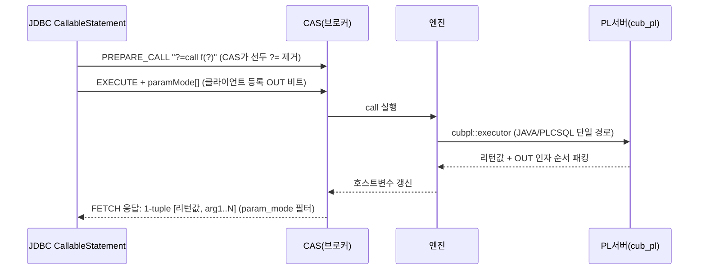
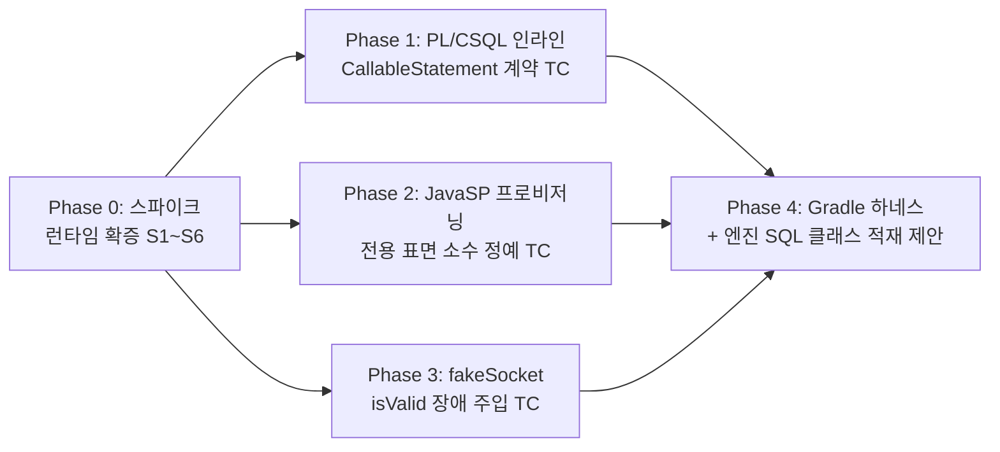

# JavaSP 제약과 JDBC CallableStatement TC 개선 방향: OUT 파라미터 검증과 4계층 설계

- 분류: analysis
- 날짜: 2026-07-23
- 관련: `analysis/2026-07-14-cas-mock-fake-broker.md`, `analysis/2026-07-14-jdbc-ctp-harness-gradle.md`, `analysis/2026-07-14-isvalid-proxy-vs-fakesocket.md`(장애 주입 방식 결론)

## 요약
JDBC 드라이버의 CallableStatement OUT 파라미터 경로는 코드 전 구간에서 SP 구현 언어(JavaSP/PL/CSQL)와 무관함을 확정했고(정적 분석, 런타임 확증 필요), JavaSP로만 검증 가능한 표면 5가지 + 버전 조건부 1가지(커서 결과셋 반환: CBRD-26955 이전 엔진에서는 JavaSP 전용)를 확정했다. 이에 따라 JDBC TC는 "PL/CSQL 인라인 DDL(즉시) + JavaSP 프로비저닝(소수 정예) + fakeSocket(장애 주입) + FaultProxy(하네스 이후)"의 4계층으로 개선한다.

## 목적
JavaSP 특성(loadjava 등) 때문에 JUnit으로 TC 환경 구성이 안 되어 @Ignore로 남은 케이스들을 포함해, JDBC TC를 어떤 방향으로 개선할지 결정한다. 특히 "OUT 파라미터는 JavaSP로만 테스트 가능한가"라는 질문을 코드로 판정하고, pgjdbc/MySQL Connector/J의 방식과 타 DBMS의 아티팩트 배포 관행을 참고해 전체 설계를 도출한다.

## 배경
- 선행 분석에서 isValid 장애 주입 TC의 방식(fakeSocket 지금, FaultProxy는 Gradle 하네스 이후)은 결론이 났다.
- 남은 축이 CallableStatement/SP 계열이다: CUBRID에서 SP를 만드는 전통적 수단이 JavaSP뿐이었고, JavaSP는 서버 호스트에서 loadjava 실행이 선행돼야 해서 JUnit(JDBC 커넥션만 보유)에서는 준비가 불가능하다.
- 모든 판단은 코드 근거(file:line)로만 하고, 코드로 알 수 없는 것은 "알 수 없음"으로 명시한다는 원칙으로 진행했다.

## 범위 / 방법
- 드라이버(cubrid-jdbc), 엔진(cubrid, pl_engine 포함), 테스트 저장소(cubrid-testcases-private, 공개 cubrid-testcases), CTP를 정적 분석. 수정 없음, 읽기 전용.
- 병렬 심층 조사 4축: 드라이버 CallableStatement 메커니즘, 엔진 SP 문법·실행 경로, JavaSP 전용 표면, SP TC 지형(전 스위트).
- 외부 조사: pgjdbc/MySQL Connector/J 테스트 스위트 구조, 타 DBMS의 서버측 아티팩트 배포 방식(웹, URL 근거).
- 한계: 전 결론이 정적 분석이다. 실행으로 확정해야 할 항목은 "다음 단계"의 스파이크로 분리했다.

## 발견 / 관찰

### 1) 현황: CallableStatement 실행 경로의 활성 테스트는 0

- test_jdbc의 CUBRID 패키지 @Ignore 유효 약 212건 중 JavaSP 필요는 정확히 2건: `TestCUBRIDCallableStatement` test1(`? = call sp_add(?, ?)`)과 test2(`? = call sp_now()`). 나머지 약 190건은 드라이버 미지원/스펙 불일치(닫힌 객체 예외, RowId/SQLXML, LOB-스트림 변환 등)로 별개 문제다.
- 이식 스위트의 SP 층은 전부 무력화 상태: MySQL 이식 `CallableStatementTest`는 전 본문 주석 처리("cubrid doesn't support procedure" 주석 8곳), jTDS 이식은 메서드 40개가 `CommentOut_test*`로 개명되어 실행 제외.
- 결론: JDBC 드라이버의 "OUT 파라미터 등록, SP 실행, 값 회수" round-trip을 단언하는 활성 테스트는 사내 어디에도 없다(CQT 하네스의 간접 통과 제외, 아래 7항).

### 2) JavaSP 프로비저닝 4단계 해부: JUnit이 못 하는 것은 2가지

```bash
# 1. 파라미터 (서버 시작 전) : java_stored_procedure=yes (신버전은 stored_procedure=yes, CBRD-25723)
# 2. Java SP 서버        : 구버전 cubrid javasp start, 신버전은 cub_server 자동 기동
# 3. 클래스 배포          : javac + loadjava <db> <Class>.class
# 4. 등록 DDL            : CREATE FUNCTION ... AS LANGUAGE JAVA NAME '...'  (일반 SQL)
```

- loadjava의 실체는 로컬 파일 복사기다: `copy_class_file()`이 .class를 DB 디렉터리 하위 `java/`(또는 `java_static/`)로 복사(`loadjava.cpp:278-312`, 디렉터리 상수 44-45행). 네트워크 경로가 없어 서버 호스트 파일시스템 접근이 필수.
- 즉 1(설정)과 3(아티팩트 배포)만 JDBC로 불가능하고, 4는 일반 SQL이라 JDBC로 실행 가능하다. 1은 하네스 소관, 3은 엔진이 SQL 경로를 안 주는 문제로 성격이 다르다.

### 3) 핵심 판정: OUT 파라미터는 언어 중립 (JavaSP 전용 아님, 정적 기준)

DDL부터 JDBC getter까지 전 구간에 언어(JAVA/PLCSQL) 분기가 없다:

| # | 단계 | 근거 (file:line) |
|---|------|------------------|
| 1 | DDL 문법 공유: 파라미터 모드 `opt_in_out`(IN/OUT/INOUT)은 단일 규칙, 언어 구분은 `pl_language_spec`에서만 | `csql_grammar.y:18686-18703, 2950, 3012, 11651-11685` |
| 2 | 언어별 OUT 금지 시맨틱 체크 없음. 제한은 언어 불문 4가지(OUT+DEFAULT 금지, 쿼리 문맥 OUT 금지, RESULTSET은 OUT+prepared call 전용, PROCEDURE는 CALL 전용) | `semantic_check.c:9622-9724`, `jsp_cl.cpp:359-372, 1469-1482`, `name_resolution.c:10432-10440` |
| 3 | PL/CSQL 문법이 OUT/INOUT 1급 지원, 코드젠은 Java 1-원소 배열(JavaSP와 동일 규약) | `PlcParser.g4:51-58`, `JavaCodeWriter.java:377-379`, `StoredProcedure.java:356-368` |
| 4 | 실행 트랜스포트 단일: PL/CSQL도 Java 클래스로 컴파일되어 동일 리플렉션 호출, 차이는 클래스로더와 sig.type뿐 | `jsp_cl.cpp:1134-1170, 2117-2118`, `pl_executor.cpp:364-386`, `StoredProcedure.findTargetMethod` |
| 5 | OUT 회신 경로 언어 무관: PL서버가 리턴값+OUT 순서 패킹, CAS가 [리턴값, arg1..N] 1-tuple을 클라이언트 등록 param_mode로 필터해 전송 | `ExecuteThread.java:492-515`, `cas_execute.c:9028-9041` |
| 6 | 드라이버에 언어 분기 0건(grep 전수). OUT은 순수 클라이언트 등록: `paramMode[index] \|= PARAM_MODE_OUT`, 실행 요청에 paramMode 배열 전송 | `UBindParameter.java:110-121`, `UStatement.java:760-764` |
| 7 | 실증 케이스 존재: 공개 cubrid-testcases `sql/_05_plcsql`(1,250케이스)에 OUT/IN OUT 모드별 PL/CSQL 케이스 14개(단, CSQL 세션변수 기반 검증) | `_02_declaration/_01_parameter/_05_in_out_mode/cases/*.sql` |



- 구조적 사실: `? = call`의 첫 `?`는 엔진 문법에 없는 CAS 전용 리턴 슬롯이다(ux_prepare가 `=`까지 잘라내고 컴파일, `cas_execute.c:684-752`). "리턴값 슬롯"과 "선언된 OUT 인자"는 물리적으로 다른 슬롯.
- 이 판정은 정적 분석이며, JDBC를 통한 PL/CSQL OUT round-trip을 실행으로 단언한 테스트는 현재 없다(스파이크 S1/S2로 확증 필요).

### 4) 그래도 JavaSP로만 테스트 가능한 표면: 5가지 확정

| # | JavaSP 전용 표면 | 근거 |
|---|---|---|
| 1 | NAME 절 Java 타입 시그니처와 argClassMap 타입매핑(프리미티브/박싱/String/Object/BigDecimal/Date·Time·Timestamp/CUBRIDOID + 1·2차원 배열, 3차원 명시 거부, DATETIME→Timestamp 특례) | `csql_grammar.y:11670-11683`, `TargetMethod.java:121-231`, `StoredProcedure.java:194-199` |
| 2 | loadjava 프로비저닝과 클래스로더 경로(`java/` vs `java_static/`, LANG_JAVASP만 old classloader) | `loadjava.cpp:44-45`, `ClassLoaderManager.java:60,68`, `StoredProcedure.java:104-127` |
| 3 | OBJECT(OID)·SET/MULTISET/SEQUENCE(·MONETARY) 파라미터 타입: PL/CSQL type_spec에 부재 | `semantic_check.c:9552-9568`, `jsp_cl.cpp:343-350`, `PlcParser.g4:614-660` |
| 4 | 서버사이드 JDBC API 임의 사용(DatabaseMetaData, generated keys 콜백, OID, 임의 URL 프로퍼티): PL/CSQL 코드젠은 고정 패턴만 | `JavaCodeWriter.java:109-110,728-760`, `CUBRIDServerSideDriver.java:118-131`, `pl_executor.cpp:566-571` |
| 5 | CURSOR '파라미터' 선언 문법(PL/CSQL은 SYS_REFCURSOR 파라미터 금지 s064). 단 아래 의심 지점 참조 | `csql_grammar.y:11797-11801`, `ParseTreeConverter.java:287-295` |
| 6 | (버전 조건부) 커서 결과셋 반환(CUBRIDOutResultSet 생성원): CBRD-26955(2026-07-03) 이전 엔진에서는 JavaSP `RETURN CURSOR`가 유일 수단. 상세는 4-1 | 커밋 397486884, `ValueUtilities.java:138-149`, 공개 스위트 에러 케이스 |

- PL/CSQL로 동등 재현 가능한 것: 기본 타입 OUT/INOUT, 서버 내 SQL, SP 내 COMMIT/ROLLBACK, 예외 전파. 결과셋 반환은 아래 4-1의 재조사 결과대로 "버전 조건부"다.
- 의심 지점(이슈 후보): JavaSP의 CURSOR OUT 파라미터는 SQL 문법·엔진 검사는 있으나 pl_server `TargetMethod.argClassMap`에 java.sql.ResultSet 항목이 없어(미등록은 ClassNotFoundException) 정적으로는 시그니처 해석 단계 도달 불가로 보인다. `StoredProcedure.checkArgs`의 `ResultSet[].class` 분기(268행)는 죽은 코드 가능성.

### 4-1) 재조사: 커서 결과셋(CUBRIDOutResultSet)은 "버전 조건부 JavaSP 전용"

"커서 OUT 결과셋(CUBRIDOutResultSet)은 JavaSP로만 테스트 가능한 것 아닌가"라는 재질문에 대해 마샬링 체인 전체를 재검증했다. 초판의 "PL/CSQL `RETURN SYS_REFCURSOR`로 동등 재현 가능" 판정은 문법 통합과 드라이버 경로만 본 불완전한 결론이었고, 다음과 같이 정정한다.

- 클라이언트가 커서 결과셋을 받는 경로는 사실상 함수 리턴 슬롯(`?=call`의 첫 `?`) 하나다. 커서 OUT '파라미터'(2번째 이후 위치)는 양쪽 모두 사실상 불가: PL/CSQL은 최상위 파라미터로 SYS_REFCURSOR 금지(s064, `ParseTreeConverter.java:287-295`), JavaSP는 DDL은 선언되지만 argClassMap 부재로 정적 도달 불가 의심(위 의심 지점).
- 함수 리턴 경로의 PL/CSQL 마샬링 체인은 완결돼 있다(전부 직접 확인): SYS_REFCURSOR의 Java 표현은 `SpLib.Query`(`Type.java:143-147`, 커서는 서버사이드 JDBC의 `prepareStatement+executeQuery`로 연 `ResultSet rs` 보유, `SpLib.java:625-687`) → `ValueUtilities.createValueFrom`의 `instanceof Query` 분기가 `ResultSetValue(query.rs)`로 포장(`ValueUtilities.java:138-149`, 주석: query.close()는 서버측 질의 결과를 닫지 않아 결과가 살아남음) → `ResultSetValue`는 `CUBRIDServerSideResultSet.getQueryId()`로 queryId를 담는 JavaSP `instanceof ResultSet`(136행)과 동일 클래스·동일 메커니즘(`ResultSetValue.java:55-60`) → 이후 wire·드라이버 경로는 언어 공통(U_TYPE_RESULTSET → CUBRIDOutResultSet → MAKE_OUT_RS).
- **그러나 이 체인 전체가 CBRD-26955(2026-07-03, develop 커밋 397486884 "support sys_refcursor in PL/CSQL stored function return type")에서 처음 추가된 것이다.** 같은 커밋이 문법(csql_grammar.y의 SYS_REFCURSOR 리턴 통합)과 pl_server의 `instanceof Query` 분기를 함께 도입했다(git log -S로 확인).
- 그 이전 엔진에서는 최상위 PL/CSQL 함수의 `return sys_refcursor`가 CREATE 시점에 거부된다. 증거: 공개 cubrid-testcases(체크아웃 2026-06-25, 커밋보다 앞섬)의 에러 케이스 `_02_create_function/_11_common/cases/01_02_11-10_error_sys_refcursor_return_type.sql`(주석 "SYS_REFCURSOR may not be the return type of stored functions")과 그 answer의 문법 에러 -493(usage에 `RETURN {data_type|CURSOR}`만 표기). 1,250개 PL/CSQL 스위트 전체에 stored function이 SYS_REFCURSOR를 반환하는 정상 케이스는 0개다.
- **판정: CBRD-26955 이전의 모든 엔진(현행 릴리스 라인 포함)에서 CUBRIDOutResultSet 경로를 만들 수 있는 SP는 JavaSP(`RETURN CURSOR ... AS LANGUAGE JAVA`)뿐이다. 재질문의 의심이 옳다.** CBRD-26955 이후 엔진에서만 PL/CSQL로도 가능하다(정적 체인 완결, 런타임 확증은 스파이크 필요).
- TC 설계 함의: 드라이버의 CUBRIDOutResultSet 경로(getObject → createInstance/MAKE_OUT_RS → fetch, 커밋/롤백 시 일괄 close)를 전 지원 엔진 버전에서 검증하려면 **JavaSP `RETURN CURSOR` 버전이 필수**(Phase 2). PL/CSQL `RETURN SYS_REFCURSOR` 버전은 CBRD-26955+ 엔진 전용 케이스로 Phase 1에 추가하되, CREATE 실패 시 [SKIP]하는 프로브 게이트가 버전 분기를 자연스럽게 흡수한다.
- 부수 관찰: 위 에러 케이스는 CBRD-26955 탑재 엔진에서는 기대 결과가 뒤집힐 것으로 보인다(스위트 갱신 필요 가능성). 실제 QA 런의 대상 엔진 버전은 미확인이라 단정하지 않는다.
- 참고: 서버사이드 JDBC 클래스 13종은 드라이버 저장소가 아니라 pl_engine에만 존재하고, 드라이버에는 호출처 없는 `UJCIUtil.isServerSide()` 플래그만 남았다(`UJCIManager.connectServerSide`는 제거됨).

### 5) 드라이버 계약 발견 사항: TC가 명세로 고정해야 할 동작들

- registerOutParameter의 scale/typeName 인자는 버려지고 sqlType도 CUBRID 접속에서는 무시된다(`CUBRIDCallableStatement.java:557-604`, `UBindParameter.java:110-121`).
- 서버측 OUT 선언과의 교차검증이 없다: 서버 prepare 응답에서 받는 파라미터 정보는 개수뿐(`UStatement.java:184`), 파라미터별 mode 수신 코드는 전부 주석 처리("3.0"). IN 선언 파라미터에도 OUT 등록이 가능하다.
- OUT 값 조회는 실행 후 첫 getXXX 때 FETCH 왕복으로 받는 1-tuple의 attribute이며, CALL_SP는 `columnNumber = parameterNumber + 1` 강제(`UStatement.java:205-206`), 인덱스 매핑은 bind는 i-1, 튜플은 i.
- CALL_SP에서 executeQuery는 허용되지만 `UResultInfo`가 CALL_SP(0x7e)를 isResultSet=false로 취급해(`UResultInfo.java:55-61`) null 반환으로 추정된다(서버가 보내는 statementType 가정 위의 추론).
- getMoreResults(int) 전면 미지원, 이름 기반 파라미터 전면 미지원, Callable의 addBatch/executeBatch 차단, Calendar 오버로드는 Calendar 무시(`CUBRIDCallableStatement.java:335-345, 582-588`).
- SP에서 복수 결과셋을 받는 유일한 경로는 RESULTSET 타입 OUT 파라미터 여러 개를 각각 getObject로 받는 것(CUBRIDOutResultSet, 커밋/롤백 시 일괄 close `CUBRIDConnection.java:774-784`).

### 6) pgjdbc / MySQL Connector/J / 타 DBMS 관행

- 공통 원칙(3계층): SQL로 만들 수 있는 것은 테스트가 인라인 생성(pgjdbc는 setUp에서 `CREATE OR REPLACE FUNCTION ... LANGUAGE plpgsql`, MySQL은 createProcedure 헬퍼+생성 객체 부기+tearDown 자동 DROP), SQL로 못 만드는 것은 하네스/CI가 보증(pgjdbc docker entrypoint/post-startup, 매트릭스), 전제 미충족은 실패가 아니라 사유 있는 스킵(assumeTrue: 버전 게이트, 프로퍼티 게이트, 실행 프로브).
- MySQL의 교훈: JUnit3 시절 `if (versionMeetsMinimum(...)) {...}` 래핑은 "조용한 초록"이었고 JUnit5 전환(8.0.21)으로 사유 있는 skipped 집계로 개선됐다. CTP 러너가 정확히 그들의 JUnit3 시절 상태다(`JdbcLocalTest.java:146-153`이 `wasSuccessful()`만 봐서 Assume 위반이 OK로 집계).
- pg/mysql 모두 컴파일 아티팩트를 서버에 배포하는 테스트가 없다(그들의 SP는 SQL 텍스트라 문제 자체가 부재). 그대로 이식 불가한 이유.
- 아티팩트 배포 스펙트럼: SQL Server `CREATE ASSEMBLY FROM 0x…`, Oracle `CREATE OR REPLACE AND COMPILE JAVA SOURCE`(Oracle loadjava조차 JDBC Thin 클라이언트 도구), DB2 `SQLJ.DB2_INSTALL_JAR(BLOB)`, PL/Java `sqlj.install_jar(BYTEA)`, Derby `CALL SQLJ.INSTALL_JAR`(JDBC CALL). 서버 호스트 셸이 필수인 것은 CUBRID loadjava가 유일. `sqlj.install_jar` 계열은 SQLJ 표준 유래 관례라 "SQL로 클래스 적재"는 표준 추종 요구다.

### 7) CTP/TC 지형의 결정적 사실

- CTP의 SQL 러너는 이미 loadjava를 하네스에서 수행한다: `CTP/sql/bin/run.sh`의 make_sql_db_data()가 번들 SpTest*.java 12개를 javac→loadjava(569-584행, loadjava=579행). "하네스가 JavaSP를 프로비저닝한다"는 사내 선례.
- CQT 러너는 `?=call`/`$out:` 케이스를 JDBC prepareCall+registerOutParameter+getObject로 실행한다(`SQLParser.java:173-193`, `ConsoleDAO.executeCall:485-518`). 단 단언은 엔진 answer 파일이라 드라이버 API 계약은 미검증.
- 엔진 SP 의미론의 본진은 공개 cubrid-testcases: `sql/_05_plcsql` 1,250케이스, `sql/_08_javasp` 96케이스. 사설 repo에는 SP 스위트가 없고 이슈 재현형 shell 5건뿐.
- jdbc.conf의 `[jdbc/cubrid.conf]` 섹션 키는 run.sh:180-182가 server start 전에 cubrid.conf로 주입한다: `java_stored_procedure=yes` 한 줄이면 코드 수정 0으로 반영.
- CTP JDBC 테스트 JVM은 서버와 동일 호스트에서 실행되므로 Runtime.exec 기반 loadjava shell-out이 기술적으로 성립한다(로컬 서버 전제 결합 비용 있음).

## 결론

"무엇을 검증하는가"가 수단을 결정한다는 원칙으로 4계층 설계를 확정한다.

| 검증 대상 | 수단 |
|---|---|
| CallableStatement API 계약(등록/실행/getter/wasNull/OutResultSet/에러 명세) | 실 DB + PL/CSQL 인라인 DDL(실행 프로브 + [SKIP] 게이트) |
| JavaSP 전용 표면(타입매핑, loadjava, OID/컬렉션, 서버사이드 JDBC) | 실 DB + JavaSP 프로비저닝(conf 주입 + loadjava, sql run.sh 선례) |
| 프로토콜 장애(isValid 죽은 CAS/무응답/불통) | fakeSocket(선행 노트 결론 유지) |
| 연결 수명주기 장애(read-hang, cancel, reconnect) | FaultProxy(Gradle 하네스 이후) |
| 엔진 SP 의미론 | JDBC TC 범위 아님(공개 sql 스위트 소관) |



- Phase 1: `createProcedure/createFunction` 헬퍼+생성 부기+@After 일괄 DROP(MySQL 방식), 실행 프로브 게이트(pgjdbc HStore 방식, 단 CTP 러너 제약상 Assume 대신 [SKIP] 로그+return). SYS_REFCURSOR 반환 케이스는 CBRD-26955+ 엔진 전용이며 프로브 게이트가 버전 분기를 흡수.
- Phase 2: 단기 JavaSpProvisioner(Runtime.exec loadjava, $CUBRID 부재 시 [SKIP]) + jdbc.conf 주입, 중기 run.sh 프로비저닝 훅(QA 협의, sql run.sh 선례 인용). **CUBRIDOutResultSet 경로의 전 버전 커버는 이 계층의 JavaSP `RETURN CURSOR` 케이스가 담당**(4-1).
- 종전 발언 정정 2건: (1) "OUT 파라미터는 PL/CSQL로 동일 검증 가능"은 근거 없는 단정이었고 "정적 코드상 성립, 런타임 확증 필요 + JavaSP 전용 표면 별도 존재"로 정정. (2) 초판의 "결과셋 반환은 PL/CSQL로 동등 재현 가능"도 불완전한 결론이었고 재조사로 "CBRD-26955 이전 엔진에서는 JavaSP 전용"으로 정정(4-1).

## 다음 단계
- Phase 0 스파이크(실 서버 실행으로 unknowns 해소, TC 단언 수위 결정):
  - S1: PL/CSQL 함수 `?=call` + registerOutParameter round-trip. CBRD-26955+ 엔진에서는 `RETURN SYS_REFCURSOR` → getObject → CUBRIDOutResultSet 왕복 포함
  - S1b: JavaSP `RETURN CURSOR` → CUBRIDOutResultSet 왕복(구버전 엔진 포함, 전 버전 커버 수단의 실동작 확인)
  - S2: PL/CSQL 프로시저 `call p(?)` OUT/INOUT round-trip, `?=` 없는 형태의 prepare 결과
  - S3: CALL_SP 튜플 attribute 0의 실체와 서버 parameterNumber
  - S4: CALL_SP에서 executeQuery 실제 반환값(null 추정 확인)
  - S5: JavaSP CURSOR OUT 파라미터(도달 불가 의심 확인, 결함이면 이슈화)
  - S6: IN 선언 파라미터에 OUT 등록 시 반환값
- Phase 1/2 TC 구현 이슈화(성격이 달라 분리): "CallableStatement 계약 TC(PL/CSQL)"와 "JavaSP 전용 표면 TC(프로비저닝)".
- 별도 과제: Gradle 하네스(선행 노트), 엔진 "SQL로 클래스/jar 적재" 기능 제안(SQLJ 계열 선례 근거).
- 코드로 알 수 없는 것(추측 배제, 스파이크·후속으로만 해소 가능): 위 S1~S6 항목 전부, PL/CSQL 프로시저 코드젠의 반환 타입(void 여부), 구버전 서버(10.x, 11.0~11.2)의 동작 차이, `test_unsupported`의 prepare 시점 SP 존재 검증 여부, 무력화된 이식 테스트의 CI 재활성 여부, transaction_control 실효 정책.

## 참고
- 드라이버: `cubrid-jdbc/src/jdbc/cubrid/jdbc/driver/CUBRIDCallableStatement.java`(등록 557-604, 조회 606-635, 미지원 목록 295-820), `driver/CUBRIDStatement.java`(getMoreResults 293-355, 605-638), `jci/UStatement.java`(prepare 응답 182-186, paramMode 전송 760-764, fetch 1204-1228, 튜플 2315-2359, RESULTSET 2298-2303), `jci/UBindParameter.java`(setOutParam 110-121, checkAllBinded 76-81), `jci/UResultInfo.java:53-61`, `driver/CUBRIDOutResultSet.java`
- 엔진: `cubrid/src/parser/csql_grammar.y`(opt_in_out 18686-18703, pl_language_spec 11651-11685, CURSOR/SYS_REFCURSOR 3059-3080, 11797-11801), `src/parser/semantic_check.c:9522-9777`, `src/sp/jsp_cl.cpp`(타입 검사 335-380, OUT 회신 664-707, lang 디스패치 2117-2118), `src/sp/pl_executor.cpp`(단일 트랜스포트 364-386, 콜백 534-582), `src/broker/cas_execute.c`(?= 제거 684-752, fetch_call 1-tuple 9022-9042), `src/executables/loadjava.cpp:44-45, 278-312`
- pl_engine: `pl_server/src/main/antlr/PlcParser.g4`(파라미터 51-58, 타입 614-660), `compiler/visitor/JavaCodeWriter.java:109-110, 260, 377-379, 1530`, `compiler/type/Type.java:143-147`(SYS_REFCURSOR=SpLib.Query), `predefined/sp/SpLib.java:625-687`(Query 클래스), `jsp/value/ValueUtilities.java:136-149`(ResultSet/Query→ResultSetValue), `jsp/value/ResultSetValue.java:55-60`(queryId), `jsp/TargetMethod.java:121-231`, `jsp/StoredProcedure.java:104-127, 194-199, 268-269, 356-368`, `jsp/ExecuteThread.java:492-515`, `jsp/jdbc/CUBRIDServerSideDriver.java`
- 커서 결과셋 버전 게이트: cubrid develop 커밋 397486884 "[CBRD-26955] support sys_refcursor in PL/CSQL stored function return type" (2026-07-03, v11.3-1205); 공개 cubrid-testcases `sql/_05_plcsql/_01_testspec/_01_basic_structure/_02_create_function/_11_common/cases/01_02_11-10_error_sys_refcursor_return_type.sql` + answers(문법 에러 -493 기대)
- 테스트/하네스: test_jdbc `TestCUBRIDCallableStatement.java`, 이식 스위트(CallableStatementTest 계열 무력화), 공개 cubrid-testcases `sql/_05_plcsql`(OUT 모드 케이스 `_02_declaration/_01_parameter/_05_in_out_mode/`), `sql/_08_javasp`; CTP `sql/bin/run.sh:569-584`(loadjava 선례), `sql/src/.../SQLParser.java:173-193`, `ConsoleDAO.java:481-527`, `jdbc/bin/run.sh:180-182`(conf 주입), `shell/src/.../JdbcLocalTest.java:146-153`(Assume=OK 집계)
- 외부: pgjdbc TESTING.md·docker/postgres-server·Jdbc3CallableStatementTest (https://github.com/pgjdbc/pgjdbc), MySQL Connector/J BaseTestCase·CHANGES WL#14042 (https://github.com/mysql/mysql-connector-j), Derby SQLJ.INSTALL_JAR (https://db.apache.org/derby/docs/10.9/ref/rrefstorejarinstall.html), SQL Server CREATE ASSEMBLY (https://learn.microsoft.com/en-us/sql/t-sql/statements/create-assembly-transact-sql), Oracle CREATE JAVA (https://docs.oracle.com/en/database/oracle/oracle-database/19/sqlrf/CREATE-JAVA.html), PL/Java sqlj.install_jar (https://tada.github.io/pljava/), CUBRID 매뉴얼은 미사용(로컬 코드 1차 소스)
