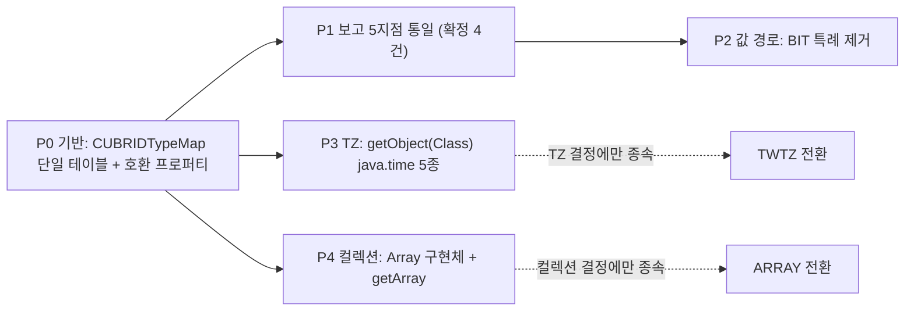

# 타입 매핑 통일안 심층 검증: 적합성, 영향, 구현 범위, 업계 사례

- 분류: analysis
- 날짜: 2026-07-24
- 관련: [1편 반환값 전수표](2026-07-20-cubrid-jdbc-metadata-type-mapping.md), [2편 불일치·규약 위반 분석](2026-07-20-cubrid-jdbc-type-mapping-issues.md), [3편 3-DB 실측 대조](2026-07-20-3db-jdbc-type-mapping-measured.md)

## 요약

통일안 6건을 적대적으로 재검증한 결과, 4건(BIT 전부 BINARY, NULL 타입, DOUBLE 이름, LTZ는 TIMESTAMP 유지)은 규약·CUBRID 의미론·회귀 근거가 한 방향으로 수렴해 확정 권고가 가능하고, 2건(TZ의 TIMESTAMP_WITH_TIMEZONE, 컬렉션의 ARRAY)은 신규 기능(getObject(Class), java.sql.Array 구현) 완성과 한 묶음일 때만 성립하는 조건부 항목이다. 구현은 쓰기 경로까지 포함해 드라이버 자바 레이어만으로 완결되며(브로커/CAS/프로토콜/CCI 불변), 회귀는 CTP 기준 shell answer 재생성 약 19~27개 파일 수준의 기계적 작업이다. 단, getObject의 기본 반환 클래스를 바꾸는 순간 비기계적 파손(하드캐스트 13개 파일 실증)이 생기므로 "타입 코드 전환"과 "기본 반환 변경"을 분리하는 단계안을 권고한다.

## 목적

결정권자 앞에서 통일안을 주장하려면 다섯 가지 질문에 근거로 답할 수 있어야 한다: (1) 제안 값이 정말 CUBRID 타입의 의미에 맞는가, (2) 바꾸면 프레임워크·사용자에게 무엇이 깨지는가, (3) 정말 드라이버만 고치면 되는가, (4) 어느 수준까지 구현해야 하는가, (5) 다른 JDBC 드라이버의 선례는 무엇인가. 이 노트는 그 다섯 질문의 답을 소스 대조·테스트 저장소 정량 분석·매뉴얼과 javadoc 원문·웹 사례 조사로 확정한다.

## 배경

1~3편에서 CUBRID JDBC의 타입 보고 5개 지점이 같은 타입을 다르게 보고하는 현황을 전수 조사·실측했고, 회의용 결정표(통일 대상 6건)를 만들었다. 이 노트는 그 제안 자체를 검증 대상으로 놓는다: 조사 5축(적합성 심사, 회귀 표면 정량화, 쓰기 경로 완결성, 구현 범위 설계, 업계 사례)과 적대적 검증 2종(드라이버-전용 주장 공격, 반대 의견 스틸맨)을 병렬로 수행했다.

## 범위 / 방법

- 소스 대조: 드라이버(cubrid-jdbc)와 브로커(cubrid `src/broker`)의 읽기·쓰기·프로토콜 경로 직접 확인.
- 회귀 정량화: CTP JDBC JUnit 스위트와 shell 시나리오(비공개 QA 저장소 2종)를 정적 grep으로 전수 스캔, 현재 매핑을 pin한 assert/answer 건수 집계.
- 규격 원문: CUBRID 11.4 매뉴얼(데이터 타입), `java.sql.Types`/`DatabaseMetaData`/`java.sql.Array` javadoc.
- 업계 사례: pgjdbc, ojdbc, MySQL/MariaDB Connector/J, H2, Firebird Jaybird, DB2 jcc, ClickHouse, Snowflake의 공개 문서·소스·이슈 웹 조사(URL은 참고 절).
- 근거 등급을 구분해 표기한다: [코드/실측] 직접 확인, [문서] 공식 문서 원문, [웹/지식] 2차 자료 기반.

## 발견 / 관찰

### 1. 항목별 적합성 재심사: 제안이 정말 CUBRID 타입에 맞는가

| 항목 | 심사 결과 | 핵심 근거 |
|---|---|---|
| (1) BIT → 전부 BINARY (A안) | **적합** (B안은 조건부) | CUBRID BIT은 비트열이지 진리값이 아님(매뉴얼: 8비트 단위 선언·입력 권장, BOOLEAN 타입 부재). B안(BIT(1)만 Boolean)은 정밀도에 따라 타입 코드가 갈라져 "타입당 하나의 값" 원칙을 스스로 깸 [문서] |
| (2) NULL 타입 → Types.NULL | **적합** | javadoc에서 NULL만 유일하게 "generic SQL **value** NULL을 식별"하는 상수. 이미 5지점 중 2곳과 getTypeInfo가 Types.NULL을 반환 중이라 신규 도입이 아니라 다수 지점으로의 수렴 [코드/실측] |
| (3) DOUBLE 이름 → "DOUBLE" | **적합** | 매뉴얼 원문 "DOUBLE과 DOUBLE PRECISION은 같은 의미로 사용된다". JDBC의 TYPE_NAME은 표준명이 아니라 데이터소스 종속 명칭. 3/4 지점이 이미 "DOUBLE", 기존 테스트 answer도 "DOUBLE"을 pin [문서] |
| (4) TZ 2종 → TIMESTAMP_WITH_TIMEZONE | **조건부 적합** | CUBRID TZ 타입은 값별 타임존을 실제 저장(매뉴얼: UTC + 생성 시 타임존 저장)하므로 TWTZ의 정의에 정확히 해당. 단 이 코드를 보고하면 규약상 getObject(col, OffsetDateTime.class)가 기대되므로 그 구현과 한 묶음일 때만 성립 [문서] |
| (5) LTZ 2종 | **A안(TIMESTAMP 유지)으로 정정 권고, B안(TWTZ) 부적합** | 매뉴얼 원문: LTZ는 "내부적으로 UTC를 저장하며 출력 시 세션 타임존으로 변환". 값에 타임존이 없으므로 TWTZ 보고는 값에 없는 정보의 과대 광고. Oracle도 TZ(-101)와 LTZ(-102)를 절대 합치지 않음 [문서] |
| (6) 컬렉션 → ARRAY (B안) | **조건부 적합** (A안 OTHER는 무조건 적합) | `java.sql.Array` javadoc: "드라이버가 이 타입을 지원하면 Array 인터페이스의 모든 메서드를 완전히 구현해야 한다". 즉 B안의 조건은 getArray() 하나가 아니라 java.sql.Array 구현체 전체 [문서] |

항목별 보강 근거:

- **BIT A안 우세 근거 3건 추가**: (a) 드라이버 자신의 쓰기 경로에서 `setBoolean`은 SHORT로 바인딩되므로, B안의 "BIT(1)=Boolean"은 읽기와 쓰기가 비대칭이 된다 [코드/실측]. (b) CALL/EVALUATE/저장 프로시저 결과처럼 값 단위 타입만 오고 정밀도가 오지 않는 경로가 있어, B안의 정밀도 기반 판별이 불가능한 지점이 존재한다(A안이면 이 문제 자체가 없음) [코드/실측]. (c) MySQL·MariaDB의 bit(1) 특례는 B안과 같은 구조지만, CUBRID처럼 손실이 생기는 8비트 접기는 조사한 어떤 벤더에도 없다 [문서].
- **BIT(8)→Boolean 특례 폐지는 양안 공통이며 독립 정당성**: 실측상 getObject가 0xAA를 true로 접어 8비트를 잃는 반면 getString/getBytes는 무손실이라, 같은 컬럼이 접근자마다 다른 값을 준다. 이 동작을 pin한 테스트는 양 저장소 통틀어 0건이라 폐지 회귀도 없다 [코드/실측].
- **NULL 유의 사항 1건**: RSMD 생성자에 `Types.NULL`이 주석 처리된 흔적이 있어 과거 의도적 회피였을 가능성이 있다. git blame으로 유래를 확인해 회의 자료에 첨부할 것(유효한 사유가 안 나오면 확정) [코드/실측].
- **TZ의 "벤더 선례 없음" 반론은 무력화됨**: PostgreSQL timestamptz는 저장 시 UTC로 정규화해 원래 오프셋을 버리는 타입이라(의미상 LTZ에 가까움) pgjdbc의 TIMESTAMP 보고는 자기 타입에는 맞는 선택이고, Oracle -101은 JDBC 4.2 이전부터의 레거시다. 값별 타임존을 실제 보존하는 CUBRID는 오히려 측정 3사 중 TWTZ의 본래 의미에 가장 부합하는 사례다 [웹/지식].

### 2. 업계 사례: 다른 JDBC는 어떻게 하나

| 주제 | 사실 | 시사점 |
|---|---|---|
| TWTZ(2014)를 실제 반환하는 드라이버 | **H2**(TIMESTAMP WITH TIME ZONE → 2014), **Firebird Jaybird 4+**(메타데이터를 항상 JDBC 4.2 기준으로 보고, getObject 기본이 OffsetDateTime) [문서] | "아무도 안 쓴다"는 반론은 사실이 아님. 표준 준수 진영의 선례 존재 |
| pgjdbc의 보류 | timestamptz→TWTZ 전환 PR #695가 2016년 생성 후 **9년째 미병합**(2026-07 현재 open). 이유: 과거 타입 코드 변경이 앱/ORM을 조용히 깨뜨린 선례(#639), "메이저 버전 + 릴리스노트로만 가능" 입장 [코드/실측(웹 API로 상태 확인)] | 타입 코드 변경은 업계가 "조용한 파괴적 변경"으로 취급. 메이저 버전 경계 + 명시적 공지가 관례 |
| Oracle | -101/-102 고유 코드 유지. EclipseLink 등 프레임워크가 -101을 특별 처리하는 생태계가 형성돼 코드 변경이 곧 생태계 파괴 [웹/지식] | 한 번 배포된 타입 코드는 생태계가 고착시킴. 바꾸려면 지금(생태계가 작을 때)이 더 쉽다는 역설도 성립 |
| **타입 코드와 getObject(Class)는 독립** | pgjdbc는 TIMESTAMP를 유지하면서 getObject(OffsetDateTime.class)를 완전 지원, Oracle도 -101 유지 + offsetDateTimeValue 제공 [문서] | "TWTZ 전환 없이 OffsetDateTime 지원 먼저"라는 단계 경로가 업계 표준 패턴 |
| 호환 스위치 선례 | MySQL/MariaDB `tinyInt1isBit`·`transformedBitIsBoolean`·`yearIsDateType`(기본값이 한쪽 동작 보존, getColumns와 getColumnType에 일관 적용), Jaybird `dataTypeBind` [문서] | 타입 보고 변경의 검증된 완충 장치는 커넥션 프로퍼티 |
| Array 부분 구현 통용 | pgjdbc PgArray도 typeMap 오버로드는 미구현 예외, H2 JdbcArray는 인메모리 최소 구현, ClickHouse는 getResultSet 없이 출시 후 사후 보완, Snowflake는 getArray 자체를 미지원으로 문서화 [문서] | javadoc의 "전부 구현" 문구에도 불구하고 업계 관례는 단계적 구현. 단 미구현 범위의 문서화가 관례의 조건 |

### 3. 사용자·프레임워크 영향: 무엇이 깨지고 무엇이 안 깨지나

**깨지지 않는 것(구조적으로 회귀 불가)** [코드/실측]:

- 값 접근자 `getString`/`getBytes`/`getTimestamp`/`getInt` 등: 타입 코드와 무관하게 동작 불변.
- CallableStatement OUT 파라미터, updatable ResultSet(updateObject): 서버가 보낸 U_TYPE 바이트 기준으로 동작하고 java.sql.Types를 참조하지 않음.
- TYPE_NAME 문자열(TIMESTAMPTZ 등): 제안이 이름을 바꾸지 않으므로 이름 pin(answer 56개)은 전부 무사. 역으로 **이름까지 바꾸는 결정은 금물**(코드 변경보다 큰 회귀).
- CCI 등 타 클라이언트: 변경이 전부 드라이버 자바 클래스에 국한, 와이어 U_TYPE 불변.

**깨지는 것(회귀 표면, CTP 정량)** [코드/실측]:

| 패턴 | 규모 | 성격 |
|---|---|---|
| TZ 컬럼의 93(TIMESTAMP) pin | shell answer 19개(케이스 번들 3~4개), JUnit 0건 | answer 재생성으로 기계적 |
| BIT 관련 pin | 특례 폐지 자체는 0건. A안은 getTypeInfo 덤프 answer 8건, B안은 2건 | 기계적 |
| 컬렉션 OTHER 의존 | Types.OTHER 분기 덤퍼 19건이 있으나 전부 컬렉션 컬럼이 없는 데드코드, 실파손 0건 | 없음 |
| "DOUBLE PRECISION" 문자열 기대 | 0건(오히려 기존 answer가 "DOUBLE"을 pin) | 없음 |
| **getObject 기본 반환 클래스 변경 시** | (CUBRIDTimestamptz) 하드캐스트 자바 13개 파일이 ClassCastException, 출력 포맷 pin answer 10~20개 | **비기계적**, 고객 코드도 같은 방식으로 깨진다는 실증 표본 |

여기서 이 분석의 가장 중요한 설계 결론이 나온다: **"타입 코드 전환"과 "getObject 기본 반환 변경"을 분리하라.** Types 코드를 2014로 바꾸더라도 인자 없는 getObject는 기존 CUBRIDTimestamptz를 유지하고, OffsetDateTime은 `getObject(col, OffsetDateTime.class)`로 opt-in하게 하면 위 표의 비기계적 파손이 전부 사라진다. 이는 Oracle(기본 반환 고유 클래스 유지)과도 같은 구조다.

부수 확인: "다른 지점을 getTypeInfo에 맞춘다"는 방향 자체가 회귀를 최소화한다. getTypeInfo 덤프 answer들은 이미 2014(TWTZ)·2003(ARRAY)을 pin하고 있어 그 방향이면 불변이고, 반대로 getTypeInfo를 내리는 결정(컬렉션 A안 등)만 8건+α를 깨뜨린다. 또한 getColumns와 RSMD의 전 컬럼 일치를 assert하는 기존 테스트(TestDataTypes4)가 있어, 통일 완료 후에는 이 테스트가 통일의 회귀 감시자가 된다.

### 4. 정말 드라이버만 고치면 되는가: 계층 영향 최종 판정

**판정: 쓰기 경로까지 포함해 드라이버 자바 레이어만으로 완결. 브로커/CAS/엔진/프로토콜 버전/CCI 전부 불변.** [코드/실측]

적대적 검증(주장을 무너뜨리려는 공격 5종)의 결과:

| 공격 시나리오 | 결과 |
|---|---|
| LTZ는 타임존 문자열 없이 와이어에 실려 세션 타임존을 드라이버가 몰라 브로커 수정 필요 | **반박됨**: CAS가 V7+ 클라이언트에는 LTZ 값마다 세션 타임존 문자열을 만들어 붙여 보냄(코드 확인). 빈 타임존 케이스는 사실상 없음 |
| TWTZ 값 쓰기(왕복)에 프로토콜 변경 필요 | **반박됨**: CUBRIDTimestamptz 경유 쓰기 인코딩과 CAS 수신 경로가 이미 완비. 부족한 것은 OffsetDateTime→CUBRIDTimestamptz 자바 변환뿐 |
| 컬렉션 원소에 TZ가 들어가면 ARRAY 불가 | **반박됨**: 원소별 재귀 직렬화로 TZ 원소에도 타임존 문자열이 붙음 |
| 카탈로그(getColumns) 경로에는 BIT 정밀도가 안 와서 B안 판별 불가 | **반박됨**: 스키마 fetch가 정밀도를 명시 전송(비트 단위) |
| 합성 결과셋 경로가 CAS 의존 | **반박됨**: 완전한 드라이버 로컬 구현 |

단, 공격 과정에서 **경계 3건**이 확인됐다(주장을 뒤집지는 않지만 발표 때 선제 명시 권장):

1. CALL/EVALUATE/저장 프로시저 결과 등 값 단위 타입 경로에는 정밀도가 오지 않아, B안(BIT(1)=Boolean) 채택 시 이 경로에서는 판별 불가로 byte[] 폴백 규칙이 필요하다. A안이면 문제 자체가 없다.
2. 이질 원소(멀티도메인) 컬렉션 값은 와이어 구조상 지금도 NULL로 유실된다. ARRAY 지원 범위는 "단일 도메인 컬렉션"으로 문서화해야 한다(기존 동작과 동일, 신규 회귀 아님).
3. TZ 타임존 문자열이 지역명("Asia/Seoul")으로 오면 드라이버가 JVM tzdb로 오프셋을 계산해야 하므로, 서버 타임존 라이브러리와 JVM tzdb의 버전 불일치 가능성이 이론상 존재한다.

부수 발견(별도 이슈 후보): readTimestamptz에 null 가드가 없어 zeroDateTimeBehavior=convertToNull 설정 + 제로 TIMESTAMPTZ 조합에서 NPE 경로가 있다. 이번 변경과 무관한 선행 버그로, 구현 시 함께 수정 권장.

### 5. 어느 수준까지 구현해야 하나

**java.sql.Array (컬렉션 B안의 조건)**: 인터페이스는 총 12메서드. javadoc은 "지원 표방 시 전부 구현"을 요구하지만 업계 대표 구현(pgjdbc·H2)조차 부분 구현이므로, 관례상 유효한 최소는 다음과 같다.

- MVP 5메서드: `getArray()`, `getArray(long,int)`, `getBaseType()`, `getBaseTypeName()`, `free()`. 원소 데이터는 이미 전량 수신되므로 인메모리 래퍼(H2 JdbcArray 패턴)로 충분.
- 후순위(SQLFeatureNotSupportedException 유지, 문서화): typeMap 오버로드(업계도 미구현), `getResultSet()` 계열(필요 시 기존 합성 결과셋 인프라 재활용으로 확장 가능).
- 전제 작업: java.sql.Array 구현 클래스 신설 + jci의 컬렉션 base type을 노출하는 접근자(현재 raw 배열만 반환되어 base type이 유실됨).

**getObject(int, Class) (TZ 조건)**: JDBC 4.2 변환 표 전체를 한 번에 구현할 필요 없음.

- 규약상 최소: OffsetDateTime 1종(TWTZ의 표준 매핑 대상).
- 실용 최소(권장): java.time 5종(LocalDate/LocalTime/LocalDateTime/OffsetTime/OffsetDateTime) + 나머지 클래스(String/수치 래퍼/byte[]/Date/Time/Timestamp/Blob/Clob)는 기존 getXXX 1:1 위임. 신규 변환 로직은 java.time 5종뿐이라 증분 비용이 낮다.
- 주의: 기존 커넥션 옵션(결과를 표준 타입으로 강등시키는 설정)이 켜진 연결에서는 타임존이 소실되는 기존 경로가 있어, 신규 구현은 컬럼 U_TYPE 분기로 그 경로를 우회해야 한다.

**하위호환 완충 장치**: 드라이버의 커넥션 프로퍼티 메커니즘은 필드 선언만으로 자동 등록되는 구조이고, 과거 동작 보존용 프로퍼티 선례가 이미 3개 있다(불리언 구동작 보존, 오라클식 빈 문자열, CUBRID 고유 타입 반환 여부). 같은 패턴으로 `useLegacyTypeMapping` 1개를 추가할 수 있으며, 매핑을 단일 테이블(가칭 CUBRIDTypeMap, U_TYPE→Types·TYPE_NAME의 단일 소스)로 모으면 구/신 분기 지점이 6곳으로 고정된다. 이 단일 테이블은 2편에서 제안한 "매핑 로직 단일화"의 구현체이자 Array의 getBaseTypeName이 쓰는 매핑과 동일물이라 중복이 생기지 않는다.

**작업 분해(구조 단위)와 결정 종속성**:

6건 중 일부만 합의돼도 P0~P2는 착수 가능하고, TZ·컬렉션 결정은 각각 P3·P4에만 게이트로 걸린다.

## 결론

**최종 권고안** (회의 자료의 기존 제안과 달라진 부분은 굵게):

| 항목 | 권고 | 근거 요약 |
|---|---|---|
| BIT | **A안(전부 BINARY) 우세 권고** | 매뉴얼 의미론, 쓰기 경로 대칭성, 정밀도 미전송 경로, 손실형 접기의 업계 부재. B안은 MySQL/PG 전례가 유일한 논거 |
| NULL 타입 | Types.NULL 확정 (git blame 확인 후) | 규약 문구 정확 부합 + 기존 다수 지점으로의 수렴 |
| DOUBLE 이름 | "DOUBLE" 확정 | 매뉴얼 동의어 + 1곳만 수정 + 기존 pin과 정합 |
| TZ 2종 | **조건부: getObject(OffsetDateTime) 구현과 한 묶음으로만 TWTZ 전환. 단계안 가능**(코드 전환과 무관하게 OffsetDateTime 지원 먼저, pgjdbc·Oracle 패턴). 어느 쪽이든 **getObject 기본 반환은 CUBRIDTimestamptz 유지** | 규약 정합 + 하드캐스트 13건 실증 + 업계의 코드/기능 분리 패턴 |
| LTZ 2종 | **A안(TIMESTAMP) 확정 권고로 정정. 실제 변경은 getTypeInfo의 LTZ 광고를 TWTZ에서 TIMESTAMP로 내리는 것** | 값에 타임존 미저장(매뉴얼), TWTZ는 과대 표기, Oracle -101/-102 분리 전례 |
| 컬렉션 | **2단계 권고: 1차는 A안(OTHER)으로 정합화(getTypeInfo의 ARRAY 광고 철회 포함), 2차로 java.sql.Array 구현 완료 후 ARRAY 전환을 별도 이슈로 재상정.** 팀이 B 직행을 원하면 Array MVP 5메서드+base type 접근자가 동반 조건 | ARRAY 보고의 규약상 조건이 Array 구현체 전체이므로 상수 치환이 아니라 기능 개발. 부분 구현 출시 자체는 업계 통례 |

**횡단 결론**:

- 6건은 성격이 둘로 갈린다: **순수 통일 4건**(BIT A, NULL, DOUBLE, LTZ A)은 상수·매핑 수정이고, **기능 동반 2건**(TZ, 컬렉션)은 신규 API 구현이 조건이다. 회의에서 이 둘을 분리 의결하면 4건은 즉시 확정 가능하다.
- "현상 유지"는 어느 항목에서도 답이 아니다. 특히 TZ·컬렉션은 getTypeInfo가 이미 TWTZ·ARRAY를 광고 중이므로, 전환을 보류하는 결정을 하더라도 광고를 내려 정합을 맞추는 변경은 필요하다.
- 배포 전략은 업계 관례를 따른다: 메이저 버전 경계 + 릴리스노트 명시(pgjdbc의 교훈) + 커넥션 프로퍼티 완충(MySQL 패턴). TYPE_NAME 문자열은 어떤 경우에도 바꾸지 않는다.
- "드라이버만 고치면 되는가"에 대한 최종 답: **그렇다**(쓰기 경로·LTZ 세션 타임존·합성 결과셋까지 공격해 확인). 경계 3건(정밀도 미전송 경로, 멀티도메인 컬렉션, tzdb 불일치)은 발표 자료에 선제 명시한다.

## 다음 단계

- 회의 자료 갱신: LTZ 행을 A 권고로, TZ 행에 "getObject(OffsetDateTime) 묶음 + 기본 반환 유지" 조건 명시, 컬렉션 행에 2단계안 반영, BIT 비고에 A 우세 근거 보강.
- 확인 항목: RSMD의 Types.NULL 주석 처리 이력(git blame), JDBC 4.2 스펙 부록 B 표 원문 대조, 서버가 방출하는 타임존 문자열 형식의 버전별 실측.
- 별도 이슈 후보: readTimestamptz null 가드 부재 NPE, java.sql.Array 구현(JDBC 4.2 확장 로드맵 트랙과 연계).
- 통일 구현 시 3편의 실측 하네스와 CTP를 회귀 기준으로 사용(예상 파손 목록은 이 노트의 3절 표).

## 참고

- 1~3편 분석 노트(위 관련 링크), 회의용 결정표(내부 문서)
- CUBRID 11.4 매뉴얼, 데이터 타입: https://www.cubrid.org/manual/ko/11.4/sql/datatype.html
- javadoc: `java.sql.Types`, `java.sql.DatabaseMetaData`, `java.sql.Array` (Java SE 8)
- pgjdbc 전환 PR(9년 보류): https://github.com/pgjdbc/pgjdbc/pull/695 , 선례 이슈: https://github.com/pgjdbc/pgjdbc/issues/639 , OffsetDateTime 매핑 문서: https://jdbc.postgresql.org/documentation/query/
- H2 타입 매핑: https://github.com/h2database/h2database/blob/master/h2/src/main/org/h2/value/DataType.java , H2 JdbcArray: https://github.com/h2database/h2database/blob/master/h2/src/main/org/h2/jdbc/JdbcArray.java
- Firebird Jaybird 4 릴리스노트(TZ 타입): https://www.firebirdsql.org/file/documentation/drivers_documentation/java/4.0.0/release_notes.html
- MySQL Connector/J 결과셋 프로퍼티(tinyInt1isBit 등): https://dev.mysql.com/doc/connector-j/en/connector-j-connp-props-result-sets.html
- Oracle TIMESTAMPTZ javadoc: https://docs.oracle.com/en/database/oracle/oracle-database/26/jajdb/oracle/sql/TIMESTAMPTZ.html
- pgjdbc PgArray: https://github.com/pgjdbc/pgjdbc/blob/master/pgjdbc/src/main/java/org/postgresql/jdbc/PgArray.java
- ClickHouse getResultSet 사후 구현 이슈: https://github.com/ClickHouse/clickhouse-java/issues/1545 , Snowflake JDBC API 지원 문서: https://docs.snowflake.com/en/developer-guide/jdbc/jdbc-api
