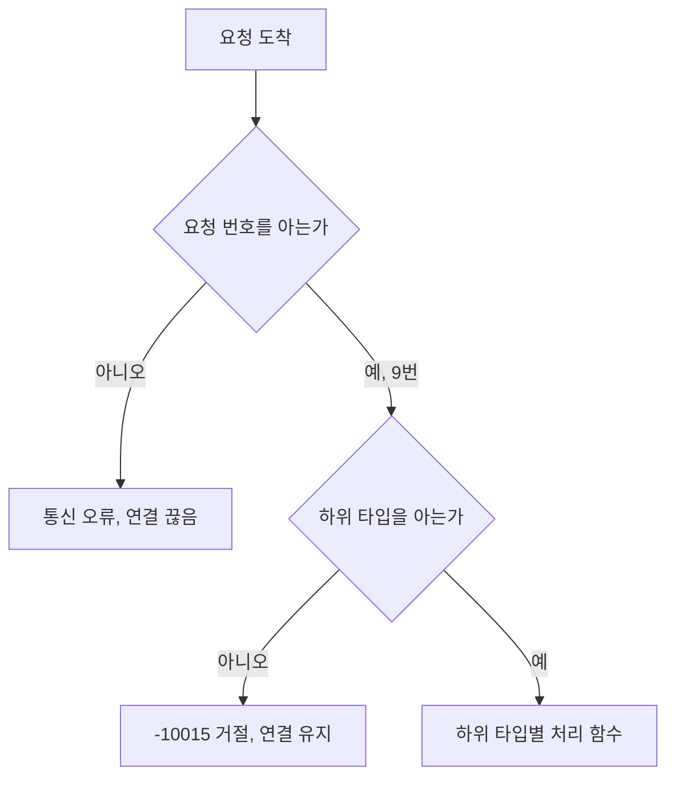
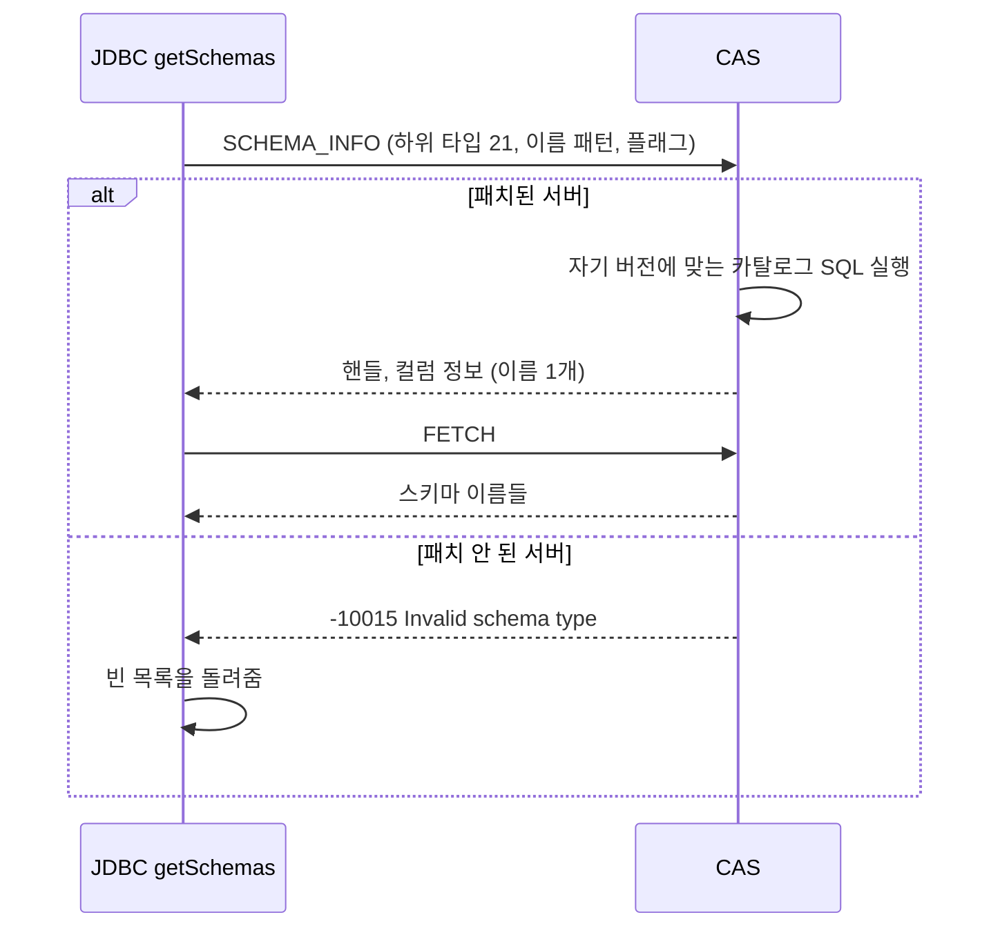

# APIS-1116 스키마 목록: CAS 스키마 정보 요청에 하위 타입을 추가하는 방식

- 분류: analysis
- 날짜: 2026-09-28
- 관련: APIS-1116, CBRD-24835, CBRD-26544, [SQL 방식 분석](2026-09-28-apis1116-schema-list-by-sql.md), [CAS 요청 번호와 하위 타입](../study/2026-09-28-cas-protocol-version-features.md)

## 요약

스키마 정보 요청(9번)에 하위 타입 21번을 추가하면 프로토콜 번호를 올리지 않고 11.2 ~ 11.4에 백포트할 수 있고, 드라이버는 21번을 보내 보고 -10015가 오면 미지원으로 보면 된다. 다만 CAS가 하위 타입 번호를 배열 칸 번호로 쓰기 때문에 브랜치마다 손댈 곳을 빠뜨리면 안 되고, 11.3/11.4에는 함께 고쳐야 할 결함이 하나 있다.

## 목적

드라이버가 SQL을 만들지 않고, 서버(CAS)가 스키마 목록을 돌려주게 하는 설계를 정리한다. 요청 모양, 옛 서버와의 호환, 지원 여부 판단, 브랜치별 구현 위치와 위험, 배포 방법을 코드와 실측으로 확인한다.

## 배경

[SQL 방식](2026-09-28-apis1116-schema-list-by-sql.md)은 서버 패치 없이 동작하지만, 서버 버전마다 어떤 카탈로그를 읽을지를 드라이버가 알아야 한다. 11.5에서 `db_user`의 의미가 바뀌자 드라이버도 따라 바뀌어야 했다.

이 방식은 그 지식을 서버로 옮긴다. 드라이버는 "스키마 목록을 달라"는 요청만 보내고, 각 CAS가 자기 버전에 맞는 카탈로그를 읽는다. 대신 서버를 고쳐야 하므로 이미 나간 11.2 ~ 11.4는 패치 릴리스가 필요하다.

## 범위 / 방법

- 엔진: `CUBRID/cubrid` develop(2026-09-18, `5d8fc7bd5`)과 release/11.2, 11.3, 11.4 브랜치의 `src/broker`
- 드라이버: `CUBRID/cubrid-jdbc` develop
- 방법
  - CAS 코드 분석: 요청 처리, 하위 타입 분기, FETCH, 핸들 정리, 로그, CGW 빌드 분기
  - 실측: 11.4.6과 develop nightly(11.5.0.2608)에 모르는 요청 번호(45)와 모르는 하위 타입(21)을 트랜잭션 도중 보내 반응 확인
  - 전처리 조건 중첩을 풀어, 각 함수가 CGW 빌드에 들어가는지 판정

## 발견 / 관찰

### 1. 두 후보: 새 요청 번호 45번 vs 9번의 하위 타입 21번

요청은 요청 번호 1바이트 뒤에 인자를 차례로 싣는다. 인자마다 앞에 길이 4바이트가 붙는다. 9번 요청의 첫 인자가 "무엇을 조회할지"를 고르는 하위 타입이다.

```
[09] [길이][하위 타입] [길이][이름 패턴 1] [길이][이름 패턴 2] [길이][플래그] [길이][샤드 번호]
```

JDBC의 메타데이터 메서드는 모두 9번 요청의 하위 타입이다.

| JDBC 메서드 | 하위 타입 |
|---|---|
| getTables | 1 `CLASS` |
| getColumns | 4 `ATTRIBUTE` |
| getIndexInfo, getBestRowIdentifier | 11 `CONSTRAINT` (+4) |
| getTablePrivileges / getColumnPrivileges | 13 `CLASS_PRIVILEGE` / 14 `ATTR_PRIVILEGE` |
| getSuperTables | 15 `DIRECT_SUPER_CLASS` |
| getPrimaryKeys | 16 `PRIMARY_KEY` |
| getImportedKeys / getExportedKeys / getCrossReference | 17 / 18 / 19 |
| getSchemas (제안) | **21 (새로 추가)** |

옛 CAS는 요청을 두 단계로 거른다.



```c
/* cas.c process_request: release/11.2, 11.4, develop 동일 */
if (func_code <= 0 || func_code >= CAS_FC_MAX)
  {
    net_write_error (..., CAS_ERROR_INDICATOR, CAS_ER_COMMUNICATION, NULL);
    return FN_CLOSE_CONN;
  }
```

11.4.6에 트랜잭션 도중(끝내지 않은 INSERT가 있는 상태) 보낸 결과

| 보낸 것 | CAS의 답 | 연결 | 끝내지 않은 INSERT |
|---|---|---|---|
| 9번 + 하위 타입 21 | -10015 Invalid schema type | 유지 | 남음 (rows=1) |
| 요청 번호 45 | -10003 Communication error | 끊김, 드라이버가 새로 접속 | 사라짐 (rows=0) |

결정: 9번의 하위 타입 21번. 45번은 패치 안 된 서버에 보내면 사용자 트랜잭션이 사라지므로, 보내기 전에 지원 여부를 알 다른 신호가 필요해진다.

### 2. 프로토콜 번호를 올리지 않아도 되는 이유

- 프로토콜 번호는 옛 상대가 같은 바이트를 다르게 읽게 되는 변경이 있을 때 올렸다(타임아웃 단위, 연결 응답 크기, 응답 끝의 필드, 타입 바이트 수, id 폭). 자세한 정리는 [CAS 요청 번호와 하위 타입](../study/2026-09-28-cas-protocol-version-features.md)에 있다.
- 새 하위 타입은 요청과 응답 모양을 바꾸지 않는다.
- 선례: 11.3에서 하위 타입 20번(`ATTR_WITH_SYNONYM`, CBRD-24835)을 추가할 때 프로토콜 번호를 올리지 않았다.
- 패치 릴리스는 번호를 올릴 수도 없다. 11.2는 V11, 11.3과 11.4는 V12이고, V13은 11.5의 번호다.

### 3. 드라이버가 지원 여부를 판단하는 방법

| 방법 | 방식 | 판단 |
|---|---|---|
| **보내 보고 판단 (선택)** | 21번을 보내고, -10015가 오면 미지원으로 본다 | 엔진에 추가할 신호가 없다. 패치된 서버에서는 추가 왕복도 없다 |
| 기능 비트 | 접속 때 받는 브로커 정보 [5]의 비어 있는 비트(0x10)를 켠다 | 추가 왕복은 없지만, CCI 계열 드라이버와 함께 쓰는 남은 5자리 중 하나를 메타데이터 기능 하나에 영구히 쓴다 |
| 서버 버전 문자열 | 11.2.x / 11.3.x / 11.4.x의 패치 번호를 비교한다 | 브랜치마다 "몇 번 패치부터"를 드라이버가 알아야 한다 |

보내 보고 판단하는 방법이 안전한 근거

- 모르는 하위 타입을 받으면 release/11.2, 11.3, 11.4 모두 -10015로 거절하고, 먼저 잡은 서버 핸들을 풀어 준다(`hm_srv_handle_free`).
- 로그 이름을 찾는 `get_schema_type_str`은 범위를 검사해서, 범위 밖이면 빈 문자열을 돌려준다.
- 오류 때 올라가는 `errors_in_transaction`은 트랜잭션 끝의 SQL 로그 모드만 정한다. 롤백과는 관계없다.
- 실측(11.4.6, 11.5 nightly): 트랜잭션 도중 보내도 끝내지 않은 INSERT가 남았다. 이어서 2,000번 보내도 모두 -10015였고, CAS는 정상이었다.
- 브로커 SQL 로그에는 요청 한 건당 두 줄(`schema_info  NULL NULL 0`, `srv_h_id -1`)이 남는다.
- 드라이버에 이미 `UErrorCode.CAS_ER_SCHEMA_TYPE = -10015`가 있다. 이 코드는 "모르는 하위 타입" 한 가지만 뜻한다.



### 4. 하위 타입 21번 설계

| 항목 | 값 |
|---|---|
| 요청 | 9번 `SCHEMA_INFO` |
| 하위 타입 | 21 (상수 이름 미정, 예: `CCI_SCH_SCHEMA`) |
| 인자 1 | 스키마 이름 패턴 |
| 인자 2 | 쓰지 않음 (null) |
| 플래그 | 1(`CCI_CLASS_NAME_PATTERN_MATCH`)이면 인자 1을 LIKE 패턴으로 본다 |
| 결과 컬럼 | 스키마 이름 1개 |
| 정렬 | 이름 순 |

서버별로 CAS가 실행하는 SQL

| 서버 | SQL |
|---|---|
| 11.2 ~ 11.4 | `select name from db_user order by name` (패턴이면 `where name like ?`) |
| 11.5 | `select schema_name from information_schema.schemata order by schema_name` (패턴이면 `where schema_name like ?`) |

- 드라이버에서 쓰던 SQL을 CAS 안으로 옮긴 것이다. CAS는 접속한 사용자 권한으로 쿼리를 실행하므로 결과도 같다.
- 두 SQL의 결과 컬럼 이름이 다르므로(`name`, `schema_name`) 같은 별칭을 붙이는 편이 클라이언트에게 일관되다.

기존 하위 타입의 구현 방식 (release/11.2, 11.4, develop 동일)

| 방식 | 하위 타입 | 읽는 곳 |
|---|---|---|
| SQL (8개) | 1 `CLASS`, 2 `VCLASS` | `db_class` |
| | 3 `QUERY_SPEC` | `db_vclass` |
| | 4 `ATTRIBUTE`, 5 `CLASS_ATTRIBUTE` | `db_attribute`, `db_class` |
| | 15 `DIRECT_SUPER_CLASS` | `db_direct_super_class` |
| | 16 `PRIMARY_KEY` | `db_index`, `db_index_key` |
| | 20 `ATTR_WITH_SYNONYM` (11.3부터) | `db_synonym` 등 |
| 엔진 API (12개) | 6 ~ 8 메서드, 9 ~ 10 상속, 11 제약, 12 트리거, 13 ~ 14 권한, 17 ~ 19 외래 키 | `db_get_constraints` 같은 C 함수 |

21번은 SQL 방식을 따른다. 가장 가까운 본보기는 1번의 `sch_class_info`이고, 결과는 일반 쿼리 결과와 같은 `fetch_result`로 돌려준다.

### 5. CAS에서 고칠 곳 (세 브랜치 공통)

CAS는 하위 타입 번호를 배열 칸 번호로 그대로 쓴다. 번호 범위를 올리면서 칸 하나를 빠뜨리면 배열 밖을 읽는다.

| 위치 | 하는 일 | 21번 추가 때 할 일 | 빠뜨리면 |
|---|---|---|---|
| `broker_cas_cci.h` `CCI_SCH_LAST` | 범위 검사 기준 | 21로 올린다 | 21번이 계속 거절된다 |
| `cas_execute.c` `ux_schema_info` | 하위 타입별 분기 | `case 21` → 새 처리 함수 (SQL을 만들어 `sch_query_execute`) | 21번이 -10015로 거절된다 |
| `cas_execute.c` `fetch_func[]` (CUBRID 빌드용) | FETCH 처리 함수 표, 번호 = 칸 | 21번 칸에 `fetch_result` | 배열 밖 값을 함수로 호출해 CAS가 비정상 종료될 수 있다 |
| `cas_execute.c` `fetch_func[]` (CGW 빌드용) | 같은 표의 게이트웨이판 | 필수 아님. 칸을 맞추려면 20, 21번에 `fetch_not_supported` | 닿지 않는다. CGW는 9번 요청을 처리하지 않는다 (6절) |
| `cas_function.c` `schema_type_str[]` (develop은 `cas_util.c`) | 로그에 남길 이름, 번호 - 1 = 칸 | 21번 이름 | 로그를 쓸 때 배열 밖을 읽는다 |
| `cas_handle.c` `hm_srv_handle_qresult_end_all` | 커밋 때 SQL 방식 결과를 닫는 목록 | 21번 추가 | 커밋 뒤에도 결과가 남는다 |
| `cas_handle.c` `srv_handle_content_free` | 핸들을 없앨 때 결과와 문장을 해제하는 목록 | 21번 추가 | 정리가 빠진다 |

- "스키마 핸들인가"만 보는 검사(`schema_type >= CCI_SCH_FIRST`)는 손댈 필요가 없다.
- 선례인 CBRD-24835(20번 추가)는 `broker_cas_cci.h`, `cas_execute.c`, `cas_handle.c` 세 파일을 고쳤다. 로그 이름 배열은 고치지 않았다(6절).

### 6. 브랜치별 주의점

**11.2: 20번 칸을 비워 둬야 한다**

- 11.2의 목록은 19번(`CROSS_REFERENCE`)까지다. 21번을 쓰려면 목록에 번호를 명시하고(`= 21`), 20번은 건너뛴다.
- 배열 세 개(FETCH 표 두 개, 로그 이름 배열)에는 20번 자리도 채운다. FETCH 표에는 `fetch_not_supported`, 로그 이름 배열에는 빈 이름을 넣는다.
- 비워 둔 20번으로 요청이 오면 `ux_schema_info`에 `case`가 없어 -10015로 거절된다. 지금 11.2와 같은 동작이다.

**11.3/11.4: 로그 이름 배열에 이미 결함이 있다**

- 범위(`CCI_SCH_LAST`)는 20번까지인데, `schema_type_str[]`에는 이름이 19개뿐이다.
- 20번 요청이 오면 로그를 남길 때 배열 밖을 읽어 엉뚱한 문자열이 찍히고, 드물게 비정상 종료될 수 있다.
- develop은 CBRD-26544(2026-02-25)에서 이름 한 줄을 넣어 고쳤지만, 11.3/11.4 릴리스 브랜치에는 이 수정이 없다.
- develop에서는 배열이 `cas_util.c`로 옮겨져 있어 그대로 cherry-pick할 수 없다. 11.x의 `cas_function.c`에 같은 한 줄을 넣어야 한다.
- 이름 배열을 맞추면 로그 문자열이 바뀌는 것뿐이다. 브로커 로그 도구(`broker_log_converter`, `broker_log_replay`, `broker_log_top`)는 이 이름을 읽지 않는다.

**CGW: 영향 없음**

- CGW(게이트웨이) 빌드의 요청 처리 표(`server_fn_table`의 `CAS_FOR_CGW` 판)는 9번 요청을 `fn_not_supported`로 연결한다. 11.3, 11.4, develop 모두 같다.
- 그래서 CGW는 어떤 하위 타입이 와도 `CAS_ER_NOT_IMPLEMENTED`(-10100)로 답하고 연결을 유지한다. `ux_schema_info`와 처리 함수들이 CGW 빌드에도 컴파일되지만 실행되지 않는다.
- CGW용 FETCH 표는 11.3, 11.4, develop 모두 19번까지라 범위(20)보다 한 칸 짧다. 닿지 않는 코드라 동작 문제는 아니고, 칸을 맞추고 싶다면 20, 21번에 `fetch_not_supported`를 넣으면 된다.
- JDBC도 CGW에는 21번을 보내지 않는다(스키마 판정에서 CUBRID 서버만 통과).

### 7. 드라이버 변경

- `USchType`에 21번을 추가하고 `SCH_MAX`를 올린다. 드라이버는 보내기 전에 자기 쪽에서도 범위를 검사한다.
- getSchemas는 스키마 판정(V11 이상, CUBRID, 접속 강제, 실패 보고)을 통과하면 `getSchemaInfo(21, 패턴, null, 플래그)`를 보낸다.
- -10015가 오면 빈 목록을 돌려준다. 다른 오류는 지금처럼 예외로 던진다.
- SQL 방식에서 쓰던 SQL 상수와 V13 판정(`supportInformationSchema`)은 필요 없어진다.
- 결과 행을 읽는 부분은 다른 메타데이터 메서드와 같다.

### 8. 배포

엔진(CAS)

- release/11.2, 11.3, 11.4와 develop에 각각 넣는다. `release/11.4_hotfix`도 있어 포함 여부는 릴리스 담당과 정한다.
- 이미 설치된 서버는 그 패치 릴리스로 올려야 21번이 생긴다.
- 바뀌는 코드는 `src/broker`뿐이다. DB 서버, 데이터 파일, 카탈로그는 바뀌지 않아 DB 마이그레이션은 없다.

드라이버

- 드라이버 저장소는 develop 한 줄로 개발되고, 각 엔진 릴리스 브랜치는 그중 한 커밋을 서브모듈로 가리킨다.

| 엔진 릴리스 브랜치 | 싣고 있는 드라이버 (cubrid-jdbc develop의 커밋) |
|---|---|
| release/11.2, 11.3 | `47149374a` (2024-08) |
| release/11.4 | `ba59be0c6` (2025-04) |

- 드라이버 변경은 develop에만 넣으면 된다.
- 11.2 ~ 11.4 패치 패키지에 새 드라이버를 싣으려면 릴리스 브랜치의 서브모듈을 올려야 한다. 그러면 중간에 쌓인 드라이버 변경도 함께 들어간다(11.2, 11.3은 43개, 11.4는 33개 커밋).
- 싣지 않아도 사용자가 새 드라이버 jar를 쓰면 된다. 새 드라이버는 10.2 이상 서버를 모두 지원한다.

조합별 동작 (어느 쪽이 먼저 나가도 깨지는 조합이 없다)

| 서버 \ 드라이버 | 옛 드라이버 | 새 드라이버 |
|---|---|---|
| 패치 전 11.2 ~ 11.4 | 빈 목록 (지금과 같음) | 빈 목록 (-10015, 연결과 트랜잭션 유지) |
| 패치된 11.2 ~ 11.4, 11.5 | 빈 목록 (21번을 보내지 않음) | 스키마 목록 |

### 9. SQL 방식과 비교해 그대로 남는 것

- 11.5의 schemata 결함(재부여 시 소유자 대신 부여자)과 일반 사용자의 조회 비용은 CAS가 같은 쿼리를 실행하므로 그대로다. 엔진 쪽 수정이 필요하다.
- PUBLIC의 `db_user` 조회 권한을 회수한 경우의 권한 오류도 같다. CAS가 접속한 사용자 권한으로 실행하기 때문이다.
- 네트워크 왕복은 요청과 FETCH로 2회다. SQL 방식(PREPARE, EXECUTE)과 같다.

## 결론

스키마 목록은 기존 스키마 정보 요청(9번)의 하위 타입 21번으로 추가하는 것이 맞다. 옛 서버는 모르는 하위 타입을 오류로 거절할 뿐 연결을 유지하므로, 드라이버는 보내 보고 판단할 수 있다. 프로토콜 번호나 기능 비트 같은 새 신호도 필요 없다.

위험은 모두 CAS의 배열 칸을 빠뜨리는 종류라서, 5절 표를 브랜치별 체크리스트로 쓰면 막을 수 있다. 11.3/11.4의 로그 이름 배열에는 이미 결함이 있으니, 이번 백포트에서 함께 고친다. CGW는 스키마 정보 요청을 처리하지 않아 영향이 없다.

## 다음 단계

- 엔진 이슈를 만든다: 하위 타입 21 추가(develop, 11.2, 11.3, 11.4), 11.3/11.4의 로그 이름 배열 수정 포함
- 하위 타입 상수 이름을 정한다
- `release/11.4_hotfix` 포함 여부와, 패치 패키지에 새 드라이버를 실을지 정한다
- CCI(`cubrid-cci`)에도 같은 목록이 있다. CCI 계열 드라이버가 21번을 쓰게 할지는 별도로 정한다
- 검증: 패치한 각 서버에 하위 타입 1 ~ 22를 한 번씩 보내, 거절과 결과가 기대대로이고 CAS가 정상인지 확인한다
- 드라이버: APIS-1116 브랜치의 SQL 조회를 하위 타입 21 요청으로 바꾸고, TC는 서버 패치 전후 두 경우를 모두 다룬다

## 참고

- 엔진: [`src/broker/cas.c`](https://github.com/CUBRID/cubrid/blob/develop/src/broker/cas.c) (`process_request`), [`cas_execute.c`](https://github.com/CUBRID/cubrid/blob/develop/src/broker/cas_execute.c) (`ux_schema_info`, `fetch_func`, `sch_class_info`), [`cas_handle.c`](https://github.com/CUBRID/cubrid/blob/develop/src/broker/cas_handle.c), [`cas_function.c`](https://github.com/CUBRID/cubrid/blob/develop/src/broker/cas_function.c), [`broker_cas_cci.h`](https://github.com/CUBRID/cubrid/blob/develop/src/broker/broker_cas_cci.h)
- 드라이버: [`UConnection.java`](https://github.com/CUBRID/cubrid-jdbc/blob/develop/src/jdbc/cubrid/jdbc/jci/UConnection.java) (`getSchemaInfo`), [`USchType.java`](https://github.com/CUBRID/cubrid-jdbc/blob/develop/src/jdbc/cubrid/jdbc/jci/USchType.java), [`UErrorCode.java`](https://github.com/CUBRID/cubrid-jdbc/blob/develop/src/jdbc/cubrid/jdbc/jci/UErrorCode.java)
- 이슈: CBRD-24835 (하위 타입 20 추가), CBRD-26544 (develop의 로그 이름 배열 수정)
- 관련 노트: [SQL 방식 분석](2026-09-28-apis1116-schema-list-by-sql.md), [CAS 요청 번호와 하위 타입](../study/2026-09-28-cas-protocol-version-features.md)
