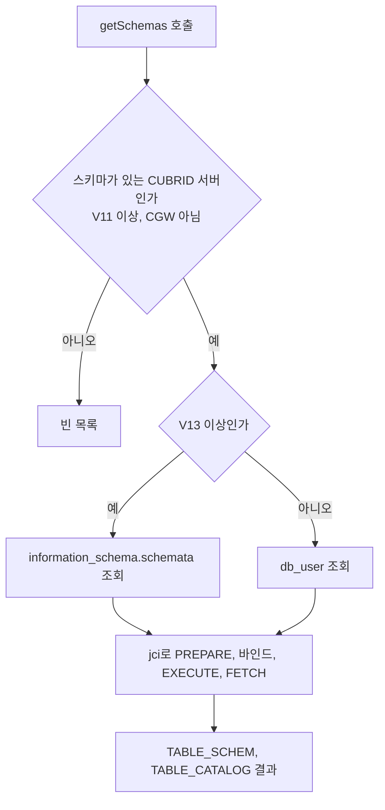

# APIS-1116 스키마 목록: 드라이버가 SQL로 조회하는 방식

- 분류: analysis
- 날짜: 2026-09-28
- 관련: APIS-1116, CBRD-25862, CBRD-25863, [프로토콜 방식 분석](2026-09-28-apis1116-schema-list-by-protocol.md), [CAS 요청 번호와 하위 타입](../study/2026-09-28-cas-protocol-version-features.md)

## 요약

드라이버가 jci로 `db_user`(11.2 ~ 11.4)와 `information_schema.schemata`(11.5)를 직접 조회하면 서버를 패치하지 않고도 이미 나간 11.2 ~ 11.4에서 스키마 목록을 줄 수 있지만, 카탈로그의 의미가 바뀌면 드라이버를 고쳐야 하고 그 일이 11.5에서 실제로 일어났다.

## 목적

`DatabaseMetaData.getSchemas()`가 스키마 목록을 드라이버의 SQL로 구하는 방식의 설계, 근거, 버전별 동작, 한계를 정리한다. 같은 문제를 CAS 프로토콜로 푸는 방식([프로토콜 방식 분석](2026-09-28-apis1116-schema-list-by-protocol.md))과 비교할 기준으로 쓴다.

## 배경

CUBRID는 11.2부터 `schema.table` 형태를 지원하고, 스키마는 곧 사용자다. 그런데 드라이버는 getTables에서 테이블마다 소속 스키마(`TABLE_SCHEM`)를 알려 주면서, getSchemas()는 서버와 상관없이 0행을 돌려주고 있었다. 같은 서버에 대해 "테이블은 SALES 스키마에 있다"와 "스키마는 하나도 없다"를 동시에 답하는 상태다.

CAS에는 스키마(사용자) 목록을 주는 요청이 없다. 스키마 정보 요청(9번)의 하위 타입 20개는 모두 스키마 **안의** 객체(테이블, 컬럼, 키, 권한 등)를 다룬다. 그래서 첫 안은 드라이버가 사용자 카탈로그를 SQL로 직접 조회하는 것이었다.

## 범위 / 방법

- 대상: `CUBRID/cubrid-jdbc` develop(`6b4386b`) 위의 작업 브랜치, 테스트는 `cubrid-testcases-private`의 JDBC 시나리오
- 서버: 11.4.6, 11.3, 11.5 develop nightly(11.5.0.2608), CTP의 11.4 이미지
- 비교 대상: PostgreSQL 17, MySQL 8.4, MariaDB 11.4, SQL Server 2022, Oracle 23 Free와 각 JDBC 드라이버
- 방법: 드라이버와 CAS 코드 분석, 사용자와 권한 조합별 실측, 성능 측정, 프로토콜 번호를 흉내 내는 프록시로 V13 경로 검증, TC와 CTP 회귀 비교

## 발견 / 관찰

### 1. 구현 개요



버전별 SQL

| 서버 | 전체 조회 | schemaPattern 지정 |
|---|---|---|
| 11.2 ~ 11.4 (V11, V12) | `select name from db_user order by name` | `select name from db_user where name like ? order by name` |
| 11.5 (V13) | `select schema_name from information_schema.schemata order by schema_name` | `select schema_name from information_schema.schemata where schema_name like ? order by schema_name` |
| 11.0 이하, CGW | 조회하지 않음 (빈 목록) | 조회하지 않음 (빈 목록) |

- 결과 컬럼은 JDBC 규격대로 `TABLE_SCHEM`, `TABLE_CATALOG` 두 개다. CUBRID에는 카탈로그가 없어 `TABLE_CATALOG`는 null이다.
- 결과는 스키마 이름 순이다.
- `getSchemas()`와 `getSchemas(catalog, schemaPattern)`은 같은 목록을 돌려준다. 수정 전에는 앞의 것이 0행, 뒤의 것이 예외였다.

SQL을 고르는 부분(드라이버)

```java
String query;
if (u_con.supportInformationSchema()) {
    query = schemaPattern == null ? SCHEMATA_QUERY : SCHEMATA_QUERY_LIKE;
} else {
    query = schemaPattern == null ? DB_USER_QUERY : DB_USER_QUERY_LIKE;
}
us = u_con.prepare(query, (byte) 0);
```

### 2. 연결의 PreparedStatement가 아니라 jci로 보내는 이유

- 연결에서 얻은 `PreparedStatement`는 호출자의 문장으로 연결에 등록된다.
- 그 문장을 닫으면 자동 커밋 모드에서 커밋이 일어난다.
- 그 커밋이 호출자가 `CLOSE_CURSORS_AT_COMMIT`로 열어 둔 커서를 닫는다. 호출자는 getSchemas를 불렀을 뿐인데 자기 결과셋이 닫힌다.
- 그래서 형제 메타데이터 메서드(getTables 등)처럼 jci(`u_con.prepare`)로 보낸다. TC `testSchemaListLeavesTheCallersCursorOpen`이 "getSchemas도 getTables처럼 호출자의 커서를 닫지 않는다"를 고정한다.
- `PREPARE_AND_EXECUTE`(41번 요청)로 한 번에 보내는 방법은 바인드 값을 실을 수 없어 LIKE 패턴에 쓸 수 없다.
- 네트워크 왕복은 늘지 않는다. PREPARE와 EXECUTE로 2회이고, 기존 스키마 정보 요청도 요청과 FETCH로 2회다.

### 3. 버전 판정

| 판정 | 조건 | 이유 |
|---|---|---|
| 스키마 지원 (`supportSchema()`) | 프로토콜 V11 이상, CUBRID 서버 | V11이 곧 11.2다. CGW는 V12 이상이어도 대상 DB가 CUBRID가 아니다 |
| schemata 사용 (`supportInformationSchema()`) | 위 조건 + V13 이상 | 11.5가 V13이고, information_schema가 처음 생긴 버전이다 |

- 판정에 쓰는 번호는 브로커가 접속할 때 알려 준 값이다. 드라이버 자신이 선언하는 번호(V12)를 올리지 않아도 11.5를 알아본다.
- 접속을 미뤄 둔 연결(XA, URL 없는 DataSource, `useLazyConnection=true`)은 번호가 0이다. 판정 안에서 먼저 접속한다. 번호만 읽으면 11.4를 "스키마 없는 서버"로 답했다가 첫 쿼리 뒤에 답이 바뀐다.
- 접속에 실패하면 "스키마 없음"으로 답하지 않고 예외를 던진다.
- 2026-09-23 기준 develop nightly(11.5.0.2608)는 아직 V12를 보낸다. 그래서 V13 분기는 실제 서버로 확인할 수 없어 프록시로 검증했다(6절).

### 4. SQL을 택했던 근거

- CAS에 스키마 목록을 주는 요청이 없다.
- 새 요청을 만들어도 이미 나가 있는 10.2 ~ 11.4 서버에서는 동작하지 않는다. 서버 패치가 필요하다.
- `db_user`는 10.2 ~ 11.4에서 컬럼 8개와 `name` 타입이 같다.
- CAS의 스키마 정보 요청도 속에서 SQL을 쓴다. develop 기준 하위 타입 20개 중 8개가 카탈로그 뷰에 SQL을 실행한다(`sch_class_info`는 `db_class`를 조회).
- 다른 드라이버도 서버가 주는 목록 하나를 그대로 읽는다.

| 드라이버 | getSchemas가 읽는 것 |
|---|---|
| Oracle ojdbc8 21.9 | `ALL_USERS` |
| PostgreSQL pgjdbc 42.7.13 | `pg_catalog.pg_namespace` |
| MySQL Connector/J 9.7 | `SHOW DATABASES` 또는 `INFORMATION_SCHEMA.SCHEMATA` (기본 설정에서는 스키마를 쓰지 않아 빈 목록) |
| MariaDB Connector/J 3.4 | `information_schema.SCHEMATA` |
| SQL Server mssql-jdbc 9.4 | `sys.schemas` |

Oracle 드라이버의 SQL이 이 방식과 거의 같다.

```sql
-- Oracle ojdbc8
SELECT username AS table_schem, null as table_catalog FROM all_users WHERE username LIKE ? ORDER BY table_schem
-- CUBRID (이 방식, 11.2 ~ 11.4)
select name from db_user where name like ? order by name
```

### 5. 권한 (11.2 ~ 11.4)

- `db_user`는 일반 클래스이고 PUBLIC에 SELECT가 부여돼 있다. 모든 사용자는 PUBLIC 소속이라 누구나 전체 사용자 목록을 본다.
- 따라서 일반 사용자도 모든 스키마를 받는다. Oracle의 `ALL_USERS`와 같은 결과다.
- JDBC 규격의 getSchemas는 "available in this database" 스키마를 돌려주라고 한다. 전체 목록도 이 뜻에 맞는다.
- PUBLIC의 `db_user` 조회 권한을 회수하면 getSchemas만 권한 오류(-494)로 실패하고, getTables는 그대로 동작한다(11.3 실측). 기본 설정에서는 생기지 않는 경우다.

### 6. 11.5에서 생긴 문제

`db_user`가 가상 클래스로 바뀌었다(CBRD-25862). DBA가 아닌 사용자에게는 자기 자신과 소속 그룹만 보인다. 11.4까지처럼 `db_user`를 읽으면 권한을 받은 테이블의 스키마가 목록에서 빠져 모순이 다시 생긴다.

대신 11.5에는 `information_schema.schemata`(CBRD-25863)가 있다. 사용자가 볼 수 있는 스키마를 서버가 계산해 주는 뷰다. 그런데 권한을 재부여한 경우 소유자 대신 재부여한 사용자가 나온다.

재부여 시나리오(11.5.0.2608 실측): `sales.orders`의 조회 권한을 소유자가 mgr에게 재부여 가능하게 주고, mgr이 kim에게 준다. 대조군 kim2는 소유자에게 직접 받는다.

| 사용자 | 권한을 준 사람 | `db_user` | `information_schema.schemata` |
|---|---|---|---|
| dba | - | 7개 전부 | 7개 전부 |
| kim2 | SALES (소유자) | KIM2, PUBLIC | DBA, INFORMATION_SCHEMA, KIM2, PUBLIC, **SALES** |
| kim | MGR (재부여) | KIM, PUBLIC | DBA, INFORMATION_SCHEMA, KIM, **MGR**, PUBLIC |

- 다섯 DB(PostgreSQL, MySQL, MariaDB, SQL Server, Oracle)는 같은 재부여 시나리오에서 모두 소유 스키마(sales)를 보여 준다.
- 소유자 기준이 맞는 동작이고, 현재 schemata 동작은 결함으로 보고 엔진에서 수정할 예정이다.
- 성능: 사용자 513명, 테이블 5,001개, 권한 5,003건에서 일반 사용자가 schemata를 읽으면 228 ms, `db_user`는 3 ms였다. 권한을 지우면 37 ms로 줄어, 권한이 많을수록 느려진다.

검토했다가 버린 대안

| 대안 | 결과 | 버린 이유 |
|---|---|---|
| `db_user` ∪ `db_class`의 소유자 | 재부여까지 맞게 나옴, 36 ~ 41 ms (getTables 수준) | 누가 무엇을 볼 수 있는지를 드라이버가 계산하게 된다. 다른 드라이버 중 이렇게 하는 곳이 없다 |
| 모든 버전에 schemata | 11.4에는 information_schema가 없다 (`Unknown class "information_schema.schemata"`) | 불가 |

결정: V13 이상에서만 schemata를 읽는다.

### 7. 검증

- **TC**: `TestSchemaMetaDataMatchesServer` 15건. 값을 적어 두지 않고 서버와, 또는 서로 맞아야 하는 다른 답과 대조한다. 그래서 스키마가 있는 서버와 없는 서버 모두에서 같은 TC가 맞다.

| 확인하는 것 | 대표 TC |
|---|---|
| 스키마 관련 5개 지원 여부가 서로 같다 | `testTheFiveSchemaAnswersAgree` |
| 각 답이 서버 실제 동작과 맞다 | `testDataManipulationAnswerMatchesServer` 등 3건 |
| getTables가 말한 스키마는 getSchemas에 있다 | `testEverySchemaGetTablesNamesIsListed` |
| 결과 컬럼, 정렬, 두 오버로드, 패턴 | 4건 |
| 이름 길이 한도가 서버와 맞다 | 2건 |
| 첫 쿼리 전에 물어도 답이 같다 (접속을 미룬 연결) | `testAnswersDoNotWaitForTheFirstStatement` |
| 접속 실패는 예외로 보고한다 | `testUnreachableServerIsReportedNotAnswered` |
| 호출자의 커서를 닫지 않는다 | `testSchemaListLeavesTheCallersCursorOpen` |

- **TC가 실제로 코드를 지키는지**: 접속을 강제하는 코드를 지우거나 답을 접속 전에 계산하도록 바꾼 변형 드라이버로 돌려, 해당 TC가 실패하는 것을 확인했다.
- **V13 경로**: 브로커 응답의 프로토콜 번호 1바이트만 12에서 13으로 바꾸는 프록시를 nightly 앞에 두고 확인했다. kim2에게 SALES가 나오고, kim에게는 MGR이 나오며(엔진 결함), DBA는 7개로 같다.
- **CTP**: upstream develop 기준 2,528건 중 10건 실패, 이 방식 2,543건 중 10건 실패. 늘어난 15건은 새 TC이고 실패 목록은 같다.

### 8. 장단점

| 장점 | 단점 |
|---|---|
| 서버를 패치하지 않아도 이미 나간 11.2 ~ 11.4에서 목록이 나온다 | 카탈로그의 의미가 바뀌면 드라이버를 고쳐야 한다. 11.5에서 실제로 일어났다 |
| 드라이버만 배포하면 된다 | 서버 버전마다 어떤 카탈로그를 읽을지를 드라이버가 알아야 한다 |
| 네트워크 왕복이 기존 메타데이터와 같다 | 11.5 분기가 프로토콜 번호 V13에 기댄다. develop에는 아직 V13이 없다 |
| 다른 드라이버와 같은 구조다 | JDBC만 혜택을 본다. CCI 계열 드라이버는 따로 구현해야 한다 |
| | 11.5의 schemata 결함과 성능 문제를 그대로 물려받는다 |

## 결론

SQL 방식은 서버 패치 없이 동작한다는 점이 가장 크다. 대신 스키마 목록의 의미를 정하는 카탈로그를 드라이버가 버전별로 알아야 해서, 11.5처럼 카탈로그가 바뀌면 드라이버도 따라 바뀌어야 한다.

11.5 대응(V13부터 schemata)까지 구현과 검증은 끝났다. 다만 서버가 자기 카탈로그를 알고 드라이버는 요청만 보내는 구조로 가는 편이 이 약점을 없앤다. 그 방식은 [프로토콜 방식 분석](2026-09-28-apis1116-schema-list-by-protocol.md)에 정리했다.

## 다음 단계

- 프로토콜 방식으로 전환할지 결정한다. 전환하면 이 방식의 SQL 조회 부분은 걷어 내고, 스키마 판정(V11, CUBRID, 접속 강제, 실패 보고)은 그대로 쓴다
- 11.5의 schemata 결함 수정과 성능은 어느 방식을 택해도 엔진 쪽 과제로 남는다
- 일반 사용자와 재부여를 다루는 TC는 develop이 V13과 schemata 수정을 받은 뒤 추가한다

## 참고

- 드라이버: [`CUBRIDDatabaseMetaData.java`](https://github.com/CUBRID/cubrid-jdbc/blob/develop/src/jdbc/cubrid/jdbc/driver/CUBRIDDatabaseMetaData.java), [`UConnection.java`](https://github.com/CUBRID/cubrid-jdbc/blob/develop/src/jdbc/cubrid/jdbc/jci/UConnection.java)
- 엔진: CBRD-25862 (`db_user` 가상 클래스), CBRD-25863 (`information_schema` 뷰)
- JDBC 규격: `java.sql.DatabaseMetaData.getSchemas`
- 관련 노트: [프로토콜 방식 분석](2026-09-28-apis1116-schema-list-by-protocol.md), [CAS 요청 번호와 하위 타입](../study/2026-09-28-cas-protocol-version-features.md), [CAS 프로토콜 버전과 릴리스 대응표](../study/2026-09-15-cas-protocol-version-releases.md)
