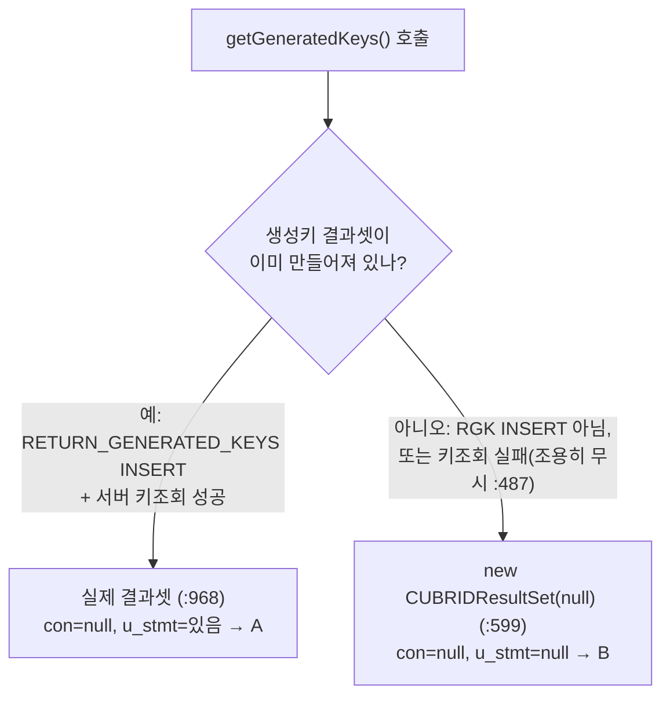

# CUBRID JDBC — con 없이 생성되는 ResultSet의 createCUBRIDException NullPointerException

- 분류: bug
- 날짜: 2026-07-11
- 관련: Hibernate ORM CUBRID CI 잔여 실패 분석, JDBC 드라이버 수정 트랙
- 정정: 초판은 원인을 `close()`로 봤으나, 코드 재검증 결과 **생성자**가 원인임(아래).

## 요약
저수준 `UStatement`만으로 만드는 일부 `CUBRIDResultSet`(generated-keys·OUT·OID)은 **`con`(연결)이 null인 채로 태어난다.** `con`은 오류를 `SQLException`으로 만드는 도구라, 그 ResultSet에서 오류를 알려야 하는 순간 **`SQLException` 대신 `NullPointerException`**이 난다. → **생성자에 연결을 넘겨 `con`을 채우면** 해결된다.

## 목적
가장 많이 발생하던 CI 실패(`createCUBRIDException` NPE)의 원인을 드라이버 소스로 규명하고, 방언·테스트가 아닌 드라이버 수정으로 가는 근본 해결책을 정리한다.

## 배경
- Hibernate를 CUBRID에서 돌릴 때 잔여 실패의 최대 군집이 이 NPE.
- 증상: `Cannot invoke "...CUBRIDConnection.createCUBRIDException(...)" because ... is null`.
- 버전/실행마다 걸리는 테스트가 달라 "타이밍 결함"으로 의심됐으나, 실제 원인은 아래 구조적 문제였다.

## 범위·방법
- 드라이버 소스(`CUBRIDResultSet`, `CUBRIDStatement`, `CUBRIDOutResultSet`, `CUBRIDOIDImpl`, `UStatement`)를 라인 단위로 추적.
- `con`/`u_stmt` 대입 지점, `con` 역참조 지점, `getGeneratedKeys` 생성 경로를 대조.

## 발견·관찰

### (1) con이 하는 일
`CUBRIDResultSet`은 오류를 이렇게 만든다:
```java
throw con.createCUBRIDException(...);   // 오류를 SQLException으로 만들어 던짐
```
즉 **`con`은 "오류(SQLException)를 만드는 도구"**다. `con`이 null이면 이 코드 자체가 NPE를 낸다. (checkIsOpen `:1630`, checkColumnIsValid `:1666`, checkRowIsValidForGet `:1654`, findColumn `:713` 등 여러 곳)

### (2) 생성자가 둘인데, 하나는 con을 안 채운다
| 생성자 | con | u_stmt | 쓰임 |
|---|---|---|---|
| 5-arg `(CUBRIDConnection, CUBRIDStatement, …)` `:108` | 실제 연결 (`:111`) | 있음 | 일반 `executeQuery()` 결과 (`CUBRIDStatement:341`) |
| 1-arg `(UStatement s)` `:158` | **null** (`:159`) | `s` (`:161`) | generated-keys · OUT · OID |

→ 일반 쿼리 결과셋은 con이 있어 **문제없음**. **1-arg로 만든 것만 con=null**이라 문제가 된다.

### (3) 왜 1-arg 생성자가 있나
일반 쿼리 실행 결과가 아니라, **따로 얻은 저수준 `UStatement`를 ResultSet으로 감싸야 하는 경우**를 위해서다(넘길 `CUBRIDStatement`가 없음). 사용처 3종:
- `getGeneratedKeys()` (`CUBRIDStatement:599`, `:968`)
- OUT 파라미터 `CUBRIDOutResultSet` (`super(null)` `:50`)
- OID `CUBRIDOIDImpl.getValues()` (`:86`)

### (4) 두 증상 A · B — 같은 뿌리
| | null인 필드 | 언제 | 결과 |
|---|---|---|---|
| **A** | `con` | 1-arg로 만든 **모든** ResultSet | 오류를 SQLException으로 **못 만듦** → NPE. **정상 사용에서도 발생** |
| **B** | `con` **+ `u_stmt`** | `getGeneratedKeys()`가 빈 placeholder `new CUBRIDResultSet(null)`(`:599`)를 만든 경우 | 오류도 못 만들고 `u_stmt`로 **데이터·메타도 못 읽음**(`getMetaData:684`) → NPE |

`getGeneratedKeys()`가 A(정상 결과셋)를 주는지 B(빈 placeholder)를 주는지:



### (5) 재현 (요지)
일반 `select 1` 결과셋으로는 재현되지 않는다(그건 con이 있음). generated-keys 결과셋에서 오류/검증 분기를 밟으면 발생:
```java
PreparedStatement ps = c.prepareStatement(
        "INSERT INTO t(v) VALUES ('a')", Statement.RETURN_GENERATED_KEYS);
ps.executeUpdate();
ResultSet gk = ps.getGeneratedKeys();   // con = null
gk.getInt(1);   // 오류를 SQLException으로 알리려는 지점에서 con=null → NPE (A)
```

## 결론
- 근본 원인: **1-arg 생성자 `CUBRIDResultSet(UStatement)`가 `con`(그리고 B에서는 `u_stmt`)을 채우지 않은 채 ResultSet을 만든다.** 공유 접근자·가드가 이를 방어 없이 역참조해 NPE가 난다.
- `close()`는 원인이 아니다(초판 정정).
- 방언(CUBRIDDialect)·테스트로는 못 고친다. **드라이버 수정 사안.**

## 다음 단계
드라이버 수정 이슈로 등록. 근본 해결:
1. **1-arg 생성자에 `CUBRIDConnection` 파라미터 추가 → 4곳에서 이미 가용한 연결을 전달** (getGeneratedKeys = `CUBRIDStatement.con:59`, OUT = `ucon.getCUBRIDConnection():1731`, OID = `cur_con:55`). → 모든 `con` NPE가 정상 `SQLException`으로 바뀜. 가드를 하나하나 고칠 필요 없음.
2. **B 추가 처리**: con을 채워도 `u_stmt`는 그대로 null이므로, `:599`가 `u_stmt=null`짜리 대신 **제대로 된 빈 ResultSet**을 반환하게 별도 수정.

> 코드로 확정할 수 없는 것(추측하지 않음): 위 경로들이 실제 애플리케이션/CI에서 얼마나 자주 발생하는지는 런타임 조건이라 소스만으로는 알 수 없다.

## 참고
- 소스(라인 확정): `CUBRIDResultSet` 생성자 `:108`/`:158`(`con` `:111`/`:159`, `u_stmt` `:161`); `con.createCUBRIDException` 지점 `:1630`/`:1654`/`:1666`/`:713`; `getMetaData` `:684`; 일반 결과셋 `CUBRIDStatement:341`.
- `CUBRIDStatement.getGeneratedKeys` `:595`(`:599`), `MakeAutoGeneratedKeysResultSet` `:950`(조건 `:480`/`:485`, 조기 return `:959`, 반환값 무시 `:487`, 리셋 `:945`); `UStatement.getGeneratedKeys` `:1976`(false 조건 `:1978`/`:2004`/`:2009`).
- `CUBRIDOutResultSet:50`(`super(null)`); `CUBRIDOIDImpl:86`(`getValues`).
- 드라이버 내부 동작은 매뉴얼이 아니라 소스로 확정(cubrid-manual은 엔진 SQL/함수/예약어용).
