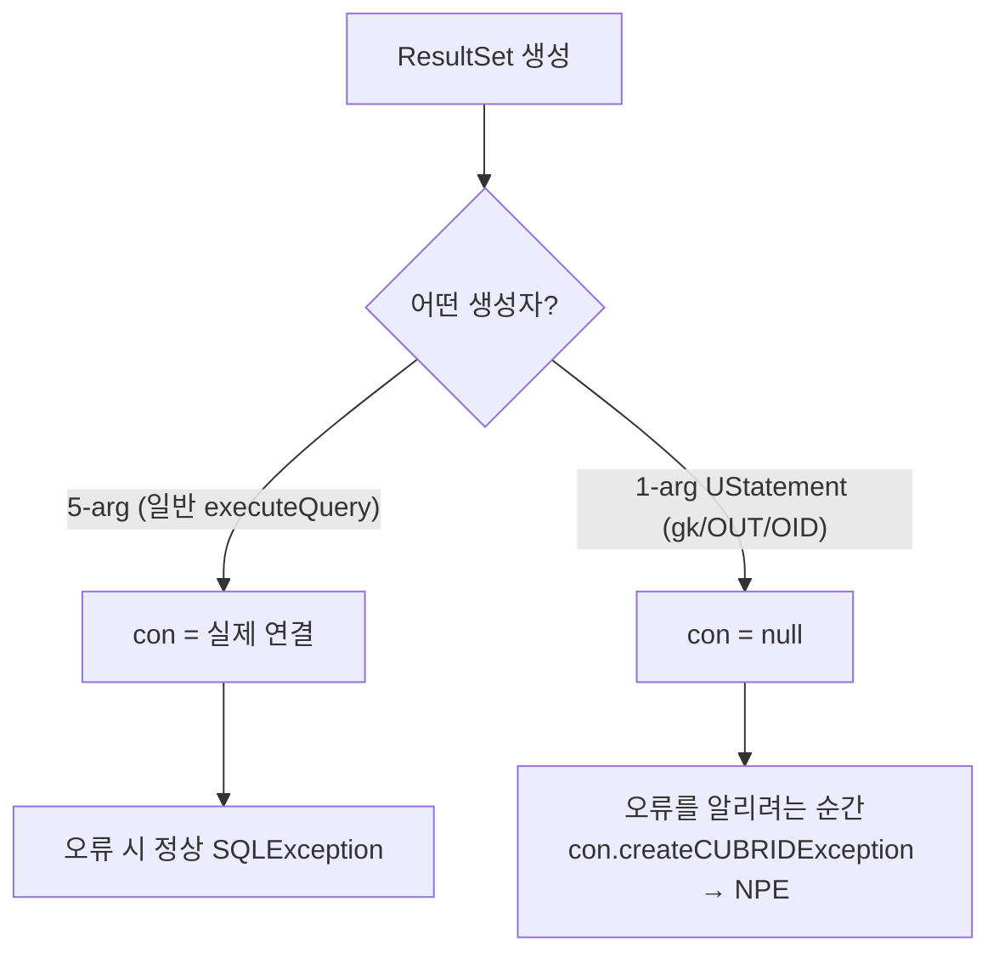

# CUBRID JDBC — con 없이 생성되는 ResultSet의 createCUBRIDException NullPointerException

- 분류: bug
- 날짜: 2026-07-11
- 관련: Hibernate ORM CUBRID CI 잔여 실패 분석, JDBC 드라이버 수정 트랙
- 정정: 초판은 원인을 `close()`로 봤으나 코드 재검증 결과 **생성자**가 원인. 별개 문제인 getGeneratedKeys 빈 결과셋(`u_stmt=null`)은 [별도 문서](2026-07-12-getgeneratedkeys-empty-resultset.md)로 분리.

## 요약
저수준 `UStatement`만으로 만드는 일부 `CUBRIDResultSet`(generated-keys·OUT·OID)은 **`con`(연결)이 null인 채로 태어난다.** `con`은 오류를 `SQLException`으로 만드는 도구라, 그 ResultSet에서 오류를 알려야 하는 순간 **`SQLException` 대신 `NullPointerException`**이 난다. → **생성자에 연결을 넘겨 `con`을 채우면** 해결.

## 목적
CI에서 가장 많던 `createCUBRIDException` NPE의 원인을 드라이버 소스로 규명하고, 방언·테스트가 아닌 드라이버 수정으로 가는 근본 해결책을 정리한다.

## 배경
- Hibernate를 CUBRID에서 돌릴 때 잔여 실패의 최대 군집이 이 NPE.
- 증상: `Cannot invoke "...CUBRIDConnection.createCUBRIDException(...)" because ... is null`.
- 버전/실행마다 걸리는 테스트가 달라 "타이밍 결함"으로 의심됐으나, 실제 원인은 아래 구조적 문제였다.

## 범위·방법
- 드라이버 소스(`CUBRIDResultSet`, `CUBRIDStatement`, `CUBRIDOutResultSet`, `CUBRIDOIDImpl`)를 라인 단위로 추적.
- `con` 대입 지점과 `con` 역참조 지점, 각 ResultSet의 생성 경로를 대조.

## 발견·관찰

### (1) con이 하는 일 — 오류를 만드는 도구
`CUBRIDResultSet`은 오류를 이렇게 만든다:
```java
throw con.createCUBRIDException(...);   // 오류를 SQLException으로 만들어 던짐
```
즉 **`con`은 "오류(SQLException)를 만드는 도구"**다. `con`이 null이면 이 코드 자체가 NPE를 낸다. (checkIsOpen `:1630`, checkColumnIsValid `:1666`, checkRowIsValidForGet `:1654`, findColumn `:713` 등 여러 곳)

### (2) 생성자가 둘인데, 하나는 con을 안 채운다
| 생성자 | con | 쓰임 |
|---|---|---|
| 5-arg `(CUBRIDConnection, CUBRIDStatement, …)` `:108` | 실제 연결 (`:111`) | 일반 `executeQuery()` 결과 (`CUBRIDStatement:341`) |
| 1-arg `(UStatement s)` `:158` | **null** (`:159`) | generated-keys · OUT · OID |

→ 일반 쿼리 결과셋은 con이 있어 **문제없음**. **1-arg로 만든 것만 con=null**이라 문제가 된다.

### (3) 왜 1-arg 생성자가 따로 있나 / 왜 다 똑같이 처리하지 않나
- 5-arg 생성자는 **`CUBRIDStatement`(JDBC Statement)를 받아** `u_stmt = s.u_stmt`를 꺼낸다(`:113`). 즉 "Statement 실행 결과"라는 전제가 있다.
- 그런데 아래 셋은 **Statement 실행 결과가 아니다** — 넘길 `CUBRIDStatement`가 없다:
  - **generated-keys**: 키만 가져오려 **따로 만든** 저수준 문장 `new UStatement(u_stmt)` (`CUBRIDStatement:958`)
  - **OID**: `u_con.getByOID(...)`가 돌려준 `UStatement` (Statement 실행이 아니라 OID 직접 조회)
  - **OUT 파라미터**: 저장 프로시저가 돌려준 커서(`UStatement`)
- 그래서 저수준 `UStatement`만 받는 생성자가 필요했다(구조 자체는 자연스러움).
- **"다 일반 쿼리처럼 통합"할 필요는 없다.** 문제는 *다른 생성자를 쓴 것*이 아니라 그 생성자가 **연결을 안 받은 것**이다. 연결은 이미 손에 있으니 **넘기기만 하면** 된다. 억지 통합은 없는 `CUBRIDStatement`를 만들어야 해 더 침습적이다.

### (4) 취약/무관
- **취약**(con=null): `getGeneratedKeys()`(`CUBRIDStatement:599`,`:968`), OUT 파라미터(`CUBRIDOutResultSet:50`), OID(`CUBRIDOIDImpl:86`)
- **무관**(con 있음): 일반 `executeQuery()` 결과셋



### (5) 재현 (요지)
일반 `select 1` 결과셋으로는 재현되지 않는다(con이 있음). generated-keys 결과셋에서 오류/검증 분기를 밟으면 발생:
```java
PreparedStatement ps = c.prepareStatement(
        "INSERT INTO t(v) VALUES ('a')", Statement.RETURN_GENERATED_KEYS);
ps.executeUpdate();
ResultSet gk = ps.getGeneratedKeys();   // con = null
gk.getInt(1);   // 오류를 SQLException으로 알리려는 지점에서 con=null → NPE
```

## 결론
- 근본 원인: **1-arg 생성자 `CUBRIDResultSet(UStatement)`가 `con`을 채우지 않은 채 ResultSet을 만든다.** 공유 접근자·가드가 이를 방어 없이 역참조해 NPE.
- `close()`는 원인이 아니다(초판 정정).
- 방언(CUBRIDDialect)·테스트로는 못 고친다. **드라이버 수정 사안.**

## 다음 단계
- **생성자에 연결 주입**: 1-arg 생성자에 `CUBRIDConnection` 파라미터를 추가하고, 4곳에서 이미 가용한 연결을 전달.
  - getGeneratedKeys → `CUBRIDStatement.con` (`:59`)
  - OUT → `ucon.getCUBRIDConnection()` (`UConnection:1731`)
  - OID → `cur_con` (`CUBRIDOIDImpl:55`)
  - → 모든 `con` NPE가 정상 `SQLException`으로. 가드를 하나하나 고칠 필요 없음.
- (별개 문제) `getGeneratedKeys`가 `u_stmt=null`인 깨진 결과셋을 만드는 건 [별도 문서](2026-07-12-getgeneratedkeys-empty-resultset.md)에서 다룸. con을 채워도 그 문제는 남는다.

## 참고
- 소스: `CUBRIDResultSet` 생성자 `:108`(`con` `:111`, `u_stmt=s.u_stmt` `:113`)·`:158`(`con=null` `:159`); `con.createCUBRIDException` 지점 `:1630`/`:1654`/`:1666`/`:713`; 일반 결과셋 `CUBRIDStatement:341`.
- `CUBRIDStatement.getGeneratedKeys` `:599`/`:968`(`new UStatement(u_stmt)` `:958`); `CUBRIDOutResultSet:50`(`super(null)`); `CUBRIDOIDImpl:86`(`getValues`, `cur_con:55`).
- 드라이버 내부 동작은 매뉴얼이 아니라 소스로 확정(cubrid-manual은 엔진 SQL/함수/예약어용).
