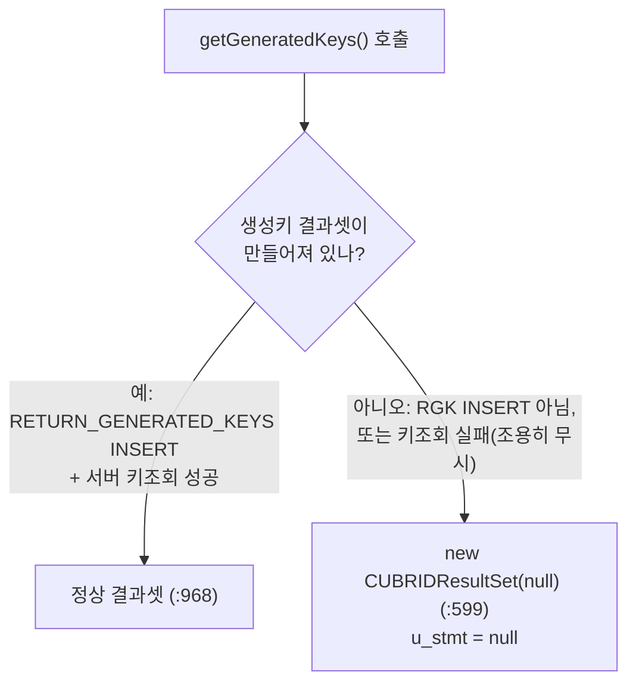

# CUBRID JDBC — getGeneratedKeys()가 빈/실패 상황에서 깨진 ResultSet(u_stmt=null)을 반환

- 분류: bug
- 날짜: 2026-07-12
- 관련: [con 없이 생성되는 ResultSet의 NPE 문서](2026-07-11-createcubridexception-npe.md), JDBC 드라이버 수정 트랙

## 요약
`getGeneratedKeys()`는 돌려줄 생성키 결과가 없을 때 `new CUBRIDResultSet(null)`로 **`u_stmt=null`인 깨진 placeholder**를 반환한다. 게다가 **서버 키조회 실패는 조용히 무시**된다. 이 결과셋에서 `getMetaData()` 등을 부르면 `u_stmt`가 null이라 NPE가 난다. → **실패는 예외로 알리고, 정상-빈은 유효한 빈 결과셋을 반환**해야 한다.

## 목적
[con=null 문제](2026-07-11-createcubridexception-npe.md)와 **구분되는**, `getGeneratedKeys`의 빈 결과셋 처리 결함을 규명한다. (두 문제는 같은 1-arg 생성자를 거치지만, 원인·범위·수정법이 다른 별개 결함이다. con을 채워도 이 문제는 남는다.)

## 배경
- con=null 분석 중 발견된 별개 결함.
- 실측 CI 스택에 `... UStatement.getColumnInfo() because "this.u_stmt" is null at CUBRIDResultSet.getMetaData` 형태가 보고된 바 있음(본 문서는 이를 드라이버 소스로 규명).

## 범위·방법
- `CUBRIDStatement`/`CUBRIDPreparedStatement`의 `getGeneratedKeys`·`MakeAutoGeneratedKeysResultSet`, 저수준 `UStatement.getGeneratedKeys`를 라인 단위로 추적.

## 발견·관찰

### (1) 언제 깨진 placeholder가 나오나
`getGeneratedKeys()`(`CUBRIDStatement:595`)는 `auto_generatedkeys_result_set`가 null이면 `new CUBRIDResultSet(null)`(`:599`)을 만든다 → **`u_stmt=null`**. 그 필드가 null인 경우:



- **(ㄱ)** `RETURN_GENERATED_KEYS` INSERT가 아닌 실행 뒤 `getGeneratedKeys()` 호출
- **(ㄴ)** `RETURN_GENERATED_KEYS` INSERT였지만 **서버 키조회가 실패**한 경우

### (2) 실패가 조용히 무시된다 (게다가 자기모순)
- `MakeAutoGeneratedKeysResultSet()`은 키조회 실패 시 **예외 없이 `return false`**(`:959`). 그런데 **다른 오류 경로는 예외를 던진다**(`:965`) → 같은 메서드 안에서 자기모순.
- 호출부 4곳 모두 그 `false` 반환을 **확인조차 안 함**: `CUBRIDStatement:487`,`:558` / `CUBRIDPreparedStatement:160`,`:495`.
- `UStatement.getGeneratedKeys()`가 `false`를 반환하는 건 **오류일 때뿐**이다 — 문장 닫힘(`:1978`)·서버오류(`:2004`)·통신오류(`:2009`). "생성키 0개"는 실패가 아니라 정상(true 반환, `:2012`). 즉 **버려지는 false는 전부 진짜 오류**다.

### (3) 그 결과셋을 쓰면 NPE
`getMetaData()`(`:680`)는 `checkIsOpen()` 통과 후 `u_stmt.getColumnInfo()`(`:684`)를 호출 → `u_stmt=null` → **NPE**.

### 재현 (요지)
```java
Statement st = conn.createStatement();
st.executeUpdate("INSERT INTO t(v) VALUES ('a')");  // RETURN_GENERATED_KEYS 없이
ResultSet gk = st.getGeneratedKeys();               // auto_generatedkeys_result_set == null → new CUBRIDResultSet(null): u_stmt=null
gk.getMetaData();                                   // u_stmt.getColumnInfo() → NPE
```

## 결론
- [con=null](2026-07-11-createcubridexception-npe.md)과 **별개 결함**이다: con을 채워도 `u_stmt=null`은 그대로 남는다.
- 현재 동작은 두 가지가 잘못됐다: (a) **키조회 실패를 조용히 무시**하고, (b) **`u_stmt=null`인 깨진 placeholder를 반환**해 나중에 NPE를 유발한다.

## 다음 단계
- **실패(오류) 케이스**: 조용히 무시하지 말고 **예외를 던져** 앱이 "생성키 조회 실패"를 알게 한다. (INSERT는 이미 실행됐으므로 되돌리는 게 아니라, 실패를 명확히 알리는 것)
- **정상-빈 케이스**(키를 요청/생성하지 않음): 예외 대신 **유효한 빈 결과셋**을 반환한다. (드라이버에 질의 없이 만드는 결과셋 클래스 `CUBRIDResultSetWithoutQuery`가 이미 있음)
- 즉 **"깨진 placeholder를 조용히 반환"을 제거**: 실패면 예외, 정상-빈이면 유효한 빈 결과셋.
- 코드로 확정 불가(추측 안 함): (ㄱ)/(ㄴ)이 실제 환경/CI에서 얼마나 자주 발생하는지는 런타임 조건이라 소스만으로는 알 수 없음.

## 참고
- 소스: `CUBRIDStatement.getGeneratedKeys` `:595`(`new CUBRIDResultSet(null)` `:599`), `MakeAutoGeneratedKeysResultSet` `:950`(조기 `return false` `:959`, 예외 던지는 경로 `:965`, 정상 생성 `:968`), 호출부 `CUBRIDStatement:487`/`:558`·`CUBRIDPreparedStatement:160`/`:495`.
- `UStatement.getGeneratedKeys` `:1976`(false 조건 `:1978`/`:2004`/`:2009`, true `:2012`).
- `CUBRIDResultSet.getMetaData` `:680`(`u_stmt.getColumnInfo()` `:684`), 1-arg 생성자 `:158`(`u_stmt=s` `:161`).
- 드라이버 내부 동작은 매뉴얼이 아니라 소스로 확정.
