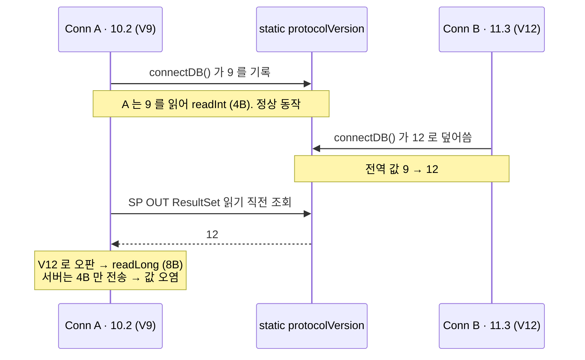

# CUBRID JDBC: static protocolVersion 으로 인한 프로토콜 버전 오판

- 분류: bug
- 날짜: 2026-07-29
- 관련: [cubrid-jdbc PR #83](https://github.com/CUBRID/cubrid-jdbc/pull/83) (APIS-1088), CBRD-23633, CBRD-23846

## 요약

`UConnection.protocolVersion` 이 커넥션별 필드가 아니라 JVM 전역 `static` 이라, 프로토콜 버전이 다른 CUBRID 서버에 동시 접속한 JVM 에서 나중 접속이 앞선 커넥션의 버전 판정을 덮어써 SP OUT ResultSet 의 와이어 바이트 폭(4B/8B)을 잘못 고른다. 2020년에 도입되어 2022년에 결함이 된 레거시이며, APIS-1088 과는 무관하다.

## 목적

APIS-1088(프로토콜 호환성 제거) PR 리뷰 중 발견한 버전 분기 결함에 대해 세 가지를 확정한다.

- 실재하는 버그인가, 아니면 이론상의 지적인가
- 언제 누가 도입했는가 (APIS-1088 이 만든 것인가)
- 실제 피해 범위는 어디까지인가

## 배경

APIS-1088 은 PROTOCOL V9 미만 서버 지원을 끊어 버전 분기 코드를 걷어내는 작업이다. 목표 중 하나가 "분기 코드에서 오는 성능 감소 및 오류 요인 제거" 였다.

분기를 훑던 중, 정리 후에도 남는 와이어 포맷 분기가 딱 하나 있고 그 판정이 전역 상태 기반이라는 점이 눈에 띄었다. V9 하한선(9)이 문제 경계(V11 = 11)보다 낮아서, 호환성 제거 후에도 이 분기는 살아남는다.

## 범위 / 방법

- 대상: `CUBRID/cubrid-jdbc`, PR #83 브랜치 (base `e4947d1`, head `2eb707b`)
- git pickaxe(`-S` / `-G`)로 원 커밋 추적. 2021-03-17 google-java-format 일괄 커밋(`1cee491`)이 `git blame` 을 가려서 blame 만으로는 추적 불가
- PR diff 의 hunk 범위를 구/신 좌표로 대조해 해당 코드의 수정 여부 확인
- `UInputBuffer` 의 프레이밍 및 경계 검사 코드를 읽어 실제 피해 범위 확정
- 서브에이전트 3개(git 이력 / 신규 노출 여부 / 노출 증감)로 병렬 분석 후, 각 결론에 반증 담당 2명씩 붙여 교차 검증 (총 9개)

## 발견 / 관찰

### 1. 버전 판정 헬퍼가 두 종류이고 저장소가 다르다

| 헬퍼 | 참조 필드 | 종류 | 위치 |
|---|---|---|---|
| `protoVersionIsAbove/Under/Same(v)` | `brokerVersion` | 인스턴스 | `UConnection.java:1883-1901` |
| `protoVersionIsLower(v)` | `protocolVersion` | **static** | `UConnection.java:1904` |

```java
// UConnection.java:232
protected static int protocolVersion = 0;      // JVM 에 하나

// UConnection.java:1904
public static boolean protoVersionIsLower(int ver) {
    return protocolVersion < ver;              // 어느 커넥션인지 알 수 없음
}
```

전역 필드에 대한 writer 는 핸드셰이크 한 곳뿐이고, 값을 되돌리는 코드는 없다.

```java
// UClientSideConnection.java:436  (connectDB 안)
protocolVersion = (int) version & CAS_PROTO_VER_MASK;
```

### 2. 이 값을 읽는 곳이 와이어 바이트 폭을 정한다

```java
// UStatement.java:311 - MAKE_OUT_RS 요청 (보내는 쪽)
if (UConnection.protoVersionIsLower(UConnection.PROTOCOL_V11)) {
    outBuffer.addInt((int) id);     // 4바이트
} else {
    outBuffer.addLong(id);          // 8바이트
}

// UStatement.java:2271 - U_TYPE_RESULTSET (받는 쪽)
if (UConnection.protoVersionIsLower(UConnection.PROTOCOL_V11)) {
    return new CUBRIDOutResultSet(relatedConnection, (long) inBuffer.readInt());
} else {
    return new CUBRIDOutResultSet(relatedConnection, inBuffer.readLong());
}
```

폭뿐 아니라 값의 의미도 다르다. `CUBRIDOutResultSet.java:41-44` 주석 기준으로 V11 미만은 `SRV_HANDLE id`, V11 이상은 `QUERY_ID` 이다.

### 3. 오염 시나리오



성립 조건 세 가지가 모두 필요하다.

- 한 JVM 에서 V11 미만 서버와 V11 이상 서버에 동시 접속 (예: 11.1 + 11.2, 또는 10.2 + 11.3)
- ResultSet 을 반환하는 스토어드 프로시저 사용 (`CallableStatement` + `getObject`)
- 두 번째 커넥션이 붙은 뒤 첫 번째 커넥션으로 SP 호출

APIS-1088 이후에도 하한선이 V9 라서 V9, V10 서버가 계속 지원되고, 이들은 모두 V11 경계 아래에 있다. 즉 **정식 지원 서버 조합만으로 이 상황이 구성된다.**

### 4. 도입 이력

| 시점 | 커밋 | 내용 |
|---|---|---|
| 2020-04-20 | `713c3c2` (CBRD-23633) | `static protocolVersion` + `protoVersionIsLower` 도입. 형제 헬퍼 3종은 이미 인스턴스 메서드였는데 이것만 static. 소비처는 읽기 타임아웃 시 `pingBroker` / `statusBroker` 선택 1곳 |
| 2020-05-20 | `8d46800` (CBRD-23648) | client/server 분리 과정에서 `private static` → `protected static`, 대입문을 `UClientSideConnection` 으로 이동 |
| 2022-04-04 | `63222eb` (CBRD-23846) | **ping 방식 고르던 static 헬퍼를 와이어 바이트 폭 결정에 재사용.** 여기서 실제 결함이 됨. 같은 커밋이 `PROTOCOL_V11` 상수도 추가 |
| 2026-07 | PR #83 (APIS-1088) | 2020년 커밋이 만든 원래 소비처 1곳 제거. 나머지 2곳은 미수정 |

핵심은 2022년이다. "잘못 고르면 ping 방식이 틀림"(무해) 수준으로 설계된 전역 헬퍼를 "잘못 고르면 바이트 폭이 틀림"(유해) 용도에 재사용하면서 결함이 됐다.

### 5. APIS-1088 은 이 코드를 건드리지 않았다

PR diff 전체에서 `protocolVersion` / `protoVersionIsLower` 를 언급하며 추가·삭제된 줄은 **한 줄뿐**이며, 그것은 `UTimedDataInputStream` 의 V9 체크 삭제다. `UClientSideConnection.java:436` 의 대입문은 diff 에 컨텍스트 줄(공백 접두사)로만 등장한다.

`UStatement.java` 의 hunk 는 구 좌표 기준 673, 784, 804, 885, 986, 1060, 1066, 1112, 1175, 2332 이고, 문제의 두 줄(구 311, 2299)은 어느 hunk 에도 포함되지 않는다.

노출 증감도 확인했다. **줄었다.**

| 항목 | PR 이전 | PR 이후 |
|---|---|---|
| V9 미만 서버 접속 | 전역에 기록 후 **성공**, 풀에 살아남아 재연결마다 재기록 | 전역에 기록 후 거부, 커넥션 미생성 |
| 역방향 오염 (살아있는 구버전 커넥션이 8B 전송) | 가능 | 불가 |
| 경계 아래 지원 범위 | V0 ~ V9 | V9 ~ V10 |

### 6. 실제 피해 범위는 "요청 1건"

`UInputBuffer` 는 응답을 length-framed 로 통째로 읽어 버퍼에 담는다.

```java
capacity = UJCIUtil.bytes2int(headerData, 0);   // 응답 길이 먼저
buffer = new byte[capacity];
readData();                                      // 소켓에서 그만큼 다 읽음
```

이후 모든 읽기는 소켓이 아니라 이 `byte[]` 안에서 일어나고, 전부 경계 검사가 있다.

```java
int readInt()   { if (position + 4 > capacity) throw ER_ILLEGAL_DATA_SIZE; ... }
long readLong() { if (position + 8 > capacity) throw ER_ILLEGAL_DATA_SIZE; ... }
```

따라서 폭을 잘못 읽어도 **소켓 프레이밍은 깨지지 않는다.** 증상은 다음 둘 중 하나로 한정된다.

- 해당 응답 안에서 OUT ResultSet id 및 이후 컬럼 값이 틀림 (조용히 잘못된 데이터가 나올 수 있음)
- 버퍼 끝을 넘으면 `ER_ILLEGAL_DATA_SIZE` 예외

다음 요청은 정상 동작한다. 커넥션이 영구히 죽지는 않는다.

## 결론

실재하는 버그이되 심각도는 중간이다. 성립 조건이 좁고(믹스 버전 JVM + SP OUT ResultSet), 피해가 요청 단위로 한정된다. 다만 조용히 틀린 데이터가 반환될 수 있다는 점은 남는다.

도입 시점이 명확하고 APIS-1088 과 무관하다. 버전 분기를 정리하는 과정에서 드러난 레거시 결함으로 보는 것이 정확하며, APIS-1088 은 오히려 지원 하한을 올려 노출을 좁혔다.

수정 비용은 매우 낮다. 호출부 두 곳 모두 커넥션 객체를 이미 손에 들고 있다.

```java
// UStatement.java:311   (파라미터 u_con 사용 가능)
if (u_con.protoVersionIsUnder(UConnection.PROTOCOL_V11)) { ... }

// UStatement.java:2271  (필드 relatedConnection 사용 가능)
if (relatedConnection.protoVersionIsUnder(UConnection.PROTOCOL_V11)) { ... }
```

`protoVersionIsUnder` 가 이미 `brokerVersion < makeProtoVersion(ver)` 이라 의미가 정확히 같다. 새 메서드가 필요 없고, 이후 `static protocolVersion` 필드, `protoVersionIsLower`, 핸드셰이크의 대입문까지 전부 삭제 가능하다.

## 다음 단계

- APIS-1088 PR 리뷰 코멘트로 전달. 이 PR 이 2020년 static 의 원래 소비처를 이미 지웠으므로, 남은 2곳까지 정리하면 전역 상태가 통째로 사라진다
- 별도 이슈로 뺄 경우 제목 예시: "Remove JVM-global static protocolVersion from JCI version check"
- 함께 정리 가능한 죽은 코드: `PROTOCOL_V0` ~ `PROTOCOL_V8` 상수(참조 0), `protoVersionIsSame`(참조 0), `UFunctionCode.CURSOR_CLOSE_FOR_PROTOCOL_V2`(참조 0), `BrokerHandler.cancelBroker`(참조 0)
- 회귀 확인 방안: 프로토콜 버전이 다른 서버 2대에 동시 접속하는 JVM 에서 SP OUT ResultSet 을 호출하는 테스트. 현재 이 리포에는 테스트가 없어 CTP 쪽에서 구성해야 함

## 참고

- [cubrid-jdbc PR #83](https://github.com/CUBRID/cubrid-jdbc/pull/83) (APIS-1088, Remove protocol compatibility)
- 커밋: `713c3c2` (CBRD-23633), `8d46800` (CBRD-23648), `63222eb` (CBRD-23846), `1cee491` (CBRD-23885, blame 을 가리는 포맷 일괄 커밋)
- 소스: `src/jdbc/cubrid/jdbc/jci/UConnection.java`, `UClientSideConnection.java`, `UStatement.java`, `UInputBuffer.java`, `src/jdbc/cubrid/jdbc/driver/CUBRIDOutResultSet.java`
- 추적 요령: 2021-03-17 포맷 일괄 커밋 때문에 `git blame` 이 막히므로 `git log -S'<심볼>' --reverse -- <경로>` 로 원 커밋을 찾을 것
