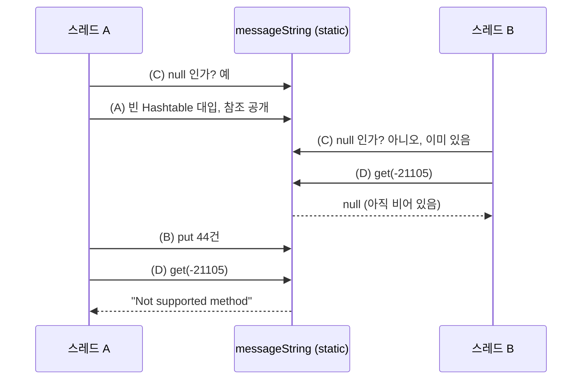
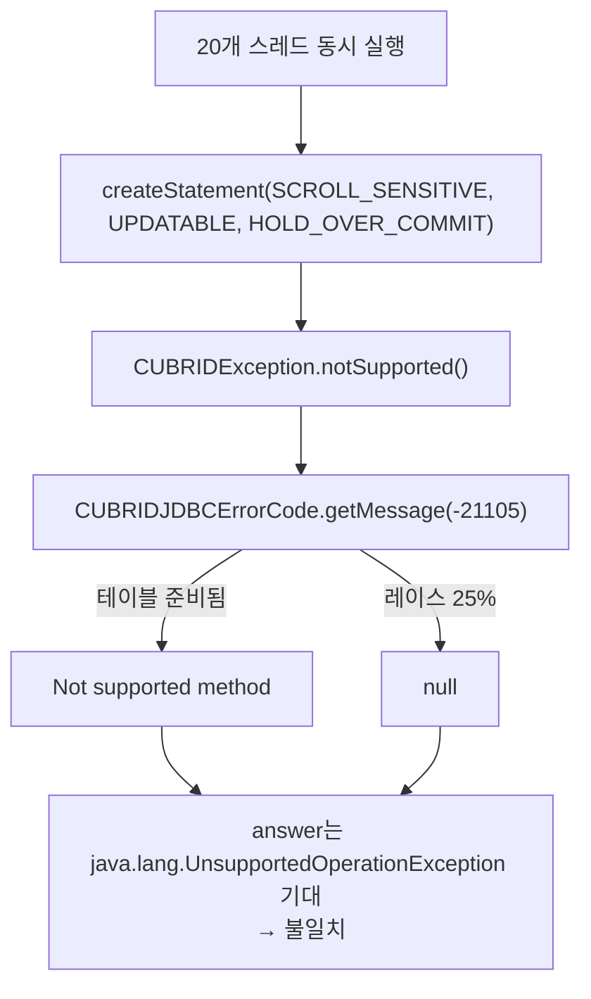

# CUBRID JDBC: 미지원 메서드 예외 전환(APIS-1090)이 드러낸 에러 메시지 테이블 레이스

- 분류: bug
- 날짜: 2026-08-19
- 관련: APIS-1090 (미지원 메서드 `SQLFeatureNotSupportedException` 전환), QA 회귀 리포트 "getMessage() race condition returns null under concurrent first call"

## 요약
APIS-1090으로 깨진 TC의 진짜 원인은 **두 가지가 겹친 것**이다. (1) 미지원 메서드 예외 메시지가 `java.lang.UnsupportedOperationException`에서 `Not supported method`로 바뀌어 answer가 **100% 불일치**하고, (2) `CUBRIDJDBCErrorCode.getMessage()`의 **2012년부터 있던** 스레드 안전하지 않은 지연 초기화가 처음으로 밟혀 **호출당 25% 확률로 `null`**을 돌려준다. 레이스는 APIS-1090이 만든 것이 아니라 노출시킨 것이며, 예외 타입 변경과도 무관하다.

## 목적
"APIS-1090 때문에 shell_heavy 커서 holdability TC가 깨진다"는 회귀 리포트에 대해, 실제로 깨지는 TC와 그 원인을 코드/실측으로 규명한다. 수정은 범위 밖.

## 배경
- 리포트 내용: 여러 스레드가 동시에 미지원 메서드를 최초 호출하면 일부만 에러 메시지 대신 `null`을 출력한다.
- 리포트가 지목한 재현 경로: `TYPE_SCROLL_SENSITIVE` ResultSet에서 `rs.absolute()`를 호출해 미지원 예외를 유발.
- APIS-1090의 변경: `throw new SQLException(new UnsupportedOperationException())` **273줄**을 `throw CUBRIDException.notSupported()`로 전환.

```java
// CUBRIDException.java (신규)
static SQLFeatureNotSupportedException notSupported() {
    return new SQLFeatureNotSupportedException(
            CUBRIDJDBCErrorCode.getMessage(CUBRIDJDBCErrorCode.not_supported), null,
            CUBRIDJDBCErrorCode.not_supported);
}
```

## 범위·방법
- 드라이버 diff(`upstream/develop...APIS-1090`)와 변경 파일 10개를 라인 단위로 대조.
- `CUBRIDJDBCErrorCode.class`를 `javap -c`로 디스어셈블해 초기화 순서를 바이트코드로 확인.
- 재현 프로그램 3종을 로컬에서 실행: (a) 동기화 배리어 기반 순수 JVM 재현, (b) TC와 동일한 형태(20 스레드가 실제 브로커에 접속 후 `createStatement`), (c) 예외 타입과 메시지 출처를 분리한 대조 실험.
- 구 릴리스 jar(2011년, 2014년)과 현재 jar을 같은 프로그램으로 비교.
- 테스트 저장소 4곳 전수 스윕(answer/expected 계열 확장자, 아카이브 내부 `.java` 추출, `.class` 바이너리 포함).

## 발견·관찰

### (1) 리포트의 재현 경로가 틀렸다: `rs.absolute()`는 실행조차 되지 않는다

시나리오는 `createStatement`에서 이미 예외를 맞는다.

```java
// TestHoldable6 (시나리오 소스)
stmt = con.createStatement(TYPE_SCROLL_SENSITIVE, CONCUR_UPDATABLE, HOLD_CURSORS_OVER_COMMIT);
...
rs.absolute(i);   // 도달하지 않음
```

```java
// CUBRIDConnection.createStatement(int type, int concur, int holdable)
if (holdable == ResultSet.HOLD_CURSORS_OVER_COMMIT) {
    if (type == ResultSet.TYPE_SCROLL_SENSITIVE || concur == ResultSet.CONCUR_UPDATABLE) {
        throw CUBRIDException.notSupported();   // APIS-1090이 바꾼 줄
    }
}
```

근거 세 가지.

| 근거 | 내용 |
|---|---|
| 로그 순서 | 하니스는 `executeQuery` **직전에** SQL 문자열을 로그에 찍는데, answer에 `SELECT` 문자열이 **0건**(`Running` 블록은 19건) |
| 대조군 | `TestCloseCursor5`는 TYPE/CONCUR와 `absolute()` 루프까지 동일하고 holdability만 `CLOSE_CURSORS_AT_COMMIT`인데 정상 통과. 트리거는 스크롤 타입이 아니라 **holdability 조합** |
| 드라이버 | `CUBRIDResultSet.absolute()`에는 `notSupported()` 경로가 없고, APIS-1090 diff에 `absolute` 문자열이 등장하지 않음 |

### (2) 문제는 둘이고, 서로 독립이다

하니스 로거는 예외 타입으로 분기한다.

```java
if (e instanceof CUBRIDException) log(String.valueOf(cubErr.getErrorCode()));
else                              log(e.getMessage());
```

`SQLFeatureNotSupportedException`은 `CUBRIDException`이 아니므로 `else` 분기를 타고, `e.getMessage()`가 그대로 로그에 남는다.

| 구분 | 예외 클래스 | errorCode | 로그에 남는 값 |
|---|---|---|---|
| APIS-1090 이전 | `java.sql.SQLException` (cause=UOE) | 0 | `java.lang.UnsupportedOperationException` |
| APIS-1090 이후 | `java.sql.SQLFeatureNotSupportedException` | -21105 | `Not supported method` |
| 이후 + 레이스 | 동일 | -21105 | `null` |

`SQLException(Throwable)`은 reason을 `cause.toString()`으로 잡기 때문에 예전 메시지가 저 문자열이었고, answer 파일은 정확히 그 값을 19블록 전부에 고정해 두고 있다. 즉 **레이스가 한 번도 안 걸려도 TC는 매번 실패**한다. 비교는 라인번호 정규화 후 순수 `diff -b`라 흡수될 여지도 없다.

### (3) 예외 타입은 레이스와 무관하다 (대조 실험)

30 스레드가 동시에 최초 호출하도록 맞춘 뒤, 예외 타입과 메시지 출처를 분리해 측정했다.

| 방식 | 예외 타입 | 메시지 출처 | 테이블 상태 | null 발생 |
|---|---|---|---|---|
| 구 방식 | `SQLException` | cause 객체 `toString()` | 끝까지 `null` (조회 자체 없음) | 0/30, 0/30, 0/30 |
| 신 방식 | `SQLFeatureNotSupportedException` | 공유 테이블 조회 | size=44 | 5/30, 7/30, 2/30 |
| **대조군** | `SQLException` (구 타입) | 공유 테이블 조회 | size=44 | **0/30, 6/30, 3/30** |

대조군이 결정적이다. 예외 타입을 예전 그대로 두고 **메시지만 테이블에서 꺼내게** 해도 똑같이 `null`이 난다. 바뀐 것은 타입이 아니라 **"메시지를 어디서 구하는가"**다. 구 방식은 그 자리에서 만든 객체 하나로 끝나 공유 상태를 건드리지 않았고, 신 방식은 프로세스 전역 static 테이블에 의존한다.

이름이 같은 두 메서드를 구분해야 한다.

| 메서드 | 하는 일 |
|---|---|
| `Throwable#getMessage()` | 예외가 **만들어질 때 이미 저장해 둔** 문자열을 꺼내 줌. 조회 없음 |
| `CUBRIDJDBCErrorCode.getMessage(int)` | 에러코드로 **공유 테이블을 조회**해 문자열을 찾아옴 |

`null`이 생기는 곳은 두 번째다. 예외를 만드는 순간 메시지 자리에 `null`이 박히고, 로거의 `e.getMessage()`는 그것을 충실히 돌려줄 뿐이다.

### (4) 레거시 코드가 왜 문제인가

```java
private static Hashtable<Integer, String> messageString;          // volatile 아님

private static void setMessageHash() {
    messageString = new Hashtable<Integer, String>();             // (A) 참조를 먼저 공개
    messageString.put(new Integer(not_supported), "Not supported method");   // (B) 그 다음 44건 채움
    ...
}

public static String getMessage(int code) {
    if (messageString == null) setMessageHash();                  // (C) 존재 여부만 확인
    return (String) messageString.get(new Integer(code));         // (D) 조회
}
```

바이트코드로 순서가 확정된다. `putstatic messageString`이 offset 7, 첫 `put`이 offset 25다. **참조 공개가 데이터 채우기보다 앞선다.**



자주 나오는 반문 세 가지.

| 반문 | 답 |
|---|---|
| "(C)에서 null 체크를 하잖아?" | (C)는 *존재 여부*만 본다. *채워졌는지*는 보지 않는다. (A) 직후부터 (B) 완료 전까지 테이블은 **존재하지만 비어 있다** |
| "`Hashtable`은 스레드 안전하지 않나?" | 맞고, 그래서 **깨지지 않는다**. 락을 정상적으로 잡고 빈 테이블에서 정직하게 "없음"을 돌려준다. **자료구조의 스레드 안전성과 초기화의 스레드 안전성은 별개**다. 예외 하나 없이 조용히 잘못된 값이 흘러나가는 이유 |
| "첫 초기화만 지나면 안전한가?" | 아니다. (C)에 락이 없어 **두 스레드가 동시에 `setMessageHash()`에 들어갈 수 있다.** A가 44건을 다 채운 뒤에도, 먼저 들어와 있던 B가 (A)를 실행하면 **완성된 테이블을 새 빈 테이블로 갈아치운다** |

### (5) 왜 14년간 안 터졌고, 왜 지금 터지나

이 패턴은 에러코드가 배열 인덱스에서 음수 코드로 바뀌며 `String[]`이 지연 초기화 `Hashtable`로 교체될 때 들어왔다(`6688814 [CUBRIDSUS-7666]`, **2012-08-23**). `CUBRIDJDBCErrorCode.java`는 APIS-1090 diff에 **없다**(양쪽 blob 해시 동일, 마지막 변경은 APIS-869).

터지려면 세 조건이 동시에 필요하다.

1. `getMessage()`가 그 JVM에서 **처음** 불릴 것
2. 그 첫 호출을 **여러 스레드가 동시에** 할 것
3. 결과가 어딘가에 **눈에 보이게** 남을 것

`upstream/develop`에서 `getMessage` 호출자는 `CUBRIDException(int errCode, ...)` 생성자 3곳뿐이고 전부 error/throw 경로다. 드라이버 전체의 `new CUBRIDException(CUBRIDJDBCErrorCode.*)` 143곳도 전부 throw 지점이다. **정상 접속과 정상 질의만으로는 이 테이블이 만들어지지 않는다.** 리플렉션으로 private 필드를 직접 관찰한 결과도 같다.

| 시점 | `messageString` |
|---|---|
| 드라이버 클래스 초기화 후 | `null` |
| **성공적인** `getConnection()` 후 | `null` |
| `setAutoCommit(false)` 후 | `null` |
| `createStatement(SS, UPD, HOLD)`가 던진 직후 | size=44 |

APIS-1090이 네 번째 호출자 `notSupported()`를 추가하면서 조건 1과 2가 맞아떨어졌다. 대상 시나리오는 20개 스레드가 **모두 같은 지점에서 각자의 첫 에러**를 낸다. 조건 3도 APIS-1090이 만들었다. `CUBRIDException` 계열로 던졌다면 로거가 errorCode(-21105)를 찍어 **레이스가 보이지 않았을 것**이다.



### (6) 실측 수치

| 대상 | 형태 | 결과 |
|---|---|---|
| 현재 jar (APIS-1090) | 배리어 기반, 20회 x 50 스레드 | **111 / 1000** null |
| 2014년 릴리스 jar (9.3.0.0206, `notSupported()` 없음) | 동일 | **151 / 1000** null |
| 2011년 jar (`String[] err_msg` 방식) | 동일 | **0 / 1000** |
| 현재 jar, **TC와 동일 형태** (20 스레드, 실제 접속 후 `createStatement`) | 12회 반복 | **12/12 실행에서 발생, 60 / 240 (25%)** |

두 가지가 확정된다. 레이스는 **APIS-1090 이전 릴리스에도 있었고**, 인위적 배리어보다 **실제 TC 형태에서 더 자주 터진다**(브로커 핸드셰이크가 스레드를 오히려 뭉치게 만든다).

### (7) 영향받는 TC 전수

| TC | 건수 | 깨지는 방식 |
|---|---|---|
| `shell_heavy/_01_cursor_holdability` :: `TestHoldable6` | x2 (구동 스크립트 2종이 동일 44시나리오) | 메시지 텍스트 변경 + `getMessage` null 레이스 |
| `shell/_24_apricot/_01_cursor_holdability/_01_cursor_functional` :: `test5`, `test7` | 2 | 스택트레이스 전체를 비교하므로 **3중** 불일치 |
| `interface/JDBC/test_jdbc` JUnit | 61 | 예외 타입/cause 단정 |

`_01_cursor_functional`이 가장 심하다. 그 하니스는 스택트레이스 전체를 찍으므로 세 군데가 동시에 깨진다.

- 헤더: `java.sql.SQLException: java.lang.UnsupportedOperationException` → `java.sql.SQLFeatureNotSupportedException: Not supported method`
- 새 프레임 `at cubrid.jdbc.driver.CUBRIDException.notSupported(...)` **삽입** (예외를 static factory 안에서 생성하므로)
- `Caused by: java.lang.UnsupportedOperationException` 및 `... 4 more` **소멸** (cause가 `null`)

같은 suite의 나머지 42개 시나리오는 영향 없다. 저장소 4곳에서 문제를 유발하는 `createStatement`/`prepareStatement` 호출 지점은 정확히 8곳뿐이며, 아카이브 내부와 `.class` 바이너리까지 훑어 추가 TC는 없었다.

### (8) 부수 발견

- `cubrid/jdbc/jci/UErrorCode.java`에 **똑같은 패턴의 별도 `messageString`**이 있다(`UError.getErrorMsg` 경로). APIS-1090과 무관하지만 동일 결함이다.
- answer 블록이 스레드 수 20이 아니라 19인 것은 구동 스크립트가 `test0..test19`를 이어붙이는 반면 하니스는 `test1..test20`을 쓰기 때문이다. APIS-1090과 무관한 기존 quirk.

## 결론

| | 무엇 | APIS-1090의 역할 |
|---|---|---|
| 문제 1 | 미지원 메서드 메시지/타입 변경 | **직접 원인.** 의도된 동작 변경이므로 TC answer 갱신이 따라와야 함 |
| 문제 2 | 공유 에러 메시지 테이블의 지연 초기화가 스레드 안전하지 않음 | **원인 아님.** 2012년부터 있던 결함을 처음 밟았고, 눈에 보이게 만들었을 뿐 |

수정 순서는 **문제 2가 먼저**다. 호출당 25% 확률로 `null`이 나오는 한 어떤 정적 answer도 맞출 수 없어, answer만 갱신하면 영구 flaky TC가 된다.

## 다음 단계
- `CUBRIDJDBCErrorCode`의 초기화를 스레드 안전하게 만드는 별도 이슈 등록 (APIS-1090과 분리, 회귀가 아닌 잠재 결함으로 기술).
- 위 수정 후 `TestHoldable6` answer와 `cursor_functional` answer 갱신 (후자는 스택트레이스 3곳).
- `test_jdbc` JUnit 61건은 소스 단정문 기준 판정이므로 suite 실제 실행으로 확정 필요.
- `UErrorCode`의 동일 패턴도 같은 이슈에 포함할지 판단.

## 참고
- 드라이버 diff: `upstream/develop...APIS-1090` (변경 파일 10개, 미지원 throw 273줄 전환)
- 레이스 도입 커밋: `6688814 [CUBRIDSUS-7666] change the error code number` (2012-08-23)
- 수정 설계: [CUBRID JDBC 에러 메시지 테이블 스레드 안전화 설계](../spec/2026-08-19-cubrid-jdbc-errorcode-thread-safety.md)
- 관련 노트: [con 없이 생성되는 ResultSet의 createCUBRIDException NPE](2026-07-11-createcubridexception-npe.md)
