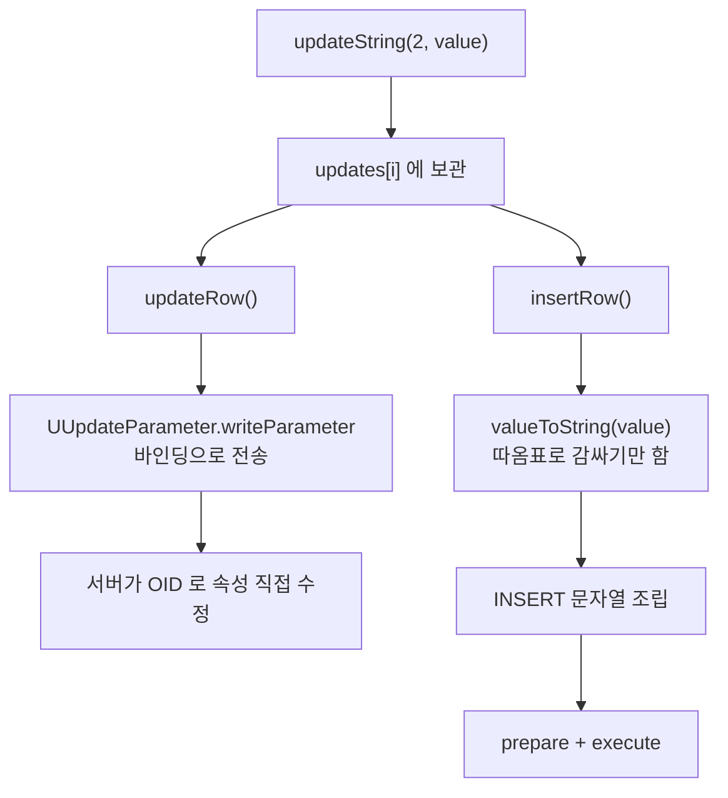

# ResultSet.insertRow 가 문자열의 작은따옴표를 이스케이프하지 않는다

- 분류: bug
- 날짜: 2026-08-31
- 관련: APIS-1107 (java.time 지원) 작업 중 부수적으로 발견, 해당 이슈와는 무관

## 요약

`CUBRIDResultSet.insertRow()` 는 값을 SQL 문자열로 이어붙여 `INSERT` 를 만드는데 문자열 값의 작은따옴표를 이스케이프하지 않아, `O'Brien` 같은 평범한 값을 넣지 못하고 한 문장 범위의 SQL 주입도 성립한다. 같은 클래스의 `updateRow()` 는 파라미터 바인딩을 쓰므로 영향이 없다.

## 목적

`insertRow` 와 `updateRow` 의 값 전달 경로가 다르다는 점을 확인하고, 그 차이가 실제 결함으로 이어지는지 재현으로 검증한다.

## 배경

두 갱신 메서드는 서버에 값을 전달하는 방식이 근본적으로 다르다.

| 메서드 | 전달 방식 | 값이 지나는 경로 |
|---|---|---|
| `updateRow` | 프로토콜 함수 `CURSOR_UPDATE` | 커서 위치의 OID 를 찾아 속성을 직접 수정, SQL 없음 |
| `insertRow` | SQL 문자열 생성 후 `prepare` + `execute` | `valueToString` 이 만든 리터럴을 문장에 이어붙임 |

`insertRow` 가 SQL 을 만드는 이유는 삽입할 행에 아직 OID 가 없어서 `CURSOR_UPDATE` 의 방식을 쓸 수 없기 때문이다. 프로토콜에 삽입용 함수가 따로 없다.



## 범위 / 방법

- 대상: `cubrid-jdbc` `upstream/develop` 기준 `CUBRIDResultSet.java`
- 방법: 코드 확인 후 실제 서버(CUBRID 11.4)에 붙여 `insertRow` 와 `updateRow` 를 같은 값으로 각각 호출해 결과를 비교
- 커서가 holdable 이면 갱신 가능한 ResultSet 을 열 수 없으므로 `setHoldability(CLOSE_CURSORS_AT_COMMIT)` + `setAutoCommit(false)` 로 재현

## 발견 / 관찰

### 문제 코드

`valueToString` 의 문자열 분기는 값을 그대로 따옴표로 감싼다.

```java
} else if (value instanceof String) {
    strvalue = "'" + value.toString() + "'";
}
```

이 줄은 2014-04-21 `dba7711` 부터 그대로이며 현재 `develop` 에도 동일하게 있다.

### 재현 결과

| 입력 값 | `insertRow` | `updateRow` |
|---|---|---|
| `O'Brien` | 구문 오류로 실패 | 성공, 값도 그대로 저장 |
| `a'; drop table qtest; --` | 구문 오류로 실패 | 성공 |
| `x'\|\|(select name from qtest where id=1)\|\|'` | 성공, 서브쿼리가 실행됨 | 해당 없음 |

`O'Brien` 을 넣으면 조립된 문장이 `values ('O'Brien')` 이 되어 서버가 거부한다.

```
Syntax: In line 1, column 28 before '')'
Syntax error: unexpected 'Brien', expecting ',' or ')'
```

### 주입의 실제 범위

- 문장을 이어붙이는 형태(`'; drop table ...; --`)는 성립하지 않는다. CAS 의 `prepare` 가 한 문장만 받으므로 파싱 단계에서 거부된다.
- 반면 한 문장 안에서 성립하는 주입은 실제로 통한다. 위 표의 세 번째 값을 넣으면 `insertRow` 가 성공하고, 저장된 값이 `xsecret-value` 로 나온다. 즉 이어붙인 서브쿼리가 그대로 실행됐다.

```
저장된 내용:
   id=1  name=[secret-value]
   id=9  name=[xsecret-value]
```

## 결론

- 결함은 확실하다. 이스케이프가 없어 `'` 가 들어간 값은 아예 삽입할 수 없고, 이는 이름·주소·자유 입력처럼 흔한 데이터에서 바로 걸린다.
- 보안 측면은 다중 문장 실행까지는 가지 않지만, 한 문장 안에서 서브쿼리를 이어붙이는 주입이 성립하므로 데이터 노출 경로로는 유효하다.
- 응급 처치로 `'` 를 `''` 로 치환하는 방법이 있으나, 근본적으로는 `insertRow` 도 `PreparedStatement` 파라미터 바인딩으로 값을 넘기는 편이 옳다. 값 종류마다 리터럴 문법을 손으로 맞추는 `valueToString` 자체가 사라진다.
- 참고로 `valueToString` 의 다른 분기(날짜, 시간, `byte[]`, `Boolean`)는 서식이 고정돼 있어 같은 문제가 없다. `CUBRIDOID` 의 OID 문자열도 드라이버가 만든 값이다.

## 다음 단계

- 이슈화 필요. 별도 이슈로 등록한다(APIS-1107 범위가 아니다).
- 수정 시 함께 볼 것: `insertRow` 를 바인딩으로 바꾸면 `valueToString` 의 유일한 호출자가 없어지므로 메서드를 통째로 제거할 수 있는지 확인.
- 회귀 테스트로 `'` 를 포함한 문자열의 `insertRow` 왕복을 추가한다.

## 참고

- `cubrid-jdbc` `src/jdbc/cubrid/jdbc/driver/CUBRIDResultSet.java` 의 `insertRow`, `updateRow`, `valueToString`
- 최초 도입 커밋 `dba7711` (2014-04-21)
