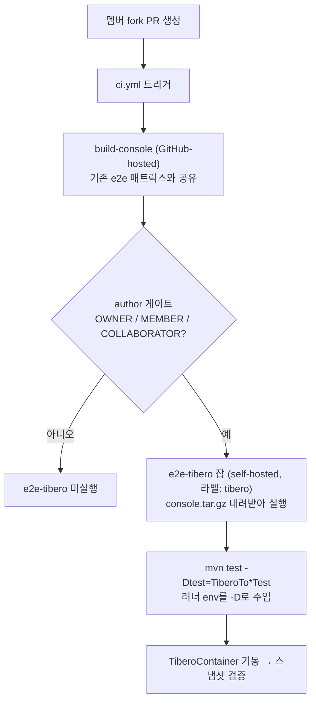
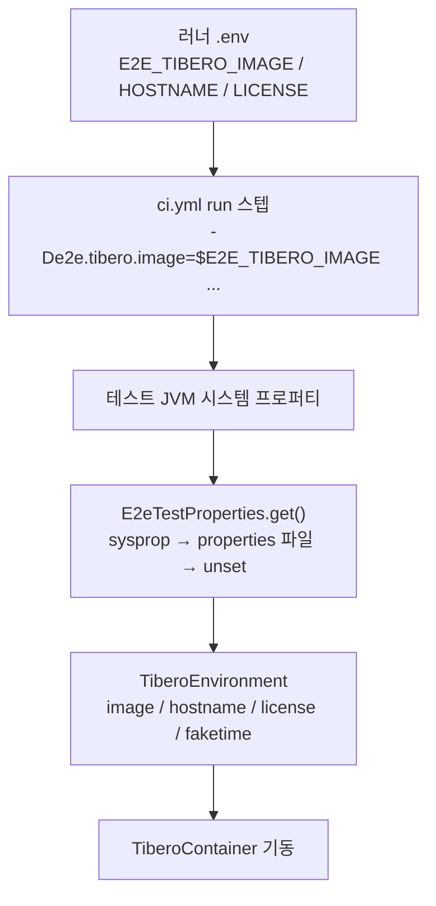

# Tibero e2e를 self-hosted 러너에서 돌리는 CI 설계

- 분류: ci
- 날짜: 2026-07-25
- 관련: CMT e2e 테스트 스위트 (tests/e2e), 후속 이슈 예정

## 요약
Tibero e2e를 머지 전 검증하기 위한 CI 설계. 상용 라이선스와 커스텀 이미지 제약으로 공개 러너에서 못 돌리므로, 내부망 self-hosted 러너에서 실행하고, 설정 4개 키는 러너 환경변수로 두어 워크플로가 `-D`로 넘긴다. 자동 경로는 `ci.yml`에 잡을 추가하고, 외부 기여자용 수동 경로는 나중에 별도 파일로 분리한다.

## 목적
- Tibero에서 CUBRID로의 마이그레이션을 검증하는 e2e TC를 CI에서 자동으로 돌려, PR 머지 전에 회귀를 잡고 싶다.
- 다른 소스 DBMS는 이미 CI에서 자동 실행되지만, Tibero만 라이선스 문제로 빠져 있다. 이 공백을 메우는 것이 목적이다.

## 배경
- 현재 e2e는 소스 DBMS별 매트릭스 잡으로 구성되고, oracle/mysql/mariadb/informix/mssql/cubrid 등은 공개 Testcontainers 이미지를 GitHub-hosted 러너가 그대로 pull해서 돌린다. 외부 설정이 사실상 0이다 (이미지명이 컨테이너 클래스에 하드코딩).
- Tibero는 상용 DB라서 (1) 이미지를 도커 허브 등 외부에 올릴 수 없고, (2) 라이선스 파일을 레포에 커밋할 수 없다. 따라서 공개 CI 러너에서 실행이 불가능하다.
- 대안은 이미지와 라이선스가 이미 있는 내부망 서버를 **self-hosted 러너**로 등록해 그 위에서만 Tibero 잡을 돌리는 것이다.

### self-hosted 러너란
- GitHub가 관리하는 클라우드 러너 대신, 우리가 소유한 머신에 러너 에이전트를 설치해 잡을 받아 실행하는 방식이다.
- 러너 에이전트는 GitHub로 아웃바운드 폴링(HTTPS)만 하며, 라벨(`tibero`)로 잡과 매칭된다. 인바운드 포트 개방이 필요 없다.
- 잡 코드는 그 머신에서 로컬 실행되므로, 이미지와 라이선스가 머신 밖으로 나가지 않는다.

## 범위 / 방법
작업을 두 단계로 나눈다.

- **(a) 배관 검증**: `ci.yml`에 Tibero 잡 하나를 추가하고, 기존 스냅샷 기준(tibero7)으로 self-hosted 러너에서 green까지 도는지 확인한다. 설정 모델과 컨테이너 코드는 건드리지 않는다.
- **(b) tibero6 전환**: 실제 마이그레이션 대부분이 Tibero 6에서 CUBRID로 넘어오므로, 컨테이너 코드(포트/라이프사이클/ready-log)와 JDBC 드라이버를 6에 맞추고 스냅샷을 재생성한다.

테스트는 우선 Srltas 포크에서 진행한다 (upstream 레포는 Settings 권한이 없어 러너 등록과 required 설정이 어렵다).

## 발견 / 관찰

### 1. 실행 흐름 (자동 경로)

### 2. 자동 경로와 수동 경로는 이벤트/신뢰모델이 다르다
| | 자동 (member-auto) | 수동 (outside-manual) |
|---|---|---|
| 대상 | 멤버/협력자 fork PR | 외부 기여자 PR |
| 이벤트 | `pull_request` | `workflow_dispatch` |
| 실행 워크플로 | PR head (멤버=신뢰) | base=develop (신뢰) |
| 트리거 | author_association 게이트로 자동 | 관리자가 수동 |
| 어디에 | `ci.yml`에 잡 추가 | 별도 `ci-tibero-manual.yml` |

- 자동 경로는 `build-console`을 기존 e2e 잡과 공유하므로 콘솔을 두 번 빌드하지 않는다.
- 수동 경로의 콘솔 빌드 중복은 "매 PR"이 아니라 "관리자가 손으로 돌릴 때만"이라 드물어 무시 가능하다. 그래서 별도 파일로 분리해도 낭비가 아니다.
- Srltas에서는 작업자가 OWNER라 자동 경로만으로 충분하다. 수동 파일은 upstream에 외부 기여자를 다뤄야 할 때 추가한다.

### 3. 설정 4개 키와 전달 경로
e2e 프레임워크가 읽는 프로퍼티 키는 로컬/CI 공통으로 4개다. 해석 순서는 시스템 프로퍼티(`-Dkey`) → `e2e-test.properties` 파일 → 없으면 스킵.

| 프로퍼티 키 | 의미 |
|---|---|
| `e2e.tibero.image` | 커스텀 Tibero 도커 이미지 태그 |
| `e2e.tibero.hostname` | 라이선스에 바인딩된 호스트명 (라이선스와 일치해야) |
| `e2e.tibero.license` | 라이선스 파일의 절대 경로 (상대 경로 거부) |
| `e2e.tibero.faketime` | libfaketime 오프셋(일 단위). 컨테이너 시계를 라이선스 유효기간 창 안으로 backdate |

- **로컬**: 개발자가 `e2e-test.properties` 파일에 값을 적는다 (gitignore).
- **CI**: 그 파일은 러너 워크스페이스에 없다(체크아웃 clean이 지우고, 비밀을 커밋할 수도 없다). 대신 같은 값을 `-D`로 주입하며, 그 출처가 러너 환경변수다.

관찰 포인트:
- 프로퍼티 키(`e2e.tibero.image`)와 환경변수 이름(`E2E_TIBERO_IMAGE`)은 별개다. 환경변수 이름에 점(`.`)을 못 쓰므로 이름이 갈리고, 워크플로의 `-De2e.tibero.image="$E2E_TIBERO_IMAGE"` 한 줄이 둘을 잇는 다리다.
- 러너를 서비스로 돌리면 셸 프로필(`.zshrc` 등)을 읽지 않는다. 러너 설치 폴더의 `.env` 파일에 넣어야 서비스/대화형 모두에서 보인다.
- `run:` 셸 스텝은 러너 프로세스 환경변수를 상속하므로 `$VAR`로 읽힌다. 반면 `${{ env.VAR }}` 컨텍스트 표현식은 워크플로 `env:` 블록에 정의된 것만 읽고 러너 OS 환경변수는 못 본다.
- `faketime`만 예외로 워크플로에서 동적 계산해 넘기는 것을 권장한다. 고정 오프셋은 시간이 지나면 유효기간 창을 벗어난다.

### 4. 왜 GitHub Secrets가 아니라 러너 환경변수인가
- fork PR의 `pull_request` 실행에는 멤버라도 Secrets가 주입되지 않는다(보안 정책). 자동 경로가 바로 "멤버의 fork PR"이라, Secrets 방식이면 값이 비어 스킵된다.
- 라이선스는 스칼라가 아니라 파일이라 Secrets에 넣으려면 base64 인코딩이 필요하고, 이는 상용 라이선스를 GitHub에 업로드하는 셈이라 부적절하다.
- 러너 환경변수는 머신에 상주하므로 fork PR에서도 항상 존재하고, 워크플로 YAML에는 값이 아니라 이름만 남아 public 레포에 커밋해도 안전하다.

### 5. 4개 키를 유지하는 이유
- 값만 바꾸면 6과 7 사이 **전환**이 된다.
- 나중에 6과 7을 **동시**에 돌리려면 매트릭스 레그별로 다른 값을 주입해야 하는데, 키로 유지하면 설계를 다시 엎지 않아도 된다. 이미지명을 코드에 하드코딩하면 오히려 매트릭스가 어려워진다.
- 단, 동시 실행 시 진짜 관문은 키가 아니라 스냅샷이다. Tibero 6과 7은 카탈로그 메타데이터/DDL 표현이 달라 산출물이 갈릴 수 있어 버전별 스냅샷이 필요할 수 있다.

### 6. 안 도는 환경에서는 자동 스킵
- 4개 키 중 하나라도 없거나 JDBC 드라이버가 클래스패스에 없으면 `@EnabledIf`가 Tibero TC만 스킵한다. 나머지 suite는 영향받지 않는다.
- 그래서 GitHub-hosted 러너나 미설정 로컬에서는 조용히 건너뛴다.
- 이 성질 때문에 e2e-tibero는 required 체크로 두지 않는 것이 안전하다. self-hosted 러너가 다운돼도 머지가 막히지 않는다.

## 결론
- Tibero e2e는 내부망 self-hosted 러너(`tibero` 라벨)에서 돌린다.
- 자동 경로는 `ci.yml`에 `e2e-tibero` 잡으로 추가하고 `build-console`을 공유한다. author_association으로 게이트하고 required로 두지 않는다.
- 외부 기여자용 수동 경로는 별도 워크플로로 분리하되, upstream 적용 시점까지 미룬다.
- 설정 4개 키는 유지하고, CI에서는 러너 `.env` → `-D`로 주입한다. `faketime`은 워크플로에서 동적 계산한다.
- (a)는 tibero7로 배관만 검증하고, (b)에서 tibero6로 전환한다.

## 다음 단계
- (a) `ci.yml`에 `e2e-tibero` 잡 추가 후 Srltas 러너에서 green 확인. 러너 `.env` 환경변수 이름 확정(`E2E_TIBERO_*` 제안).
- (b) tibero6로 컨테이너/드라이버 전환, `tibero_to_cubrid` 및 `tibero_to_unload` 스냅샷 재생성.
- upstream 적용 시 외부 기여자용 수동 dispatch 워크플로 추가, required 체크 정책 확정.
- 이슈화: (a)와 (b)를 각각 TOOLS 이슈로 분리 예정.

## 참고
- `tests/e2e/src/test/java/com/cmt/e2e/framework/db/containers/TiberoEnvironment.java` (4개 키 정의, `@EnabledIf` 판정)
- `tests/e2e/src/test/java/com/cmt/e2e/framework/core/E2eTestProperties.java` (해석 순서: sysprop → 파일 → 기본값)
- `tests/e2e/src/test/java/com/cmt/e2e/framework/db/containers/TiberoContainer.java` (이미지/라이선스/faketime 사용)
- `tests/e2e/e2e-test.properties.example` (로컬 설정 템플릿)
- `.github/workflows/ci.yml` (기존 e2e 매트릭스, build-console 공유 구조)
- GitHub Actions 문서: self-hosted runners, `author_association`, fork PR의 secrets/token 제약
