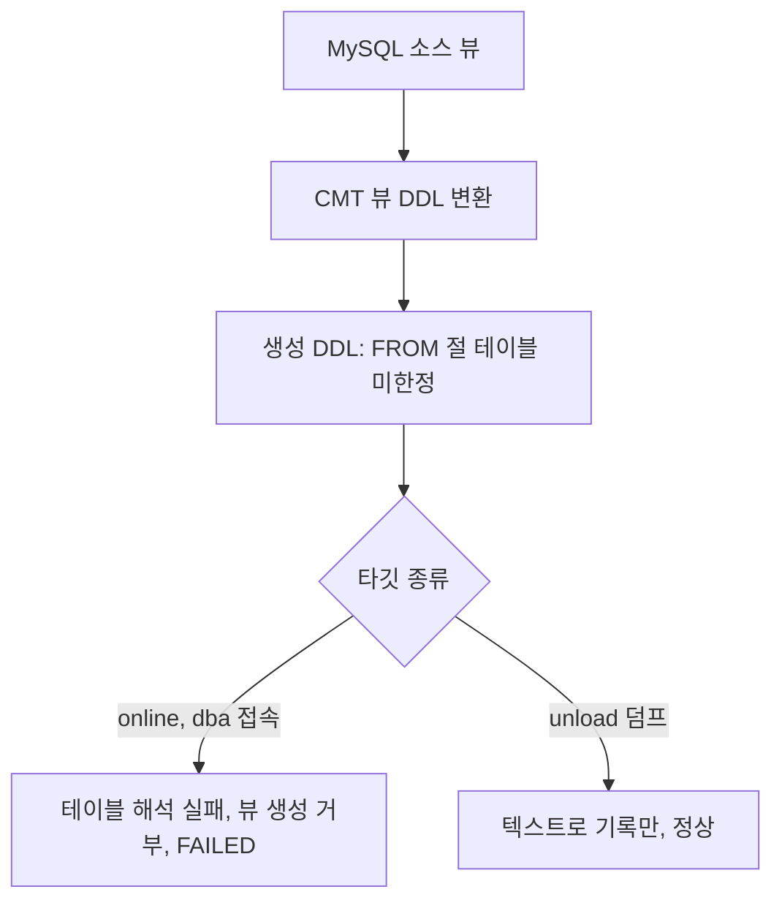

# CMT MySQL→CUBRID online 뷰 이관 실패 (미한정 테이블 참조)

- 분류: cmt_bug
- 날짜: 2026-07-12
- 관련: CMT e2e MySQL 소스 추가 작업 중 발견 (tests/e2e, MySqlToCubridTest / MySqlToUnloadTest)

## 요약
MySQL 소스를 CUBRID online 타깃으로 이관할 때 CMT가 생성하는 CREATE VIEW의 FROM 절 테이블이 스키마 미한정이라, dba로 접속한 타깃이 테이블을 해석하지 못해 뷰 생성이 거부되고 마이그레이션 전체가 FAILED로 끝난다.

## 목적
CMT e2e에 MySQL 소스를 추가하던 중 발견한 online 뷰 이관 실패를 기록하고, 원인과 영향 범위를 정리한다.

## 배경
CMT e2e 프레임워크에 MySQL 8.0 소스(→ CUBRID) 시나리오를 추가하는 과정에서, 테이블/PK/FK/인덱스/데이터/루틴은 모두 정상 이관되는데 뷰만 online 타깃에 생성되지 않고 마이그레이션이 실패했다.

## 범위 / 방법
- 환경: CMT console 12.0.0, 소스 MySQL 8.0, 타깃 CUBRID 11.4 online (dba 접속, add_schema)
- 조인 뷰와 단일 테이블 뷰 두 형태로 각각 재현 확인
- online 타깃 / unload(덤프) 타깃 / CUBRID→CUBRID online 세 경우 비교
- 원본 스키마 XML의 `view_query_sql`로 CMT가 생성한 뷰 정의 확인

## 발견 / 관찰
- 마이그레이션 리포트에서 뷰만 실패, 전체 결과는 FAILED:

```
view: Exported[1]; Imported[0]
MIGRATION RESULT: FAILED   (exit 1)
```

- CMT가 생성한 뷰 정의(FROM 절 테이블이 스키마 미한정):

```sql
select "o"."order_id" AS "order_id", ... , "o"."ordered_at" AS "ordered_at"
from ("e2e_order" "o" join "e2e_customer" "c" on(("c"."customer_id" = "o"."customer_id")))
```

  단일 테이블 뷰(`from "e2e_order"`)도 동일하게 실패 → 조인/괄호 형태가 아니라 테이블 미한정이 원인.

- 타깃 종류별 결과:

| 시나리오 | 뷰 이관 | 결과 |
|---|---|---|
| MySQL → CUBRID online | Imported[0] | FAILED |
| MySQL → unload (LoadDB 덤프) | Imported[1] | SUCCESS |
| CUBRID → CUBRID online | 정상 | SUCCESS |

- 실패 시 CMT stderr에 상세 CUBRID 에러는 남지 않고 리포트 카운트(Imported[0])로만 확인된다.



## 결론
MySQL 소스 뷰를 online 이관할 때 CMT가 뷰 DDL의 테이블 참조를 대상 스키마로 한정하지 않는 것이 원인으로 보인다. 타깃 연결이 dba이므로 미한정 테이블이 소유자 스키마로 해석되지 않아 뷰 생성이 거부된다. unload는 DDL을 텍스트로 기록만 하므로 영향이 없고, CUBRID 소스 뷰는 네이티브 DDL이 이미 스키마 한정되어 문제가 없다.

## 다음 단계
- CMT JIRA 버그 등록: MySQL→CUBRID online 뷰 DDL의 FROM 절 테이블 스키마 한정 누락 (초안 작성 완료)
- e2e에서는 MySQL 시드에서 뷰를 잠정 제외(적용 가능한 항목만 검증)하고 본 노트/이슈로 추적
- 수정 방향(참고): 뷰 변환 시 FROM 절 테이블을 대상 스키마로 한정하거나, 뷰 생성 세션에 소유자 스키마 컨텍스트를 설정

## 참고
- CMT e2e: tests/e2e (`MySqlToCubridTest`, `MySqlToUnloadTest`)
- MySQL 계열 e2e 제약 전반(ENUM/SET/JSON 등)은 별도 기록 참조
