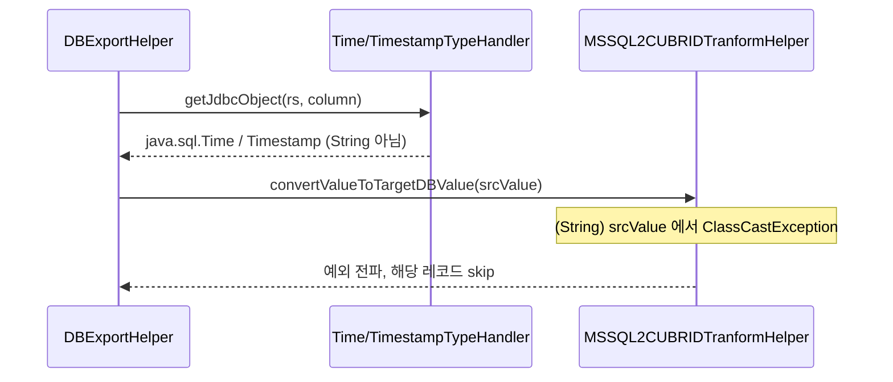

# MSSQL → CUBRID 이관 발견 사항 (TIME/DATETIME2 값 유실, 코멘트 이관)

- 분류: cmt_bug
- 날짜: 2026-07-13
- 관련: CMT e2e 테스트에 MSSQL 소스 추가 작업 중 발견

## 요약
SQL Server 소스를 CUBRID로 이관할 때 non-null `TIME` 및 `DATETIME2` 컬럼 값이 값 변환 단계에서 `ClassCastException`으로 조용히 유실되어 해당 레코드가 통째로 누락된다. CMT의 MSSQL 값 변환기가 값을 `String`으로 캐스팅하지만, export 계층은 `java.sql.Time`/`java.sql.Timestamp` 객체를 넘기기 때문이다.

## 목적
CMT e2e 테스트에 MSSQL 소스를 추가하면서 마이그레이션 리포트의 레코드 수 불일치를 발견하고, 스냅샷과 CMT 엔진 소스를 근거로 원인을 확정한다. 마이그레이션은 exit 1(FAILED)로 끝나며 일부 레코드가 사라진다.

## 배경
MSSQL e2e 데이터셋(비즈니스 그래프 + 타입 배터리 + 뷰 + 시노님)을 CUBRID online 및 unload로 이관하던 중, 시간 타입을 담은 테이블에서만 레코드가 유실되었다. 뷰, 시노님, DESC 인덱스, 컬럼 코멘트 등 다른 객체는 정상 이관되었다.

## 범위 / 방법
- 소스: SQL Server 2022. 타깃: CUBRID 11.4 (online), CMT unload(LoadDB) 덤프.
- 드라이버: mssql-jdbc 9.4.1 (Microsoft JDBC).
- 테스트 빌드: CMT Console 12.0.0.0318.
- 확정 방법: (1) 마이그레이션 리포트의 record 수, (2) unload 덤프 파일 내용(누락 재현), (3) CMT 엔진 소스 코드 경로 추적, (4) 해당 컬럼 제거 후 재이관하여 green 확인.

## 발견 / 관찰

### 1. TIME / DATETIME2 값 유실 (버그)
시간 타입을 담은 테이블에서 non-null `TIME`/`DATETIME2` 값을 가진 행이 이관되지 않는다. online, unload 양쪽에서 동일하게 재현된다.

| 대상 | record Exported | record Imported | 유실 |
|------|-----------------|-----------------|------|
| online (CUBRID) | 28 | 26 | 2 |
| unload (덤프) | 28 | 26 | 2 |

unload(덤프 파일 생성, CUBRID 접속 없음)에서도 동일하게 유실되므로, CUBRID 입력이 아니라 소스 값 변환(export) 단계의 문제다. 유실된 행은 `TIME`/`DATETIME2`가 non-null인 행이고, 모두 NULL인 행은 정상 이관되었다.

원인: 값 변환기는 값을 `String`으로 캐스팅한다.

```java
// mssql/trans/MSSQL2CUBRIDTranformHelper.convertValueToTargetDBValue
if ("time".equals(dataType) && target == CUBRID_DT_TIME) {
    return ((String) srcValue).substring(0, 8);   // (String) 캐스팅
}
// datetime2:
String datetime = (String) srcValue;              // (String) 캐스팅
```

그러나 export 계층은 이 컬럼들을 `String`이 아니라 JDBC 객체로 읽어 넘긴다.

```java
// core/export/DBExportHelper: JDBC 타입별 값 핸들러
handlerMap1.put(Types.TIME, new TimeTypeHandler());          // rs.getTime()      -> java.sql.Time
handlerMap1.put(Types.TIMESTAMP, new TimestampTypeHandler()); // rs.getTimestamp() -> java.sql.Timestamp
```

MSSQL의 export 헬퍼는 값 읽기 메서드를 오버라이드하지 않으므로(해당 코드가 주석 처리됨) 위 기본 핸들러가 사용된다. 결과적으로 `(String) srcValue`에서 `ClassCastException`이 발생하고, 이 분기는 try-catch가 없어 예외가 레코드 처리 루프로 전파되어 해당 레코드가 skip된다.



영향 범위: non-null `TIME` 또는 `DATETIME2` 컬럼을 가진 모든 MSSQL 소스. 값이 조용히 누락되므로 데이터 유실을 인지하기 어렵다. `DATE`, `DATETIME`, `SMALLDATETIME`은 별도 분기 없이 상위 클래스 변환을 타며 정상 이관된다(비즈니스 테이블의 DATE 컬럼으로 확인).

### 2. 테이블 확장 속성 코멘트 미이관 (관찰)
확장 속성(`MS_Description`)으로 부여한 코멘트 중 컬럼 코멘트는 CUBRID로 이관되나, 테이블 코멘트는 이관되지 않는다.

| 코멘트 대상 | 이관 여부 |
|-------------|-----------|
| 컬럼 (예: customer_name) | 이관됨 |
| 테이블 (예: e2e_customer) | 이관 안 됨(NULL) |

### 3. 참고 (버그 아님, 정상/공통 동작)
- 뷰, 시노님, DESC 인덱스 방향은 정상 이관된다. (Informix가 DESC를 ASC로 떨어뜨리던 것과 대비)
- 프로시저/함수는 이관되지 않는다. MSSQL의 export 헬퍼가 관련 빌더를 오버라이드하지 않아 상위 클래스의 no-op이 사용되며, 이는 MySQL/Informix와 동일한 공통 동작이다.

## 결론
- 발견 1(TIME/DATETIME2 유실)은 데이터 유실을 유발하는 명확한 버그로, 이슈화 우선순위가 높다. 변환기가 `(String)` 캐스팅 대신 `java.sql.Time`/`java.sql.Timestamp`(또는 그 문자열 표현)를 처리하도록 수정이 필요하다.
- 발견 2(테이블 코멘트 미이관)는 결과물 완전성 관점의 관찰이다.
- e2e에서는 발견 1에 해당하는 `TIME`/`DATETIME2`를 타입 배터리에서 제외하고 주석으로 사유를 남겨 green을 확보했다.

## 다음 단계
- 발견 1을 JIRA 버그로 등록 검토 (제목 예: MSSQL 소스의 TIME/DATETIME2 값이 ClassCastException으로 유실됨).
- 등록 시 재현용 시드(비어있지 않은 TIME/DATETIME2 한 행)와 리포트의 record 수 불일치를 근거로 첨부.
- 발견 2는 확장 속성(테이블 레벨) 읽기 경로 확인 후 별도 판단.

## 참고
- 값 변환: `plugins/com.cubrid.cubridmigration.core/src/com/cubrid/cubridmigration/mssql/trans/MSSQL2CUBRIDTranformHelper.java` (convertValueToTargetDBValue)
- 값 읽기 핸들러: `plugins/com.cubrid.cubridmigration.core/src/com/cubrid/cubridmigration/core/export/DBExportHelper.java` (getJdbcObject, handlerMap1), TimeTypeHandler, TimestampTypeHandler
- MSSQL export 헬퍼(값 읽기 오버라이드 주석 처리): `.../mssql/export/MSSQLExportHelper.java`
