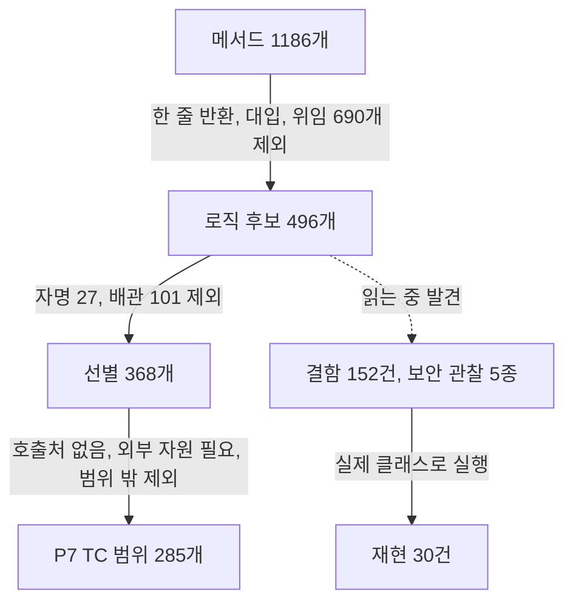

# CMT 공용 유틸과 스키마 모델 코드의 결함 기록

- 분류: cmt_bug
- 날짜: 2026-09-28
- 관련: CMT 레거시 단위 테스트 현대화 P7 (상위 이슈 TOOLS-4976), P6 PR [CUBRID/cubrid-migration#429](https://github.com/CUBRID/cubrid-migration/pull/429)

## 요약
CMT 코어의 공용 유틸, 스키마 모델, 실행 기록 코드를 TC 선별을 위해 전부 읽다가 결함 152건과 보안 관찰 5종을 찾았고, 그중 30건은 실제 클래스를 실행해 재현했다.

## 목적
P7 단위 테스트를 고르면서 발견한 결함을 추후 개선사항으로 보고할 수 있게 한곳에 모은다. 이번 작업은 현재 동작을 그대로 기록하는 특성화 테스트라 프로덕션 코드를 고치지 않으므로, 고칠 거리는 이 기록으로 넘긴다.

## 배경
CMT의 레거시 단위 테스트(Eclipse PDE 프래그먼트)는 빌드에 포함되지 않아 실질 커버리지가 0이었고, 이를 7단계로 나눠 Maven unit-test 모듈에 새로 쓰고 있다. P7은 마지막 단계로 공용 유틸과 스키마 모델을 다룬다. 테스트는 결함을 고치지 않고 `// DEFECT:` 주석으로만 표시하는데, 테스트가 닿지 않는 메서드의 결함도 있어 전체를 따로 적는다.

## 범위 / 방법

| 대상 | 파일 | 메서드(생성자 포함) |
|---|---:|---:|
| `core/common` (`xml` 포함) | 20 | 220 |
| `core/connection` | 8 | 100 |
| `core/dbtype`, `core/io` | 7 | 38 |
| `core/dbobject` | 29 | 540 |
| `cubrid/dbobj`, `mssql/dbobj` | 2 | 45 |
| `core/engine/event`, `core/engine/report` | 32 | 234 |
| `ThreadUtils`, `UserDefinedDataHandlerManager` | 2 | 9 |
| **합계** | **100** | **1186** |

- 기준 소스: `CUBRID/cubrid-migration` develop [`355a129e`](https://github.com/CUBRID/cubrid-migration/tree/355a129e206ddb86fd4e905feb6bec18cafaaac5), 줄 번호도 이 커밋 기준
- 판정: 로직 후보 496개를 6묶음으로 나눠 같은 기준으로 본문을 읽었다. 판정 목록과 후보 목록을 스크립트로 대조해 누락과 중복이 없음을 확인했다
- 재현: 영향이 큰 후보는 unit-test 모듈에 임시 프로브를 만들어 실제 클래스를 실행했다. 프로브는 확인 뒤 지웠다
- Locale에 걸린 것은 en_US, ko_KR, de_DE, fr_FR에서 각각 실행했다
- 시리얼 기본값은 CUBRID 11.4 매뉴얼과 대조했다

## 발견 / 관찰

### 확인 수준

건수는 메서드 기준이다.

| 수준 | 건수 | 뜻 |
|---|---:|---|
| 재현 | 30 | 실제 클래스를 실행해 확인했다. 실측값을 적었다 |
| 코드 확인 | 25 | 코드만으로 동작이 확실하다. 아직 실행하지 않았다 |
| 후보 | 97 | 결함 가능성이 있지만 호출 경로나 입력 조건에 따라 문제가 되지 않을 수 있다 |

### 재현한 결함

#### 마이그레이션 결과가 달라지는 것

| 위치 | 실측 | 영향 |
|---|---|---|
| [`Column.cloneCol:105`](https://github.com/CUBRID/cubrid-migration/blob/355a129e206ddb86fd4e905feb6bec18cafaaac5/plugins/com.cubrid.cubridmigration.core/src/com/cubrid/cubridmigration/core/dbobject/Column.java#L105) | 시작 100, 증분 5 → 복제본 100 / 1 | 대상 컬럼을 이 복제본으로 만들어, CUBRID와 MSSQL 소스의 AUTO_INCREMENT 증분이 1이 됨 |
| [`CUBRIDTrigger.formatPriority:259`](https://github.com/CUBRID/cubrid-migration/blob/355a129e206ddb86fd4e905feb6bec18cafaaac5/plugins/com.cubrid.cubridmigration.core/src/com/cubrid/cubridmigration/cubrid/dbobj/CUBRIDTrigger.java#L259) | de_DE, fr_FR → PRIORITY 01,00, 우선순위 0이면 PRIORITY 00,00 (en_US, ko_KR은 01.00, 0이면 줄 없음) | 소수점이 쉼표인 Locale에서 잘못된 트리거 DDL이 나감 |
| [`FK.getColumnNames:241`](https://github.com/CUBRID/cubrid-migration/blob/355a129e206ddb86fd4e905feb6bec18cafaaac5/plugins/com.cubrid.cubridmigration.core/src/com/cubrid/cubridmigration/core/dbobject/FK.java#L241) [`FK.getCol2RefMapping:124`](https://github.com/CUBRID/cubrid-migration/blob/355a129e206ddb86fd4e905feb6bec18cafaaac5/plugins/com.cubrid.cubridmigration.core/src/com/cubrid/cubridmigration/core/dbobject/FK.java#L124) | B, A 순서로 추가 → [A, B] / B→RB, A→RA 순서로 추가 → [RA, RB] | 복합 FK 컬럼이 선언 순서가 아니라 이름 사전순으로 나감 |
| [`RmInvalidXMLCharReader.read:95`](https://github.com/CUBRID/cubrid-migration/blob/355a129e206ddb86fd4e905feb6bec18cafaaac5/plugins/com.cubrid.cubridmigration.core/src/com/cubrid/cubridmigration/core/io/RmInvalidXMLCharReader.java#L95) [`RmInvalidXMLCharReader.read:115`](https://github.com/CUBRID/cubrid-migration/blob/355a129e206ddb86fd4e905feb6bec18cafaaac5/plugins/com.cubrid.cubridmigration.core/src/com/cubrid/cubridmigration/core/io/RmInvalidXMLCharReader.java#L115) [`RmInvalidXMLCharReader.isValid:142`](https://github.com/CUBRID/cubrid-migration/blob/355a129e206ddb86fd4e905feb6bec18cafaaac5/plugins/com.cubrid.cubridmigration.core/src/com/cubrid/cubridmigration/core/io/RmInvalidXMLCharReader.java#L142) | 이모지 U+1F600 → U+0020 U+0020 / U+D7FF, U+FFFD → 공백 | mysqldump XML 소스를 읽는 경로에서 데이터가 공백으로 바뀜 |
| [`CSVReader.parseLine:160`](https://github.com/CUBRID/cubrid-migration/blob/355a129e206ddb86fd4e905feb6bec18cafaaac5/plugins/com.cubrid.cubridmigration.core/src/com/cubrid/cubridmigration/core/io/CSVReader.java#L160) | ",b,c" → StringIndexOutOfBoundsException | 첫 칸이 빈 CSV 줄을 읽지 못함 |
| [`CharsetUtils.turnOracleCharset2Normal:184`](https://github.com/CUBRID/cubrid-migration/blob/355a129e206ddb86fd4e905feb6bec18cafaaac5/plugins/com.cubrid.cubridmigration.core/src/com/cubrid/cubridmigration/core/common/CharsetUtils.java#L184) | WE8ISO8859P15 → ISO8859-1 | ISO8859P13, P15가 앞선 P1 부분 일치에 먼저 걸림 |
| [`TimeZoneUtils.getGMTFormat:157`](https://github.com/CUBRID/cubrid-migration/blob/355a129e206ddb86fd4e905feb6bec18cafaaac5/plugins/com.cubrid.cubridmigration.core/src/com/cubrid/cubridmigration/core/common/TimeZoneUtils.java#L157) [`TimeZoneUtils.getGMTFormat:141`](https://github.com/CUBRID/cubrid-migration/blob/355a129e206ddb86fd4e905feb6bec18cafaaac5/plugins/com.cubrid.cubridmigration.core/src/com/cubrid/cubridmigration/core/common/TimeZoneUtils.java#L141) | Asia/Kolkata → GMT+05:00 / 없는 ID → GMT+00:00 | 30분, 45분 단위 시간대의 분이 사라지고, 모르는 ID도 오류 없이 GMT+00:00 |
| [`Sequence.getMaxValue:123`](https://github.com/CUBRID/cubrid-migration/blob/355a129e206ddb86fd4e905feb6bec18cafaaac5/plugins/com.cubrid.cubridmigration.core/src/com/cubrid/cubridmigration/core/dbobject/Sequence.java#L123) [`Sequence.getMinValue:129`](https://github.com/CUBRID/cubrid-migration/blob/355a129e206ddb86fd4e905feb6bec18cafaaac5/plugins/com.cubrid.cubridmigration.core/src/com/cubrid/cubridmigration/core/dbobject/Sequence.java#L129) | 기본 최댓값 10^36, 매뉴얼 NOMAXVALUE는 10^37 / 기본 최솟값 -10^37, 매뉴얼 NOMINVALUE는 -10^36 | 값을 정하지 않은 시리얼의 기본 범위가 CUBRID 매뉴얼과 다름 |
| [`Sequence.clone:89`](https://github.com/CUBRID/cubrid-migration/blob/355a129e206ddb86fd4e905feb6bec18cafaaac5/plugins/com.cubrid.cubridmigration.core/src/com/cubrid/cubridmigration/core/dbobject/Sequence.java#L89) | comment "note" → 복제본 null | 복제본으로 만든 시리얼 DDL에 COMMENT가 빠질 수 있음 |

#### 저장과 설정

| 위치 | 실측 | 영향 |
|---|---|---|
| [`CipherUtils.encrypt:72`](https://github.com/CUBRID/cubrid-migration/blob/355a129e206ddb86fd4e905feb6bec18cafaaac5/plugins/com.cubrid.cubridmigration.core/src/com/cubrid/cubridmigration/core/common/CipherUtils.java#L72) | 32자, 64자 → ArrayIndexOutOfBoundsException (8, 31, 33자는 왕복 성공) | 접속 정보와 SSH 프록시 비밀번호 저장이 실패함 |
| [`CUBRIDIOUtils.copyFile:135`](https://github.com/CUBRID/cubrid-migration/blob/355a129e206ddb86fd4e905feb6bec18cafaaac5/plugins/com.cubrid.cubridmigration.core/src/com/cubrid/cubridmigration/core/common/CUBRIDIOUtils.java#L135) | copyFile(f, f) → 파일 크기 0 | 원본과 대상이 같으면 내용이 사라짐 |
| [`XMLMemento.getRoot:494`](https://github.com/CUBRID/cubrid-migration/blob/355a129e206ddb86fd4e905feb6bec18cafaaac5/plugins/com.cubrid.cubridmigration.core/src/com/cubrid/cubridmigration/core/common/xml/XMLMemento.java#L494) | 루트 앞에 주석이나 DOCTYPE → loadMemento가 null | 주석을 단 설정 XML을 읽지 못함 |
| [`XMLMemento.getBoolean:181`](https://github.com/CUBRID/cubrid-migration/blob/355a129e206ddb86fd4e905feb6bec18cafaaac5/plugins/com.cubrid.cubridmigration.core/src/com/cubrid/cubridmigration/core/common/xml/XMLMemento.java#L181) | 없는 키 → false | 인터페이스 문서(null)와 다름 |
| [`PathUtils.getFileKBSize:191`](https://github.com/CUBRID/cubrid-migration/blob/355a129e206ddb86fd4e905feb6bec18cafaaac5/plugins/com.cubrid.cubridmigration.core/src/com/cubrid/cubridmigration/core/common/PathUtils.java#L191) | 10000000 → US "10,000 KB", DE "10.000 KB" | 크기 표시가 Locale을 따름 |

#### 스키마 모델과 메시지

| 위치 | 실측 | 영향 |
|---|---|---|
| [`Index.addColumn:190`](https://github.com/CUBRID/cubrid-migration/blob/355a129e206ddb86fd4e905feb6bec18cafaaac5/plugins/com.cubrid.cubridmigration.core/src/com/cubrid/cubridmigration/core/dbobject/Index.java#L190) [`Index.getIndexColumns:127`](https://github.com/CUBRID/cubrid-migration/blob/355a129e206ddb86fd4e905feb6bec18cafaaac5/plugins/com.cubrid.cubridmigration.core/src/com/cubrid/cubridmigration/core/dbobject/Index.java#L127) | 같은 컬럼을 두 번 넣으면 3개부터 중복 (5개면 C0, C2, C4가 두 번씩) / 컬럼 4개일 때 C1, C3 조회가 null | 비교자가 음수를 돌려주지 않아 TreeMap 탐색이 어긋남 |
| [`Index.setIndexColumns:138`](https://github.com/CUBRID/cubrid-migration/blob/355a129e206ddb86fd4e905feb6bec18cafaaac5/plugins/com.cubrid.cubridmigration.core/src/com/cubrid/cubridmigration/core/dbobject/Index.java#L138) | 정렬 null → false(내림차순) | 스키마 페처들이 null 정렬을 오름차순으로 보는 규칙과 반대 |
| [`Index.isIndexNodePK:269`](https://github.com/CUBRID/cubrid-migration/blob/355a129e206ddb86fd4e905feb6bec18cafaaac5/plugins/com.cubrid.cubridmigration.core/src/com/cubrid/cubridmigration/core/dbobject/Index.java#L269) | 인덱스 종류 -1~3, PK 없음에서 모두 false | 문자열과 int를 비교해 아래 PK 판정이 실행되지 않음 |
| [`View.equals:108`](https://github.com/CUBRID/cubrid-migration/blob/355a129e206ddb86fd4e905feb6bec18cafaaac5/plugins/com.cubrid.cubridmigration.core/src/com/cubrid/cubridmigration/core/dbobject/View.java#L108) | 이름 V, 소유자 A와 B → true | 다른 스키마의 같은 이름 뷰를 같다고 봄 |
| [`Catalog.getDatabaseType:121`](https://github.com/CUBRID/cubrid-migration/blob/355a129e206ddb86fd4e905feb6bec18cafaaac5/plugins/com.cubrid.cubridmigration.core/src/com/cubrid/cubridmigration/core/dbobject/Catalog.java#L121) | new Catalog() → MySQL | DB 종류 기본값 0이 MySQL의 ID |
| [`CreateObjectStartEvent.toString:52`](https://github.com/CUBRID/cubrid-migration/blob/355a129e206ddb86fd4e905feb6bec18cafaaac5/plugins/com.cubrid.cubridmigration.core/src/com/cubrid/cubridmigration/core/engine/event/CreateObjectStartEvent.java#L52) | "Begin to create Create table[t] successfully.." | 사용자에게 보이는 진행 문구가 깨짐 |

#### 입력 검증과 문자열 유틸

| 위치 | 실측 | 영향 |
|---|---|---|
| [`ValidationUtils.isIP:189`](https://github.com/CUBRID/cubrid-migration/blob/355a129e206ddb86fd4e905feb6bec18cafaaac5/plugins/com.cubrid.cubridmigration.core/src/com/cubrid/cubridmigration/core/common/ValidationUtils.java#L189) | "01.02.03.04" → true | 앞에 0이 붙은 주소를 거르는 검사가 동작하지 않음 |
| [`CommonUtils.equalsListsIgnoreOrder:122`](https://github.com/CUBRID/cubrid-migration/blob/355a129e206ddb86fd4e905feb6bec18cafaaac5/plugins/com.cubrid.cubridmigration.core/src/com/cubrid/cubridmigration/core/common/CommonUtils.java#L122) | [a,a,b]와 [a,b,b] → true | 원소 개수를 세지 않음 |
| [`CommonUtils.isASCII:251`](https://github.com/CUBRID/cubrid-migration/blob/355a129e206ddb86fd4e905feb6bec18cafaaac5/plugins/com.cubrid.cubridmigration.core/src/com/cubrid/cubridmigration/core/common/CommonUtils.java#L251) | U+2FE0 → NullPointerException | 어느 유니코드 블록에도 없는 문자에서 NPE |
| [`CommonUtils.str2Double:220`](https://github.com/CUBRID/cubrid-migration/blob/355a129e206ddb86fd4e905feb6bec18cafaaac5/plugins/com.cubrid.cubridmigration.core/src/com/cubrid/cubridmigration/core/common/CommonUtils.java#L220) | "\|1" → NumberFormatException | 정규식 문자 클래스 안의 '\|\|' 때문에 '\|' 문자를 허용함 |

### 보안 관찰

코드로만 확인했고 실제로 공격해 보지는 않았다.

| ID | 내용 | 위치 |
|---|---|---|
| S1 | 스크립트와 이력 파일 속 XML을 `XMLDecoder`로 역직렬화한다. 조작된 파일을 열면 임의 클래스 생성과 메서드 호출이 가능하다 | [`Catalog.loadXML:395`](https://github.com/CUBRID/cubrid-migration/blob/355a129e206ddb86fd4e905feb6bec18cafaaac5/plugins/com.cubrid.cubridmigration.core/src/com/cubrid/cubridmigration/core/dbobject/Catalog.java#L395) [`CUBRIDIOUtils.loadObjectFromXML:356`](https://github.com/CUBRID/cubrid-migration/blob/355a129e206ddb86fd4e905feb6bec18cafaaac5/plugins/com.cubrid.cubridmigration.core/src/com/cubrid/cubridmigration/core/common/CUBRIDIOUtils.java#L356) [`MigrationReport.loadFromReportFile:787`](https://github.com/CUBRID/cubrid-migration/blob/355a129e206ddb86fd4e905feb6bec18cafaaac5/plugins/com.cubrid.cubridmigration.core/src/com/cubrid/cubridmigration/core/engine/report/MigrationReport.java#L787) |
| S2 | zip 항목 이름의 `../`를 막지 않아 대상 폴더 밖에 쓸 수 있다 (Zip Slip) | [`CUBRIDIOUtils.extractFromZip:203`](https://github.com/CUBRID/cubrid-migration/blob/355a129e206ddb86fd4e905feb6bec18cafaaac5/plugins/com.cubrid.cubridmigration.core/src/com/cubrid/cubridmigration/core/common/CUBRIDIOUtils.java#L203) [`CUBRIDIOUtils.unzip:622`](https://github.com/CUBRID/cubrid-migration/blob/355a129e206ddb86fd4e905feb6bec18cafaaac5/plugins/com.cubrid.cubridmigration.core/src/com/cubrid/cubridmigration/core/common/CUBRIDIOUtils.java#L622) |
| S3 | XML 파서에서 외부 엔티티(XXE)를 막지 않는다 | [`XMLMemento.getRoot:494`](https://github.com/CUBRID/cubrid-migration/blob/355a129e206ddb86fd4e905feb6bec18cafaaac5/plugins/com.cubrid.cubridmigration.core/src/com/cubrid/cubridmigration/core/common/xml/XMLMemento.java#L494) |
| S4 | SSH 세션에서 호스트 키 검증을 끈다 (`StrictHostKeyChecking=no`), 중간자 공격에 노출된다 | [`SSHUtils.createSession:131`](https://github.com/CUBRID/cubrid-migration/blob/355a129e206ddb86fd4e905feb6bec18cafaaac5/plugins/com.cubrid.cubridmigration.core/src/com/cubrid/cubridmigration/core/common/SSHUtils.java#L131) |
| S5 | 암호화 키가 코드에 고정되어 있어, 코드만 있으면 저장된 접속 비밀번호를 복호화할 수 있다 | [`CipherUtils.encrypt:72`](https://github.com/CUBRID/cubrid-migration/blob/355a129e206ddb86fd4e905feb6bec18cafaaac5/plugins/com.cubrid.cubridmigration.core/src/com/cubrid/cubridmigration/core/common/CipherUtils.java#L72) |

### P6와 원인이 같은 것

아래 두 건은 P6에서 호출하는 쪽의 결함으로 이미 테스트에 고정했다. 개선사항을 집계할 때 한 번만 센다.

| 위치 | P6에서 고정한 곳 |
|---|---|
| [`CommonUtils.formatCUBRIDNumber:320`](https://github.com/CUBRID/cubrid-migration/blob/355a129e206ddb86fd4e905feb6bec18cafaaac5/plugins/com.cubrid.cubridmigration.core/src/com/cubrid/cubridmigration/core/common/CommonUtils.java#L320) | `NumericHandlerTest` (호출하는 쪽은 `NumericHandler`) |
| [`TimeZoneUtils.getTZFromOffset:170`](https://github.com/CUBRID/cubrid-migration/blob/355a129e206ddb86fd4e905feb6bec18cafaaac5/plugins/com.cubrid.cubridmigration.core/src/com/cubrid/cubridmigration/core/common/TimeZoneUtils.java#L170) | `MySQLSchemaFetcherTest`, `MariaDBSchemaFetcherTest`의 `getTimezone` 테스트 |

### 전체 목록

"처리"는 P7 TC와의 관계다. "TC 대상"은 메서드가 P7 범위에 들어 있어 테스트로 고정할 수 있다는 뜻이고, 나머지는 이 기록으로만 남긴다.

| 처리 | 건수 |
|---|---:|
| TC 대상 | 114 |
| 기록만 (호출처 없음) | 17 |
| 기록만 (외부 자원 필요) | 5 |
| 기록만 (범위 밖 클래스) | 8 |
| 기록만 (규칙 없는 메서드) | 8 |

공용 유틸 (<code>core/common</code>, 77건)

| # | 위치 | 내용 | 수준 | 처리 | 비고 |
|---:|---|---|---|---|---|
| 1 | [`CUBRIDIOUtils.clearFileOrDir:99`](https://github.com/CUBRID/cubrid-migration/blob/355a129e206ddb86fd4e905feb6bec18cafaaac5/plugins/com.cubrid.cubridmigration.core/src/com/cubrid/cubridmigration/core/common/CUBRIDIOUtils.java#L99) | 디렉터리를 가리키는 심볼릭 링크를 따라가 링크 대상의 내용까지 지우고(103·107행), delete() 실패는 모두 무시함(104·109·115행) | 후보 | TC 대상 |  |
| 2 | [`CUBRIDIOUtils.copyFile:135`](https://github.com/CUBRID/cubrid-migration/blob/355a129e206ddb86fd4e905feb6bec18cafaaac5/plugins/com.cubrid.cubridmigration.core/src/com/cubrid/cubridmigration/core/common/CUBRIDIOUtils.java#L135) | 예외가 나면 스트림을 닫지 않고(141행 실패 시 140행 입력 스트림 누수, 루프 중 IOException도 동일), f1과 f2가 같은 파일이면 141행이 먼저 잘라 내용이 사라짐 | 재현 | TC 대상 |  |
| 3 | [`CUBRIDIOUtils.copyFolder:172`](https://github.com/CUBRID/cubrid-migration/blob/355a129e206ddb86fd4e905feb6bec18cafaaac5/plugins/com.cubrid.cubridmigration.core/src/com/cubrid/cubridmigration/core/common/CUBRIDIOUtils.java#L172) | dest가 src 안에 있으면 178행에서 만든 dest가 180행 목록에 다시 잡혀 경로 길이 한계까지 중첩 복사함 | 후보 | TC 대상 |  |
| 4 | [`CUBRIDIOUtils.extractFromZip:203`](https://github.com/CUBRID/cubrid-migration/blob/355a129e206ddb86fd4e905feb6bec18cafaaac5/plugins/com.cubrid.cubridmigration.core/src/com/cubrid/cubridmigration/core/common/CUBRIDIOUtils.java#L203) | 엔트리 이름의 '../'를 막지 않아 outputDir 밖에 쓸 수 있음(Zip Slip, 223행) | 후보 | TC 대상 | 보안 S2 |
| 5 | [`CUBRIDIOUtils.getFileLength:274`](https://github.com/CUBRID/cubrid-migration/blob/355a129e206ddb86fd4e905feb6bec18cafaaac5/plugins/com.cubrid.cubridmigration.core/src/com/cubrid/cubridmigration/core/common/CUBRIDIOUtils.java#L274) | 빈 이름 오류 문구가 getFileInputStream에서 복사돼 'Can't create input stream'이라고 나옴 (277행) | 코드 확인 | TC 대상 |  |
| 6 | [`CUBRIDIOUtils.isLocal:332`](https://github.com/CUBRID/cubrid-migration/blob/355a129e206ddb86fd4e905feb6bec18cafaaac5/plugins/com.cubrid.cubridmigration.core/src/com/cubrid/cubridmigration/core/common/CUBRIDIOUtils.java#L332) | '::1' 등 IPv6 루프백과 127.0.0.1 외 루프백 주소는 호스트 이름이 그 주소로 풀리고 표기까지 같을 때만 로컬로 봄 (333·340행) | 후보 | 기록만 (호출처 없음) |  |
| 7 | [`CUBRIDIOUtils.loadObjectFromXML:356`](https://github.com/CUBRID/cubrid-migration/blob/355a129e206ddb86fd4e905feb6bec18cafaaac5/plugins/com.cubrid.cubridmigration.core/src/com/cubrid/cubridmigration/core/common/CUBRIDIOUtils.java#L356) | XMLDecoder는 임의 클래스 생성·메서드 호출이 가능해 외부에서 들여온 파일을 읽으면 코드 실행 위험 (358행) | 후보 | TC 대상 | 보안 S1 |
| 8 | [`CUBRIDIOUtils.mergeFile:376`](https://github.com/CUBRID/cubrid-migration/blob/355a129e206ddb86fd4e905feb6bec18cafaaac5/plugins/com.cubrid.cubridmigration.core/src/com/cubrid/cubridmigration/core/common/CUBRIDIOUtils.java#L376) | 원본이 없으면 390행 FileNotFoundException으로 389행 출력 스트림이 닫히지 않고, 387행에서 만든 빈 대상 파일이 남음 | 코드 확인 | TC 대상 |  |
| 9 | [`CUBRIDIOUtils.readDataFromExcel:411`](https://github.com/CUBRID/cubrid-migration/blob/355a129e206ddb86fd4e905feb6bec18cafaaac5/plugins/com.cubrid.cubridmigration.core/src/com/cubrid/cubridmigration/core/common/CUBRIDIOUtils.java#L411) | 빈 행(getRow가 null)이나 빈 셀(getCell이 null)이 있으면 422·426행에서 NullPointerException | 후보 | TC 대상 |  |
| 10 | [`CUBRIDIOUtils.saveDataToExcel:506`](https://github.com/CUBRID/cubrid-migration/blob/355a129e206ddb86fd4e905feb6bec18cafaaac5/plugins/com.cubrid.cubridmigration.core/src/com/cubrid/cubridmigration/core/common/CUBRIDIOUtils.java#L506) | autoSizeColumn(524행)을 데이터 행을 넣기 전에 불러 열 너비가 헤더에만 맞춰짐 | 후보 | 기록만 (호출처 없음) |  |
| 11 | [`CUBRIDIOUtils.saveObject2XML:561`](https://github.com/CUBRID/cubrid-migration/blob/355a129e206ddb86fd4e905feb6bec18cafaaac5/plugins/com.cubrid.cubridmigration.core/src/com/cubrid/cubridmigration/core/common/CUBRIDIOUtils.java#L561) | XMLEncoder 기본 ExceptionListener라 직렬화하지 못한 속성은 stderr에만 찍히고 빠진 채 저장됨 (563-566행) | 후보 | 기록만 (호출처 없음) |  |
| 12 | [`CUBRIDIOUtils.unzip:622`](https://github.com/CUBRID/cubrid-migration/blob/355a129e206ddb86fd4e905feb6bec18cafaaac5/plugins/com.cubrid.cubridmigration.core/src/com/cubrid/cubridmigration/core/common/CUBRIDIOUtils.java#L622) | 엔트리 이름의 '../'를 막지 않아 outputDir 밖에 쓸 수 있음(Zip Slip, 638·645행) | 후보 | TC 대상 | 보안 S2 |
| 13 | [`CUBRIDIOUtils.writeLines:697`](https://github.com/CUBRID/cubrid-migration/blob/355a129e206ddb86fd4e905feb6bec18cafaaac5/plugins/com.cubrid.cubridmigration.core/src/com/cubrid/cubridmigration/core/common/CUBRIDIOUtils.java#L697) | 문자셋 이름이 잘못되면 701행에서 기존 파일을 먼저 비운 뒤 702행 위임에서 UnsupportedEncodingException이 남 | 후보 | 기록만 (규칙 없는 메서드) |  |
| 14 | [`CUBRIDIOUtils.writeToFile:787`](https://github.com/CUBRID/cubrid-migration/blob/355a129e206ddb86fd4e905feb6bec18cafaaac5/plugins/com.cubrid.cubridmigration.core/src/com/cubrid/cubridmigration/core/common/CUBRIDIOUtils.java#L787) | PrintWriter가 쓰기 오류를 삼켜(794행) 디스크 부족 같은 실패가 IOException으로 올라오지 않음 | 후보 | TC 대상 |  |
| 15 | [`CUBRIDIOUtils.writeTvSheet:842`](https://github.com/CUBRID/cubrid-migration/blob/355a129e206ddb86fd4e905feb6bec18cafaaac5/plugins/com.cubrid.cubridmigration.core/src/com/cubrid/cubridmigration/core/common/CUBRIDIOUtils.java#L842) | 데이터 행이 columns보다 짧으면 856행 ArrayIndexOutOfBoundsException, 길면 남는 값을 버림 | 후보 | TC 대상 |  |
| 16 | [`CUBRIDIOUtils.zip:869`](https://github.com/CUBRID/cubrid-migration/blob/355a129e206ddb86fd4e905feb6bec18cafaaac5/plugins/com.cubrid.cubridmigration.core/src/com/cubrid/cubridmigration/core/common/CUBRIDIOUtils.java#L869) | 871행 append 모드라 기존 zip이 있으면 그 뒤에 새 zip을 덧붙인 비정상 파일이 되고, remove여도 877행 File.delete라 내용 있는 디렉터리는 남음 | 후보 | TC 대상 |  |
| 17 | [`CUBRIDIOUtils.zip:894`](https://github.com/CUBRID/cubrid-migration/blob/355a129e206ddb86fd4e905feb6bec18cafaaac5/plugins/com.cubrid.cubridmigration.core/src/com/cubrid/cubridmigration/core/common/CUBRIDIOUtils.java#L894) | 최상위 디렉터리 이름을 빼고 자식을 루트에 넣어, 입력 디렉터리들에 같은 이름 파일이 있으면 ZipException(duplicate entry) (907·914행) | 후보 | TC 대상 |  |
| 18 | [`CharsetUtils.getCharsetByte:111`](https://github.com/CUBRID/cubrid-migration/blob/355a129e206ddb86fd4e905feb6bec18cafaaac5/plugins/com.cubrid.cubridmigration.core/src/com/cubrid/cubridmigration/core/common/CharsetUtils.java#L111) | 기본 Locale의 toLowerCase라 tr Locale에서 'ISO-8859-1'이 'ıso-8859-1'이 되어 조회에 실패하고 2를 반환 (115행) | 후보 | TC 대상 |  |
| 19 | [`CharsetUtils.getCharsets:141`](https://github.com/CUBRID/cubrid-migration/blob/355a129e206ddb86fd4e905feb6bec18cafaaac5/plugins/com.cubrid.cubridmigration.core/src/com/cubrid/cubridmigration/core/common/CharsetUtils.java#L141) | contains가 대소문자와 별칭을 구분해 file.encoding이 'utf8'처럼 지정되면 UTF-8과 같은 문자셋이 중복 항목으로 들어감 (151행) | 후보 | TC 대상 |  |
| 20 | [`CharsetUtils.turnOracleCharset2Normal:184`](https://github.com/CUBRID/cubrid-migration/blob/355a129e206ddb86fd4e905feb6bec18cafaaac5/plugins/com.cubrid.cubridmigration.core/src/com/cubrid/cubridmigration/core/common/CharsetUtils.java#L184) | ISO8859P13·ISO8859P15가 앞선 ISO8859P1 부분 일치에 먼저 걸려 ISO8859-1을 반환해 13·15 항목에 도달하지 못함 (161·170·171·186행); 후보: KO16MSWIN949·JA16SJIS 등 표에 없는 문자셋은 JVM 기본 문자셋으로 대체 (190행) | 재현 | TC 대상 |  |
| 21 | [`CharsetUtils.getOracleCharsetByte:199`](https://github.com/CUBRID/cubrid-migration/blob/355a129e206ddb86fd4e905feb6bec18cafaaac5/plugins/com.cubrid.cubridmigration.core/src/com/cubrid/cubridmigration/core/common/CharsetUtils.java#L199) | groupCount()는 매치 여부와 무관한 패턴의 그룹 수라 항상 1이어서 g > 0 검사가 항상 참 (205·207행) | 코드 확인 | 기록만 (호출처 없음) |  |
| 22 | [`CipherUtils.encrypt:72`](https://github.com/CUBRID/cubrid-migration/blob/355a129e206ddb86fd4e905feb6bec18cafaaac5/plugins/com.cubrid.cubridmigration.core/src/com/cubrid/cubridmigration/core/common/CipherUtils.java#L72) | 원문이 32바이트의 배수면 newLength가 length와 같아 buf[length] = 0에서 ArrayIndexOutOfBoundsException (80·85행); 후보: 기본 문자셋 getBytes (77행), 코드에 박힌 고정 키(52행)와 블록 단위 암호화라 코드만 있으면 복호화 가능 | 재현 | TC 대상 | 보안 S5 |
| 23 | [`CipherUtils.decrypt:140`](https://github.com/CUBRID/cubrid-migration/blob/355a129e206ddb86fd4e905feb6bec18cafaaac5/plugins/com.cubrid.cubridmigration.core/src/com/cubrid/cubridmigration/core/common/CipherUtils.java#L140) | getBytes·new String이 기본 문자셋이라 암호화할 때와 JVM 기본 문자셋이 다르면 저장된 비ASCII 암호가 깨짐 (146·166·170행) | 후보 | TC 대상 |  |
| 24 | [`CipherUtils.getHex:180`](https://github.com/CUBRID/cubrid-migration/blob/355a129e206ddb86fd4e905feb6bec18cafaaac5/plugins/com.cubrid.cubridmigration.core/src/com/cubrid/cubridmigration/core/common/CipherUtils.java#L180) | 16진이 아닌 글자를 예외 없이 0으로 바꿔 잘못된 암호문도 조용히 엉뚱한 문자열로 복호화됨 (192-193·208-209행) | 후보 | TC 대상 |  |
| 25 | [`CommonUtils.toEncoding:100`](https://github.com/CUBRID/cubrid-migration/blob/355a129e206ddb86fd4e905feb6bec18cafaaac5/plugins/com.cubrid.cubridmigration.core/src/com/cubrid/cubridmigration/core/common/CommonUtils.java#L100) | str.getBytes()가 JVM 기본 문자셋이라 같은 입력도 기본 문자셋에 따라 결과가 달라짐 (106행) | 후보 | 기록만 (호출처 없음) |  |
| 26 | [`CommonUtils.equalsListsIgnoreOrder:122`](https://github.com/CUBRID/cubrid-migration/blob/355a129e206ddb86fd4e905feb6bec18cafaaac5/plugins/com.cubrid.cubridmigration.core/src/com/cubrid/cubridmigration/core/common/CommonUtils.java#L122) | 원소 개수를 세지 않아 [a,a,b]와 [a,b,b]도 true (134-161행); 주석(129행)은 둘 다 null이면 같다고 하지만 125행에서 false | 재현 | 기록만 (호출처 없음) |  |
| 27 | [`CommonUtils.str2Int:190`](https://github.com/CUBRID/cubrid-migration/blob/355a129e206ddb86fd4e905feb6bec18cafaaac5/plugins/com.cubrid.cubridmigration.core/src/com/cubrid/cubridmigration/core/common/CommonUtils.java#L190) | 정규식은 통과하지만 int 범위를 넘는 값('99999999999')은 0이 아니라 NumberFormatException을 던짐 (193-194행) | 후보 | 기록만 (호출처 없음) |  |
| 28 | [`CommonUtils.str2Long:206`](https://github.com/CUBRID/cubrid-migration/blob/355a129e206ddb86fd4e905feb6bec18cafaaac5/plugins/com.cubrid.cubridmigration.core/src/com/cubrid/cubridmigration/core/common/CommonUtils.java#L206) | long 범위를 넘거나 숫자가 아니면 조용히 0이 되어 호출처 CUBRIDSchemaFetcher의 AUTO_INCREMENT 시작값이 1로 바뀜 (209-210행) | 후보 | TC 대상 |  |
| 29 | [`CommonUtils.str2Double:220`](https://github.com/CUBRID/cubrid-migration/blob/355a129e206ddb86fd4e905feb6bec18cafaaac5/plugins/com.cubrid.cubridmigration.core/src/com/cubrid/cubridmigration/core/common/CommonUtils.java#L220) | 문자 클래스 안의 '\|\|'가 '\|'를 허용해 '\|1'·'1\|5'가 정규식을 통과하고 parseDouble에서 NumberFormatException (221·225행) | 재현 | 기록만 (호출처 없음) |  |
| 30 | [`CommonUtils.isASCII:251`](https://github.com/CUBRID/cubrid-migration/blob/355a129e206ddb86fd4e905feb6bec18cafaaac5/plugins/com.cubrid.cubridmigration.core/src/com/cubrid/cubridmigration/core/common/CommonUtils.java#L251) | 어느 블록에도 속하지 않는 문자(U+2FE0 등)는 UnicodeBlock.of가 null을 돌려 NPE (253-254행) | 재현 | TC 대상 |  |
| 31 | [`CommonUtils.formatCUBRIDNumber:320`](https://github.com/CUBRID/cubrid-migration/blob/355a129e206ddb86fd4e905feb6bec18cafaaac5/plugins/com.cubrid.cubridmigration.core/src/com/cubrid/cubridmigration/core/common/CommonUtils.java#L320) | 기본 Locale의 DecimalFormat이라 de_DE 등에서 소수점이 쉼표('1,5')가 되어 SQL 숫자 값이 깨짐 (321행) | 후보 | TC 대상 | P6와 같은 원인 |
| 32 | [`CommonUtils.getGSSLoginConfigContent:377`](https://github.com/CUBRID/cubrid-migration/blob/355a129e206ddb86fd4e905feb6bec18cafaaac5/plugins/com.cubrid.cubridmigration.core/src/com/cubrid/cubridmigration/core/common/CommonUtils.java#L377) | tkFile의 역슬래시를 이스케이프하지 않아 Windows 경로가 JAAS 설정 파서에서 'C:Users...'처럼 깨질 수 있음 (378행) | 후보 | TC 대상 |  |
| 33 | [`CommonUtils.isInParentheses:387`](https://github.com/CUBRID/cubrid-migration/blob/355a129e206ddb86fd4e905feb6bec18cafaaac5/plugins/com.cubrid.cubridmigration.core/src/com/cubrid/cubridmigration/core/common/CommonUtils.java#L387) | private 생성자(68행)뿐이라 인스턴스를 만들 수 없어 이 인스턴스 메서드는 리플렉션 없이 호출할 수 없음 (387행) | 코드 확인 | 기록만 (호출처 없음) |  |
| 34 | [`CommonUtils.isInDoubleQuotation:400`](https://github.com/CUBRID/cubrid-migration/blob/355a129e206ddb86fd4e905feb6bec18cafaaac5/plugins/com.cubrid.cubridmigration.core/src/com/cubrid/cubridmigration/core/common/CommonUtils.java#L400) | private 생성자(68행)뿐이라 리플렉션 없이 호출할 수 없음; 후보: 큰따옴표 한 글자만 있어도 시작과 끝이 같은 글자라 true (404행) | 코드 확인 | 기록만 (호출처 없음) |  |
| 35 | [`CommonUtils.isInSingleQuotation:413`](https://github.com/CUBRID/cubrid-migration/blob/355a129e206ddb86fd4e905feb6bec18cafaaac5/plugins/com.cubrid.cubridmigration.core/src/com/cubrid/cubridmigration/core/common/CommonUtils.java#L413) | private 생성자(68행)뿐이라 리플렉션 없이 호출할 수 없음; 후보: 작은따옴표 한 글자만 있어도 true (417행) | 코드 확인 | 기록만 (호출처 없음) |  |
| 36 | [`DBUtils.getCubridPartitionExp:120`](https://github.com/CUBRID/cubrid-migration/blob/355a129e206ddb86fd4e905feb6bec18cafaaac5/plugins/com.cubrid.cubridmigration.core/src/com/cubrid/cubridmigration/core/common/DBUtils.java#L120) | 컬럼명을 따옴표로 감싸지 않아, 함수가 없을 때 큰따옴표로 감싸는 호출처(CUBRIDSQLHelper 558-560행)와 달리 예약어·대소문자 컬럼에서 DDL이 깨질 수 있음 (131·137·143행) | 후보 | TC 대상 |  |
| 37 | [`DBUtils.parsePartitionColumns:164`](https://github.com/CUBRID/cubrid-migration/blob/355a129e206ddb86fd4e905feb6bec18cafaaac5/plugins/com.cubrid.cubridmigration.core/src/com/cubrid/cubridmigration/core/common/DBUtils.java#L164) | EXTRACT·cast 판별이 대소문자를 구분해 'extract(...)'·'CAST(...)'는 컬럼을 못 찾고, 중첩 함수 'f(g(c))'는 'g(c'로 잘려 빈 목록 (171-182행) | 후보 | TC 대상 |  |
| 38 | [`DBUtils.normalizePartitionColumnName:204`](https://github.com/CUBRID/cubrid-migration/blob/355a129e206ddb86fd4e905feb6bec18cafaaac5/plugins/com.cubrid.cubridmigration.core/src/com/cubrid/cubridmigration/core/common/DBUtils.java#L204) | MySQL 백틱(`c`)은 벗기지 않아 컬럼을 못 찾고, 큰따옴표 한 글자면 substring(1, 0)으로 StringIndexOutOfBoundsException (210-218행) | 후보 | TC 대상 |  |
| 39 | [`DBUtils.parsePartitionFunc:229`](https://github.com/CUBRID/cubrid-migration/blob/355a129e206ddb86fd4e905feb6bec18cafaaac5/plugins/com.cubrid.cubridmigration.core/src/com/cubrid/cubridmigration/core/common/DBUtils.java#L229) | 'EXTRACT' 판별이 대소문자를 구분해 'extract(year from d)'는 'extract'가 되고 getCubridPartitionExp에서 'extract(d)'로 바뀜 (240행) | 후보 | TC 대상 |  |
| 40 | [`DBUtils.getBitString:283`](https://github.com/CUBRID/cubrid-migration/blob/355a129e206ddb86fd4e905feb6bec18cafaaac5/plugins/com.cubrid.cubridmigration.core/src/com/cubrid/cubridmigration/core/common/DBUtils.java#L283) | len이 bytes.length보다 크면 ArrayIndexOutOfBoundsException인데 Javadoc(279-280행)은 len이 길이보다 작으면 안 된다고 거꾸로 적음 (286-287행) | 후보 | TC 대상 |  |
| 41 | [`DBUtils.reader2String:307`](https://github.com/CUBRID/cubrid-migration/blob/355a129e206ddb86fd4e905feb6bec18cafaaac5/plugins/com.cubrid.cubridmigration.core/src/com/cubrid/cubridmigration/core/common/DBUtils.java#L307) | read 중 IOException이 나면 reader를 닫지 않고 전파 (312-317행) | 후보 | TC 대상 |  |
| 42 | [`DBUtils.rollback:326`](https://github.com/CUBRID/cubrid-migration/blob/355a129e206ddb86fd4e905feb6bec18cafaaac5/plugins/com.cubrid.cubridmigration.core/src/com/cubrid/cubridmigration/core/common/DBUtils.java#L326) | 롤백 실패를 로거 없이 printStackTrace로만 남기고 삼켜 트랜잭션 상태 이상을 알 수 없음 (332-333행) | 후보 | TC 대상 |  |
| 43 | [`PathUtils.checkPathExist:84`](https://github.com/CUBRID/cubrid-migration/blob/355a129e206ddb86fd4e905feb6bec18cafaaac5/plugins/com.cubrid.cubridmigration.core/src/com/cubrid/cubridmigration/core/common/PathUtils.java#L84) | 같은 이름의 일반 파일이 있어도 true(85행), 다른 스레드가 먼저 만들어 mkdirs가 false면 디렉터리가 있어도 false(89행) | 후보 | TC 대상 |  |
| 44 | [`PathUtils.checkPathEmpty:102`](https://github.com/CUBRID/cubrid-migration/blob/355a129e206ddb86fd4e905feb6bec18cafaaac5/plugins/com.cubrid.cubridmigration.core/src/com/cubrid/cubridmigration/core/common/PathUtils.java#L102) | list()가 null(권한 없음 등 I/O 오류)이어도 비었다고 true (105행) | 후보 | TC 대상 |  |
| 45 | [`PathUtils.createFile:116`](https://github.com/CUBRID/cubrid-migration/blob/355a129e206ddb86fd4e905feb6bec18cafaaac5/plugins/com.cubrid.cubridmigration.core/src/com/cubrid/cubridmigration/core/common/PathUtils.java#L116) | 부모 생성 실패 문구에 만들지 못한 부모 대신 그 상위(parentFile.getParent())를 넣음(119행); 후보: 다른 스레드가 먼저 부모를 만들면 mkdirs가 false라 IOException(118행) | 코드 확인 | TC 대상 |  |
| 46 | [`PathUtils.deleteFile:131`](https://github.com/CUBRID/cubrid-migration/blob/355a129e206ddb86fd4e905feb6bec18cafaaac5/plugins/com.cubrid.cubridmigration.core/src/com/cubrid/cubridmigration/core/common/PathUtils.java#L131) | delete() 실패를 버려(132행) 비어 있지 않은 디렉터리나 잠긴 파일이 조용히 남음 | 후보 | 기록만 (규칙 없는 메서드) |  |
| 47 | [`PathUtils.extracFileExt:143`](https://github.com/CUBRID/cubrid-migration/blob/355a129e206ddb86fd4e905feb6bec18cafaaac5/plugins/com.cubrid.cubridmigration.core/src/com/cubrid/cubridmigration/core/common/PathUtils.java#L143) | 점이 디렉터리 이름에만 있으면 'd/file'처럼 경로 조각을 확장자로 돌려줌 (147행) | 후보 | TC 대상 |  |
| 48 | [`PathUtils.getFileKBSize:191`](https://github.com/CUBRID/cubrid-migration/blob/355a129e206ddb86fd4e905feb6bec18cafaaac5/plugins/com.cubrid.cubridmigration.core/src/com/cubrid/cubridmigration/core/common/PathUtils.java#L191) | 기본 Locale의 NumberFormat이라 Locale마다 천 단위 구분자가 달라짐 (200행) | 재현 | TC 대상 |  |
| 49 | [`PathUtils.getURLFilePath:292`](https://github.com/CUBRID/cubrid-migration/blob/355a129e206ddb86fd4e905feb6bec18cafaaac5/plugins/com.cubrid.cubridmigration.core/src/com/cubrid/cubridmigration/core/common/PathUtils.java#L292) | URL 경로를 디코딩하지 않아 '%20' 같은 퍼센트 인코딩이 그대로 남음 (293행) | 후보 | TC 대상 |  |
| 50 | [`PathUtils.initPaths:316`](https://github.com/CUBRID/cubrid-migration/blob/355a129e206ddb86fd4e905feb6bec18cafaaac5/plugins/com.cubrid.cubridmigration.core/src/com/cubrid/cubridmigration/core/common/PathUtils.java#L316) | toCanonicalPath가 실패해 null이면 설치 경로가 File.separator(루트)가 되어 루트 아래에 디렉터리를 만듦 (325-328행) | 후보 | TC 대상 |  |
| 51 | [`PathUtils.mergePath:393`](https://github.com/CUBRID/cubrid-migration/blob/355a129e206ddb86fd4e905feb6bec18cafaaac5/plugins/com.cubrid.cubridmigration.core/src/com/cubrid/cubridmigration/core/common/PathUtils.java#L393) | path1이 null이나 빈 문자열이면 '/'가 앞에 붙어 루트 기준 절대 경로가 됨 (406-409행) | 후보 | TC 대상 |  |
| 52 | [`PathUtils.setWorkspace:429`](https://github.com/CUBRID/cubrid-migration/blob/355a129e206ddb86fd4e905feb6bec18cafaaac5/plugins/com.cubrid.cubridmigration.core/src/com/cubrid/cubridmigration/core/common/PathUtils.java#L429) | tempDir가 이미 있으면 새 workspace로 옮기지 않아 이전 workspace나 setBaseTempDir 값이 남음 (445행) | 후보 | TC 대상 |  |
| 53 | [`PathUtils.transStr2FileName:470`](https://github.com/CUBRID/cubrid-migration/blob/355a129e206ddb86fd4e905feb6bec18cafaaac5/plugins/com.cubrid.cubridmigration.core/src/com/cubrid/cubridmigration/core/common/PathUtils.java#L470) | ':'·'\|'·공백만 바꾸고 '/'·'\'·'*'·'?' 등 파일 이름에 못 쓰는 문자는 그대로 둠 (474행) | 후보 | TC 대상 |  |
| 54 | [`PathUtils.getFileNameWithoutExtendName:493`](https://github.com/CUBRID/cubrid-migration/blob/355a129e206ddb86fd4e905feb6bec18cafaaac5/plugins/com.cubrid.cubridmigration.core/src/com/cubrid/cubridmigration/core/common/PathUtils.java#L493) | 확장자 없는 파일이 점이 든 디렉터리 아래 있으면 디렉터리 이름을 자름 (497행) | 후보 | TC 대상 |  |
| 55 | [`PathUtils.changeLocalFilePath:520`](https://github.com/CUBRID/cubrid-migration/blob/355a129e206ddb86fd4e905feb6bec18cafaaac5/plugins/com.cubrid.cubridmigration.core/src/com/cubrid/cubridmigration/core/common/PathUtils.java#L520) | oldName이 빈 문자열이면 525행이 null만 걸러 replace가 모든 글자 사이에 newName을 끼움 | 후보 | TC 대상 |  |
| 56 | [`PathUtils.changeOldNameToNewName:704`](https://github.com/CUBRID/cubrid-migration/blob/355a129e206ddb86fd4e905feb6bec18cafaaac5/plugins/com.cubrid.cubridmigration.core/src/com/cubrid/cubridmigration/core/common/PathUtils.java#L704) | 스크립트 이름 부분만이 아니라 상대 경로 전체의 oldName을 모두 치환 (709행) | 후보 | TC 대상 |  |
| 57 | [`PathUtils.changeOldNameToNewName:716`](https://github.com/CUBRID/cubrid-migration/blob/355a129e206ddb86fd4e905feb6bec18cafaaac5/plugins/com.cubrid.cubridmigration.core/src/com/cubrid/cubridmigration/core/common/PathUtils.java#L716) | 스크립트 이름 부분만이 아니라 상대 경로 전체의 oldName을 모두 치환 (721행) | 후보 | TC 대상 |  |
| 58 | [`PathUtils.addRootPath:728`](https://github.com/CUBRID/cubrid-migration/blob/355a129e206ddb86fd4e905feb6bec18cafaaac5/plugins/com.cubrid.cubridmigration.core/src/com/cubrid/cubridmigration/core/common/PathUtils.java#L728) | 루트 밖 절대 경로에도 루트를 그대로 앞에 붙여 '/root//other/..'가 됨 (732행) | 후보 | TC 대상 |  |
| 59 | [`PathUtils.removeRootPath:736`](https://github.com/CUBRID/cubrid-migration/blob/355a129e206ddb86fd4e905feb6bec18cafaaac5/plugins/com.cubrid.cubridmigration.core/src/com/cubrid/cubridmigration/core/common/PathUtils.java#L736) | 경로 경계를 보지 않는 startsWith라 '/out'이 '/output/..'에도 걸림 (737행) | 후보 | TC 대상 |  |
| 60 | [`ProxySSH.close:62`](https://github.com/CUBRID/cubrid-migration/blob/355a129e206ddb86fd4e905feb6bec18cafaaac5/plugins/com.cubrid.cubridmigration.core/src/com/cubrid/cubridmigration/core/common/ProxySSH.java#L62) | connect 전이나 openChannel 실패 뒤 호출하면 channel이 null이라 NPE (63행) | 후보 | 기록만 (규칙 없는 메서드) |  |
| 61 | [`SSHUtils.checkAck:67`](https://github.com/CUBRID/cubrid-migration/blob/355a129e206ddb86fd4e905feb6bec18cafaaac5/plugins/com.cubrid.cubridmigration.core/src/com/cubrid/cubridmigration/core/common/SSHUtils.java#L67) | 오류 메시지를 읽다 스트림이 끝나면 read가 계속 -1을 돌려 줄바꿈을 만나지 못하고 무한 루프 (83-86행) | 코드 확인 | TC 대상 |  |
| 62 | [`SSHUtils.newSSHSession:98`](https://github.com/CUBRID/cubrid-migration/blob/355a129e206ddb86fd4e905feb6bec18cafaaac5/plugins/com.cubrid.cubridmigration.core/src/com/cubrid/cubridmigration/core/common/SSHUtils.java#L98) | 본 세션 생성이나 연결이 실패해도 이미 연결한 gatewaySession을 끊지 않아 누수되고, 전달받은 host의 authType을 덮어씀 (106-121행) | 후보 | 기록만 (외부 자원 필요) |  |
| 63 | [`SSHUtils.createSession:131`](https://github.com/CUBRID/cubrid-migration/blob/355a129e206ddb86fd4e905feb6bec18cafaaac5/plugins/com.cubrid.cubridmigration.core/src/com/cubrid/cubridmigration/core/common/SSHUtils.java#L131) | StrictHostKeyChecking=no로 호스트 키 검증을 꺼 중간자 공격에 노출 (138행) | 후보 | TC 대상 | 보안 S4 |
| 64 | [`SSHUtils.initKRBEnvironment:165`](https://github.com/CUBRID/cubrid-migration/blob/355a129e206ddb86fd4e905feb6bec18cafaaac5/plugins/com.cubrid.cubridmigration.core/src/com/cubrid/cubridmigration/core/common/SSHUtils.java#L165) | krbTicket(UI 기본값은 krb5cc_사용자 티켓 캐시) 경로를 java.security.auth.login.config로 지정하고 없으면 그 자리에 JAAS 설정을 써서 티켓 파일과 로그인 설정 파일을 혼동 (172-179행) | 후보 | TC 대상 |  |
| 65 | [`SSHUtils.scpFrom:195`](https://github.com/CUBRID/cubrid-migration/blob/355a129e206ddb86fd4e905feb6bec18cafaaac5/plugins/com.cubrid.cubridmigration.core/src/com/cubrid/cubridmigration/core/common/SSHUtils.java#L195) | checkAck 실패로 286행에서 반환하면 293행 channel.disconnect()를 건너뛰고 예외 때도 채널을 닫지 않음; 후보: 원격이 보낸 파일명을 검증 없이 로컬 경로에 붙임 (258행) | 코드 확인 | 기록만 (외부 자원 필요) |  |
| 66 | [`SSHUtils.scpTo:306`](https://github.com/CUBRID/cubrid-migration/blob/355a129e206ddb86fd4e905feb6bec18cafaaac5/plugins/com.cubrid.cubridmigration.core/src/com/cubrid/cubridmigration/core/common/SSHUtils.java#L306) | 파일명을 '/'로만 잘라 역슬래시를 쓰는 Windows 경로나 '/'로 시작하는 경로('/a', lastIndexOf 0)는 경로째 보냄 (332-336행) | 후보 | 기록만 (외부 자원 필요) |  |
| 67 | [`TextFileUtils.readText:52`](https://github.com/CUBRID/cubrid-migration/blob/355a129e206ddb86fd4e905feb6bec18cafaaac5/plugins/com.cubrid.cubridmigration.core/src/com/cubrid/cubridmigration/core/common/TextFileUtils.java#L52) | 잘못된 encoding(또는 null)이면 InputStreamReader 생성에서 예외가 나 이미 연 파일 스트림을 닫지 않음 (54-57행) | 코드 확인 | TC 대상 |  |
| 68 | [`TimeZoneUtils.getTimeZonesList:95`](https://github.com/CUBRID/cubrid-migration/blob/355a129e206ddb86fd4e905feb6bec18cafaaac5/plugins/com.cubrid.cubridmigration.core/src/com/cubrid/cubridmigration/core/common/TimeZoneUtils.java#L95) | 키를 문자열로 정렬해 GMT+00~+14 뒤에 GMT-01~-12가 오는 등 오프셋 순서가 아님 (62·97행) | 후보 | TC 대상 |  |
| 69 | [`TimeZoneUtils.getGMTByDisplay:109`](https://github.com/CUBRID/cubrid-migration/blob/355a129e206ddb86fd4e905feb6bec18cafaaac5/plugins/com.cubrid.cubridmigration.core/src/com/cubrid/cubridmigration/core/common/TimeZoneUtils.java#L109) | 부분 문자열 검색이라 'Asia'가 GMT+04:00에 걸리고, 100자 절단으로 빠진 ID(Europe/Paris, UTC, Asia/Kolkata)는 null (114-117행, 71-76행) | 후보 | TC 대상 |  |
| 70 | [`TimeZoneUtils.getGMTFormat:141`](https://github.com/CUBRID/cubrid-migration/blob/355a129e206ddb86fd4e905feb6bec18cafaaac5/plugins/com.cubrid.cubridmigration.core/src/com/cubrid/cubridmigration/core/common/TimeZoneUtils.java#L141) | 알 수 없는 ID도 예외 없이 'GMT+00:00'이 됨 (146행) | 재현 | TC 대상 |  |
| 71 | [`TimeZoneUtils.getGMTFormat:157`](https://github.com/CUBRID/cubrid-migration/blob/355a129e206ddb86fd4e905feb6bec18cafaaac5/plugins/com.cubrid.cubridmigration.core/src/com/cubrid/cubridmigration/core/common/TimeZoneUtils.java#L157) | 30·45분 단위가 버려져 +05:30은 GMT+05:00, -00:30은 GMT+00:00이 됨 (158행); 후보: 기본 Locale DecimalFormat이라 sv-SE는 '−'(U+2212), ar-EG는 아라비아 숫자로 출력 (159행) | 재현 | TC 대상 |  |
| 72 | [`TimeZoneUtils.getTZFromOffset:170`](https://github.com/CUBRID/cubrid-migration/blob/355a129e206ddb86fd4e905feb6bec18cafaaac5/plugins/com.cubrid.cubridmigration.core/src/com/cubrid/cubridmigration/core/common/TimeZoneUtils.java#L170) | 인자는 시간 단위인데 MySQL·MariaDB 호출처의 예외 경로가 getRawOffset() 밀리초를 넘겨 'GMT+32400000:00'이 됨 (MySQLSchemaFetcher 1001행, MariaDBSchemaFetcher 1023행) | 후보 | TC 대상 | P6와 같은 원인 |
| 73 | [`TimeZoneUtils.format:230`](https://github.com/CUBRID/cubrid-migration/blob/355a129e206ddb86fd4e905feb6bec18cafaaac5/plugins/com.cubrid.cubridmigration.core/src/com/cubrid/cubridmigration/core/common/TimeZoneUtils.java#L230) | 음수 ms는 '00 00:00:00.00-1'처럼 부호가 자리 채움 사이에 끼어듦 (242-247행) | 후보 | TC 대상 |  |
| 74 | [`ValidationUtils.isValidPathName:100`](https://github.com/CUBRID/cubrid-migration/blob/355a129e206ddb86fd4e905feb6bec18cafaaac5/plugins/com.cubrid.cubridmigration.core/src/com/cubrid/cubridmigration/core/common/ValidationUtils.java#L100) | 주석(115행)은 '~'도 금지한다지만 정규식에 없어 허용됨 (116행) | 후보 | 기록만 (호출처 없음) |  |
| 75 | [`ValidationUtils.isPositiveDouble:159`](https://github.com/CUBRID/cubrid-migration/blob/355a129e206ddb86fd4e905feb6bec18cafaaac5/plugins/com.cubrid.cubridmigration.core/src/com/cubrid/cubridmigration/core/common/ValidationUtils.java#L159) | '0'·'0.0'도 true라 양수가 아니라 음이 아닌 수 검사 (164행) | 후보 | 기록만 (호출처 없음) |  |
| 76 | [`ValidationUtils.isIP:189`](https://github.com/CUBRID/cubrid-migration/blob/355a129e206ddb86fd4e905feb6bec18cafaaac5/plugins/com.cubrid.cubridmigration.core/src/com/cubrid/cubridmigration/core/common/ValidationUtils.java#L189) | indexOf(0)은 문자 '0'이 아닌 NUL(U+0000)을 찾아 항상 -1이라 '01.02.03.04' 같은 선행 0 거부가 동작하지 않음 (206행) | 재현 | 기록만 (호출처 없음) |  |
| 77 | [`ValidationUtils.isSciDouble:223`](https://github.com/CUBRID/cubrid-migration/blob/355a129e206ddb86fd4e905feb6bec18cafaaac5/plugins/com.cubrid.cubridmigration.core/src/com/cubrid/cubridmigration/core/common/ValidationUtils.java#L223) | 문자 클래스 안의 '\|\|'가 '\|'를 허용해 '\|1'·'1\|2'도 true (227행) | 코드 확인 | 기록만 (호출처 없음) |  |

XML 저장 (<code>core/common/xml</code>, 5건)

| # | 위치 | 내용 | 수준 | 처리 | 비고 |
|---:|---|---|---|---|---|
| 78 | [`XMLMemento.getBoolean:181`](https://github.com/CUBRID/cubrid-migration/blob/355a129e206ddb86fd4e905feb6bec18cafaaac5/plugins/com.cubrid.cubridmigration.core/src/com/cubrid/cubridmigration/core/common/xml/XMLMemento.java#L181) | IXMLMemento 문서는 키가 없거나 불리언이 아니면 null이라 했지만 false를 돌려줌 (185·194행) | 재현 | TC 대상 |  |
| 79 | [`XMLMemento.putString:287`](https://github.com/CUBRID/cubrid-migration/blob/355a129e206ddb86fd4e905feb6bec18cafaaac5/plugins/com.cubrid.cubridmigration.core/src/com/cubrid/cubridmigration/core/common/xml/XMLMemento.java#L287) | null이면 기존 속성을 지우지 않고 그대로 남김 (289-291행) | 후보 | TC 대상 |  |
| 80 | [`XMLMemento.saveToFile:421`](https://github.com/CUBRID/cubrid-migration/blob/355a129e206ddb86fd4e905feb6bec18cafaaac5/plugins/com.cubrid.cubridmigration.core/src/com/cubrid/cubridmigration/core/common/xml/XMLMemento.java#L421) | IOException이 아닌 예외(428행)와 close 때 flush 실패(433-435행)를 로그만 남기고 삼킴 | 후보 | 기록만 (호출처 없음) |  |
| 81 | [`XMLMemento.getTextNode:470`](https://github.com/CUBRID/cubrid-migration/blob/355a129e206ddb86fd4e905feb6bec18cafaaac5/plugins/com.cubrid.cubridmigration.core/src/com/cubrid/cubridmigration/core/common/xml/XMLMemento.java#L470) | 공백만 있는 텍스트 노드도 첫 Text로 잡아, 들여쓴 XML을 읽으면 자식 요소만 있는 요소도 null 대신 공백을 돌려줌 (480행) | 후보 | TC 대상 |  |
| 82 | [`XMLMemento.getRoot:494`](https://github.com/CUBRID/cubrid-migration/blob/355a129e206ddb86fd4e905feb6bec18cafaaac5/plugins/com.cubrid.cubridmigration.core/src/com/cubrid/cubridmigration/core/common/xml/XMLMemento.java#L494) | 루트 앞에 주석·DOCTYPE·PI가 있으면 getFirstChild가 요소가 아니어서 null을 돌려줌(499-503행, getDocumentElement를 써야 함); 후보: 외부 엔티티(XXE)도 막지 않음(496행) | 재현 | TC 대상 | 보안 S3 |

접속 관리 (<code>core/connection</code>, 11건)

| # | 위치 | 내용 | 수준 | 처리 | 비고 |
|---:|---|---|---|---|---|
| 83 | [`CMTConParamManager.loadFromFile:107`](https://github.com/CUBRID/cubrid-migration/blob/355a129e206ddb86fd4e905feb6bec18cafaaac5/plugins/com.cubrid.cubridmigration.core/src/com/cubrid/cubridmigration/core/connection/CMTConParamManager.java#L107) | port·databaseTypeID가 없거나 잘못되면 NumberFormatException·NPE·RuntimeException이 잡히지 않아 뒤 항목을 못 읽고, 항목마다 addConnection이 save2File로 defaultFile(호출부에서 같은 파일)을 다시 써서 못 읽은 항목이 파일에서 사라짐 (135, 138, 156행) | 코드 확인 | TC 대상 |  |
| 84 | [`CMTConParamManager.save2File:169`](https://github.com/CUBRID/cubrid-migration/blob/355a129e206ddb86fd4e905feb6bec18cafaaac5/plugins/com.cubrid.cubridmigration.core/src/com/cubrid/cubridmigration/core/connection/CMTConParamManager.java#L169) | 비밀번호가 32바이트 배수면 CipherUtils.encrypt가 ArrayIndexOutOfBoundsException을 던지는데 ParserConfigurationException·IOException만 잡아 add/update/removeConnection 호출자까지 전파됨 (186, 203-206행) | 코드 확인 | TC 대상 |  |
| 85 | [`CMTConParamManager.addConnection:216`](https://github.com/CUBRID/cubrid-migration/blob/355a129e206ddb86fd4e905feb6bec18cafaaac5/plugins/com.cubrid.cubridmigration.core/src/com/cubrid/cubridmigration/core/connection/CMTConParamManager.java#L216) | 관찰자에 저장한 복제본이 아니라 호출자 cp를 그대로 넘겨 JDBCChangingManager 공유 목록이 호출자 객체를 참조함, update·remove는 스냅샷을 넘김 (227행) | 후보 | TC 대상 |  |
| 86 | [`CMTConParamManager.updateConnection:241`](https://github.com/CUBRID/cubrid-migration/blob/355a129e206ddb86fd4e905feb6bec18cafaaac5/plugins/com.cubrid.cubridmigration.core/src/com/cubrid/cubridmigration/core/connection/CMTConParamManager.java#L241) | 새 이름이 다른 연결과 겹치는지 검사하지 않아 addConnection과 달리 같은 이름의 연결이 둘 생길 수 있음 (242-252행) | 후보 | TC 대상 |  |
| 87 | [`CMTConParamManager.updateSelectedSourceCatalog:319`](https://github.com/CUBRID/cubrid-migration/blob/355a129e206ddb86fd4e905feb6bec18cafaaac5/plugins/com.cubrid.cubridmigration.core/src/com/cubrid/cubridmigration/core/connection/CMTConParamManager.java#L319) | 빈 목록 검사를 정규화 전에 해서 공백·null만 담은 목록은 EMPTY 선택으로 캐시되고 getSelectedSourceCatalog(cp, 빈 목록)이 그 Catalog를 돌려줌 (321-324행) | 후보 | TC 대상 |  |
| 88 | [`ConnParameters.getConParam:305`](https://github.com/CUBRID/cubrid-migration/blob/355a129e206ddb86fd4e905feb6bec18cafaaac5/plugins/com.cubrid.cubridmigration.core/src/com/cubrid/cubridmigration/core/connection/ConnParameters.java#L305) | Oracle dbName이 '//'이면 '/'.split('/')가 빈 배열이라 names[0]에서 ArrayIndexOutOfBoundsException, null이면 NPE (323-328행) | 후보 | 기록만 (범위 밖 클래스) |  |
| 89 | [`ConnParameters.getConParamByInfo:354`](https://github.com/CUBRID/cubrid-migration/blob/355a129e206ddb86fd4e905feb6bec18cafaaac5/plugins/com.cubrid.cubridmigration.core/src/com/cubrid/cubridmigration/core/connection/ConnParameters.java#L354) | ConnParameters를 넘겨도 userJDBCURL·timeZone을 옮기지 않아 사용자 JDBC URL이 사라짐 (355-374행) | 후보 | 기록만 (범위 밖 클래스) |  |
| 90 | [`ConnParameters.getDefaultName:384`](https://github.com/CUBRID/cubrid-migration/blob/355a129e206ddb86fd4e905feb6bec18cafaaac5/plugins/com.cubrid.cubridmigration.core/src/com/cubrid/cubridmigration/core/connection/ConnParameters.java#L384) | host가 null이면 new StringBuffer(null)에서 NPE, 나머지 null 필드는 'null' 문자열이 됨 (385-392행) | 후보 | 기록만 (범위 밖 클래스) |  |
| 91 | [`ConnParameters.getDefaultSchema:481`](https://github.com/CUBRID/cubrid-migration/blob/355a129e206ddb86fd4e905feb6bec18cafaaac5/plugins/com.cubrid.cubridmigration.core/src/com/cubrid/cubridmigration/core/connection/ConnParameters.java#L481) | StringUtils.upperCase가 기본 Locale을 따라 tr Locale에서 'i'가 'İ'로 바뀜 (486행) | 후보 | 기록만 (호출처 없음) |  |
| 92 | [`ConnParameters.hashCode:501`](https://github.com/CUBRID/cubrid-migration/blob/355a129e206ddb86fd4e905feb6bec18cafaaac5/plugins/com.cubrid.cubridmigration.core/src/com/cubrid/cubridmigration/core/connection/ConnParameters.java#L501) | 기본 Locale의 toLowerCase라 tr Locale에서 isSameDB로 같은 'ADMIN'과 'admin'의 해시가 달라져 equals/hashCode 계약이 깨짐 (505, 508행) | 후보 | 기록만 (범위 밖 클래스) |  |
| 93 | [`JDBCUtil.getJdbcJarVersion:131`](https://github.com/CUBRID/cubrid-migration/blob/355a129e206ddb86fd4e905feb6bec18cafaaac5/plugins/com.cubrid.cubridmigration.core/src/com/cubrid/cubridmigration/core/connection/JDBCUtil.java#L131) | JarFile을 닫지 않아 호출마다 jar 파일 핸들이 남고, JDBCDriverManagePage 정렬처럼 반복 호출되면 누적됨 (132행) | 코드 확인 | TC 대상 |  |

DB 종류 (<code>core/dbtype</code>, 1건)

| # | 위치 | 내용 | 수준 | 처리 | 비고 |
|---:|---|---|---|---|---|
| 94 | [`DatabaseType.getJDBCData:220`](https://github.com/CUBRID/cubrid-migration/blob/355a129e206ddb86fd4e905feb6bec18cafaaac5/plugins/com.cubrid.cubridmigration.core/src/com/cubrid/cubridmigration/core/dbtype/DatabaseType.java#L220) | 등록 경로를 부분 문자열(indexOf)로 비교하고 없는 파일은 파일명만 써서 'cubrid.jar'가 'JDBC-11.2.1.0040-cubrid.jar'에 맞는 식으로 다른 드라이버를 돌려줌 (227-233행) | 후보 | TC 대상 |  |

입출력 (<code>core/io</code>, 6건)

| # | 위치 | 내용 | 수준 | 처리 | 비고 |
|---:|---|---|---|---|---|
| 95 | [`CSVReader.parseLine:160`](https://github.com/CUBRID/cubrid-migration/blob/355a129e206ddb86fd4e905feb6bec18cafaaac5/plugins/com.cubrid.cubridmigration.core/src/com/cubrid/cubridmigration/core/io/CSVReader.java#L160) | 구분자가 줄 첫 글자(i=0)면 charAt(i - 1)이 charAt(-1)이 되어 StringIndexOutOfBoundsException이라 첫 칸이 빈 줄을 못 읽음, 실제로 쓰이는 au.com.bytecode.opencsv.CSVReader도 같은 코드 (211행) | 재현 | TC 대상 |  |
| 96 | [`RmInvalidXMLCharReader.read:95`](https://github.com/CUBRID/cubrid-migration/blob/355a129e206ddb86fd4e905feb6bec18cafaaac5/plugins/com.cubrid.cubridmigration.core/src/com/cubrid/cubridmigration/core/io/RmInvalidXMLCharReader.java#L95) | 서로게이트 쌍의 두 절반을 모두 무효로 봐 보충 문자(이모지 등)가 공백 두 개가 되고, invalidateChars가 있어도 목록 없이 공백으로 바꿔 read(char[])와 처리가 다름 (99-100행) | 재현 | TC 대상 |  |
| 97 | [`RmInvalidXMLCharReader.read:115`](https://github.com/CUBRID/cubrid-migration/blob/355a129e206ddb86fd4e905feb6bec18cafaaac5/plugins/com.cubrid.cubridmigration.core/src/com/cubrid/cubridmigration/core/io/RmInvalidXMLCharReader.java#L115) | 읽은 count가 아니라 요청 length까지 돌아 이번에 채우지 않은 버퍼 뒤쪽(NUL·이전 내용)도 바꾸고 invalidateChars에 쌓으며, 목록이 없으면 서로게이트 절반이 공백이 되어 보충 문자가 깨짐 (120, 123행) | 재현 | TC 대상 |  |
| 98 | [`RmInvalidXMLCharReader.isValid:142`](https://github.com/CUBRID/cubrid-migration/blob/355a129e206ddb86fd4e905feb6bec18cafaaac5/plugins/com.cubrid.cubridmigration.core/src/com/cubrid/cubridmigration/core/io/RmInvalidXMLCharReader.java#L142) | Arrays.fill 끝 인덱스가 배타적이라 U+D7FF·U+FFFD가 무효로 판정되고(57-58행), char 값만 들어와 0x10000 이상 분기가 쓰이지 않아 서로게이트가 모두 무효 (143-144행) | 재현 | TC 대상 |  |
| 99 | [`SQLParser.executeSQLFile:61`](https://github.com/CUBRID/cubrid-migration/blob/355a129e206ddb86fd4e905feb6bec18cafaaac5/plugins/com.cubrid.cubridmigration.core/src/com/cubrid/cubridmigration/core/io/SQLParser.java#L61) | 인코딩 이름이 잘못되면 InputStreamReader 생성자가 UnsupportedEncodingException을 던져 먼저 연 FileInputStream이 닫히지 않음 (64-66행) | 코드 확인 | 기록만 (규칙 없는 메서드) |  |
| 100 | [`SQLParser.executeSQLFile:78`](https://github.com/CUBRID/cubrid-migration/blob/355a129e206ddb86fd4e905feb6bec18cafaaac5/plugins/com.cubrid.cubridmigration.core/src/com/cubrid/cubridmigration/core/io/SQLParser.java#L78) | '/'·'*'·'-' 뒤 글자를 미리 읽고 따옴표만 검사해 '**/'처럼 *가 짝수 개인 주석 끝을 놓쳐 뒤 문장이 주석에 묶이고, '-' 바로 뒤 줄바꿈은 줄 주석을 끝내지 못함 (101-148행) | 코드 확인 | TC 대상 |  |

스키마 모델 (<code>core/dbobject</code>, 30건)

| # | 위치 | 내용 | 수준 | 처리 | 비고 |
|---:|---|---|---|---|---|
| 101 | [`Catalog.getDatabaseType:121`](https://github.com/CUBRID/cubrid-migration/blob/355a129e206ddb86fd4e905feb6bec18cafaaac5/plugins/com.cubrid.cubridmigration.core/src/com/cubrid/cubridmigration/core/dbobject/Catalog.java#L121) | databaseType 기본값 0이 MySQL ID라 유형을 정하지 않은 Catalog도 MySQL로 보이고 isDbHasUserSchema도 true가 됨 (71, 122행) | 재현 | TC 대상 |  |
| 102 | [`Catalog.setSchemas:162`](https://github.com/CUBRID/cubrid-migration/blob/355a129e206ddb86fd4e905feb6bec18cafaaac5/plugins/com.cubrid.cubridmigration.core/src/com/cubrid/cubridmigration/core/dbobject/Catalog.java#L162) | set인데 목록을 주면 기존 스키마를 지우지 않고 덧붙여 두 번 부르면 중복되고, 자기 getSchemas()를 넘기면 ConcurrentModificationException (163-169행) | 후보 | TC 대상 |  |
| 103 | [`Catalog.saveXML:362`](https://github.com/CUBRID/cubrid-migration/blob/355a129e206ddb86fd4e905feb6bec18cafaaac5/plugins/com.cubrid.cubridmigration.core/src/com/cubrid/cubridmigration/core/dbobject/Catalog.java#L362) | 스키마의 catalog와 테이블 컬럼의 tableOrView를 null로 지운 뒤 되돌리지 않아, 저장 후 원본(설정의 srcCatalog) 역참조가 사라짐 (371, 376행; finally 385행은 connectionParameters만 복원) | 코드 확인 | TC 대상 |  |
| 104 | [`Catalog.loadXML:395`](https://github.com/CUBRID/cubrid-migration/blob/355a129e206ddb86fd4e905feb6bec18cafaaac5/plugins/com.cubrid.cubridmigration.core/src/com/cubrid/cubridmigration/core/dbobject/Catalog.java#L395) | 마이그레이션 스크립트 속 XML을 XMLDecoder로 그대로 역직렬화해, 조작된 스크립트를 열면 임의 클래스 생성·메서드 호출이 가능 (399-400행) | 후보 | TC 대상 | 보안 S1 |
| 105 | [`Catalog.isDbHasUserSchema:414`](https://github.com/CUBRID/cubrid-migration/blob/355a129e206ddb86fd4e905feb6bec18cafaaac5/plugins/com.cubrid.cubridmigration.core/src/com/cubrid/cubridmigration/core/dbobject/Catalog.java#L414) | CUBRID 유형인데 version이 설정되지 않은 Catalog면 NPE (421행) | 후보 | TC 대상 |  |
| 106 | [`Catalog.createCatalog:430`](https://github.com/CUBRID/cubrid-migration/blob/355a129e206ddb86fd4e905feb6bec18cafaaac5/plugins/com.cubrid.cubridmigration.core/src/com/cubrid/cubridmigration/core/dbobject/Catalog.java#L430) | setSchemas→addSchema(215행)가 공유 Schema의 catalog를 복사본으로 바꿔 원본 Catalog의 스키마까지 복사본을 가리키고, port를 옮기지 않아 원본과 equals/hashCode가 달라지며 createSql은 두 번 설정 (433, 435, 437, 442행) | 후보 | TC 대상 |  |
| 107 | [`Column.cloneCol:105`](https://github.com/CUBRID/cubrid-migration/blob/355a129e206ddb86fd4e905feb6bec18cafaaac5/plugins/com.cubrid.cubridmigration.core/src/com/cubrid/cubridmigration/core/dbobject/Column.java#L105) | autoIncIncrVal을 옮기지 않아(122행은 시드만) 복제본 증분이 1로 초기화되고, DBTransformHelper.getCUBRIDColumn(199행)을 거치는 CUBRID·MSSQL 소스의 AUTO_INCREMENT(seed, incr) 증분이 1이 됨 (105-127행) | 재현 | TC 대상 |  |
| 108 | [`Column.getPrecision:198`](https://github.com/CUBRID/cubrid-migration/blob/355a129e206ddb86fd4e905feb6bec18cafaaac5/plugins/com.cubrid.cubridmigration.core/src/com/cubrid/cubridmigration/core/dbobject/Column.java#L198) | null 대신 0을 돌려주므로 호출처의 null 검사(OracleSchemaFetcher 1629행, DBTransformHelper 925행, TiberoTypeFormatter 62·84행)는 항상 거짓 (199행) | 후보 | TC 대상 |  |
| 109 | [`Column.getScale:202`](https://github.com/CUBRID/cubrid-migration/blob/355a129e206ddb86fd4e905feb6bec18cafaaac5/plugins/com.cubrid.cubridmigration.core/src/com/cubrid/cubridmigration/core/dbobject/Column.java#L202) | null 대신 0을 돌려주므로 호출처의 getScale() != null(AbstractJDBCSchemaFetcher 605행, MSSQLSchemaFetcher 529행, MySQLXMLSchemaParser 167행)은 항상 참이고 TiberoTypeFormatter 87행 scale == null 분기는 도달 불가 (203행) | 후보 | TC 대상 |  |
| 110 | [`Column.setDataTypeInstance:370`](https://github.com/CUBRID/cubrid-migration/blob/355a129e206ddb86fd4e905feb6bec18cafaaac5/plugins/com.cubrid.cubridmigration.core/src/com/cubrid/cubridmigration/core/dbobject/Column.java#L370) | subType이 있으면 precision·scale은 sub에서 읽으면서 enumElements는 바깥 dti에서 읽어(375행), getDataTypeInstance()가 sub에 넣은 elements(399행)가 왕복하면 null이 됨 | 후보 | TC 대상 |  |
| 111 | [`FK.getCol2RefMapping:124`](https://github.com/CUBRID/cubrid-migration/blob/355a129e206ddb86fd4e905feb6bec18cafaaac5/plugins/com.cubrid.cubridmigration.core/src/com/cubrid/cubridmigration/core/dbobject/FK.java#L124) | TreeMap(68행)이라 참조 컬럼이 선언(KEY_SEQ) 순서가 아니라 FK 컬럼명 사전순으로 나와, CUBRIDSQLHelper가 만드는 복합 FK DDL의 컬럼 순서가 원본과 달라지고 참조 PK 순서와 어긋나면 CUBRID가 거부할 수 있음 (125행) | 재현 | TC 대상 |  |
| 112 | [`FK.getColumnNames:241`](https://github.com/CUBRID/cubrid-migration/blob/355a129e206ddb86fd4e905feb6bec18cafaaac5/plugins/com.cubrid.cubridmigration.core/src/com/cubrid/cubridmigration/core/dbobject/FK.java#L241) | 68행 TreeMap 때문에 FK 컬럼이 선언 순서가 아니라 이름 사전순으로 나옴, getCol2RefMapping과 같은 원인 (242행) | 재현 | TC 대상 |  |
| 113 | [`FK.getFKString:283`](https://github.com/CUBRID/cubrid-migration/blob/355a129e206ddb86fd4e905feb6bec18cafaaac5/plugins/com.cubrid.cubridmigration.core/src/com/cubrid/cubridmigration/core/dbobject/FK.java#L283) | '] '와 ' > '를 이어 붙여 '>' 앞 공백이 두 칸 (297행) | 후보 | TC 대상 |  |
| 114 | [`Grant.getName:93`](https://github.com/CUBRID/cubrid-migration/blob/355a129e206ddb86fd4e905feb6bec18cafaaac5/plugins/com.cubrid.cubridmigration.core/src/com/cubrid/cubridmigration/core/dbobject/Grant.java#L93) | classOwner가 null이면 빈 문자열로 바꾸지만 점은 남아 'SELECT ON .tbl TO u' 형태가 됨 (98-99행) | 후보 | TC 대상 |  |
| 115 | [`Index.copyFrom:94`](https://github.com/CUBRID/cubrid-migration/blob/355a129e206ddb86fd4e905feb6bec18cafaaac5/plugins/com.cubrid.cubridmigration.core/src/com/cubrid/cubridmigration/core/dbobject/Index.java#L94) | src가 null이면 NPE(FK.copyFrom은 null이면 무시)인데 TableMappingView가 getIndexByName 결과를 그대로 넘기고, comment는 복사하지 않음 (94-100행) | 후보 | TC 대상 |  |
| 116 | [`Index.getIndexColumns:127`](https://github.com/CUBRID/cubrid-migration/blob/355a129e206ddb86fd4e905feb6bec18cafaaac5/plugins/com.cubrid.cubridmigration.core/src/com/cubrid/cubridmigration/core/dbobject/Index.java#L127) | 비교자가 음수를 돌려주지 않아(52행) 반환 맵의 get이 있는 키를 못 찾고, XMLEncoder가 get으로 값을 읽어 saveXML·loadXML을 거치면 3컬럼 이상 인덱스의 첫 컬럼 등 일부 정렬이 null로 저장돼 false(D)로 바뀜 (128-130행, 모사 실측) | 재현 | TC 대상 |  |
| 117 | [`Index.setIndexColumns:138`](https://github.com/CUBRID/cubrid-migration/blob/355a129e206ddb86fd4e905feb6bec18cafaaac5/plugins/com.cubrid.cubridmigration.core/src/com/cubrid/cubridmigration/core/dbobject/Index.java#L138) | null 정렬을 false(내림차순)로 바꿔, fetcher들이 null 정렬을 A로 보는 규칙과 반대이고 59행 주석(A/D/null)과도 어긋남 (146행) | 재현 | TC 대상 |  |
| 118 | [`Index.addColumn:190`](https://github.com/CUBRID/cubrid-migration/blob/355a129e206ddb86fd4e905feb6bec18cafaaac5/plugins/com.cubrid.cubridmigration.core/src/com/cubrid/cubridmigration/core/dbobject/Index.java#L190) | 비교자가 같지 않으면 늘 1을 돌려줘(52행) TreeMap 탐색이 오른쪽으로만 가므로, 컬럼이 3개 이상이면 get이 첫 컬럼 등을 못 찾아 같은 컬럼이 중복 추가됨 (191-192행, 모사 실측) | 재현 | TC 대상 |  |
| 119 | [`Index.isIndexNodePK:269`](https://github.com/CUBRID/cubrid-migration/blob/355a129e206ddb86fd4e905feb6bec18cafaaac5/plugins/com.cubrid.cubridmigration.core/src/com/cubrid/cubridmigration/core/dbobject/Index.java#L269) | String.equals에 int indexType(Integer로 박싱)을 넘겨 조건이 항상 참이라 늘 false를 반환하고 아래 PK 판정은 죽은 코드 (270행) | 재현 | TC 대상 |  |
| 120 | [`PartitionInfo.clone:116`](https://github.com/CUBRID/cubrid-migration/blob/355a129e206ddb86fd4e905feb6bec18cafaaac5/plugins/com.cubrid.cubridmigration.core/src/com/cubrid/cubridmigration/core/dbobject/PartitionInfo.java#L116) | subPartitions는 새 리스트로 바꾸지 않아 원본과 복제본이 같은 리스트를 공유 (124-126행) | 후보 | TC 대상 |  |
| 121 | [`Schema.addView:178`](https://github.com/CUBRID/cubrid-migration/blob/355a129e206ddb86fd4e905feb6bec18cafaaac5/plugins/com.cubrid.cubridmigration.core/src/com/cubrid/cubridmigration/core/dbobject/Schema.java#L178) | null 검사가 없어 views에 null을 넣은 뒤 view.setSchema에서 NPE가 나 목록에 null이 남음(addTable은 null을 무시) (183-184행) | 코드 확인 | TC 대상 |  |
| 122 | [`Sequence.clone:89`](https://github.com/CUBRID/cubrid-migration/blob/355a129e206ddb86fd4e905feb6bec18cafaaac5/plugins/com.cubrid.cubridmigration.core/src/com/cubrid/cubridmigration/core/dbobject/Sequence.java#L89) | comment를 옮기지 않아 호출처 MigrationConfiguration 876행이 comment를 넣기(877행) 전에 복제본으로 만든 DDL에 COMMENT가 빠짐 (89-104행) | 재현 | TC 대상 |  |
| 123 | [`Sequence.getMaxValue:123`](https://github.com/CUBRID/cubrid-migration/blob/355a129e206ddb86fd4e905feb6bec18cafaaac5/plugins/com.cubrid.cubridmigration.core/src/com/cubrid/cubridmigration/core/dbobject/Sequence.java#L123) | null이면 10^36을 돌려주는데 CUBRID 매뉴얼의 NOMAXVALUE 자동값은 10^37이라 getMinValue와 지수가 뒤바뀐 듯 (125행) | 재현 | TC 대상 |  |
| 124 | [`Sequence.getMinValue:129`](https://github.com/CUBRID/cubrid-migration/blob/355a129e206ddb86fd4e905feb6bec18cafaaac5/plugins/com.cubrid.cubridmigration.core/src/com/cubrid/cubridmigration/core/dbobject/Sequence.java#L129) | null이면 -10^37을 돌려주는데 CUBRID 매뉴얼의 NOMINVALUE 자동값은 -10^36이라 getMaxValue와 지수가 뒤바뀐 듯 (131행) | 재현 | TC 대상 |  |
| 125 | [`Table.addFK:78`](https://github.com/CUBRID/cubrid-migration/blob/355a129e206ddb86fd4e905feb6bec18cafaaac5/plugins/com.cubrid.cubridmigration.core/src/com/cubrid/cubridmigration/core/dbobject/Table.java#L78) | javadoc(74행)은 기존 FK를 지운다고 하나 같은 이름이 있으면 새 FK를 조용히 버리고, FK인데 예외 문구가 'Index can't be NULL'·'Index was set into a wrong table.' (80, 83, 85-89행) | 코드 확인 | TC 대상 |  |
| 126 | [`Table.addIndex:97`](https://github.com/CUBRID/cubrid-migration/blob/355a129e206ddb86fd4e905feb6bec18cafaaac5/plugins/com.cubrid.cubridmigration.core/src/com/cubrid/cubridmigration/core/dbobject/Table.java#L97) | javadoc(93행)은 기존 것을 지운다고 하나 같은 이름이 있으면 새 인덱스를 조용히 버림 (104-108행) | 코드 확인 | TC 대상 |  |
| 127 | [`Table.getIndexByName:176`](https://github.com/CUBRID/cubrid-migration/blob/355a129e206ddb86fd4e905feb6bec18cafaaac5/plugins/com.cubrid.cubridmigration.core/src/com/cubrid/cubridmigration/core/dbobject/Table.java#L176) | FK 조회(159행)와 달리 대소문자를 구분해, 대소문자만 다른 같은 이름의 인덱스가 addIndex에서 따로 들어가고 대소문자가 다른 이름으로는 removeIndex도 못 지움 (181행) | 후보 | TC 대상 |  |
| 128 | [`TableOrView.addColumn:135`](https://github.com/CUBRID/cubrid-migration/blob/355a129e206ddb86fd4e905feb6bec18cafaaac5/plugins/com.cubrid.cubridmigration.core/src/com/cubrid/cubridmigration/core/dbobject/TableOrView.java#L135) | 대소문자만 다른 컬럼(Oracle 따옴표 식별자 'ID'/'id' 등)은 중복으로 보고 예외 없이 버림 (136행) | 후보 | TC 대상 |  |
| 129 | [`TableOrView.getColumnByName:164`](https://github.com/CUBRID/cubrid-migration/blob/355a129e206ddb86fd4e905feb6bec18cafaaac5/plugins/com.cubrid.cubridmigration.core/src/com/cubrid/cubridmigration/core/dbobject/TableOrView.java#L164) | 소속 테이블 owner가 null이면 171행 NPE, 호출처 MigrationConfiguration 1551·4513행은 대상 테이블에 원본 테이블명(scc.getParent().getName())을 넘겨 대상 owner가 있을 때 이름이 다른(소문자화 등) 대상 테이블에서는 항상 null이라 1551행은 기존 대상 컬럼을 새로 만듦 (170-172행) | 후보 | TC 대상 |  |
| 130 | [`View.equals:108`](https://github.com/CUBRID/cubrid-migration/blob/355a129e206ddb86fd4e905feb6bec18cafaaac5/plugins/com.cubrid.cubridmigration.core/src/com/cubrid/cubridmigration/core/dbobject/View.java#L108) | name만 비교해 owner가 다른 동명 뷰를 같다고 판정, MigrationConfiguration 716행 targetViews.remove(vw)가 다른 owner의 동명 뷰를 먼저 지울 수 있음 (122-126행) | 재현 | TC 대상 |  |

CUBRID 트리거 (<code>cubrid/dbobj</code>, 3건)

| # | 위치 | 내용 | 수준 | 처리 | 비고 |
|---:|---|---|---|---|---|
| 131 | [`CUBRIDTrigger.setPriority:244`](https://github.com/CUBRID/cubrid-migration/blob/355a129e206ddb86fd4e905feb6bec18cafaaac5/plugins/com.cubrid.cubridmigration.core/src/com/cubrid/cubridmigration/cubrid/dbobj/CUBRIDTrigger.java#L244) | priority가 null이면 Double.parseDouble이 NullPointerException을 던져 catch(NumberFormatException)를 벗어남 (246행) | 후보 | TC 대상 |  |
| 132 | [`CUBRIDTrigger.formatPriority:259`](https://github.com/CUBRID/cubrid-migration/blob/355a129e206ddb86fd4e905feb6bec18cafaaac5/plugins/com.cubrid.cubridmigration.core/src/com/cubrid/cubridmigration/cubrid/dbobj/CUBRIDTrigger.java#L259) | 기본 Locale의 DecimalFormat이라 소수점이 쉼표인 Locale에서 01,00이 되고 getDDL의 new BigDecimal이 실패해 'PRIORITY 00,00'이 나감 (261행, 298-306행) | 재현 | TC 대상 |  |
| 133 | [`CUBRIDTrigger.getDDL:270`](https://github.com/CUBRID/cubrid-migration/blob/355a129e206ddb86fd4e905feb6bec18cafaaac5/plugins/com.cubrid.cubridmigration.core/src/com/cubrid/cubridmigration/cubrid/dbobj/CUBRIDTrigger.java#L270) | priority를 설정하지 않았으면 new BigDecimal(null)이 NullPointerException을 던져 catch(NumberFormatException)를 벗어남 (298행) | 후보 | TC 대상 |  |

이벤트 문구 (<code>core/engine/event</code>, 8건)

| # | 위치 | 내용 | 수준 | 처리 | 비고 |
|---:|---|---|---|---|---|
| 134 | [`CreateObjectEvent.CreateObjectEvent:82`](https://github.com/CUBRID/cubrid-migration/blob/355a129e206ddb86fd4e905feb6bec18cafaaac5/plugins/com.cubrid.cubridmigration.core/src/com/cubrid/cubridmigration/core/engine/event/CreateObjectEvent.java#L82) | error가 null이면 isSuccess=false인데 toString(156행)은 성공 문구를 내고 DefaultMigrationReporter.addEvent(194행)는 NPE (82-86행) | 후보 | 기록만 (규칙 없는 메서드) |  |
| 135 | [`CreateObjectEvent.toString:93`](https://github.com/CUBRID/cubrid-migration/blob/355a129e206ddb86fd4e905feb6bec18cafaaac5/plugins/com.cubrid.cubridmigration.core/src/com/cubrid/cubridmigration/core/engine/event/CreateObjectEvent.java#L93) | 실패 경로의 'Alter'에 공백이 없어 'Alterview[v] unsuccessfully. Detail:...'가 됨 (158행) | 코드 확인 | TC 대상 |  |
| 136 | [`CreateObjectStartEvent.toString:52`](https://github.com/CUBRID/cubrid-migration/blob/355a129e206ddb86fd4e905feb6bec18cafaaac5/plugins/com.cubrid.cubridmigration.core/src/com/cubrid/cubridmigration/core/engine/event/CreateObjectStartEvent.java#L52) | super.toString()이 'Create ... successfully.'를 돌려줘 'Begin to create Create table[t] successfully..'처럼 동사가 겹치고 마침표가 두 번 붙음 (53행) | 재현 | TC 대상 |  |
| 137 | [`ExportSQLEvent.toString:61`](https://github.com/CUBRID/cubrid-migration/blob/355a129e206ddb86fd4e905feb6bec18cafaaac5/plugins/com.cubrid.cubridmigration.core/src/com/cubrid/cubridmigration/core/engine/event/ExportSQLEvent.java#L61) | 사용자 메시지의 'statments' 오타 (68행) | 코드 확인 | TC 대상 |  |
| 138 | [`ImportCSVEvent.toString:96`](https://github.com/CUBRID/cubrid-migration/blob/355a129e206ddb86fd4e905feb6bec18cafaaac5/plugins/com.cubrid.cubridmigration.core/src/com/cubrid/cubridmigration/core/engine/event/ImportCSVEvent.java#L96) | recordCount가 0이면 toString을 재정의하지 않은 SourceCSVConfig를 그대로 붙여 'SourceCSVConfig@해시'가 메시지에 나옴 (98행) | 코드 확인 | TC 대상 |  |
| 139 | [`ImportRecordsEvent.toString:87`](https://github.com/CUBRID/cubrid-migration/blob/355a129e206ddb86fd4e905feb6bec18cafaaac5/plugins/com.cubrid.cubridmigration.core/src/com/cubrid/cubridmigration/core/engine/event/ImportRecordsEvent.java#L87) | 실패 이벤트도 recordCount가 0이면 오류 없이 'No record of table [...] to be imported.'만 나옴 (88-90행) | 후보 | TC 대상 |  |
| 140 | [`LobMigrationErrorEvent.toString:50`](https://github.com/CUBRID/cubrid-migration/blob/355a129e206ddb86fd4e905feb6bec18cafaaac5/plugins/com.cubrid.cubridmigration.core/src/com/cubrid/cubridmigration/core/engine/event/LobMigrationErrorEvent.java#L50) | toString을 부를 때마다 printStackTrace로 표준 오류에 스택을 찍고 메시지 없는 예외면 null을 돌려줌 (51-52행) | 후보 | 기록만 (규칙 없는 메서드) |  |
| 141 | [`MigrationErrorEvent.toString:54`](https://github.com/CUBRID/cubrid-migration/blob/355a129e206ddb86fd4e905feb6bec18cafaaac5/plugins/com.cubrid.cubridmigration.core/src/com/cubrid/cubridmigration/core/engine/event/MigrationErrorEvent.java#L54) | toString을 부를 때마다 printStackTrace로 표준 오류에 스택을 찍고 메시지 없는 예외면 null을 돌려줌 (55-56행) | 후보 | 기록만 (규칙 없는 메서드) |  |

리포트 (<code>core/engine/report</code>, 9건)

| # | 위치 | 내용 | 수준 | 처리 | 비고 |
|---:|---|---|---|---|---|
| 142 | [`DefaultMigrationReporter.DefaultMigrationReporter:105`](https://github.com/CUBRID/cubrid-migration/blob/355a129e206ddb86fd4e905feb6bec18cafaaac5/plugins/com.cubrid.cubridmigration.core/src/com/cubrid/cubridmigration/core/engine/report/DefaultMigrationReporter.java#L105) | 파일 생성이나 MigrationTemplateWriter.save에서 예외가 나면 이미 연 pwLog·pwNonsupport·pwRenameObj를 닫지 않은 채 던짐 (130-155행) | 후보 | 기록만 (외부 자원 필요) |  |
| 143 | [`DefaultMigrationReporter.buildViewDDL:417`](https://github.com/CUBRID/cubrid-migration/blob/355a129e206ddb86fd4e905feb6bec18cafaaac5/plugins/com.cubrid.cubridmigration.core/src/com/cubrid/cubridmigration/core/engine/report/DefaultMigrationReporter.java#L417) | alterDDL이 자바 null이면 SQL_NULL('null')과 달라 joinDDLs가 문자열 'null'을 붙이고, JDBCImporter.createView는 alterDDL을 정하기 전에 성공 이벤트를 보냄 (420행) | 후보 | 기록만 (범위 밖 클래스) |  |
| 144 | [`MigrationBriefReport.loadFromHistoryFile:144`](https://github.com/CUBRID/cubrid-migration/blob/355a129e206ddb86fd4e905feb6bec18cafaaac5/plugins/com.cubrid.cubridmigration.core/src/com/cubrid/cubridmigration/core/engine/report/MigrationBriefReport.java#L144) | 145행은 보고서 디렉터리 기준으로 확인하지만 158행은 파일명만 transferOld2New에 넘겨 168행 new File(hisFile)이 현재 작업 디렉터리 기준이 됨(UI는 hf.getName()을 넘김) | 후보 | 기록만 (범위 밖 클래스) |  |
| 145 | [`MigrationBriefReport.transferOld2New:167`](https://github.com/CUBRID/cubrid-migration/blob/355a129e206ddb86fd4e905feb6bec18cafaaac5/plugins/com.cubrid.cubridmigration.core/src/com/cubrid/cubridmigration/core/engine/report/MigrationBriefReport.java#L167) | 196행은 새 이름 파일이 이미 있을 때만 내용을 옮기고(임시 경로가 정규 경로가 아니면 같은 파일을 지움), 223행 indexOf('.') - 1은 확장자 앞 글자 하나를 잘라내며 점이 없으면 StringIndexOutOfBoundsException | 후보 | 기록만 (범위 밖 클래스) |  |
| 146 | [`MigrationBriefReport.save2BriefFile:263`](https://github.com/CUBRID/cubrid-migration/blob/355a129e206ddb86fd4e905feb6bec18cafaaac5/plugins/com.cubrid.cubridmigration.core/src/com/cubrid/cubridmigration/core/engine/report/MigrationBriefReport.java#L263) | PathUtils.createFile이 이미 있는 파일이면 IOException('Create file failed')을 던져 기존 brief를 덮어쓰지 못함 (265행) | 후보 | 기록만 (범위 밖 클래스) |  |
| 147 | [`MigrationReport.getRecMigResults:435`](https://github.com/CUBRID/cubrid-migration/blob/355a129e206ddb86fd4e905feb6bec18cafaaac5/plugins/com.cubrid.cubridmigration.core/src/com/cubrid/cubridmigration/core/engine/report/MigrationReport.java#L435) | 새로 만든 결과에 srcSchema를 넣지 않아 owner를 준 재조회가 그 결과를 찾지 못하고 매번 새로 추가함 (444-453행) | 후보 | TC 대상 |  |
| 148 | [`MigrationReport.hasError:480`](https://github.com/CUBRID/cubrid-migration/blob/355a129e206ddb86fd4e905feb6bec18cafaaac5/plugins/com.cubrid.cubridmigration.core/src/com/cubrid/cubridmigration/core/engine/report/MigrationReport.java#L480) | 실패한 DB 객체라도 error가 null·공백이면(메시지 없는 예외) 오류로 치지 않음 (482행) | 후보 | TC 대상 |  |
| 149 | [`MigrationReport.initReport:505`](https://github.com/CUBRID/cubrid-migration/blob/355a129e206ddb86fd4e905feb6bec18cafaaac5/plugins/com.cubrid.cubridmigration.core/src/com/cubrid/cubridmigration/core/engine/report/MigrationReport.java#L505) | getDBObjResult는 null을 돌려주지 않아 544·569행 조건이 항상 참이라 547-558·572행이 도달 불가, PK/FK/인덱스 결과가 미리 등록되지 않음; 506-507행은 dataFileResults·objNameResult를 비우지 않음 | 코드 확인 | 기록만 (외부 자원 필요) |  |
| 150 | [`MigrationReport.loadFromReportFile:787`](https://github.com/CUBRID/cubrid-migration/blob/355a129e206ddb86fd4e905feb6bec18cafaaac5/plugins/com.cubrid.cubridmigration.core/src/com/cubrid/cubridmigration/core/engine/report/MigrationReport.java#L787) | .mh 속 report XML을 XMLDecoder로 그대로 역직렬화해 조작된 이력 파일을 열면 임의 클래스 생성·메서드 호출이 가능 (788행) | 후보 | 기록만 (규칙 없는 메서드) | 보안 S1 |

엔진 유틸 (<code>core/engine</code>, 2건)

| # | 위치 | 내용 | 수준 | 처리 | 비고 |
|---:|---|---|---|---|---|
| 151 | [`ThreadUtils.threadSleep:53`](https://github.com/CUBRID/cubrid-migration/blob/355a129e206ddb86fd4e905feb6bec18cafaaac5/plugins/com.cubrid.cubridmigration.core/src/com/cubrid/cubridmigration/core/engine/ThreadUtils.java#L53) | InterruptedException을 잡은 뒤 인터럽트 상태를 복원하지 않아 meh가 null이면(대부분의 호출처) 인터럽트가 흔적 없이 사라짐 (56-58행) | 후보 | TC 대상 |  |
| 152 | [`UserDefinedDataHandlerManager.putColumnDataHandler:83`](https://github.com/CUBRID/cubrid-migration/blob/355a129e206ddb86fd4e905feb6bec18cafaaac5/plugins/com.cubrid.cubridmigration.core/src/com/cubrid/cubridmigration/core/engine/UserDefinedDataHandlerManager.java#L83) | 105행 getHandlerMethod는 null을 돌려주지 않아 조건이 항상 참(convert가 없으면 NoSuchMethodException으로 false) | 코드 확인 | TC 대상 |  |

## 결론
- 재현한 결함 중 마이그레이션 결과가 달라지는 9개 항목(증분, 트리거 PRIORITY, FK 순서, 이모지, CSV, 문자셋, 시간대, 시리얼)은 사용자 데이터에 바로 닿아 개선 우선순위가 가장 높다
- 보안 관찰 5종은 사용자가 여는 외부 파일(스크립트, 이력, zip)과 SSH 접속에서 시작하므로, 기능 결함과 따로 검토해야 한다
- 후보 97건은 호출 경로에 따라 문제가 되지 않을 수 있다. TC를 쓰면서 재현 여부로 다시 가른다

## 다음 단계
- P7 TC 작성 중 재현되는 후보는 수준을 올리고, `// DEFECT:`로 고정한 테스트를 이 노트에 적는다
- 재현한 결함은 P6에서 `// DEFECT:`로 표시한 결함 32건과 묶어 개선 이슈로 보고한다
- 보안 관찰 5종은 별도 이슈로 검토한다

## 참고
- CUBRID 11.4 매뉴얼, CREATE SERIAL: https://www.cubrid.org/manual/en/11.4/sql/schema/serial_stmt.html#create-serial
- CMT 소스 (기준 커밋): https://github.com/CUBRID/cubrid-migration/tree/355a129e206ddb86fd4e905feb6bec18cafaaac5
- P6 PR: https://github.com/CUBRID/cubrid-migration/pull/429
- 상위 이슈 TOOLS-4976: http://jira.cubrid.org/browse/TOOLS-4976
