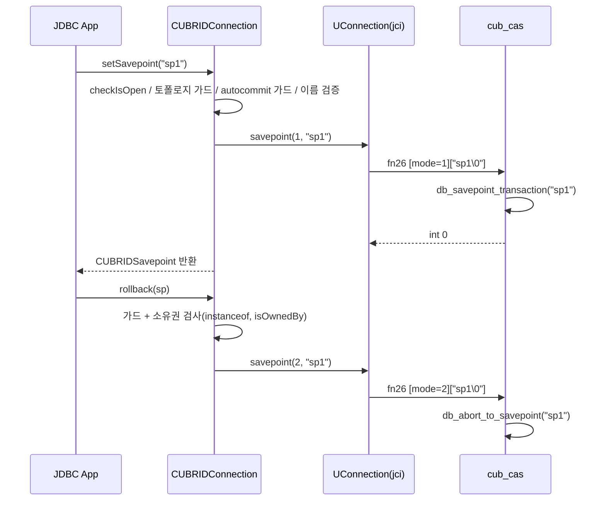

# CUBRID JDBC Savepoint 구현 설계 (setSavepoint / rollback(Savepoint))

- 분류: spec
- 날짜: 2026-07-15
- 관련: cubrid-jdbc (JDBC 드라이버), cubrid (engine/broker 소스 근거)

## 요약
CUBRID JDBC의 savepoint 미구현 4개 메서드를 전용 바이너리 프로토콜 `UFunctionCode.SAVEPOINT(26)` 부활 방식(방식 A)으로 구현한다. `releaseSavepoint`는 서버 지원이 없어 `SQLFeatureNotSupportedException`으로 확정하고, SHARD proxy/CGW 연결에는 드라이버 가드를 둔다.

## 목적
`java.sql.Connection`의 `setSavepoint()`, `setSavepoint(String)`, `rollback(Savepoint)`, `releaseSavepoint(Savepoint)`를 CUBRID JDBC에서 실동작하도록 구현하기 위한 설계를 확정한다.

## 배경
현재 CUBRID JDBC는 savepoint를 전혀 지원하지 않는다.

- 4개 메서드 전부 첫 줄에서 `throw new SQLException(new UnsupportedOperationException())` (CUBRIDConnection.java:524-593). 3.0 시절의 완성된 구현(CUBRIDSavepoint, `u_con.savepoint(mode, name)`)이 통째로 주석 처리되어 있음
- `java.sql.Savepoint` 구현 클래스가 저장소 어디에도 없음 (주석 속 `CUBRIDSavepoint`는 실존한 적 없는 클래스)
- 모순: `CUBRIDDatabaseMetaData.supportsSavepoints()`는 `true`를 반환 (CUBRIDDatabaseMetaData.java:2684)
- 프로토콜 상수는 살아 있음: `UFunctionCode.SAVEPOINT(26)`, `CUBRID_STMT_SAVEPOINT=32`. 서버측 핸들러 `fn_savepoint`(cas_function.c:1829)도 일반 브로커 디스패치 테이블에 배선되어 있고 CCI(`cci_savepoint`)가 수년간 동일 프로토콜을 사용 중

## 범위 / 방법
- 비교 대상 분석: pgjdbc(`PSQLSavepoint` + 평문 SQL), mysql-connector-j(`MysqlSavepoint` + 평문 SQL), 레거시 3.0 주석 코드
- 후보 방식: A(프로토콜 26 부활) vs B(평문 SQL `SAVEPOINT x` / `ROLLBACK TO SAVEPOINT x` 발행)
- 검증 방법: 멀티에이전트 워크플로우 3회(각 조사 + 적대적 검증), 대상은 cubrid-jdbc, cubrid engine/broker(shard proxy, cgw 포함), CUBRID 11.4 매뉴얼, CTP 테스트 저장소, git 이력
- 방식 결정에 사용한 판단 축: 토폴로지별 동작, 트랜잭션 첫 연산 안전성, 이름 처리 충실도, 라운드트립, 변경 표면, 기존 테스트 정합

## 발견 / 관찰

### 방식 비교의 핵심 사실
1. 두 방식 모두 엔진 내부에서 동일 프리미티브로 수렴: set은 `tran_savepoint_internal`, rollback-to는 `tran_abort_upto_user_savepoint`. 의미론 차이 없음
2. SHARD proxy와 CGW는 fn26을 차단하지만, 이는 의미론적 금지가 아니라 최소 화이트리스트 스캐폴딩 (git 이력: SHARD는 2012년 dbgw3.0 임포트 시부터, CGW는 2021년 도입 시부터 기본 차단. `executeBatch`, LOB, `getGeneratedKeys` 등 주류 기능도 같은 테이블에서 차단됨)
3. 방식 B의 SQL도 해당 토폴로지에서는 동작하지 않음. SHARD: shard hint 없는 문장은 라우팅 불가로 에러. CGW(11.4+): DBLink 힌트 게이트가 직접 SQL을 전부 거부(-1356). 즉 어느 방식도 SHARD/CGW에서 실동작은 불가능하고, 선택지는 에러 품질뿐
4. 트랜잭션 첫 연산 안전성: CUBRID는 명시적 begin이 없는 "항상 트랜잭션 중" 모델. tdes는 클라이언트 등록 시점과 commit/abort RPC 내부에서 `TRAN_ACTIVE`로 재무장되며, `log_append_savepoint`는 savepoint가 트랜잭션의 첫 로그 레코드인 경우를 명시 처리(log_append.cpp:1619). CCI 회귀 테스트가 commit 직후 savepoint 설정을 실증. 따라서 A/B 동률
5. 이름 처리: A는 파서 무경유 바이트 전달로 이스케이프, 254바이트 절단, 예약어, 서버 파라미터(`no_backslash_escapes`) 의존이 전혀 없음. B는 문자열 리터럴 + 이스케이프로 동등 충실도가 가능하나 정책 표면이 더 넓음. 서버 이름 매칭은 case-sensitive `strcmp`(log_manager.c:3499), 중복 이름 허용(최신 우선), rollback-to 후 대상 savepoint 생존(반복 롤백 가능), COMMIT/ROLLBACK 시 전체 폐기
6. 라운드트립: A는 1회, B는 2회(PREPARE+EXECUTE)
7. `releaseSavepoint`는 어느 방식으로도 서버 전달 불가: 엔진 문법에 RELEASE 토큰 자체가 없고, fn26은 mode 1(set)/2(rollback)만 구현. 매뉴얼에도 공식 문구 존재: "Savepoints are not supported in dblink transactions." (admin/config, dblink_auto_commit 경고)
8. 드라이버는 접속 핸드셰이크의 broker_info dbms_type 바이트로 토폴로지를 식별 가능: proxy=4~6(`isConnectedToProxy()` 기존 구현), CGW=7~9(상수 미정의, 추가 필요)

### 방식 비교표 (토폴로지 가드 전제)

| 항목 | A. 프로토콜 26 | B. 평문 SQL | 우위 |
|---|---|---|---|
| SHARD/CGW | 가드로 차단 | 가드로 차단 | 동률 |
| 트랜잭션 첫 연산 | 안전 (구조 보장 + CCI 실증) | 안전 | 동률 |
| 이름 처리 | 정책 최소, 파서 무경유 | 이스케이프 + 서버 설정 의존 | A |
| 라운드트립 | 1회 | 2회 | A |
| 변경 표면 | jci 메서드 1개 부활 + driver | driver만 | B |
| 경로 검증 이력 | 서버측 CCI 수년 | 전 구간 CTP 일상 검증 | 근소 B |
| CCI 대칭성 | 동일 프로토콜, 동일 CAS 로그 | 상이 | A |
| 설계 연속성 | 3.0 원설계 복원 | 신규 패턴 | A |

## 결론

### 확정 결정
- 구현 방식: **A, 프로토콜 `SAVEPOINT(26)` 부활**
- `releaseSavepoint(Savepoint)`: 항상 `SQLFeatureNotSupportedException`
- 토폴로지 가드: SHARD proxy/CGW 연결에서 `setSavepoint`/`rollback(Savepoint)` 호출 시 SQL/프로토콜 전송 전에 `SQLFeatureNotSupportedException`
- autocommit ON에서 `setSavepoint`/`rollback(Savepoint)`는 예외 (JDBC 스펙)
- 이름 정책: `null`, 빈 문자열, U+0000 포함만 거부. 그 외 무제약 (바이트 그대로 왕복)
- 클라이언트측 savepoint 레지스트리 없음: 연결당 unnamed 카운터 1개만 유지. 낡은 savepoint 사용은 서버 에러 -550으로 표면화 (pgjdbc와 동일 정책)

### 설계 상세

1. 신규 `CUBRIDSavepoint implements java.sql.Savepoint`: 필드 `con`(소유권), `isNamed`, `id`, `name`. unnamed는 `getSavepointId()` 제공, named는 `getSavepointName()` 제공, 교차 접근은 예외 (pg 패턴). released 플래그 없음
2. `UConnection.savepoint(byte mode, String name)` 부활: 주석 코드(UConnection.java:1610-1624)를 청사진으로 하되 두 가지 드리프트 수정(`new UError(this)`, 스트림 필드 `output`). `putByOID` 템플릿(setBeginTime, checkReconnect, send_recv_msg, logException)을 따르고 `endTransaction`의 failover 꼬리 로직과 `turnOnAutoCommitBySelf`는 복사하지 않음. mode 상수 SET=1/ROLLBACK=2 (서버 `fn_savepoint`와 일치)
3. `UConnection`에 CGW dbms_type 상수 `7/8/9` 추가 및 `isConnectedToGateway()` 신설 (기존 `isConnectedToProxy()`와 대칭)
4. `CUBRIDConnection` 4개 메서드: 가드 순서는 checkIsOpen, 토폴로지, autocommit, 이름 검증. unnamed 이름은 `CUBRID_JDBC_SAVEPOINT_<n>` (연결별 카운터). rollback은 소유권 검사 후 mode 2 호출, savepoint 객체 무효화 없음
5. 에러 코드 신설: `savepoint_in_auto_commit_mode(-21144)`, `invalid_savepoint(-21145)`. 토폴로지 가드와 release는 표준 `SQLFeatureNotSupportedException`
6. `supportsSavepoints()`: proxy/CGW 연결이면 `false`, 일반 브로커면 `true` (기존의 무조건 `true` 모순 해소)
7. 래퍼: `CUBRIDConnectionWrapperPooling` 무변경(자동 상속). `CUBRIDConnectionWrapperXA` 무변경(xa_started 시 release 무음 no-op은 기존 테스트가 고정하므로 보존)
8. `commit()`/`rollback()` 무변경 (정리할 클라이언트 상태 없음)

### 주의/문서화 항목
- 읽기전용 브로커에서 rollback-to는 `CHECK_MODIFICATION_ERROR`로 거부됨 (A 경로 고유, 시맨틱상 수용하고 문서화)
- `db_abort_to_savepoint(NULL)`은 전체 롤백으로 동작하므로 이름 없는 요청은 드라이버에서 원천 차단 (이름 정책으로 충족)
- 매뉴얼 JDBC 페이지의 "java.sql.Savepoint: Not Supported" 기술은 구현 후 갱신 필요

### 기존 테스트 영향
| 테스트 | 영향 |
|---|---|
| TestSavePoint (3건 @Ignore) | 구현 후 un-ignore 가능 |
| TestCUBRIDConnectionWrapperXA test2/3 | autocommit 가드 덕에 계속 통과 |
| 동 test5/6 (foreign Savepoint) | 소유권 검사/release 예외로 계속 통과 |
| TestCUBRIDConnectionWrapperXA2 test6 | 래퍼 보존으로 계속 통과 |
| TestUFunctionCode (SAVEPOINT==26 고정) | A 방식과 자연 정합 |
| Jdbc3SavepointTest (pg 포팅, 봉인됨) | 선택: 봉인 해제 시 기성 기능 테스트 확보 |

## 다음 단계
- 구현 계획 수립(작업 분해) 후 구현: CUBRIDSavepoint, UConnection.savepoint 부활, CUBRIDConnection 4메서드, 에러 코드, metadata, 테스트
- 런타임 스모크 검증(선택, 저렴한 보험): 실제 서버에서 첫 연산 savepoint와 특수 이름 케이스 실측
- 구현 완료 후 CTP JDBC 스위트로 회귀 확인, JIRA 이슈화 및 업스트림 PR 검토
- 부수 발견 별도 이슈화 후보: CGW SQL 주석 파서 무한루프(cas_cgw_execute.c, 미종결 `/*`), `isConnectedToOracle()`의 CGW-Oracle 미인식, supportsSavepoints 모순(본 구현으로 해소)

## 참고
- cubrid-jdbc: `CUBRIDConnection.java`, `UConnection.java`, `UFunctionCode.java`, `CUBRIDDatabaseMetaData.java`
- cubrid: `src/broker/cas_function.c`(fn_savepoint), `src/broker/shard_proxy_handler.c`, `src/broker/cas_cgw.c`, `src/transaction/transaction_cl.c`, `src/transaction/log_manager.c`, `src/parser/csql_grammar.y`
- CUBRID 11.4 매뉴얼: SQL 트랜잭션(SAVEPOINT, ROLLBACK TO), shard 제약, admin/config(dblink_auto_commit 경고), api/jdbc(미지원 표)
- 비교 구현: pgjdbc `PSQLSavepoint`/`PgConnection`, mysql-connector-j `MysqlSavepoint`/`ConnectionImpl`
