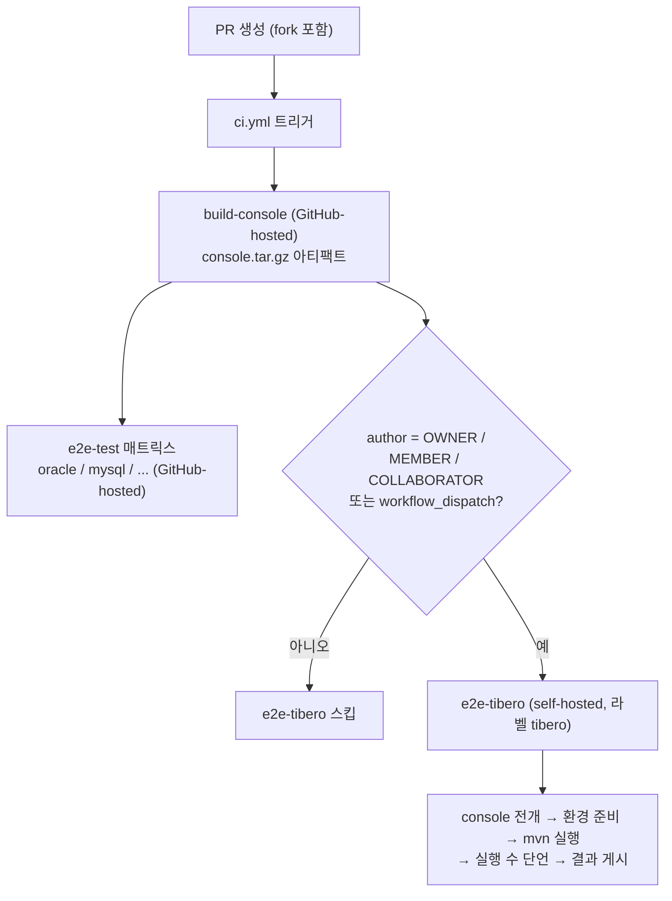
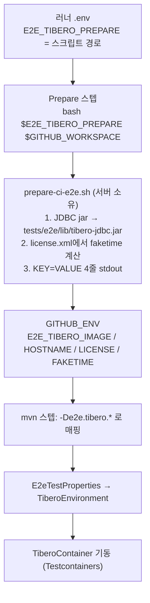

# Tibero e2e를 self-hosted 러너에서 실행하는 CI 구조

- 분류: spec
- 날짜: 2026-07-26
- 관련: CMT e2e 테스트 스위트 (tests/e2e), CMT `.github/workflows/ci.yml`, faketime-tibero (러너 자산)

## 요약
Tibero e2e를 내부망 self-hosted 러너에서 실행하는 CI를 구성했다. CI는 실행 요청과 결과 수집만 담당하고, 이미지/라이선스/JDBC 드라이버/faketime 계산 등 Tibero 고유 환경은 전부 러너에 있는 준비 스크립트가 소유한다. 러너와 CI 사이의 계약은 환경변수 한 개(`E2E_TIBERO_PREPARE`)뿐이다.

## 목적
다른 소스 DBMS는 이미 CI에서 자동 검증되지만 Tibero만 빠져 있었다. 상용 라이선스와 비공개 커스텀 이미지 제약을 지키면서, PR 머지 전에 Tibero 마이그레이션 회귀를 자동으로 잡는 것이 목적이다.

## 배경
- 다른 DBMS(oracle, mysql, mariadb, informix, mssql, cubrid)는 공개 Testcontainers 이미지를 GitHub-hosted 러너가 그대로 받아 쓰므로 외부 설정이 사실상 없다. 이미지 태그가 컨테이너 클래스에 하드코딩되어 있고, JDBC 드라이버도 Maven Central에서 자동으로 내려온다.
- Tibero만 예외다. 이미지를 외부 저장소에 올릴 수 없고, 라이선스 파일과 JDBC 드라이버는 레포에 커밋할 수 없다. 즉 공개 CI 러너에서는 실행 자체가 불가능하다.
- 그래서 이미지/라이선스/드라이버가 이미 있는 내부망 서버에 러너 에이전트를 등록해(라벨 `tibero`) 그 머신에서만 Tibero 잡을 돌린다. 러너는 GitHub로 아웃바운드 폴링만 하므로 인바운드 포트 개방이 필요 없다.

## 범위 / 방법
- 자동 경로만 구현했다. `ci.yml`에 `e2e-tibero` 잡 1개를 추가하고 기존 `build-console`을 공유한다. 외부 기여자용 수동 dispatch 워크플로는 upstream 적용 시점으로 미뤘다.
- 검증은 tibero7 기준(기존 스냅샷과 일치)으로 잡아 배관이 도는지를 먼저 확인했다. Tibero 6 전환은 후속 작업으로 분리했다.
- 컨테이너 기동 방식은 기존 Testcontainers 모델을 유지했다. 러너의 `restart-faketime-tibero*.sh`는 영속 볼륨과 고정 포트로 장기 실행 컨테이너를 띄우는 별개 모델이라, e2e가 매 실행 새로 띄우는 임시 컨테이너와 호환되지 않는다. 따라서 준비 스크립트는 컨테이너를 띄우지 않고 준비만 한다.
- 초안 작성 후 다중 관점 리뷰(bash 정합성, GitHub Actions 시맨틱, 값 전달 계약)로 결함을 찾고, 재현된 것만 수정했다.

## 발견 / 관찰

### 1. 실행 흐름


- `needs: build-console`로 콘솔 빌드를 매트릭스 잡과 공유한다. Tibero 때문에 콘솔을 두 번 빌드하지 않는다.
- 신뢰 게이트는 잡 레벨 `if`로 걸었다. 신뢰된 작성자의 PR은 자동 실행되고, 그 외에는 관리자가 `workflow_dispatch`로 수동 실행한다.

```yaml
if: >
  github.event_name == 'workflow_dispatch' ||
  contains(fromJSON('["OWNER","MEMBER","COLLABORATOR"]'), github.event.pull_request.author_association)
```

- push 이벤트에서는 `github.event.pull_request`가 null이라 조건이 false가 되어 잡이 조용히 스킵된다(표현식 오류가 아니다). 즉 머지 후 자동 실행은 하지 않고, 필요하면 수동으로 돌린다.
- 러너가 단일 머신이고 신뢰 경계가 사람 단위이므로 이 잡은 required 상태 체크로 두지 않는다. 러너가 내려가도 머지가 막히지 않는다.

### 2. 역할 분리: CI는 요청, 서버는 환경
| 역할 | 담당 |
| --- | --- |
| 소스 체크아웃, 콘솔 아티팩트 전개 | CI (워크플로) |
| 이미지 태그, 라이선스 파일, 호스트명 | 러너 (준비 스크립트) |
| JDBC 드라이버 배치 | 러너 (준비 스크립트) |
| faketime 오프셋 계산 | 러너 (준비 스크립트) |
| 테스트 실행 요청, 결과 수집 및 게시 | CI (워크플로) |
| 컨테이너 기동과 검증 | 테스트 코드 (Testcontainers) |

CI가 아는 것은 "준비 스크립트를 호출하면 필요한 값이 나온다"는 사실뿐이다. 워크플로 YAML에는 값이 아니라 변수 이름만 남으므로 public 레포에 커밋해도 안전하다.

### 3. 설정 전달 경로


워크플로 쪽은 두 스텝이 전부다.

```bash
# Prepare 스텝: 스크립트의 stdout(KEY=VALUE)을 그대로 환경에 적재
: "${E2E_TIBERO_PREPARE:?E2E_TIBERO_PREPARE is not set on this runner}"
bash "$E2E_TIBERO_PREPARE" "$GITHUB_WORKSPACE" >> "$GITHUB_ENV"
```

```bash
# 실행 스텝: 환경변수를 프로퍼티 키로 매핑
mvn -B clean test -Dtest='TiberoTo*Test' \
  -De2e.tibero.image="$E2E_TIBERO_IMAGE" \
  -De2e.tibero.hostname="$E2E_TIBERO_HOSTNAME" \
  -De2e.tibero.license="$E2E_TIBERO_LICENSE" \
  -De2e.tibero.faketime="$E2E_TIBERO_FAKETIME"
```

프레임워크가 읽는 키는 로컬과 CI가 동일하고, 해석 순서는 시스템 프로퍼티(`-D`), `e2e-test.properties`, 없으면 스킵이다.

| 프로퍼티 키 | 의미 | CI에서의 출처 |
| --- | --- | --- |
| `e2e.tibero.image` | 커스텀 이미지 태그 | 스크립트 설정 블록 |
| `e2e.tibero.hostname` | 라이선스에 바인딩된 호스트명 | license.xml에서 추출 |
| `e2e.tibero.license` | license.xml 절대 경로 | 스크립트 설정 블록 |
| `e2e.tibero.faketime` | backdate 일수(양의 정수) | license.xml 기준 계산 |

- 프로퍼티 키는 점(`.`)을 쓰지만 환경변수 이름은 점을 쓸 수 없어 이름이 갈린다. 그 둘을 잇는 것이 위 `-D` 매핑 한 줄이다.
- 값 4개를 러너 `.env`에 나열하지 않고 스크립트가 계산해 내보내므로, 러너에 등록할 변수는 스크립트 경로 하나로 줄었다.
- GitHub Secrets를 쓰지 않는 이유: fork PR의 `pull_request` 실행에는 멤버라도 Secrets가 주입되지 않는다. 자동 경로가 곧 "멤버의 fork PR"이라 Secrets 방식이면 값이 비어 스킵된다. 라이선스는 파일이라 Secrets에 넣으려면 업로드가 필요해 제약과도 충돌한다.

### 4. faketime 계산 원리
- 라이선스 유효기간을 벗어나지 않도록 컨테이너 시계를 backdate한다. 테스트는 `FAKETIME=-Nd` 형태로 컨테이너에 주입한다.
- N을 상수로 고정하면 시간이 흐를수록 시계가 앞으로 밀려 언젠가 유효기간을 벗어난다. 그래서 스크립트가 `license.xml`의 시작일 기준으로 매 실행 계산한다. 결과적으로 컨테이너 시계는 항상 라이선스 시작일에 고정되고 드리프트가 없다.
- 계산은 UTC 달력 날짜로 한다. 이미지가 시각을 UTC로 렌더하므로, 호스트 로컬(KST) 날짜로 계산하면 자정부터 오전 9시까지는 시계가 시작일보다 하루 이전으로 잡혀 라이선스 검증이 실패한다. 리뷰 중 해당 오프셋으로 실제 컨테이너를 부팅해 재현했다(`Inactive license, valid from later date`).

### 5. JDBC 드라이버: 버전 중립 파일명
- pom의 `tibero` 프로파일은 파일 존재로 활성화된다. 파일이 있으면 system 스코프 의존성이 붙고, 없으면 Tibero만 조용히 비활성된다. 드라이버가 없는 다른 모든 환경(GitHub-hosted 매트릭스, Tibero를 쓰지 않는 로컬)에서 빌드가 깨지지 않게 하려는 의도적 구조다.
- 대상 파일명을 버전 중립(`tibero-jdbc.jar`)으로 통일했다. 스크립트가 원본을 이 이름으로 복사하므로, Tibero 6으로 바꿀 때 러너 쪽 원본 경로만 바꾸면 되고 pom과 Java는 손대지 않는다. 이름이 박혀 있던 곳은 pom 3곳, Java 2곳, 문서 1곳으로 흩어져 있었다.
- 파일 기반 프로파일 활성화에서는 `${basedir}`를 써야 한다. 3.9 이전 Maven은 `${project.basedir}`를 이 자리에서 보간하지 않아 경로가 리터럴로 남고, 경고 없이 프로파일이 비활성된다. 워크플로는 JDK만 설치하고 Maven은 러너의 것을 쓰므로 러너의 Maven 버전에 좌우된다. 3.6.3, 3.8.8, 3.9.9로 재현 확인했다.

### 6. 조용한 성공(silent green) 차단
- 프레임워크는 환경이 없으면 `@EnabledIf`로 Tibero TC만 스킵한다. 로컬 개발자에게는 올바른 동작이지만, CI에서는 "스킵 전부"와 "통과 전부"가 똑같이 초록불이 된다. 키 이름 표류, 드라이버 손상, 프로파일 비활성이 모두 이 경로로 숨는다.
- 결과 게시 액션은 이를 막지 못한다. fork PR에서 권한 오류를 견디도록 `continue-on-error`와 `action_fail: false`를 두었기 때문이다.
- 그래서 mvn 직후 surefire XML에서 실제 실행 수를 집계해 0이면 잡을 실패시킨다. 이 잡의 존재 이유가 Tibero 커버리지 보장이므로, 커버리지가 사라지면 붉게 드러나야 한다.

```bash
executed=$((executed + tests - skipped))   # TEST-*.xml 전체 합산
[ "$executed" -eq 0 ] && exit 1            # 0이면 환경 문제로 판단
```

### 7. 러너 상시 운영
- 러너 에이전트는 유휴 시간으로 자동 종료되지 않는다. 리스너 프로세스가 살아 있는 동안 계속 대기 상태로 남고, `Offline`은 프로세스가 죽었다는 뜻이다. `run.sh`로 포그라운드 실행하면 터미널 세션 종료와 함께 죽는다.
- 상시 운영은 서비스 모드(`svc.sh install`)로 등록한다. 등록(`config.sh`)과 실행 방식은 별개이므로, 이미 등록된 러너에 서비스만 얹으면 되고 재등록이나 새 토큰은 필요 없다.
- 서비스 모드는 셸 프로필(`.zshrc` 등)을 읽지 않는다. 그래서 `E2E_TIBERO_PREPARE`는 러너 설치 폴더의 `.env`에 둔다. `.env`는 시작 시점에만 읽히므로 수정 후 재시작이 필요하다.
- 워크플로의 `run:` 스텝은 러너 프로세스의 환경변수를 상속하므로 `$VAR`로 읽힌다. `${{ env.VAR }}` 표현식은 워크플로 `env:` 블록만 보고 러너 OS 환경변수는 보지 못한다.

### 8. 리뷰에서 걸러낸 함정
| 증상 | 원인 | 조치 |
| --- | --- | --- |
| 심야 실행만 전멸 | 로컬(KST) 날짜로 faketime 계산, 컨테이너는 UTC 렌더 | UTC 달력 날짜로 계산. 기존 재시작 스크립트에도 동일 결함이 잠복해 함께 수정 |
| 테스트 0개인데 초록불 | 구버전 Maven이 `${project.basedir}`를 파일 활성화에서 미보간 | `${basedir}`로 변경 |
| 환경이 깨졌는데 초록불 | `@EnabledIf` 스킵이 성공으로 집계 | 실행 수 단언 스텝 추가 |
| 이미지 부재가 늦게 드러남 | 준비 단계에 이미지 확인 없음 | 스크립트에 docker 이미지 프리플라이트 추가 |

한편 60분 타임아웃 부족, push 미실행, 협력자 게이트 범위 등은 실측치와 확정 설계에 비추어 문제가 아니라고 판단해 변경하지 않았다.

## 결론
- CI와 서버의 책임이 갈렸다. CI는 실행을 요청하고 결과를 모으며, Tibero 고유 환경은 러너의 준비 스크립트가 소유한다. 계약은 환경변수 한 개다.
- 라이선스와 이미지가 레포나 GitHub로 나가지 않으면서, 신뢰된 작성자의 PR에서는 Tibero e2e가 머지 전에 자동으로 돈다.
- faketime을 라이선스 기준으로 매번 계산해 시간 경과로 깨지는 구조를 제거했고, 환경이 조용히 빠졌을 때 초록불이 뜨는 경로를 세 곳에서 막았다.
- self-hosted 러너에서 `e2e-tibero` 잡이 정상 실행되는 것을 확인했다.

## 다음 단계
- Tibero 6 전환: 컨테이너 클래스(포트, 라이프사이클, ready 로그) 개편, tibero6 드라이버 적용, `tibero_to_*` 스냅샷 재생성. 준비 스크립트는 버전별 디렉터리에 같은 형태로 복제한다.
- 6과 7을 동시에 돌릴 경우: 버전별 매트릭스 레그와 레그별 값 주입, 산출물이 갈리면 버전별 스냅샷 분리.
- upstream 적용 시: 외부 기여자용 수동 dispatch 워크플로 추가, required 체크 정책 확정.
- 성능 개선 후보: 영속 Tibero 인스턴스를 러너에 두고 테스트가 외부 접속하는 모델(매 실행 설치 비용 제거). 프레임워크에 외부 접속 모드가 필요해 별도 검토 대상이다.
- 이슈화: CI 편입과 Tibero 6 전환을 각각 TOOLS 이슈로 분리 예정.

## 참고
- `.github/workflows/ci.yml`: `e2e-tibero` 잡(게이트, 준비 스텝, 실행, 실행 수 단언, 결과 게시)
- `tests/e2e/pom.xml`: `tibero` 프로파일(파일 존재 활성화, system 스코프 의존성, 드라이버 복사)
- `tests/e2e/src/test/java/com/cmt/e2e/framework/db/containers/TiberoEnvironment.java`: 4개 키 정의와 `@EnabledIf` 판정
- `tests/e2e/src/test/java/com/cmt/e2e/framework/core/E2eTestProperties.java`: 해석 순서
- `tests/e2e/src/test/java/com/cmt/e2e/framework/db/containers/TiberoContainer.java`: 이미지, 호스트명, 라이선스, FAKETIME 주입
- `tests/e2e/src/test/java/com/cmt/e2e/framework/db/JdbcDriverJars.java`: 드라이버 탐색 패턴
- `tests/e2e/README.md`, `tests/e2e/e2e-test.properties.example`: 로컬 실행 설정
- faketime-tibero 레포: `prepare-ci-e2e.sh`(CI 준비), `restart-faketime-tibero{6,7}.sh`(장기 실행 컨테이너 갱신)
- GitHub Actions 문서: self-hosted runners, `author_association`, fork PR의 secrets/token 제약, `GITHUB_ENV`
