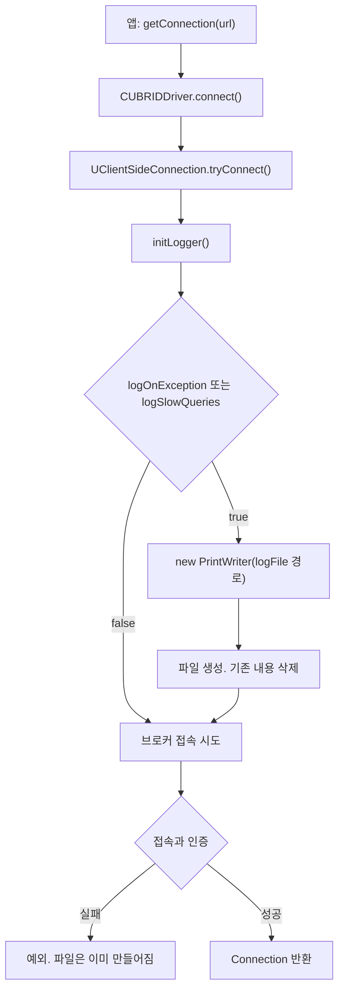
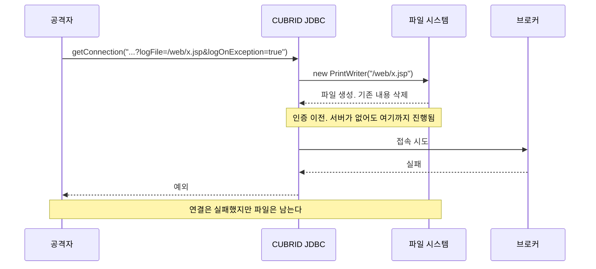
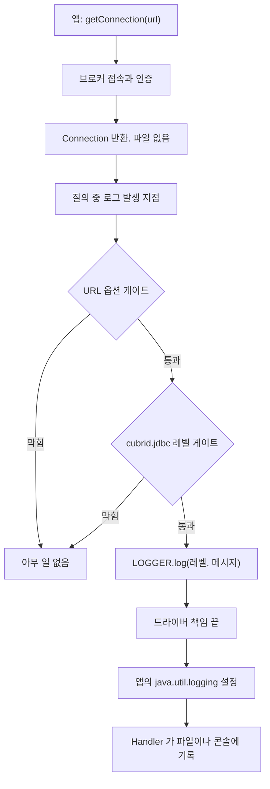
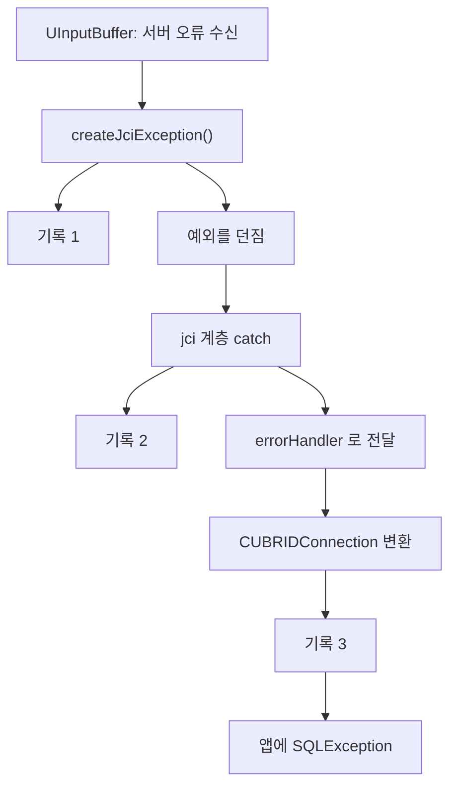

# CUBRID JDBC 로그 파일 생성 방식 변경: 드라이버 직접 생성에서 java.util.logging 위임으로

- 분류: spec
- 날짜: 2026-08-27
- 관련: APIS-1104, [GitHub 이슈 #85](https://github.com/CUBRID/cubrid-jdbc/issues/85)

## 요약

드라이버가 연결 문자열의 `logFile` 경로에 직접 파일을 만들던 방식을 없애고, 로그를 `java.util.logging`에 넘긴다. 출력 위치와 회전 정책은 애플리케이션이 소유한다.

## 목적

`logFile` 옵션의 임의 파일 쓰기 취약점을 해결하면서, 로그의 소유권을 드라이버에서 애플리케이션으로 옮긴다. 이 문서는 **기존 방식과 변경 후 방식이 어떻게 다른지**를 그림으로 정리한다.

## 배경: 기존에는 어떻게 파일을 만들었나

연결을 시도하면 드라이버가 **인증보다 먼저** 파일을 열었다.



세 가지가 문제였다.

| | 내용 |
|---|---|
| 경로 | 연결 문자열이 정한다. 검증이 없다 |
| 시점 | `tryConnect()` 첫 줄. 접속과 인증 이전이다 |
| 열기 방식 | `new PrintWriter(경로)`. append가 아니라 **덮어쓰기** |

세 가지가 겹치면 이렇게 된다.



실측 결과다.

| 시나리오 | 파일 생성 |
|---|---|
| 틀린 비밀번호 | 생성됨 |
| 없는 사용자 | 생성됨 |
| 없는 DB | 생성됨 |
| 도달 불가 호스트 | 생성됨 |
| 지연 연결(소켓 없음) | 생성됨 |

25바이트 파일을 놓고 재현하면 0바이트가 됐다. 덮어쓰기가 맞다.

## 범위 / 방법

- 드라이버 3개 파일 수정, `cubrid.jdbc.log` 패키지(`Log`, `BasicLogger`) 삭제
- 실서버(CUBRID 11.4.5)로 Acceptance Criteria 7건 실측
- 드라이버를 5가지로 변형해 각 TC의 회귀 검출력 확인
- Spring Boot 3.4.1 앱을 만들어 애플리케이션 로그와 드라이버 로그의 분리 시연

## 발견 / 관찰

### 변경 후: 드라이버는 파일을 만들지 않는다



핵심은 **게이트가 두 단계**이고 드라이버의 책임이 `LOGGER.log`에서 끝난다는 것이다.

| 항목 | 기존 | 변경 후 |
|---|---|---|
| 출력 위치 결정 | 드라이버 (`logFile`) | 애플리케이션 (JUL 설정) |
| 파일 생성 시점 | 연결 시도 시 | 실제 기록이 생길 때 |
| 파일 열기 방식 | 덮어쓰기 고정 | 앱이 정함 (append, 회전) |
| 로그 레벨 | 필터가 항상 `ALL`이라 무의미 | 예외 `FINE`, 슬로우 쿼리 `FINEST` |
| `logFile` 옵션 | 경로 지정 | 선언 제거. URL에 남아도 무시 |

### 게이트 두 단계

| URL 옵션 | `cubrid.jdbc` 레벨 | 결과 |
|---|---|---|
| 꺼짐 | 미설정 | 안 나옴 |
| 꺼짐 | `FINEST` | 안 나옴 (옵션이 막음) |
| 켜짐 | 미설정 | 안 나옴 (레벨이 막음) |
| 켜짐 | `FINE` 또는 `FINEST` | 나옴 |

두 옵션의 기본값이 다르다. 성격이 달라서다.

| 옵션 | 기본값 | 켰을 때 드라이버가 추가로 하는 일 |
|---|---|---|
| `logOnException` | `true` | 없음. 예외 객체는 이미 존재한다 |
| `logSlowQueries` | `false` | 질의마다 시각을 측정한다 |

### 레벨을 두 단계로 나눈 이유

슬로우 쿼리 기록에는 SQL 원문과 바인드 값이 들어간다. 예외 진단만 보려는 운영자에게 그것까지 흘리지 않기 위해 한 단계 아래에 뒀다.

| `cubrid.jdbc.level` | 나오는 것 |
|---|---|
| 미설정 | 없음 |
| `FINE` | 예외 로그 (SQL과 바인드 값 없음) |
| `FINEST` | 예외 로그 + SQL 원문과 바인드 값 |

### Spring Boot에서는 레벨 이름이 다르다

Spring Boot는 `jul-to-slf4j`로 JUL 레코드를 Logback으로 넘긴다.


Logback에는 `FINE`과 `FINEST`가 없다. 실제 앱에서 JUL 레벨을 찍어 확인한 대응이다.

| `logging.level.cubrid.jdbc` | JUL `cubrid.jdbc` 레벨 | 나오는 것 |
|---|---|---|
| (미설정) | `null` | 없음 |
| `DEBUG` | `FINE` | 예외 로그 |
| `TRACE` | `FINEST` | 예외 로그 + 슬로우 쿼리 |

Spring Boot가 Logback 레벨을 JUL 쪽에 전파하므로 `LevelChangePropagator` 같은 추가 설정은 필요 없었다.

### 애플리케이션 로그와 분리하기

```xml
<logger name="cubrid.jdbc" level="TRACE" additivity="false">
  <appender-ref ref="DRIVER"/>
</logger>
<root level="INFO">
  <appender-ref ref="APP"/>
</root>
```

`additivity="false"`가 핵심이다. 없으면 드라이버 로그가 root로도 올라가 콘솔에 중복 출력된다.

시연 결과다.

| | 애플리케이션 로그 | 드라이버 로그 |
|---|---|---|
| 콘솔 | 16줄 | 0건 |
| `logs/cubrid-jdbc.log` | 0줄 | 4건 (143줄) |

### 남아 있는 문제: 한 오류에 로그 3건

이번 변경과 무관하게 이전부터 있던 구조다. 예외가 위로 올라가는 길목마다 한 번씩 기록된다.



세 레코드의 오류 코드와 최초 프레임이 모두 같다. 태그만 다르다.

| | 태그 | 오류 | 최초 프레임 |
|---|---|---|---|
| 1 | `[UJciException]` | `-493` | `UInputBuffer:176` |
| 2 | `[UJciException]` | 같음 | 같음 |
| 3 | `[CUBRIDException]` | 같음 | 같음 |

Spring 앱에서 실패 질의 1건이 스택 40프레임 × 3개, 143줄 11KB를 만들었다. 앱 로그가 16줄인 것과 대비된다.

조사한 다른 드라이버(pgjdbc, MariaDB, MySQL)는 **예외 팩토리에서 로깅하지 않는다.** CUBRID만 만드는 곳, 받는 곳, 변환하는 곳이 각각 찍는다.

| 드라이버 | 실패 질의 1건당 |
|---|---|
| pgjdbc | 1레코드, 0프레임 |
| MariaDB | 2레코드, 276바이트 |
| mssql-jdbc | 3레코드, 1,025바이트 |
| CUBRID | 3레코드, 3,099바이트 |

## 결론

로그의 소유권이 드라이버에서 애플리케이션으로 넘어갔다. 드라이버는 "무엇을 어떤 등급으로 알릴지"만 정하고, "어디에 어떻게 쌓을지"는 애플리케이션이 정한다. 그 결과 연결 문자열이 파일 시스템에 손을 댈 수 있는 경로가 없어졌다.

부수 효과로 회전, 크기 제한, 권한 관리를 앱의 로깅 설정이 그대로 제공하게 됐다. 기존 방식에는 없던 것이다.

## 다음 단계

- 한 오류에 로그 3건 문제: 기록 지점을 한 계층으로 확정 (별도 이슈)
- 스택 트레이스 부착 범위 재검토: 앱이 이미 예외를 받는 경로에는 붙이지 않는 방향
- `getParentLogger()` 미구현 (JDBC 4.1 규격)
- 매뉴얼에 Spring Boot 절 추가: 레벨 대응표와 `additivity=false` 예제

## 참고

- [GitHub 이슈 #85 (공개)](https://github.com/CUBRID/cubrid-jdbc/issues/85)
- [PostgreSQL JDBC 보안 공지: Arbitrary File Write](https://jdbc.postgresql.org/security/)
- [MariaDB Connector/J: 3.0.0에서 제거된 로깅 옵션](https://mariadb.com/docs/connectors/mariadb-connector-j/about-mariadb-connector-j)
- [MySQL Connector/J 디버깅과 프로파일링 속성](https://dev.mysql.com/doc/connector-j/en/connector-j-connp-props-debugging-profiling.html)
