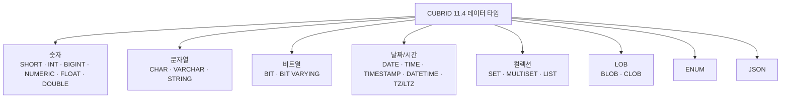

# CUBRID 11.4 지원 데이터 타입 정리

- 분류: study
- 날짜: 2026-07-23
- 관련: https://www.cubrid.org/manual/ko/11.4/sql/datatype.html

## 요약
CUBRID 11.4는 숫자, 문자열, 비트열, 날짜/시간(타임존 포함), 컬렉션, LOB, ENUM, JSON 8개 범주의 데이터 타입을 지원한다. 전용 BOOLEAN 타입은 없고, MONETARY는 deprecated 상태다.

## 목적
CUBRID 11.4에서 사용 가능한 데이터 타입 전체를 범주별로 파악하고, 각 타입의 크기/범위/제약을 한눈에 볼 수 있게 정리한다.

## 배경
스키마 설계나 타입 매핑 작업 시 버전에 따라 지원 타입과 한계가 달라진다. 11.4 기준의 정확한 레퍼런스가 필요하여 공식 매뉴얼(버전 고정 URL)을 근거로 확인했다.

## 범위 / 방법
- 확인 대상: CUBRID 11.4 한국어 매뉴얼의 데이터 타입 페이지(`sql/datatype.html`).
- 방법: cubrid-manual 스킬로 버전 고정 매뉴얼을 조회.
- 교차 검증 항목: 문자열/비트열 최대 길이, ENUM 원소 상한, 타임존 타입 명칭, BOOLEAN/MONETARY 지원 여부.

## 발견 / 관찰

전체 범주 구조:

### 숫자 (Numeric)
| 타입 | 별칭 | 크기 | 범위 / 정밀도 |
|---|---|---|---|
| `SHORT` | `SMALLINT` | 2 byte | -32,768 ~ 32,767 |
| `INT` | `INTEGER` | 4 byte | -2,147,483,648 ~ 2,147,483,647 |
| `BIGINT` | | 8 byte | -9,223,372,036,854,775,808 ~ 9,223,372,036,854,775,807 |
| `NUMERIC` | `DECIMAL` | 16 byte | 전체 자릿수 p=1~38, 소수 자릿수 s=0~38 (기본 p=15, s=0) |
| `FLOAT` | `REAL` | 4 byte | 약 ±3.402823466E+38, 유효자리 7 |
| `DOUBLE` | `DOUBLE PRECISION` | 8 byte | 약 ±1.7976931348623157E+308, 유효자리 15 |
| `MONETARY` | | | deprecated (사용 비권장) |

### 문자열 (Character/String)
| 타입 | 별칭 | 최대 길이(n) | 특징 |
|---|---|---|---|
| `CHAR(n)` | `CHARACTER(n)` | 268,435,455 | 고정 길이, 공백 패딩 |
| `VARCHAR(n)` | `CHAR VARYING`, `CHARACTER VARYING` | 1,073,741,823 | 가변 길이, 패딩 없음 |
| `STRING` | | 1,073,741,823 | 최대 길이 `VARCHAR`와 동일 |

### 비트열 (Bit String)
| 타입 | 최대 길이 | 특징 |
|---|---|---|
| `BIT(n)` | 1,073,741,823 bit | 고정 길이 (기본 1 bit) |
| `BIT VARYING(n)` | 1,073,741,823 bit | 가변 길이 |

### 날짜 / 시간 (Date/Time)
| 타입 | 크기 | 범위 |
|---|---|---|
| `DATE` | 4 byte | 0001-01-01 ~ 9999-12-31 |
| `TIME` | 4 byte | 00:00:00 ~ 23:59:59 |
| `TIMESTAMP` | 4 byte | 1970-01-01 00:00:01 ~ 2038-01-19 03:14:07 (UTC) |
| `DATETIME` | 8 byte | 0001-01-01 00:00:00.000 ~ 9999-12-31 23:59:59.999 (밀리초) |

타임존 지원 타입(UTC로 저장하고 타임존 정보를 함께 관리):

| 타입 | 크기 | 설명 |
|---|---|---|
| `TIMESTAMPTZ` | 8 byte | 명시적 타임존 포함 |
| `TIMESTAMPLTZ` | 4 byte | 세션(로컬) 타임존 기준 |
| `DATETIMETZ` | 12 byte | 명시적 타임존 포함 |
| `DATETIMELTZ` | 8 byte | 세션(로컬) 타임존 기준 |

### 컬렉션 (Collection)
| 타입 | 별칭 | 순서 | 중복 |
|---|---|---|---|
| `SET` | | 없음 | 불가 |
| `MULTISET` | | 없음 | 허용 |
| `LIST` | `SEQUENCE` | 있음 (입력 순서 유지) | 허용 |

### LOB (Large Object)
| 타입 | 설명 |
|---|---|
| `BLOB` | 바이너리 대용량 객체, 외부 저장 |
| `CLOB` | 문자 대용량 객체, 외부 저장 |

### 기타 (ENUM / JSON)
- `ENUM`: 열거형. 값 집합은 최대 512개 원소, 인덱스로 저장(2 byte).
- `JSON`: 네이티브 JSON 타입(RFC 7159 검증). object, array, scalar(string, number, boolean, null) 지원.

## 결론
CUBRID 11.4는 8개 범주에 걸쳐 폭넓은 데이터 타입을 제공한다. 실무에서 주의할 점은 세 가지다. 첫째, 전용 `BOOLEAN` 타입이 없어 `ENUM`이나 `JSON`의 boolean 값으로 대체해야 한다. 둘째, `MONETARY`는 deprecated 되어 신규 사용을 권장하지 않는다. 셋째, 타임존이 필요한 경우 `TZ`/`LTZ` 변형을 사용한다.

## 다음 단계
- 단순 조사 성격이라 별도 이슈화는 불필요.
- 후속으로 타입별 JDBC 매핑(`java.sql.Types` 대응)이나 타 DBMS 대비 타입 매핑표가 필요하면 별도 노트로 정리.

## 참고
- CUBRID 11.4 데이터 타입 매뉴얼: https://www.cubrid.org/manual/ko/11.4/sql/datatype.html
