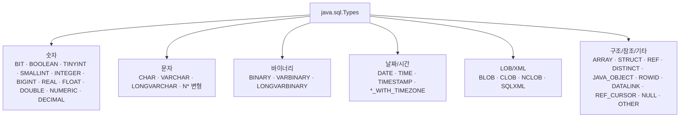

# JDBC 표준 데이터 타입 (java.sql.Types) 정리

- 분류: study
- 날짜: 2026-07-23
- 관련: [CUBRID 11.4 데이터 타입 정리](https://github.com/Srltas/work-docs/blob/master/study/2026-07-23-cubrid-11-4-data-types.md)

## 요약
JDBC는 벤더 중립적인 표준 SQL 타입을 `java.sql.Types`의 정수 상수(Java 8/JDBC 4.2 기준 총 39개)로 정의하며, 표준에 없는 벤더 고유 타입은 `OTHER`로 노출된다.

## 목적
JDBC가 정의하는 표준 데이터 타입 전체와, 각 타입이 매핑되는 Java 타입 및 도입 버전을 한눈에 볼 수 있게 정리한다.

## 배경
CUBRID 11.4 데이터 타입 조사에 이어, JDBC 드라이버가 DB 타입을 Java 애플리케이션에 어떤 표준 코드로 노출하는지 확인할 필요가 있었다. JDBC 타입은 특정 DBMS 타입이 아니라 모든 드라이버가 공통으로 매핑하는 추상 타입 집합이다.

## 범위 / 방법
- 확인 대상: `java.sql.Types` 상수 목록과 각 상수의 `@since` 버전.
- 방법: Oracle Java SE 17 공식 Javadoc으로 상수 전체와 도입 버전을 교차 검증.
- Java SE 버전과 JDBC 버전 대응: `1.2`=JDBC 2.0, `1.4`=JDBC 3.0, `1.6`=JDBC 4.0, `1.8`=JDBC 4.2 (표기 없는 항목은 최초 버전).

## 발견 / 관찰

전체 범주 구조:

### 숫자 (Numeric)
| JDBC 타입 (`Types.*`) | 매핑 Java 타입 | 도입(JDBC) |
|---|---|---|
| `BIT` | `boolean` | |
| `BOOLEAN` | `boolean` | 3.0 |
| `TINYINT` | `byte` | |
| `SMALLINT` | `short` | |
| `INTEGER` | `int` | |
| `BIGINT` | `long` | |
| `REAL` | `float` | |
| `FLOAT` | `double` | |
| `DOUBLE` | `double` | |
| `NUMERIC` | `java.math.BigDecimal` | |
| `DECIMAL` | `java.math.BigDecimal` | |

> SQL `FLOAT`과 `DOUBLE`은 둘 다 Java `double`로, `REAL`만 `float`으로 매핑된다.

### 문자 (Character)
| JDBC 타입 | 매핑 Java 타입 | 도입(JDBC) |
|---|---|---|
| `CHAR` | `String` | |
| `VARCHAR` | `String` | |
| `LONGVARCHAR` | `String` | |
| `NCHAR` | `String` | 4.0 |
| `NVARCHAR` | `String` | 4.0 |
| `LONGNVARCHAR` | `String` | 4.0 |

### 바이너리 (Binary)
| JDBC 타입 | 매핑 Java 타입 | 도입(JDBC) |
|---|---|---|
| `BINARY` | `byte[]` | |
| `VARBINARY` | `byte[]` | |
| `LONGVARBINARY` | `byte[]` | |

### 날짜 / 시간 (Date/Time)
| JDBC 타입 | 매핑 Java 타입 | 도입(JDBC) |
|---|---|---|
| `DATE` | `java.sql.Date` | |
| `TIME` | `java.sql.Time` | |
| `TIMESTAMP` | `java.sql.Timestamp` | |
| `TIME_WITH_TIMEZONE` | `java.time.OffsetTime` | 4.2 |
| `TIMESTAMP_WITH_TIMEZONE` | `java.time.OffsetDateTime` | 4.2 |

### 대용량 객체 (LOB / XML)
| JDBC 타입 | 매핑 Java 타입 | 도입(JDBC) |
|---|---|---|
| `CLOB` | `java.sql.Clob` | 2.0 |
| `BLOB` | `java.sql.Blob` | 2.0 |
| `NCLOB` | `java.sql.NClob` | 4.0 |
| `SQLXML` | `java.sql.SQLXML` | 4.0 |

### 구조 / 참조 / 기타
| JDBC 타입 | 매핑 Java 타입 | 도입(JDBC) |
|---|---|---|
| `ARRAY` | `java.sql.Array` | 2.0 |
| `STRUCT` | `java.sql.Struct` | 2.0 |
| `REF` | `java.sql.Ref` | 2.0 |
| `DISTINCT` | 기반 타입의 매핑 | 2.0 |
| `JAVA_OBJECT` | 해당 Java 클래스 | 2.0 |
| `ROWID` | `java.sql.RowId` | 4.0 |
| `DATALINK` | `java.net.URL` | 3.0 |
| `REF_CURSOR` | `java.sql.ResultSet` | 4.2 |
| `NULL` | (SQL NULL 표현) | |
| `OTHER` | 벤더 고유 타입 (드라이버 의존) | |

## 결론
JDBC는 표준 SQL 타입을 `java.sql.Types` 정수 상수로 표현하며, 이 코드는 `PreparedStatement.setXxx()` / `ResultSet.getXxx()` / `setObject(idx, value, Types.XXX)` 에서 사용된다. Java 8부터는 `java.sql.JDBCType` enum과 `SQLType` 인터페이스로 타입을 더 안전하게 지정할 수 있다. 표준에 없는 벤더 고유 타입(예: CUBRID의 `SET`/`MULTISET`/`LIST`, `MONETARY`)은 보통 `OTHER`로 노출되고 드라이버 자체 확장으로 처리된다.

## 다음 단계
- 단순 조사 성격이라 별도 이슈화는 불필요.
- 후속으로 CUBRID 11.4 타입 ↔ `java.sql.Types` 매핑표를 작성하고, cubrid-jdbc 소스에서 드라이버가 실제로 반환하는 타입 코드를 확인해 정리 가능.

## 참고
- java.sql.Types Javadoc (Java SE 17): https://docs.oracle.com/en/java/javase/17/docs/api/java.sql/java/sql/Types.html
- 이전 노트: CUBRID 11.4 데이터 타입 정리 (`study/2026-07-23-cubrid-11-4-data-types.md`)
