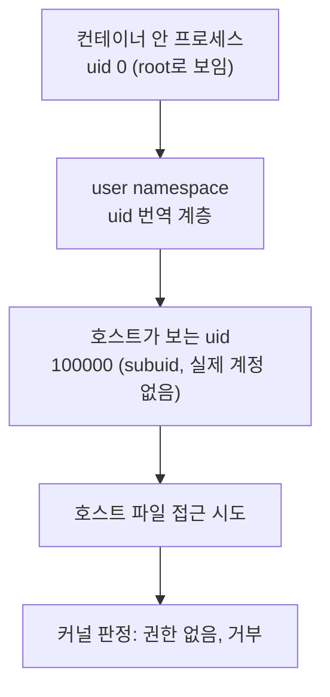
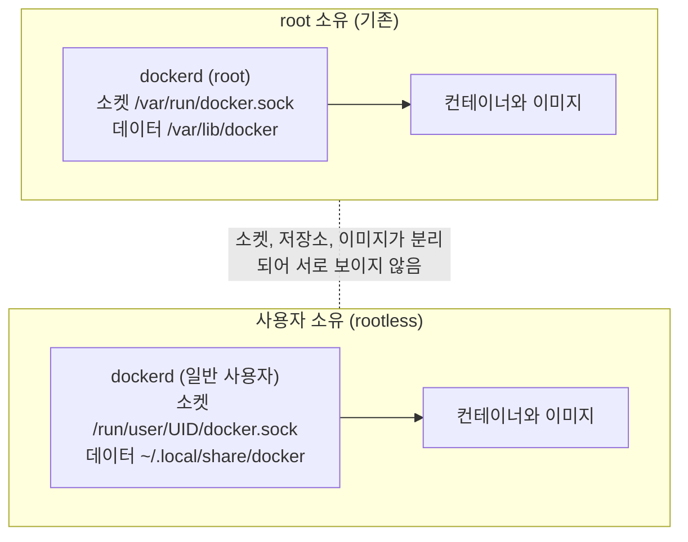

# rootless Docker 개념 정리

- 분류: study
- 날짜: 2026-07-28
- 관련: Docker 공식 문서 Rootless mode, Linux user namespace

## 요약
rootless Docker는 데몬을 일반 사용자 권한으로 실행하고, user namespace로 컨테이너 안의 uid를 호스트의 권한 없는 uid로 번역해서, 컨테이너에서 호스트 root 권한을 얻는 경로를 끊는 방식이다.

## 목적
CI 러너처럼 신뢰도가 낮은 코드를 실행하는 환경에서, docker 소켓 접근이 곧 호스트 root 권한이 되는 문제를 어떻게 없애는지 이해한다. 개념과 동작 원리를 정리해 두어 나중에 다시 볼 수 있게 하는 것이 목적이다.

## 배경
Docker는 클라이언트와 데몬이 분리된 구조다. `docker` 명령은 요청을 보내는 클라이언트일 뿐이고 실제 작업은 root로 동작하는 `dockerd`가 수행한다. 그래서 소켓에 접근할 수 있다는 것은 root 데몬에 임의의 작업을 지시할 수 있다는 뜻이 된다.

```bash
docker run -v /:/host -it alpine chroot /host sh   # 호스트 root 셸
```

`-v /:/host`는 호스트 루트를 컨테이너에 붙이라는 요청이고, 그 마운트를 실행하는 주체가 root 데몬이므로 사용자 권한으로는 막을 수단이 없다. 따라서 `docker` 그룹 소속은 사실상 제한 없는 sudo 권한과 같다.

## 범위 / 방법
- 다루는 것: 왜 docker 그룹이 위험한가, user namespace와 subuid 매핑, root 권한을 대체하는 구성 요소, 데몬이 두 개가 되는 구조, 클라이언트가 데몬을 선택하는 방법, 한계.
- 다루지 않는 것: 설치 절차, 특정 환경의 적용 기록(별도 문서).
- 근거: Docker 공식 Rootless mode 문서에서 전제 조건과 소켓 경로를 확인했고, 나머지는 리눅스 namespace 개념 기준으로 정리했다. 버전이나 커널에 따라 달라지는 항목은 그렇게 명시했다.

## 발견 / 관찰

### 1. user namespace: uid를 번역하는 계층
리눅스 namespace는 프로세스가 보는 세계를 격리하는 커널 기능이고 종류가 여럿이다(프로세스 목록, 네트워크, 마운트, 사용자 등). 그중 user namespace는 uid와 gid를 **번역**한다.



컨테이너 안에서는 uid 0이므로 root처럼 동작하지만, 호스트 커널이 보는 실체는 권한 없는 uid다. 그래서 호스트 루트를 마운트해도 읽거나 쓸 수 없다. 명찰만 root이고 건물 밖에서는 방문객인 상태로 이해하면 된다.

### 2. subuid / subgid: 번역에 쓸 번호 범위
매핑에 사용할 uid 범위를 계정별로 미리 배정해 둔다.

```
/etc/subuid:  someuser:100000:65536     # 100000부터 65536개
/etc/subgid:  someuser:100000:65536
```

- 이 범위는 실제 계정이 없는 번호이므로 그 uid로는 호스트에서 아무 일도 할 수 없다.
- 공식 문서는 최소 65,536개의 subordinate UID/GID가 필요하다고 명시한다.
- 매핑을 실제로 설정하는 도구는 `newuidmap`, `newgidmap`이며 보통 `uidmap` 패키지로 제공된다. 이들은 setuid 바이너리로, 일반 사용자가 배정된 범위 안에서만 매핑을 만들 수 있게 통제한다.

### 3. root 권한이 필요했던 일들의 대체 수단
컨테이너 실행에는 원래 root가 필요한 작업이 몇 가지 있다. rootless는 이를 사용자 공간 구현으로 바꾼다.

| 기능 | 원래 방식 (root) | rootless 대체 |
| --- | --- | --- |
| 이미지 저장 계층 | `overlay2` 커널 마운트 | `fuse-overlayfs` 등 사용자 공간 파일시스템 (커널이 rootless overlay를 지원하면 `overlay2` 사용 가능) |
| 컨테이너 네트워크 | veth, bridge 생성 | `slirp4netns` 계열이 사용자 공간에서 TCP/IP를 대행 |
| 포트 공개 | iptables 조작 | RootlessKit의 포트 드라이버 |

성능은 커널 마운트 방식보다 다소 떨어진다. 테스트 컨테이너를 띄우는 용도에서는 체감이 크지 않다.

### 4. 데몬이 두 개가 되는 구조
rootless 데몬은 기존 root 데몬을 대체하지 않고 별도로 추가된다. 소켓, 데이터 디렉터리, 이미지 저장소가 모두 분리된다.



여기서 파생되는 실무적 결과가 둘 있다.

- 한쪽 데몬의 컨테이너를 다른 쪽에서 조작할 수 없다. 격리 효과이면서, `docker system prune`이 서로에게 영향을 주지 않는다는 뜻도 된다.
- **이미지도 공유되지 않는다.** 레지스트리에 올릴 수 없는 로컬 이미지는 `docker save`로 파일로 뽑아 rootless 쪽에서 `docker load`로 다시 적재해야 한다. 디스크를 두 배로 쓴다.

### 5. 클라이언트는 `DOCKER_HOST`로 데몬을 고른다
`docker` 명령이나 Testcontainers 같은 라이브러리는 `DOCKER_HOST` 환경변수로 접속할 소켓을 결정한다.

```
DOCKER_HOST=unix:///run/user/1001/docker.sock
```

즉 애플리케이션이나 워크플로 코드를 고치지 않고 환경변수만으로 대상 데몬을 바꿀 수 있다. 되돌리기도 환경변수를 지우는 것으로 끝난다.

### 6. 사용자 systemd 서비스와 linger
rootless 데몬은 systemd **user** 서비스로 동작한다. 사용자 서비스는 기본적으로 로그인 세션과 함께 종료되므로, 로그인 없이 상시 유지하려면 linger를 켜야 한다.

```bash
loginctl enable-linger <user>
```

서비스 관리 명령도 시스템 서비스와 다르다(`systemctl --user`). 사용자 세션 밖에서 다루려면 `XDG_RUNTIME_DIR`와 `DBUS_SESSION_BUS_ADDRESS`가 필요할 수 있다.

### 7. 막아주는 것과 막아주지 못하는 것
공식 문서는 rootless의 목적을 데몬과 컨테이너 런타임의 잠재적 취약점을 완화하는 것이라고 설명한다. 완전한 격리 수단이 아니라는 점을 분명히 알고 써야 한다.

| 막아준다 | 막아주지 못한다 |
| --- | --- |
| 소켓 접근을 통한 호스트 root 획득 | 그 계정이 원래 읽을 수 있는 파일 접근 |
| 다른 데몬(root)의 컨테이너 조작 | 네트워크 경로 접근(예: 호스트에 열린 서비스) |
| 두 데몬 간 이미지, 캐시 간섭 | 커널 취약점을 이용한 탈출(이론상) |

정리하면 "컨테이너에서 호스트 관리자가 되는 것"을 막는 조치이고, 그보다 강한 격리는 VM의 영역이다.

### 8. 환경에 따라 달라지는 제약
아래 항목은 커널 버전, cgroup 버전, 배포판에 따라 달라진다. 적용 전에 해당 환경 기준으로 확인이 필요하다.

- 컨테이너 리소스 제한(메모리, CPU): cgroup v2 환경이 아니면 사용할 수 없는 경우가 있다.
- 1024 미만 포트 바인딩: 기본적으로 불가하며, 커널 파라미터나 capability 부여가 필요하다.
- 스토리지 드라이버: 커널이 rootless overlay를 지원하지 않으면 `fuse-overlayfs`가 필요하다.
- 일부 기능(overlay 네트워크, checkpoint 등)은 지원되지 않을 수 있다.

## 결론
- 위험의 근원은 컨테이너 자체가 아니라 **root로 도는 데몬에 명령할 수 있는 권한**이다. rootless는 데몬의 실행 주체를 바꿔 그 전제를 없앤다.
- 핵심 기술은 user namespace의 uid 번역이고, subuid 범위가 그 번역표의 재료다.
- 데몬이 분리되므로 이미지도 분리된다. 로컬 전용 이미지를 쓰는 환경에서는 이 이관 비용을 미리 계산해야 한다.
- 도입과 롤백이 환경변수 수준에서 가능해 시도 비용이 낮다.

## 다음 단계
- 후속 학습 주제: user namespace 상세(`man 7 user_namespaces`), cgroup v1과 v2 차이, Podman의 rootless 모델과 비교, VM 격리와 컨테이너 격리의 경계.
- 적용 기록은 별도 문서로 남긴다(이 노트는 개념 정리에 한정).

## 참고
- Docker 공식 문서: Rootless mode (https://docs.docker.com/engine/security/rootless/) 전제 조건(`newuidmap`/`newgidmap`, subuid/subgid 최소 65,536개)과 소켓 경로 확인
- `man 7 user_namespaces`, `man 5 subuid`
- RootlessKit (https://github.com/rootless-containers/rootlesskit)
- slirp4netns (https://github.com/rootless-containers/slirp4netns)
- fuse-overlayfs (https://github.com/containers/fuse-overlayfs)
- Testcontainers 설정 문서의 `DOCKER_HOST` 항목
