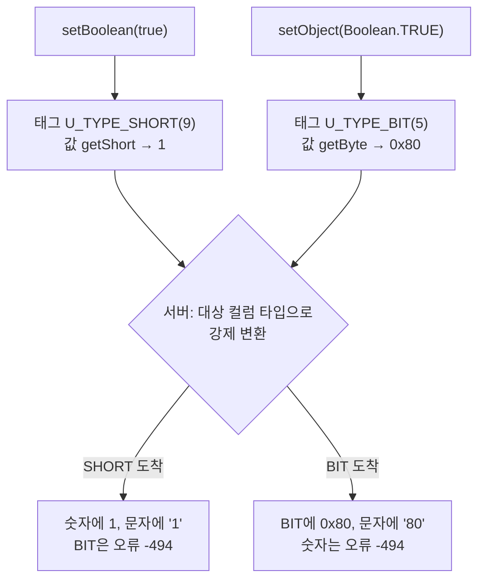

# setBoolean과 setObject(Boolean)의 전송 표현 비교

- 분류: study
- 날짜: 2026-08-04
- 관련: CUBRIDSUS-14857 (setBoolean의 저장 값을 -128에서 1로 변경한 이슈)

## 요약
`setBoolean`은 SHORT 태그로 `1`을 보내고 `setObject(Boolean.TRUE)`는 BIT 태그로 `0x80`을 보내며, 이 태그 한 바이트 차이가 숫자, 문자, BIT 세 컬럼군에서 서로 정반대의 결과를 만든다.

## 목적
boolean 값이 서버로 실제 어떤 표현으로 전달되는지 확정한다. BIT 타입의 Boolean 처리 스펙을 정하는 과정에서, 두 API의 동작 차이가 어느 층에서 생기는지 특정하고 수정 범위를 산정하기 위한 근거로 삼는다.

## 배경
CUBRID에는 BOOLEAN 데이터 타입이 없다. 그리고 CAS 와이어 프로토콜의 타입 태그 집합(`U_TYPE`)에도 boolean 전용 태그가 없다. 따라서 Java의 `boolean` 값은 서버로 갈 때 반드시 다른 타입으로 위장해서 전송된다.

문제는 드라이버가 두 개의 서로 다른 위장을 쓰고 있다는 점이다. 같은 `true`인데 `setBoolean`으로 넣는지 `setObject`로 넣는지에 따라 성공하는 컬럼 타입이 정반대가 되고, 문자 컬럼에는 서로 다른 문자열이 저장된다.

## 범위 / 방법

- 측정 대상: 드라이버 11.3.3, 서버 11.5.0
- 소스 추적: `UStatement`, `UUType`, `UOutputBuffer`, `UBindParameter`, `UGetTypeConvertedValue` (경로는 모두 `src/jdbc/cubrid/jdbc/jci/`)
- 클라이언트 측 실측: 컬럼 타입 8종에 두 API로 각각 저장한 뒤 저장 값과 반환 클래스 확인
- 서버 측 확인: 브로커 SQL 로그(`SQL_LOG = ON`)의 `bind` 항목으로 서버가 실제로 받은 타입과 값 대조
- 범위에서 제외: 배치 바인딩(`executeBatch`), 컬렉션 원소 바인딩

## 발견 / 관찰

### 1. 태그가 갈리는 지점은 한 곳이다

두 경로는 `bindValue` 직전에 타입 태그를 고르는 부분에서만 갈린다.

| 진입 API | 호출되는 bind 오버로드 | 태그 결정 방식 | 결정된 태그 |
|---|---|---|---|
| `setBoolean(int, boolean)` | `bind(int, boolean)` | 메서드 안에 상수로 고정 | `U_TYPE_SHORT` (9) |
| `setObject(int, Object)` | `bind(int, Object)` | `UUType.getObjectDBtype(value)` | `U_TYPE_BIT` (5) |

`getObjectDBtype`의 해당 분기는 `value instanceof Boolean`일 때 `U_TYPE_BIT`을 돌려준다. 이 분기는 `setObject` 외에 두 경로가 더 통과한다.

| 통과 경로 | 용도 |
|---|---|
| `UStatement.bind(int, Object)` | `setObject` |
| `UPutByOIDParameter` | OID로 직접 갱신 |
| `UAParameter` | 저장 프로시저 인자 |

### 2. 태그에 따라 값 변환 함수가 달라진다

`UOutputBuffer`는 태그별로 다른 변환 함수를 호출한다. 여기서 값까지 갈린다.

| 태그 | 호출되는 변환 | `Boolean.TRUE` 입력 시 결과 | 와이어 값 길이 |
|---|---|---|---|
| `U_TYPE_SHORT` | `getShort` | `1` | 2바이트 |
| `U_TYPE_BIT` | `getByte` | `-128` (`0x80`) | 1바이트 |

`getByte`가 `Boolean.TRUE`를 `-128`로 바꾸는 것은 CUBRID가 비트열을 8비트 단위로 왼쪽부터 채우기 때문이다. `B'1'`은 `B'10000000'`과 같고 그 바이트 값이 `0x80`이다.

참고로 `setBoolean` 경로는 `Boolean`이 아니라 미리 만든 `Byte` 객체를 넘기므로 `getShort`의 Number 분기를 탄다. 다만 `getShort`에는 Boolean 분기도 있고 그 결과가 `1`이므로, 태그만 SHORT로 바꾸면 `Boolean`을 그대로 넘겨도 같은 값이 나온다.

### 3. 와이어 바이트 레이아웃

파라미터 하나는 태그와 값이 각각 4바이트 길이 접두를 갖는 형태로 기록된다. 태그도 길이 접두를 갖는다는 점에 주의한다.

```
setBoolean(true)
  00 00 00 01 | 09           타입 태그: 길이 1, U_TYPE_SHORT(9)
  00 00 00 02 | 00 01        값: 길이 2, short 1

setObject(Boolean.TRUE)
  00 00 00 01 | 05           타입 태그: 길이 1, U_TYPE_BIT(5)
  00 00 00 01 | 80           값: 길이 1, 0x80
```

### 4. 전체 흐름



### 5. 서버가 받은 것 (브로커 SQL 로그)

같은 SQL에 두 API로 바인딩한 결과다. 서버 로그가 태그를 그대로 보여준다.

```
execute srv_h_id 1 INSERT INTO cvtest(b8) VALUES (?)
bind 1 : SHORT 1
execute error:-494 tuple 0

execute srv_h_id 1 INSERT INTO cvtest(b8) VALUES (?)
bind 1 : BIT (1)
execute 0 tuple 1
```

`-494`는 "Cannot coerce host var to type ..." 오류다. `BIT (1)`의 괄호 안 숫자는 값의 바이트 길이이고 그 뒤에 원시 바이트 `0x80`이 따라온다.

### 6. 컬럼 타입별 결과 (실측)

| 컬럼 타입 | `setBoolean(true)` | `setObject(Boolean.TRUE)` |
|---|---|---|
| BIT(1) | 실패 (-494) | 저장 `0x80` |
| BIT(8) | 실패 (-494) | 저장 `0x80` |
| BIT VARYING(8) | 실패 (-494) | 저장 `0x80` |
| SHORT | 저장 `1` | 실패 (-494) |
| INT | 저장 `1` | 실패 (-494) |
| NUMERIC(3,0) | 저장 `1` | 실패 (-494) |
| CHAR(4) | 저장 `"1"` | 저장 `"80"` |
| VARCHAR(10) | 저장 `"1"` | 저장 `"80"` |

성공하는 컬럼군이 정확히 반대다. 문자 컬럼은 양쪽 모두 성공하지만 저장되는 문자열이 다르다. `"80"`은 `0x80`을 16진 표기로 문자화한 결과이고, boolean을 저장하려는 의도로는 설명되지 않는 값이다.

### 7. `useOldBooleanValue` 프로퍼티는 한쪽만 본다

이 프로퍼티는 `bind(int, boolean)` 안에서만 읽힌다.

| | 기본값 | `useOldBooleanValue=true` |
|---|---|---|
| `setBoolean` | SHORT `1` | SHORT `-128` |
| `setObject(Boolean)` | BIT `0x80` | BIT `0x80` (프로퍼티 무시) |

### 8. 저장 운반체가 숫자와 문자로 좁혀지는 이유

와이어 태그를 SHORT로 정하면, boolean이 최종적으로 착지할 수 있는 컬럼 타입 집합은 엔진의 SHORT 강제 변환 규칙이 결정한다.

| 변환 | 가능 여부 |
|---|---|
| SHORT에서 SHORT, INT, NUMERIC | 가능 |
| SHORT에서 CHAR, VARCHAR | 가능 (`"1"`이 됨) |
| SHORT에서 BIT, BIT VARYING | 불가 |

즉 boolean의 저장 운반체가 숫자와 문자로 정해진 것은 별도 정책의 결과가 아니라, 와이어 태그를 SHORT로 고른 데서 자동으로 따라온 결과다. 엔진에는 숫자와 BIT 사이의 캐스트가 어느 방향으로도 없다(`CAST(1 AS BIT(8))`, `CAST(B'10000000' AS INT)` 모두 실패).

## 결론

두 API의 모든 동작 차이는 태그 선택 한 곳에서 나온다. 값 변환 함수, 와이어 길이, 성공하는 컬럼군, 문자 컬럼의 저장 문자열, 프로퍼티 반영 여부까지 모두 그 한 바이트의 파생 결과다.

따라서 두 API를 같게 만드는 데 프로토콜 변경이나 서버 변경은 필요하지 않다. `getObjectDBtype`의 Boolean 분기가 돌려주는 태그를 `U_TYPE_BIT`에서 `U_TYPE_SHORT`로 바꾸면 `setObject(Boolean)`이 `setBoolean`과 동일한 표현으로 전송된다. 이때 문자 컬럼의 `"80"` 저장 문제는 별도 수정 없이 사라진다. SHORT 태그가 `getShort`를 타고 그 결과가 `1`이기 때문이다.

남는 정합 작업은 `useOldBooleanValue` 처리다. 현재는 `bind(int, boolean)` 안에만 있어서, 태그를 통일하더라도 `setObject` 경로는 이 프로퍼티를 반영하지 않는다. 두 경로가 완전히 같아지려면 프로퍼티 판정을 한쪽으로 모아야 한다.

## 다음 단계

- 이슈화 필요. `getObjectDBtype`의 Boolean 분기 변경과 `useOldBooleanValue` 경로 통합을 한 이슈로 묶는다.
- 변경 전 확인: `setObject(Boolean)`으로 BIT 컬럼에 저장하는 사용 사례와 테스트가 존재하는지 조사한다. 존재하면 이 변경이 유일한 하위호환 파괴 지점이 된다.
- `getObjectDBtype`을 공유하는 OID 갱신 경로와 저장 프로시저 인자 경로도 함께 SHORT로 바뀌므로, 두 경로의 회귀 확인이 필요하다.
- 배치 바인딩과 컬렉션 원소 바인딩은 이번 조사 범위 밖이다. 같은 비대칭이 있는지 별도 확인한다.

## 참고

- 소스: `src/jdbc/cubrid/jdbc/jci/` 아래 `UStatement.java`, `UUType.java`, `UOutputBuffer.java`, `UBindParameter.java`, `UGetTypeConvertedValue.java`
- CUBRIDSUS-14857: R4.3에서 9.3까지 `setBoolean`이 SHORT 컬럼에 `-128`을 저장한 것을 버그로 판정하고 10.0에서 `1`로 변경. `useOldBooleanValue` 프로퍼티가 이때 도입되었다.
- 서버 측 확인은 브로커 SQL 로그의 `bind` 항목을 사용했다. `cubrid_broker.conf`의 `SQL_LOG`가 `ON`이면 기록된다.
- CUBRID 매뉴얼의 비트열 설명: 비트열은 8비트 단위로 왼쪽부터 채워지며, 8비트 단위로 길이를 선언하고 값을 입력할 것을 권장한다. `B'1'`과 `B'10000000'`은 같은 값이다.
