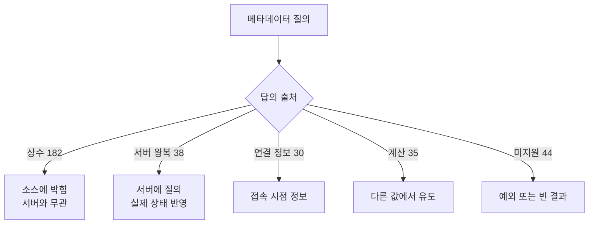

# CUBRID JDBC가 제공하는 메타데이터 전수 정리

- 분류: study
- 날짜: 2026-09-15
- 관련: TOOLS-4940 (Hibernate 지원을 막는 JDBC 결함 목록) 중 메타데이터 부정확 항목

## 요약

CUBRID JDBC가 답하는 메타데이터는 8개 클래스 371개 표면인데, 그중 절반 가까이가 서버에 묻지 않고 소스에 박힌 상수이며, 실측으로 확정한 오답이 15건이다.

## 목적

메타데이터 값이 서버 실제 동작과 어긋난다는 보고를 받았다. 값을 고치기 전에 먼저 "무엇이 있고 각각 답이 어디서 오는가"를 빠짐없이 파악한다. 수정 범위를 산정하고, 어느 값이 구조적으로 틀릴 수밖에 없는지 가리기 위한 기준표로 쓴다.

## 배경

JDBC 애플리케이션과 ORM은 접속한 DB의 능력을 드라이버에게 물어보고 그 답에 맞춰 SQL을 만든다. Hibernate가 대표적이다. 답이 틀리면 프레임워크는 틀린 전제로 동작하고, 그 결과는 예외가 아니라 **조용한 오동작**으로 나타난다.

실제로 Hibernate CUBRID 방언은 드라이버 메타데이터를 여러 곳에서 불신하고 덮어쓰고 있다. 즉 "드라이버가 틀린 값을 답한다"는 것이 이미 우회 코드로 기록돼 있는 상태다.

## 범위 / 방법

- 대상: `CUBRIDDatabaseMetaData` 및 메타데이터를 답하는 나머지 7개 클래스
- 기준: 드라이버 `develop` 브랜치 소스
- 방법
  - `java.sql` 인터페이스 메서드 목록을 리플렉션으로 뽑아 구현 목록과 집합 차이를 구함
  - 각 메서드의 답이 어디서 오는지 소스로 분류 (상수 / 서버 왕복 / 연결 정보 / 계산 / 미지원)
  - 의심 항목은 서버에 직접 질의해 대조 (CUBRID 11.4.6, 드라이버 11.4.0)
  - 기존 TC 저장소 3곳과 Hibernate 방언의 우회 지점을 대조해 검증 여부 확인
- 범위에서 제외: 값 수정, TC 작성 (다음 단계)

## 발견 / 관찰

### 1. 메타데이터 표면은 8개 클래스 371개다

`DatabaseMetaData` 하나만 보면 놓치는 것이 많다. 실제 분포는 이렇다.

| 클래스 | 개수 | 성격 |
|---|---|---|
| `CUBRIDDatabaseMetaData` | 235 | DB 능력·한계·카탈로그 조회 |
| `CUBRIDResultSetMetaData` | 29 | 결과 컬럼의 타입·이름·속성 |
| `CUBRIDStatement` | 24 | 실행 결과 부수 정보 |
| `CUBRIDConnection` | 21 | 연결 상태·설정 |
| `CUBRIDResultSet` | 9 | 커서 상태 |
| `CUBRIDDriver` | 7 | 드라이버 버전·속성 |
| `CUBRIDPreparedStatement` | 3 | 파라미터·결과 서술 |
| `CUBRIDShardMetaData` | 2 | 샤드 구성 |

`ParameterMetaData`는 11개 메서드가 전부 미구현이다.

### 2. 답이 어디서 오는가가 신뢰도를 가른다

이 축이 이 조사의 핵심이다. 서버에 묻지 않는 값은 서버가 바뀌어도 따라가지 않는다.



`DatabaseMetaData`의 능력 질의 100개 중 **88개가 `checkIsOpen(); return 상수;` 두 줄**이다(true 30 / false 58). 서버나 연결에 물어보는 것은 `supportsSavepoints` 하나뿐이다. 이 영역은 질의가 아니라 선언문 모음에 가깝다.

### 3. 결과셋을 돌려주는 26개는 셋으로 갈린다

| 구분 | 개수 | 메서드 |
|---|---|---|
| 서버에 질의 | 11 | `getTables`, `getColumns`, `getPrimaryKeys`, `getIndexInfo`, `getBestRowIdentifier`, `getSuperTables`, 권한 2종, 외래키 3종 |
| 빈 결과 고정 | 9 | `getProcedures`, `getProcedureColumns`, `getSchemas`, `getCatalogs`, `getVersionColumns`, `getAttributes`, `getSuperTypes`, `getTypeInfo`, `getTableTypes` |
| 미지원 예외 | 6 | `getUDTs`, `getFunctions`, `getFunctionColumns`, `getSchemas(2인자)`, `getPseudoColumns`, `getClientInfoProperties` |

`getTypeInfo`와 `getTableTypes`는 드라이버가 내용을 만들어 채우므로 빈 결과가 아니다. 나머지 7개는 실제로 0행을 돌려준다.

문제는 그중 일부가 **답할 수 있는데 안 답한다**는 점이다. 저장 프로시저를 만들어 놓고 `getProcedures(null, null, "%")`를 불러도 0행이다.

### 4. 실측으로 확정한 오답 15건

서버에 직접 질의해 대조한 결과다.

| 메서드 | 드라이버 답 | 서버 실측 |
|---|---|---|
| `getMaxTableNameLength` | 254 | 222 (223자부터 서버가 명시 거부) |
| `storesLowerCaseQuotedIdentifiers` | false | 인용해도 소문자 폴딩 |
| `supportsColumnAliasing` | false | `select a as b` 정상 |
| `supportsOuterJoins` | false | `left/right outer join` 정상 |
| `supportsLimitedOuterJoins` | false | 위와 같음 |
| `supportsExpressionsInOrderBy` | false | `order by n+1` 정상 |
| `supportsOrderByUnrelated` | false | select 목록 밖 컬럼 정렬 정상 |
| `supportsGroupByUnrelated` | false | select 목록 밖 컬럼 그룹핑 정상 |
| `supportsSelectForUpdate` | false | `for update` 정상 |
| `supportsSchemasInDataManipulation` | false | `dba.t` 로 4종 DML 전부 성공 |
| `supportsSchemasInTableDefinitions` | false | `create table dba.t` 성공 |
| `supportsSchemasInIndexDefinitions` | false | `create index ... on dba.t` 성공 |
| `getExtraNameCharacters` | `"%#"` | `%`는 식별자에 못 씀 (`#`만 유효) |
| `getSystemFunctions` | `""` | `DATABASE`, `IFNULL`, `USER` 존재 |
| `getNumericFunctions` | 집계 함수 7개 | 수치 스칼라 함수가 목록에 0개 |

추가로 규격 위반이 하나 있다. `supportsDataDefinitionAndDataManipulationTransactions`와 `supportsDataManipulationTransactionsOnly`가 **둘 다 true**인데, JDBC 규격상 상호 배타다.

### 5. 보고와 다른 점 두 가지

**컬럼 이름 한계 254는 맞는 값이다.** 222는 테이블 전용이다.

```
create table zz_col254 (c*254 int)  -> OK, char_length(attr_name)=254
create table zz_col255 (c*255 int)  -> 에러 없이 254로 절단
create table t*223 (a int)          -> ERROR: cannot exceed 222 bytes
```

매뉴얼도 Column 254 bytes / Table 222 bytes로 구분한다. 따라서 고칠 것은 `getMaxTableNameLength` 하나다.

다만 **단위 문제는 별건으로 실재**한다. 서버는 바이트로 세고 JDBC 규약은 문자로 센다. UTF-8 DB에서 한글 컬럼명 84자(252바이트)는 성공하고 85자(255바이트)는 조용히 84자로 잘린다.

**`supportsStoredProcedures`와 `supportsConvert`의 false는 맞는 값이다.** 이 둘은 SQL 지원 여부가 아니라 **JDBC escape 문법** 지원 여부를 묻는다.

```
create procedure zz_proc ...     -> 서버는 만든다
{call zz_proc(?)}                -> Illegal CALL statement
call zz_proc(?)   (escape 없음)   -> OK
{fn convert(n, SQL_VARCHAR)}     -> Syntax error
cast(n as varchar)               -> 10
```

진짜 결함은 값이 아니라 드라이버가 JDBC escape 처리를 아예 하지 않는다는 점이다. 별도 항목으로 다뤄야 한다.

같은 이유로 `supportsPositionedDelete/Update=false`, `supportsFullOuterJoins=false`, `nullsAreSortedLow=true`, `getDefaultTransactionIsolation=2`도 전부 정확한 값이다.

### 6. 판정을 낮춰야 할 항목

`supportsIntegrityEnhancementFacility=false`는 절반만 틀렸다. 외래키는 실제로 강제된다. 그러나 CHECK 제약은 파싱만 되고 강제되지 않는다.

```
create table zz_chk (a int check (a > 0));
insert into zz_chk values (-1);   -> 1 row affected
select a from zz_chk;             -> -1
```

IEF는 CHECK를 포함하므로 이 값을 명백한 오답으로 올리면 안 된다. CHECK 미강제라는 서버 쪽 사안과 함께 봐야 한다.

`getMax*`가 0을 답하는 16종도 단정할 수 없다. JDBC 규약에서 0은 "제한 없음 또는 알 수 없음"이다. 다만 `getMaxProcedureNameLength=0`은 매뉴얼이 254 bytes를 명시하므로 "답할 수 있는데 안 답함"으로 분류하는 편이 맞다.

### 7. 자기모순 조합

값 하나하나가 아니라 조합이 앞뒤가 안 맞는 경우다.

| 조합 | 문제 |
|---|---|
| `stores*QuotedIdentifiers` 3종 전부 false + `supportsMixedCaseQuotedIdentifiers` false | "구분하지 않는다"면서 "어떤 형태로도 저장하지 않는다" |
| `isCatalogAtStart=true` + 카탈로그 관련 전부 false/null | 쓰지 않는 개념의 위치만 답함 |
| `getSchemas()` 0행 + `getTables()`가 `TABLE_SCHEM=DBA` 채움 | 스키마가 실재하는데 없다고 답함 |
| `supportsDataDefinitionAndDataManipulationTransactions` + `...TransactionsOnly` 둘 다 true | 규격상 상호 배타 |

### 8. 검증 자산은 얇다

`DatabaseMetaData` 177개 중 값이 못 박혀 있는 것은 29개다. JUnit 단정 21개와 골든 파일 비교 9개가 전부다. 나머지는 호출만 하고 넘어가거나 아예 다루지 않는다.

Hibernate 방언이 덮어쓰는 지점이 사실상 2차 오답 목록 역할을 한다. 인용 식별자 대소문자, 식별자 최대 길이, 스키마 이름 해석 세 곳이다.

## 결론

메타데이터 문제는 값 몇 개가 틀린 것이 아니라 **구조적**이다. 능력 질의 100개 중 88개가 소스에 박힌 상수이고, 서버 동작이 바뀌어도 따라가지 않는다. 실측으로 확정한 오답 15건은 그 구조가 드러난 표본에 가깝다.

수정 난이도는 값마다 다르다. 상수를 고치는 것은 한 줄이지만, 그 값이 맞는지 판정하려면 서버 실측이 필요하다. 반대로 `getProcedures`처럼 구조적으로 미구현인 것은 값 수정으로 해결되지 않는다.

## 다음 단계

- 오답 15건을 이슈로 등록한다. 한 줄 상수 수정이 대부분이라 묶어서 하나의 이슈로 갈 수 있다
- 규격 위반 1건(트랜잭션 지원 상호 배타)은 값 판단이 필요하므로 분리한다
- 식별자 길이의 바이트 대 문자 단위 문제는 별건으로 등록한다. 값 수정이 아니라 규약 해석 문제다
- JDBC escape 미번역은 메타데이터가 아니라 별개 결함이다. `supportsStoredProcedures`/`supportsConvert` 값은 건드리지 않는다
- CHECK 제약 미강제는 서버 쪽 사안으로 넘긴다
- 값을 고치기 전에 회귀를 잡을 TC가 29개뿐이라는 점을 고려한다. 고치는 값마다 TC를 함께 추가하는 편이 안전하다

## 참고

- CUBRID 매뉴얼 식별자 규칙과 길이 한계: https://www.cubrid.org/manual/en/11.4/sql/identifier.html
- TOOLS-4940 (Hibernate 지원 차단 요인 목록)
- 실측 환경: CUBRID 11.4.6, JDBC 드라이버 11.4.0
