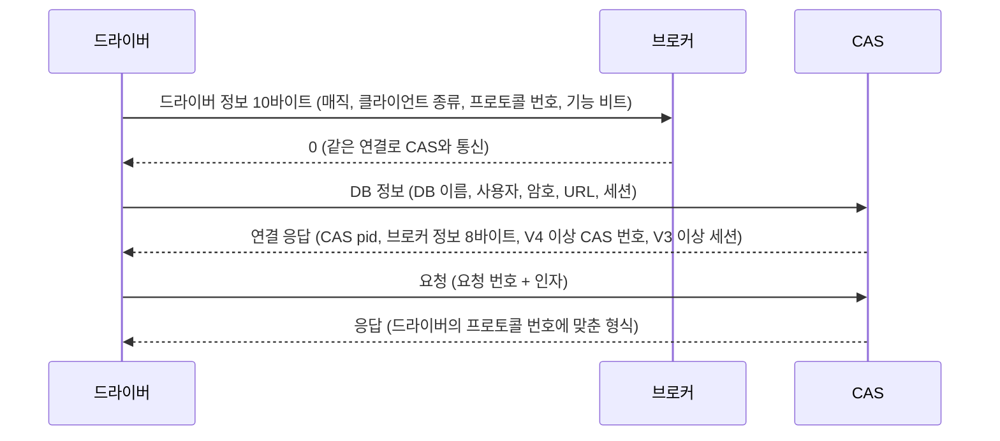

# CAS 요청 번호, 하위 타입과 프로토콜 버전별 기능

- 분류: study
- 날짜: 2026-09-28
- 관련: [CAS 프로토콜 버전과 릴리스 대응표](2026-09-15-cas-protocol-version-releases.md), APIS-1116 (스키마 목록 요청 검토)

## 요약

요청 번호 1~44 중 프로토콜 번호 체계(2012-07)보다 늦게 생긴 것은 43, 44 둘뿐이고, 프로토콜 번호는 주로 기존 요청의 인자와 응답 모양이 바뀔 때 올렸으며, 새 요청 종류와 스키마 하위 타입, 기능 비트는 번호를 올리지 않고 늘어났다.

## 목적

새 요청(예: 스키마 목록)을 추가할 때 프로토콜 번호를 올려야 하는지, 드라이버는 무엇으로 서버의 지원 여부를 판단해야 하는지 판단할 근거를 만든다. 이를 위해 요청 번호(함수 코드)마다 하는 일과, 프로토콜 번호에 따라 무엇이 생기거나 달라졌는지를 코드로 정리한다.

## 배경

드라이버는 요청마다 맨 앞에 요청 번호(함수 코드, `enum t_cas_func_code`)를 붙여 보내고, CAS는 그 번호로 처리 함수를 고른다(`cas.c`의 `server_fn_table`). 이와 별개로 드라이버와 CAS는 접속할 때 서로의 프로토콜 번호를 주고받는다. 그 뒤 CAS는 드라이버의 번호를 보고 응답 형식을 맞추고(`DOES_CLIENT_UNDERSTAND_THE_PROTOCOL`), 드라이버는 서버의 번호를 보고 요청 형식을 맞춘다. 번호와 릴리스의 대응은 [대응표 노트](2026-09-15-cas-protocol-version-releases.md)에 있다.



## 범위 / 방법

- 엔진: `CUBRID/cubrid` develop(2026-09-18, `5d8fc7bd5`)과 release/10.0 ~ 11.4 브랜치의 `src/broker`
- 드라이버: `CUBRID/cubrid-jdbc` develop(`6b4386b`)
- 요청 번호: `enum t_cas_func_code`와 `cas.c`의 `server_fn_table`(번호 → 처리 함수). 애매한 번호는 처리 함수의 인자와 로그 문구로 역할을 확인
- 요청 번호가 생긴 때: `src/broker/cas_protocol.h`에 대한 `git log -S`. 저장소의 첫 커밋이 2008 R1.0이라 그보다 이른 시점은 알 수 없다
- 하위 타입: `broker_cas_cci.h`, `cas_protocol.h`의 enum과 define, 그리고 각 처리 함수(`cas_function.c`, `cas_xa.c`, `cas_execute.c`)의 분기. 스키마 정보 하위 타입이 생긴 때는 `src/broker`, `src/cci`에 대한 `git log -S`
- 프로토콜 번호별 분기: `git grep -w PROTOCOL_Vn`. 본체 CAS 파일 기준으로 정리하고, CGW(`cas_cgw*.c`)와 샤드 프록시(`shard_proxy_*.c`)는 같은 분기를 반복하므로 따로 적지 않았다
- JDBC: `UFunctionCode`와, 드라이버 코드에서 각 값을 참조하는지
- 실측: 11.4.6 서버와 develop nightly(11.5.0.2608)에 접속해 드라이버가 받은 브로커 정보 8바이트를 읽었다

## 발견 / 관찰

### 1. 요청 번호 1~44

값을 싣는 응답(EXECUTE, FETCH, OID_GET 등)에는 공통 변화가 있다. V7부터 타입을 2바이트로 싣고, V7 미만 드라이버에게는 타임존 타입을, V8 미만 드라이버에게는 JSON을 바꿔 보낸다. 이 공통 변화는 표에서 반복하지 않는다.

| 번호 | 이름 | 하는 일 | 생긴 때 | 프로토콜 번호에 따른 차이 | JDBC |
|---|---|---|---|---|---|
| 1 | `END_TRAN` | 트랜잭션 커밋, 롤백 | 2008 R1.0 | - | 사용 |
| 2 | `PREPARE` | SQL 준비 | 2008 R1.0 | - | 사용 |
| 3 | `EXECUTE` | 준비한 문장 실행 | 2008 R1.0 | V1 타임아웃 인자, V2 응답에 컬럼 메타데이터와 밀리초 단위, V5 응답 끝 샤드 번호 | 사용 |
| 4 | `GET_DB_PARAMETER` | DB 파라미터 읽기 (격리 수준, 락 타임아웃 등) | 2008 R1.0 | V2 락 타임아웃을 밀리초로 (V1은 초) | 사용 |
| 5 | `SET_DB_PARAMETER` | DB 파라미터 설정 | 2008 R1.0 | - | 사용 |
| 6 | `CLOSE_REQ_HANDLE` | 문장 핸들 닫기 | 2008 R1.0 | - | 사용 (`CLOSE_USTATEMENT`) |
| 7 | `CURSOR` | 커서 위치 이동 | 2008 R1.0 | - | 사용 |
| 8 | `FETCH` | 결과 행 가져오기 | 2008 R1.0 | V5 응답 끝 fetch 끝 표시 | 사용 |
| 9 | `SCHEMA_INFO` | 스키마 정보 (develop 기준 하위 타입 1~20) | 2008 R1.0 | V5 샤드 번호 인자 | 사용 (`GET_SCHEMA_INFO`) |
| 10 | `OID_GET` | OID로 객체 속성 읽기 | 2008 R1.0 | - | 사용 (`GET_BY_OID`) |
| 11 | `OID_PUT` | OID로 객체 속성 쓰기 | 2008 R1.0 | - | 사용 (`PUT_BY_OID`) |
| 12 | `DEPRECATED1` | 폐기 (옛 GLO 생성) | 2008 R1.0, 8.4.0에서 폐기 | - | 없음 |
| 13 | `DEPRECATED2` | 폐기 (옛 GLO 저장) | 2008 R1.0, 8.4.0에서 폐기 | - | 없음 |
| 14 | `DEPRECATED3` | 폐기 (옛 GLO 읽기) | 2008 R1.0, 8.4.0에서 폐기 | - | 없음 |
| 15 | `GET_DB_VERSION` | 서버 버전 문자열 | 2008 R1.0 | - | 사용 |
| 16 | `GET_CLASS_NUM_OBJS` | 클래스의 객체 수 | 2008 R1.0 | - | 정의만 (`GET_CLASS_NUMBER_OBJECTS`) |
| 17 | `OID_CMD` | OID로 삭제, 인스턴스 확인, 잠금, 클래스 이름 조회 | 2008 R1.0 | - | 사용 (`RELATED_TO_OID`) |
| 18 | `COLLECTION` | 컬렉션 속성 읽기, 크기, 추가, 삭제 | 2008 R1.0 | - | 사용 (`RELATED_TO_COLLECTION`) |
| 19 | `NEXT_RESULT` | 다음 결과로 이동 | 2008 R1.0 | - | 사용 |
| 20 | `EXECUTE_BATCH` | 여러 SQL을 한 번에 실행 | 2008 R1.0 | V3 결과 오류마다 오류 지시자, V4 타임아웃 인자, V5 샤드 번호 | 사용 (`EXECUTE_BATCH_STATEMENT`) |
| 21 | `EXECUTE_ARRAY` | 준비한 문장을 여러 바인드 값으로 실행 | 2008 R1.0 | V3 결과 오류마다 오류 지시자, V4 타임아웃 인자, V5 샤드 번호 | 사용 (`EXECUTE_BATCH_PREPAREDSTATEMENT`) |
| 22 | `CURSOR_UPDATE` | 커서 위치의 행 갱신 | 2008 R1.0 | - | 사용 |
| 23 | `GET_ATTR_TYPE_STR` | 속성의 타입 문자열 | 2008 R1.0 | - | 없음 |
| 24 | `GET_QUERY_INFO` | 쿼리 정보 (실행 계획 등) | 2008 R1.0 | - | 사용 |
| 25 | `DEPRECATED4` | 폐기 (옛 GLO 명령) | 2008 R1.0, 8.4.0에서 폐기 | - | 없음 |
| 26 | `SAVEPOINT` | 세이브포인트 설정, 롤백 | 2008 R1.0 | - | 사용 |
| 27 | `PARAMETER_INFO` | 준비한 문장의 파라미터 정보 | 2008 R1.0 | - | 사용 |
| 28 | `XA_PREPARE` | XA 준비 | 2008 R1.0 | - | 사용 |
| 29 | `XA_RECOVER` | XA 복구 대상 목록 | 2008 R1.0 | - | 사용 |
| 30 | `XA_END_TRAN` | XA 커밋, 롤백 | 2008 R1.0 | - | 사용 |
| 31 | `CON_CLOSE` | 연결 종료 | 2008 R1.0 | - | 사용 |
| 32 | `CHECK_CAS` | 연결 상태 확인 | 2008 R1.0 | - | 사용 |
| 33 | `MAKE_OUT_RS` | 저장 프로시저 OUT 결과셋 만들기 | 2008 R1.0 | V11 8바이트 query id (V11 미만 드라이버에는 지원 안 함) | 사용 |
| 34 | `GET_GENERATED_KEYS` | 자동 생성 키 | 2008 R1.0 | - | 사용 |
| 35 | `LOB_NEW` | LOB 만들기 | 8.4.0 | - | 사용 (`NEW_LOB`) |
| 36 | `LOB_WRITE` | LOB 쓰기 | 8.4.0 | - | 사용 (`WRITE_LOB`) |
| 37 | `LOB_READ` | LOB 읽기 | 8.4.0 | - | 사용 (`READ_LOB`) |
| 38 | `END_SESSION` | 세션 종료 | 8.4.0 | - | 사용 |
| 39 | `GET_ROW_COUNT` | 마지막 문장의 행 수 | 8.4.0 | - | 없음 |
| 40 | `GET_LAST_INSERT_ID` | 마지막 AUTO_INCREMENT 값 | 8.4.0 | - | 없음 |
| 41 | `PREPARE_AND_EXECUTE` | 준비와 실행을 한 번에 | 2012-01 (CUBRIDSUS-6447) | 3번과 같음, 9.0.0(V2) 드라이버는 42번으로 보냄 | 정의만 |
| 42 | `CURSOR_CLOSE` | 커서 닫기 | 2011-07 (CUBRIDSUS-5646) | 9.0.0(V2) 드라이버는 41번으로 보냄 | 사용 |
| 43 | `GET_SHARD_INFO` | 샤드 정보 | 2013-03 (CUBRIDSUS-10123) | CAS는 지원 안 함으로 답하고, 샤드 프록시가 처리 | 사용 |
| 44 | `CAS_CHANGE_MODE` | CAS 할당 방식 변경 (AUTO, KEEP) | 2013-11 (CUBRIDSUS-12425) | - | 사용 (`SET_CAS_CHANGE_MODE`) |

- "8.4.0"은 RB-8.4.0 브랜치를 trunk에 병합한 커밋(2011-06-30)에 처음 나온 번호다. 12~14, 25번이 폐기 표시로 바뀐 것도 이 병합이다.
- 12~14, 25번은 지금 `fn_deprecated`가 처리한다. 원래 처리 함수는 `fn_glo_new`, `fn_glo_save`, `fn_glo_load`, `fn_glo_cmd`였다.
- 9.0.0 드라이버(프로토콜 V2와 정확히 같은 번호)만 41, 42번이 서로 바뀌어 있어서, CAS가 받을 때 번호를 바꿔 준다(`CAS_FC_*_FOR_PROTO_V2`).
- JDBC의 "정의만"은 `UFunctionCode`에 값은 있지만 드라이버 코드에서 참조하지 않는다는 뜻이다. "없음"은 `UFunctionCode`에 값이 없다.

### 2. 요청 안의 하위 타입

하위 타입은 프로토콜에 따로 있는 번호가 아니라, 요청 번호 뒤에 오는 인자 가운데 "무엇을 할지"를 고르는 값이다. 코드에서 부르는 이름은 요청마다 다르다(`schema_type`, `cmd`, `param_name`, `tran_type` 등). 요청은 요청 번호 1바이트 뒤에 인자를 차례로 싣고, 인자마다 앞에 길이 4바이트가 붙는다(`UOutputBuffer`).

```
요청      = [요청 번호] [길이][인자 1] [길이][인자 2] ...
getTables = [09] [길이][1: CLASS] [길이]["%"] [길이](null) [길이][플래그 3] [길이][샤드 번호]
```

#### 2-1. 하위 타입을 받는 요청

| 요청 번호 | 하위 타입 인자 | 값 | 모르는 값이 오면 |
|---|---|---|---|
| 1 `END_TRAN` | 1번째 `tran_type` | 1 COMMIT, 2 ROLLBACK | -10005 (`CAS_ER_TRAN_TYPE`) |
| 4 `GET_DB_PARAMETER` | 1번째 `param_name` | 1 ISOLATION_LEVEL, 2 LOCK_TIMEOUT, 3 MAX_STRING_LENGTH, 5 NO_BACKSLASH_ESCAPES (내부용) | -10011 (`CAS_ER_PARAM_NAME`) |
| 5 `SET_DB_PARAMETER` | 1번째 `param_name` | 1 ISOLATION_LEVEL, 2 LOCK_TIMEOUT, 4 AUTO_COMMIT | -10011 (`CAS_ER_PARAM_NAME`) |
| 9 `SCHEMA_INFO` | 1번째 `schema_type` | 1~20 (2-2 표) | -10015 (`CAS_ER_SCHEMA_TYPE`) |
| 17 `OID_CMD` | 1번째 `cmd` | 1 DROP, 2 IS_INSTANCE, 3 LOCK_READ, 4 LOCK_WRITE, 5 CLASS_NAME | -10001 (`CAS_ER_INTERNAL`) |
| 18 `COLLECTION` | 1번째 `cmd` | 1 GET, 2 SIZE, 3 SET_DROP, 4 SET_ADD, 5 SEQ_DROP, 6 SEQ_INSERT, 7 SEQ_PUT | -10001 (`CAS_ER_INTERNAL`) |
| 19 `NEXT_RESULT` | 2번째 `flag` | 1 KEEP_CURRENT_RESULT (현재 결과 유지), 그 외 값은 현재 결과를 닫음 | 해당 없음 |
| 24 `GET_QUERY_INFO` | 2번째 `info_type` | 1 PLAN (R4.0 전에는 HISTOGRAM도 있었음) | 오류 없이 빈 결과 |
| 26 `SAVEPOINT` | 1번째 `cmd` | 1 설정, 2 롤백 | -10001 (`CAS_ER_INTERNAL`) |
| 30 `XA_END_TRAN` | 2번째 `tran_type` | 1 COMMIT, 2 ROLLBACK | -10005 (`CAS_ER_TRAN_TYPE`) |
| 35 `LOB_NEW` | 1번째 `lob_type` | 23 BLOB, 24 CLOB | -10004 (`CAS_ER_ARGS`) |
| 44 `CAS_CHANGE_MODE` | 1번째 `mode` | 1 AUTO, 2 KEEP | -10004 (`CAS_ER_ARGS`) |

- 모르는 하위 타입 값은 모두 오류로 거절하거나 무시하고, 연결은 유지한다(`FN_KEEP_CONN`). 연결을 끊는 것은 모르는 요청 번호뿐이다(8절).
- 7번 `CURSOR`도 기준(origin) 인자를 받지만, CAS는 이 값으로 분기하지 않고 결과 행 수만 돌려준다.
- 8번 `FETCH`의 `fetch_flag`는 무엇을 할지 고르는 값이 아니라 내부 메모리 처리 플래그다.

#### 2-2. 9번 `SCHEMA_INFO`의 하위 타입 1~20

| 값 | 이름 | 돌려주는 것 | 인자 1 / 인자 2 | 생긴 때 | CAS 처리 함수 | JDBC 메서드 |
|---|---|---|---|---|---|---|
| 1 | `CLASS` | 클래스(테이블, 뷰) 목록 | 클래스 이름 / - | 2008 R1.0 | `sch_class_info` | getTables |
| 2 | `VCLASS` | 뷰 목록 | 클래스 이름 / - | 2008 R1.0 | `sch_class_info` | 없음 |
| 3 | `QUERY_SPEC` | 뷰의 정의 쿼리 | 뷰 이름 / - | 2008 R1.0 | `sch_queryspec` | 없음 |
| 4 | `ATTRIBUTE` | 컬럼(속성) 목록 | 클래스 이름 / 컬럼 이름 | 2008 R1.0 | `sch_attr_info` | getColumns, getBestRowIdentifier |
| 5 | `CLASS_ATTRIBUTE` | 클래스 속성 목록 | 클래스 이름 / 속성 이름 | 2008 R1.0 | `sch_attr_info` | 없음 |
| 6 | `METHOD` | 메서드 목록 | 클래스 이름 / - | 2008 R1.0 | `sch_method_info` | 없음 |
| 7 | `CLASS_METHOD` | 클래스 메서드 목록 | 클래스 이름 / - | 2008 R1.0 | `sch_method_info` | 없음 |
| 8 | `METHOD_FILE` | 메서드 파일 목록 | 클래스 이름 / - | 2008 R1.0 | `sch_methfile_info` | 없음 |
| 9 | `SUPERCLASS` | 상위 클래스 목록 | 클래스 이름 / - | 2008 R1.0 | `sch_superclass` | 없음 |
| 10 | `SUBCLASS` | 하위 클래스 목록 | 클래스 이름 / - | 2008 R1.0 | `sch_superclass` | 없음 |
| 11 | `CONSTRAINT` | 제약 조건, 인덱스 | 클래스 이름 / - | 2008 R1.0 | `sch_constraint` | getIndexInfo, getBestRowIdentifier |
| 12 | `TRIGGER` | 트리거 목록 | 클래스 이름 / - | 2008 R1.0 | `sch_trigger` | 없음 |
| 13 | `CLASS_PRIVILEGE` | 테이블 권한 | 클래스 이름 / - | 2008 R1.0 | `sch_class_priv` | getTablePrivileges |
| 14 | `ATTR_PRIVILEGE` | 컬럼 권한 | 클래스 이름 / 컬럼 이름 | 2008 R1.0 | `sch_attr_priv` | getColumnPrivileges |
| 15 | `DIRECT_SUPER_CLASS` | 직계 상위 클래스 | 클래스 이름 / - | 2008 R1.0 | `sch_direct_super_class` | getSuperTables |
| 16 | `PRIMARY_KEY` | 기본 키 | 클래스 이름 / - | 2008 R1.0 | `sch_primary_key` | getPrimaryKeys |
| 17 | `IMPORTED_KEYS` | 이 테이블이 참조하는 외래 키 | 클래스 이름 / - | 8.4.0 | `sch_imported_keys` | getImportedKeys |
| 18 | `EXPORTED_KEYS` | 이 테이블을 참조하는 외래 키 | 클래스 이름 / - | 8.4.0 | `sch_exported_keys_or_cross_reference` | getExportedKeys |
| 19 | `CROSS_REFERENCE` | 두 테이블 사이의 외래 키 | 기본 키 테이블 / 외래 키 테이블 | 8.4.0 | `sch_exported_keys_or_cross_reference` | getCrossReference |
| 20 | `ATTR_WITH_SYNONYM` | 동의어가 가리키는 대상의 컬럼 | 이름 / 컬럼 이름 | 2023-08 (11.3, CBRD-24835) | `sch_attr_with_synonym_info` | 없음 |

- 4번째 인자는 패턴 일치 플래그다. 1(`CCI_CLASS_NAME_PATTERN_MATCH`)이면 인자 1을, 2(`CCI_ATTR_NAME_PATTERN_MATCH`)이면 인자 2를 LIKE 패턴으로 본다. JDBC는 대부분 3(둘 다)을 보내고, getColumnPrivileges, getIndexInfo, getBestRowIdentifier는 2를 보낸다.
- 5번째 인자는 V5부터 샤드 번호다.
- develop의 `sch_class_info`는 인자 1에 `스키마.클래스` 형태도 받아, 점 앞을 소유자로 거른다.
- JDBC `USchType`에는 1~19만 있고(11번 이름은 `SCH_CONSTRAIT`), 20번은 없다.
- release/11.2에는 19번까지만 있다. 20번은 11.3부터다.

#### 2-3. 비트 플래그를 받는 요청

하위 타입과 달리, 여러 값을 비트로 겹쳐 한 인자에 보낸다. 이름은 `broker_cas_cci.h`의 `CCI_PREPARE_*`, `CCI_EXEC_*`, 괄호 안은 헤더의 주석이다.

| 요청 번호 | 비트 | 이름 |
|---|---|---|
| 2 `PREPARE` | 0x01 | `INCLUDE_OID` |
| 2 `PREPARE` | 0x02 | `UPDATABLE` |
| 2 `PREPARE` | 0x04 | `QUERY_INFO` |
| 2 `PREPARE` | 0x08 | `HOLDABLE` |
| 2 `PREPARE` | 0x10 | `XASL_CACHE_PINNED` |
| 2 `PREPARE` | 0x40 | `CALL` |
| 3 `EXECUTE` | 0x01 | `ASYNC` (obsoleted) |
| 3 `EXECUTE` | 0x02 | `QUERY_ALL` |
| 3 `EXECUTE` | 0x04 | `QUERY_INFO` |
| 3 `EXECUTE` | 0x08 | `ONLY_QUERY_PLAN` |
| 3 `EXECUTE` | 0x10 | `THREAD` |
| 3 `EXECUTE` | 0x20 | `NOT_USED` (not currently used) |
| 3 `EXECUTE` | 0x40 | `RETURN_GENERATED_KEYS` |
| 9 `SCHEMA_INFO` | 0x01 | `CLASS_NAME_PATTERN_MATCH` |
| 9 `SCHEMA_INFO` | 0x02 | `ATTR_NAME_PATTERN_MATCH` |

### 3. 프로토콜 번호별로 본 요청 번호

| 프로토콜 | 이 번호부터 쓸 수 있는 요청 | 이 번호부터 형식이 바뀐 요청 | 요청 번호 밖의 변화 |
|---|---|---|---|
| V0 (2012-07) | 1~42 (번호 체계 이전부터 있음) | - | - |
| V1 | - | 3, 41: 쿼리 타임아웃 인자 | 쿼리 취소 로그에 클라이언트 주소 |
| V2 | - | 3, 41: 응답에 컬럼 메타데이터, 타임아웃 밀리초 / 4: 락 타임아웃 밀리초 | 9.0.0 전용: 41, 42 번호 바뀜, ENUM을 문자열로 |
| V3 | - | 20, 21: 결과 오류마다 오류 지시자 | 서버 세션 키로 세션 이어 쓰기, 연결 응답에 세션 20바이트 |
| V4 | - | 20, 21: 쿼리 타임아웃 인자 | 연결 응답에 CAS 번호 |
| V5 | 43 (샤드) | 3, 41, 20, 21: 응답 끝 샤드 번호 / 8: fetch 끝 표시 / 9: 샤드 번호 인자 | 드라이버 버전 문자열 |
| (V5 시기) | 44 (2013-11, 번호를 올리지 않음) | - | - |
| V6 | - | - (MySQL용 CAS에만 있었고 제거됨) | - |
| V7 | - | 값을 싣는 모든 응답: 타입 2바이트, 미만에는 타임존 타입을 바꿔 보냄 | - |
| V8 | - | 값을 싣는 모든 응답: 미만에는 JSON을 문자열로 | - |
| V9 | - | - | 드라이버 쪽 헬스 체크 방식 |
| V10 | - | - | SSL (접속 첫 5바이트 `CUBRS`로 구분) |
| V11 | - | 33: 8바이트 query id (미만 드라이버에는 지원 안 함) | - |
| V12 | - | - | 브로커 정보 [6]에 Oracle 호환 숫자 설정 |

### 4. 접속 때 주고받는 값

드라이버가 보내는 정보(10바이트, `enum t_driver_info_pos`)

| 칸 | 뜻 | JDBC가 보내는 값 |
|---|---|---|
| [0]~[4] | 매직 | `CUBRK` (SSL이면 `CUBRS`) |
| [5] | 클라이언트 종류 | 3 (JDBC) |
| [6] | 프로토콜 번호 | 0x40(표시 비트) + 12 |
| [7] | 기능 비트 | 0x80(새 오류 코드) + 0x40(holdable 결과) |
| [8]~[9] | 예약 | 0 |

CAS가 보내는 브로커 정보(8바이트, `enum t_broker_info_pos`). 두 서버에서 실측한 값이 같았다.

```
11.4.6.1963  [0]=01 [1]=01 [2]=01 [3]=00 [4]=4C [5]=C0 [6]=00 [7]=00
11.5.0.2608  [0]=01 [1]=01 [2]=01 [3]=00 [4]=4C [5]=C0 [6]=00 [7]=00
```

| 칸 | 뜻 | 실측 값 |
|---|---|---|
| [0] | DBMS 종류 | 01 (CUBRID) |
| [1] | keep connection | 01 |
| [2] | statement pooling | 01 |
| [3] | CCI pconnect | 00 |
| [4] | 프로토콜 번호 | 4C (0x40 + 12) |
| [5] | 기능 비트 | C0 (0x80 + 0x40) |
| [6] | 시스템 파라미터 (V12부터) | 00 |
| [7] | 예약 | 00 |

### 5. 프로토콜 번호 정의

| 번호 | 정의 주석 (`cas_protocol.h`) | 도입 | CAS 분기 |
|---|---|---|---|
| V0 | old protocol | 2012-07 | 없음 |
| V1 | query_timeout and query_cancel | 2012-07 | 있음 |
| V2 | send columns meta-data with the result for executing | 2012-07 | 있음 |
| V3 | session information extend with server session key | 2012-11 | 있음 |
| V4 | send as_index to driver | 2012-12 | 있음 |
| V5 | shard feature, fetch end flag | 2013-03 | 있음 |
| V6 | cci/cas4m support unsigned integer type | 2014-06 (CUBRIDSUS-13743) | 없음. MySQL용 CAS(`cas_mysql_execute.c`)에만 있었고 2015-12에 그 파일과 함께 제거됨(CUBRIDSUS-17996) |
| V7 | timezone types, to pin xasl entry for retry | 2015-02 | 있음 |
| V8 | JSON type | 2018-10 | 있음 |
| V9 | cas health check: get function status | 2020-04 (CBRD-23633) | 없음, 드라이버 쪽 변경 |
| V10 | Secure Broker/CAS using SSL | 2020-08 (CBRD-23687) | 없음, 매직 `CUBRS`로 구분 |
| V11 | make out resultset | 2022-04 | 있음 |
| V12 | Remove trailing zeros from double and float types | 2023-08 (CBRD-24949) | 있음 |

develop의 `CURRENT_PROTOCOL`은 V12다. V12의 정의 주석은 "double, float의 후행 0 제거"지만, 프로토콜로 바뀐 것은 그 동작을 켜는 시스템 파라미터를 브로커 정보에 실어 보내는 것이다(CBRD-24949 커밋 제목: "send oracle_compat_number_behavior system parameter to the clients").

### 6. 근거 위치: 프로토콜 번호별로 CAS가 달리 하는 곳

"V*n* 이상 드라이버에게는"이 기준이다. 위치는 `src/broker/` 기준 파일과 함수다.

| 번호 | CAS가 달리 하는 것 | 위치 |
|---|---|---|
| V1 | 실행 요청에서 쿼리 타임아웃 인자를 받는다 | `cas_function.c` `fn_execute_internal` |
| V1 | 쿼리 취소 로그에 클라이언트 IP와 포트를 남긴다 | `cas_log.c` `cas_log_query_cancel` |
| V2 | 실행 응답에 컬럼 메타데이터를 실을 수 있다 | `cas_execute.c` `ux_execute`, `ux_execute_all`, `ux_execute_call` |
| V2 | 쿼리 타임아웃과 락 타임아웃을 밀리초로 주고받는다 (V1은 초) | `cas_function.c` `fn_execute_internal`, `fn_get_db_parameter` |
| V2 (9.0.0 전용) | 요청 번호 41, 42를 바꿔 받는다 | `cas.c` `process_request` |
| V2 (9.0.0 전용) | ENUM을 문자열로 보낸다 | `cas.c` `process_request` |
| V3 | 서버 세션 키로 세션을 이어 쓴다 (미만은 매번 새 세션) | `cas.c` `cas_set_session_id` |
| V3 | 연결 응답에 20바이트 세션 정보를 싣는다 | `cas.c` `cas_send_connect_reply_to_driver` |
| V3 | 배치, 배열 실행 결과의 오류마다 오류 지시자를 싣는다 | `cas_execute.c` `ux_execute_batch`, `ux_execute_array` |
| V4 | 연결 응답에 CAS 번호(as_index)를 싣는다 | `cas.c` `cas_send_connect_reply_to_driver` |
| V4 | 배치, 배열 실행 요청에서 쿼리 타임아웃 인자를 받는다 | `cas_function.c` `fn_execute_batch`, `fn_execute_array` |
| V5 | 실행, 배치, 배열 실행 응답 끝에 샤드 번호를 싣는다 | `cas_execute.c` `ux_execute` 계열, `ux_execute_batch`, `ux_execute_array` |
| V5 | FETCH 응답 끝에 끝 표시 바이트(`fetch_end_flag`)를 싣는다 | `cas_execute.c` `fetch_*` 계열 10개 함수 |
| V5 | 스키마 정보 요청에서 샤드 번호 인자를 받는다 | `cas_function.c` `fn_schema_info` |
| V5 | 드라이버 버전 문자열을 URL 뒤에서 읽는다 | `cas_common_main.c` `cas_parse_db_info` |
| V7 | 타입을 2바이트(타입 + 문자셋, 컬렉션 표시)로 싣는다 | `cas_net_buf.c` `net_buf_cp_cas_type_and_charset` |
| V7 | 미만 드라이버에게는 타임존 타입을 DATETIME, TIMESTAMP로 바꿔 보낸다 | `cas.c` `process_request` |
| V8 | 미만 드라이버에게는 JSON을 문자열로 보낸다 | `cas.c` `process_request` |
| V11 | OUT 결과셋 요청(`MAKE_OUT_RS`)을 8바이트 query id로 받는다 (미만은 지원 안 함으로 답한다) | `cas_function.c` `fn_make_out_rs` |
| V12 | 브로커 정보 [6]에 `oracle_compat_number_behavior` 설정을 싣는다 | `cas_common_main.c` `cas_main_loop`, `cas_meta.c` |

### 7. JDBC 드라이버가 프로토콜 번호를 쓰는 곳 (develop)

| 번호 | 드라이버가 하는 것 | 위치 |
|---|---|---|
| V8 | 이보다 낮은 서버는 접속을 거부한다 | `UClientSideConnection.java` `connectDB` |
| V11 | OUT 결과셋 번호를 V11 미만이면 4바이트, 이상이면 8바이트로 보내고 읽는다 | `UStatement.java` 2곳 |
| V12 | Oracle 호환 숫자 설정을 브로커 정보 [6]에서 읽는다 | `UConnection.java` `isOracleCompatNumberBehavior` |
| (선언) | 드라이버 자신은 V12를 보낸다 | `UConnection.java` `CAS_PROTOCOL_VERSION` |

holdable 결과 지원은 번호가 아니라 기능 비트 0x40으로 판단한다(`UConnection.supportHoldableResult()`가 `brokerInfoSupportHoldableResult()`만 본다).

### 8. 프로토콜 번호를 올리지 않고 늘어난 것

프로토콜 번호 체계(V0 ~ V2)가 생긴 2012-07 이후 기준이다.

| 무엇 | 도입 | 이슈 | 도입 커밋의 번호 변경 |
|---|---|---|---|
| 기능 비트 0x80: 새 오류 코드 체계 | 2013-02-20 | CUBRIDSUS-10735 | 없음 |
| 기능 비트 0x40: holdable 결과 지원 | 2013-02-26 | CUBRIDSUS-10766 | 없음 |
| 기능 비트 0x20: 서버 다운 시 재접속 | 2013-05-22 | CUBRIDSUS-11247 | 없음 |
| 요청 번호 44: `CAS_CHANGE_MODE` | 2013-11-13 | CUBRIDSUS-12425 | 없음 |
| 스키마 하위 타입 20: `ATTR_WITH_SYNONYM` | 2023-08-07 | CBRD-24835 | 없음 |

- 요청 번호는 release/10.0부터 develop까지 모든 브랜치에서 44번(`CAS_CHANGE_MODE`)으로 끝난다. 10.0 이후 새 요청 번호는 없다.
- 요청 번호 43(샤드 정보)은 V5(샤드 기능)가 들어온 다음 날 별개 커밋으로 들어왔다. 샤드 기능의 일부라 위 표에는 넣지 않았다.
- 기능 비트는 0x80, 0x40, 0x20 세 개가 쓰이고 0x10 이하는 비어 있다. release/11.2 ~ develop 모두 같다.
- 스키마 하위 타입 20은 11.3에 들어갔다. release/11.2는 19번(`CROSS_REFERENCE`)까지다. 같은 11.3에 V12도 들어갔지만 별개 커밋이고, 하위 타입 추가는 프로토콜 번호와 묶이지 않았다.
- 옛 CAS는 모르는 스키마 하위 타입을 `CAS_ER_SCHEMA_TYPE`(-10015, "Invalid schema type")으로 거절한다. release/11.2, 11.3, 11.4의 `ux_schema_info` 모두 같은 처리이고, 11.4.6과 develop nightly에 21번을 보내 -10015가 오는 것을 실측했다.
- 반면 모르는 요청 번호(45 이상)를 받으면 옛 CAS는 통신 오류(`CAS_ER_COMMUNICATION`, -10003)를 보내고 연결을 끊는다(`cas.c` `process_request`의 `FN_CLOSE_CONN`, release/11.2, 11.4, develop 동일).

  ```c
  if (func_code <= 0 || func_code >= CAS_FC_MAX)
    {
      net_write_error (..., CAS_ERROR_INDICATOR, CAS_ER_COMMUNICATION, NULL);
      return FN_CLOSE_CONN;
    }
  ```

| 11.4.6에 트랜잭션 도중 보낸 것 | CAS의 답 | 연결 | 끝내지 않은 INSERT |
|---|---|---|---|
| 요청 9 + 하위 타입 21 | -10015 Invalid schema type | 유지 | 남음 |
| 요청 번호 45 | -10003 Communication error | 끊김, 드라이버가 새로 접속 | 사라짐 |

## 결론

요청 번호는 2013년에 44번까지 채워진 뒤 늘지 않았다. 기능은 요청 번호를 늘리는 대신 요청 안의 하위 타입으로 늘어났다. 하위 타입을 받는 요청은 12가지이고, 모두 모르는 값이 오면 오류로 거절하거나 무시하며 연결은 유지한다. 프로토콜 번호 체계가 생긴 뒤 새로 생긴 요청은 43번(샤드, V5)과 44번(번호를 올리지 않음) 둘뿐이다.

프로토콜 번호를 올린 변경은 모두 옛 상대가 같은 바이트를 다르게 읽게 되는 경우였다. 타임아웃 단위(V2), 연결 응답 크기(V3, V4), 응답 끝에 붙는 필드(V5), 타입 바이트 수(V7), id 폭(V11), 브로커 정보 칸의 의미(V12)가 그렇다.

번호 없이 늘어난 것은 새 요청 번호, 새 스키마 하위 타입, 기능 비트였다. 다만 옛 CAS가 모를 때의 반응은 셋이 다르다. 기능 비트는 모르는 쪽이 무시하고, 새 스키마 하위 타입은 오류로 거절만 하지만, 새 요청 번호는 연결을 끊는다. 따라서 새 기능을 옛 서버에 보내 보고 판단하려면 요청 번호가 아니라 스키마 하위 타입으로 넣어야 한다.

## 다음 단계

- 스키마 목록 요청을 새 하위 타입으로 설계할 때 이 분류를 근거로 쓴다 (APIS-1116)
- CCI(`cubrid-cci`)가 번호를 쓰는 곳은 이번 범위 밖이다

## 참고

- 엔진 정의: [`src/broker/cas_protocol.h`](https://github.com/CUBRID/cubrid/blob/develop/src/broker/cas_protocol.h) (`enum t_cas_protocol`, `t_cas_func_code`, `t_driver_info_pos`, `t_broker_info_pos`)
- 요청 번호 → 처리 함수: [`src/broker/cas.c`](https://github.com/CUBRID/cubrid/blob/develop/src/broker/cas.c)의 `server_fn_table`
- 엔진 분기: [`cas_function.c`](https://github.com/CUBRID/cubrid/blob/develop/src/broker/cas_function.c), [`cas_execute.c`](https://github.com/CUBRID/cubrid/blob/develop/src/broker/cas_execute.c), [`cas_net_buf.c`](https://github.com/CUBRID/cubrid/blob/develop/src/broker/cas_net_buf.c), [`cas_common_main.c`](https://github.com/CUBRID/cubrid/blob/develop/src/broker/cas_common_main.c), [`cas_meta.c`](https://github.com/CUBRID/cubrid/blob/develop/src/broker/cas_meta.c)
- 드라이버: [`UFunctionCode.java`](https://github.com/CUBRID/cubrid-jdbc/blob/develop/src/jdbc/cubrid/jdbc/jci/UFunctionCode.java), [`UConnection.java`](https://github.com/CUBRID/cubrid-jdbc/blob/develop/src/jdbc/cubrid/jdbc/jci/UConnection.java), [`UClientSideConnection.java`](https://github.com/CUBRID/cubrid-jdbc/blob/develop/src/jdbc/cubrid/jdbc/jci/UClientSideConnection.java), [`UStatement.java`](https://github.com/CUBRID/cubrid-jdbc/blob/develop/src/jdbc/cubrid/jdbc/jci/UStatement.java)
- 도입 이슈: CUBRIDSUS-5646, CUBRIDSUS-6447, CUBRIDSUS-10123, CUBRIDSUS-10735, CUBRIDSUS-10766, CUBRIDSUS-11247, CUBRIDSUS-12425, CUBRIDSUS-13743, CUBRIDSUS-17996, CBRD-23633, CBRD-23687, CBRD-24835, CBRD-24949
- 관련 노트: [CAS 프로토콜 버전과 릴리스 대응표](2026-09-15-cas-protocol-version-releases.md)
