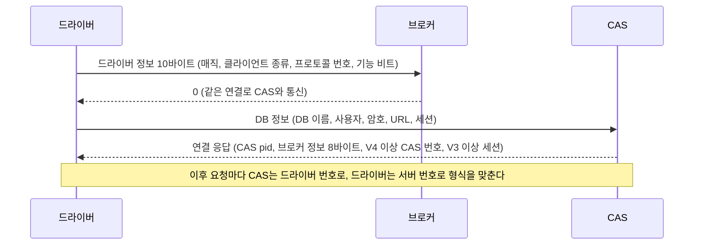

# CAS 프로토콜 버전별 기능과, 번호 없이 늘어난 것들

- 분류: study
- 날짜: 2026-09-28
- 관련: [CAS 프로토콜 버전과 릴리스 대응표](2026-09-15-cas-protocol-version-releases.md), APIS-1116 (스키마 목록 요청 검토)

## 요약

프로토콜 번호는 옛 상대가 같은 바이트를 다르게 읽게 되는 변경(타임아웃 단위, 연결 응답 크기, 응답 끝에 붙는 필드, 타입 바이트 수, id 폭)에 올렸고, 새 요청 종류와 새 스키마 하위 타입, 기능 비트는 번호를 올리지 않고 늘어났다.

## 목적

새 요청(예: 스키마 목록)을 추가할 때 프로토콜 번호를 올려야 하는지, 드라이버는 무엇으로 서버의 지원 여부를 판단해야 하는지 판단할 근거를 만든다. 이를 위해 번호마다 실제로 무엇이 달라지는지와, 번호와 상관없이 늘어난 것이 무엇인지를 코드로 정리한다.

## 배경

드라이버와 CAS는 접속할 때 서로의 프로토콜 번호를 주고받는다. 그 뒤 CAS는 드라이버의 번호를 보고 응답 형식을 맞추고(`DOES_CLIENT_UNDERSTAND_THE_PROTOCOL`), 드라이버는 서버의 번호를 보고 요청 형식을 맞춘다. 번호와 릴리스의 대응은 [대응표 노트](2026-09-15-cas-protocol-version-releases.md)에 있고, 이 노트는 번호별 기능 내용을 다룬다.



## 범위 / 방법

- 엔진: `CUBRID/cubrid` develop(2026-09-18, `5d8fc7bd5`)과 release/10.0 ~ 11.4 브랜치의 `src/broker`
- 드라이버: `CUBRID/cubrid-jdbc` develop(`6b4386b`)
- 번호별 분기 위치: `git grep -w PROTOCOL_Vn`. 본체 CAS 파일 기준으로 정리하고, CGW(`cas_cgw*.c`)와 샤드 프록시(`shard_proxy_*.c`)는 같은 분기를 반복하므로 따로 적지 않았다
- 번호를 도입한 커밋: `src/broker/cas_protocol.h`에 대한 `git log -S`
- 번호 없이 늘어난 것: 함수 코드, 스키마 하위 타입, 기능 비트 정의를 릴리스 브랜치별로 비교하고 도입 커밋을 조회
- 실측: 11.4.6 서버와 develop nightly(11.5.0.2608)에 접속해 드라이버가 받은 브로커 정보 8바이트를 읽었다

## 발견 / 관찰

### 1. 접속 때 주고받는 값

드라이버가 보내는 정보(10바이트, `enum t_driver_info_pos`)

| 칸 | 뜻 | JDBC가 보내는 값 |
|---|---|---|
| [0]~[4] | 매직 | `CUBRK` (SSL이면 `CUBRS`) |
| [5] | 클라이언트 종류 | 3 (JDBC) |
| [6] | 프로토콜 번호 | 0x40(표시 비트) + 12 |
| [7] | 기능 비트 | 0x80(새 오류 코드) + 0x40(holdable 결과) |
| [8]~[9] | 예약 | 0 |

CAS가 보내는 브로커 정보(8바이트, `enum t_broker_info_pos`). 두 서버에서 실측한 값이 같았다.

```
11.4.6.1963  [0]=01 [1]=01 [2]=01 [3]=00 [4]=4C [5]=C0 [6]=00 [7]=00
11.5.0.2608  [0]=01 [1]=01 [2]=01 [3]=00 [4]=4C [5]=C0 [6]=00 [7]=00
```

| 칸 | 뜻 | 실측 값 |
|---|---|---|
| [0] | DBMS 종류 | 01 (CUBRID) |
| [1] | keep connection | 01 |
| [2] | statement pooling | 01 |
| [3] | CCI pconnect | 00 |
| [4] | 프로토콜 번호 | 4C (0x40 + 12) |
| [5] | 기능 비트 | C0 (0x80 + 0x40) |
| [6] | 시스템 파라미터 (V12부터) | 00 |
| [7] | 예약 | 00 |

### 2. 번호별 한눈에 보기

| 번호 | 정의 주석 (`cas_protocol.h`) | 도입 | CAS 분기 |
|---|---|---|---|
| V0 | old protocol | 2012-07 | 없음 |
| V1 | query_timeout and query_cancel | 2012-07 | 있음 |
| V2 | send columns meta-data with the result for executing | 2012-07 | 있음 |
| V3 | session information extend with server session key | 2012-11 | 있음 |
| V4 | send as_index to driver | 2012-12 | 있음 |
| V5 | shard feature, fetch end flag | 2013-03 | 있음 |
| V6 | cci/cas4m support unsigned integer type | 2014-06 (CUBRIDSUS-13743) | 없음. MySQL용 CAS(`cas_mysql_execute.c`)에만 있었고 2015-12에 그 파일과 함께 제거됨(CUBRIDSUS-17996) |
| V7 | timezone types, to pin xasl entry for retry | 2015-02 | 있음 |
| V8 | JSON type | 2018-10 | 있음 |
| V9 | cas health check: get function status | 2020-04 (CBRD-23633) | 없음, 드라이버 쪽 변경 |
| V10 | Secure Broker/CAS using SSL | 2020-08 (CBRD-23687) | 없음, 매직 `CUBRS`로 구분 |
| V11 | make out resultset | 2022-04 | 있음 |
| V12 | Remove trailing zeros from double and float types | 2023-08 (CBRD-24949) | 있음 |

develop의 `CURRENT_PROTOCOL`은 V12다.

### 3. 번호별로 CAS가 달리 하는 것

"V*n* 이상 드라이버에게는"이 기준이다. 표의 위치는 `src/broker/` 기준 파일과 함수다.

| 번호 | CAS가 달리 하는 것 | 위치 |
|---|---|---|
| V1 | 실행 요청에서 쿼리 타임아웃 인자를 받는다 | `cas_function.c` `fn_execute_internal` |
| V1 | 쿼리 취소 로그에 클라이언트 IP와 포트를 남긴다 | `cas_log.c` `cas_log_query_cancel` |
| V2 | 실행 응답에 컬럼 메타데이터를 실을 수 있다 | `cas_execute.c` `ux_execute`, `ux_execute_all`, `ux_execute_call` |
| V2 | 쿼리 타임아웃과 락 타임아웃을 밀리초로 주고받는다 (V1은 초) | `cas_function.c` `fn_execute_internal`, `fn_get_db_parameter` |
| V2 (9.0.0 전용) | 함수 코드 41, 42의 번호를 바꿔 받는다 | `cas.c` `process_request` |
| V2 (9.0.0 전용) | ENUM을 문자열로 보낸다 | `cas.c` `process_request` |
| V3 | 서버 세션 키로 세션을 이어 쓴다 (미만은 매번 새 세션) | `cas.c` `cas_set_session_id` |
| V3 | 연결 응답에 20바이트 세션 정보를 싣는다 | `cas.c` `cas_send_connect_reply_to_driver` |
| V3 | 배치, 배열 실행 결과의 오류마다 오류 지시자를 싣는다 | `cas_execute.c` `ux_execute_batch`, `ux_execute_array` |
| V4 | 연결 응답에 CAS 번호(as_index)를 싣는다 | `cas.c` `cas_send_connect_reply_to_driver` |
| V4 | 배치, 배열 실행 요청에서 쿼리 타임아웃 인자를 받는다 | `cas_function.c` `fn_execute_batch`, `fn_execute_array` |
| V5 | 실행 응답 끝에 샤드 번호를 싣는다 | `cas_execute.c` `ux_execute` 계열 |
| V5 | FETCH 응답 끝에 끝 표시 바이트(`fetch_end_flag`)를 싣는다 | `cas_execute.c` `fetch_*` 계열 10개 함수 |
| V5 | 스키마 정보 요청에서 샤드 번호 인자를 받는다 | `cas_function.c` `fn_schema_info` |
| V5 | 드라이버 버전 문자열을 URL 뒤에서 읽는다 | `cas_common_main.c` `cas_parse_db_info` |
| V7 | 타입을 2바이트(타입 + 문자셋, 컬렉션 표시)로 싣는다 | `cas_net_buf.c` `net_buf_cp_cas_type_and_charset` |
| V7 | 미만 드라이버에게는 타임존 타입을 DATETIME, TIMESTAMP로 바꿔 보낸다 | `cas.c` `process_request` |
| V8 | 미만 드라이버에게는 JSON을 문자열로 보낸다 | `cas.c` `process_request` |
| V11 | OUT 결과셋 요청(`MAKE_OUT_RS`)을 8바이트 query id로 받는다 (미만은 지원 안 함으로 답한다) | `cas_function.c` `fn_make_out_rs` |
| V12 | 브로커 정보 [6]에 `oracle_compat_number_behavior` 설정을 싣는다 | `cas_common_main.c` `cas_main_loop`, `cas_meta.c` |

V12의 정의 주석은 "double, float의 후행 0 제거"지만, 프로토콜로 바뀐 것은 그 동작을 켜는 시스템 파라미터를 브로커 정보에 실어 보내는 것이다(CBRD-24949 커밋 제목: "send oracle_compat_number_behavior system parameter to the clients").

### 4. JDBC 드라이버가 번호를 쓰는 곳 (develop)

| 번호 | 드라이버가 하는 것 | 위치 |
|---|---|---|
| V8 | 이보다 낮은 서버는 접속을 거부한다 | `UClientSideConnection.java` `connectDB` |
| V11 | OUT 결과셋 번호를 V11 미만이면 4바이트, 이상이면 8바이트로 보내고 읽는다 | `UStatement.java` 2곳 |
| V12 | Oracle 호환 숫자 설정을 브로커 정보 [6]에서 읽는다 | `UConnection.java` `isOracleCompatNumberBehavior` |
| (선언) | 드라이버 자신은 V12를 보낸다 | `UConnection.java` `CAS_PROTOCOL_VERSION` |

holdable 결과 지원은 번호가 아니라 기능 비트 0x40으로 판단한다(`UConnection.supportHoldableResult()`가 `brokerInfoSupportHoldableResult()`만 본다).

### 5. 번호를 올리지 않고 늘어난 것

프로토콜 번호 체계(V0 ~ V2)가 생긴 2012-07 이후 기준이다.

| 무엇 | 도입 | 이슈 | 도입 커밋의 번호 변경 |
|---|---|---|---|
| 기능 비트 0x80: 새 오류 코드 체계 | 2013-02-20 | CUBRIDSUS-10735 | 없음 |
| 기능 비트 0x40: holdable 결과 지원 | 2013-02-26 | CUBRIDSUS-10766 | 없음 |
| 기능 비트 0x20: 서버 다운 시 재접속 | 2013-05-22 | CUBRIDSUS-11247 | 없음 |
| 함수 코드 44: `CAS_CHANGE_MODE` | 2013-11-13 | CUBRIDSUS-12425 | 없음 |
| 스키마 하위 타입 20: `ATTR_WITH_SYNONYM` | 2023-08-07 | CBRD-24835 | 없음 |

- 함수 코드는 release/10.0부터 develop까지 모든 브랜치에서 44번(`CAS_CHANGE_MODE`)으로 끝난다. 10.0 이후 새 함수 코드는 없다.
- 기능 비트는 0x80, 0x40, 0x20 세 개가 쓰이고 0x10 이하는 비어 있다. release/11.2 ~ develop 모두 같다.
- 스키마 하위 타입 20은 11.3에 들어갔다. release/11.2는 19번(`CROSS_REFERENCE`)까지다. 같은 11.3에 V12도 들어갔지만 별개 커밋이고, 하위 타입 추가는 번호와 묶이지 않았다.
- 옛 CAS는 모르는 스키마 하위 타입을 `CAS_ER_SCHEMA_TYPE`(-10015, "Invalid schema type")으로 거절한다. release/11.2, 11.3, 11.4의 `ux_schema_info` 모두 같은 처리이고, 11.4.6과 develop nightly에 21번을 보내 -10015가 오는 것을 실측했다.

## 결론

번호를 올린 변경은 모두 옛 상대가 같은 바이트를 다르게 읽게 되는 경우였다. 타임아웃 단위(V2), 연결 응답 크기(V3, V4), 응답 끝에 붙는 필드(V5), 타입 바이트 수(V7), id 폭(V11), 브로커 정보 칸의 의미(V12)가 그렇다.

번호 없이 늘어난 것은 옛 상대가 모르면 정해진 방식으로 거절하거나 무시하는 추가였다. 새 함수 코드, 새 스키마 하위 타입, 기능 비트가 여기에 해당한다. 따라서 새 스키마 하위 타입은 번호를 올리지 않고 추가할 수 있는 종류다. 다만 드라이버가 서버의 지원 여부를 무엇으로 판단할지는 따로 정해야 한다.

## 다음 단계

- 스키마 목록 요청을 새 하위 타입으로 설계할 때 이 분류를 근거로 쓴다 (APIS-1116)
- 옛 CAS가 모르는 함수 코드를 받을 때의 동작은 이번에 확인하지 않았다. 새 함수 코드를 검토하게 되면 따로 확인한다
- CCI(`cubrid-cci`)가 번호를 쓰는 곳은 이번 범위 밖이다

## 참고

- 엔진 정의: [`src/broker/cas_protocol.h`](https://github.com/CUBRID/cubrid/blob/develop/src/broker/cas_protocol.h) (`enum t_cas_protocol`, `t_cas_func_code`, `t_driver_info_pos`, `t_broker_info_pos`)
- 엔진 분기: [`cas.c`](https://github.com/CUBRID/cubrid/blob/develop/src/broker/cas.c), [`cas_function.c`](https://github.com/CUBRID/cubrid/blob/develop/src/broker/cas_function.c), [`cas_execute.c`](https://github.com/CUBRID/cubrid/blob/develop/src/broker/cas_execute.c), [`cas_net_buf.c`](https://github.com/CUBRID/cubrid/blob/develop/src/broker/cas_net_buf.c), [`cas_common_main.c`](https://github.com/CUBRID/cubrid/blob/develop/src/broker/cas_common_main.c), [`cas_meta.c`](https://github.com/CUBRID/cubrid/blob/develop/src/broker/cas_meta.c)
- 드라이버: [`UConnection.java`](https://github.com/CUBRID/cubrid-jdbc/blob/develop/src/jdbc/cubrid/jdbc/jci/UConnection.java), [`UClientSideConnection.java`](https://github.com/CUBRID/cubrid-jdbc/blob/develop/src/jdbc/cubrid/jdbc/jci/UClientSideConnection.java), [`UStatement.java`](https://github.com/CUBRID/cubrid-jdbc/blob/develop/src/jdbc/cubrid/jdbc/jci/UStatement.java)
- 도입 이슈: CUBRIDSUS-10735, CUBRIDSUS-10766, CUBRIDSUS-11247, CUBRIDSUS-12425, CUBRIDSUS-13743, CUBRIDSUS-17996, CBRD-23633, CBRD-23687, CBRD-24835, CBRD-24949
- 관련 노트: [CAS 프로토콜 버전과 릴리스 대응표](2026-09-15-cas-protocol-version-releases.md)
